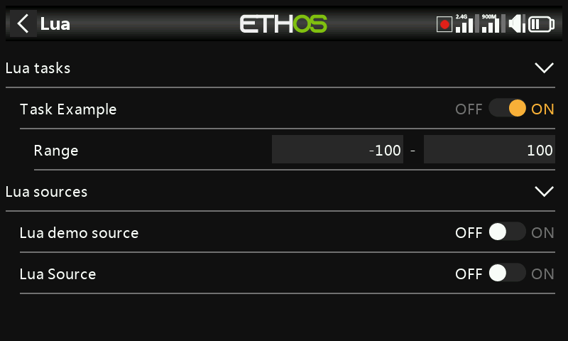

# Lua Scripts (Model)

Attaches Lua scripts to a specific model — for custom widgets or
functions that should only run while that model is selected. For the Lua
scripting environment itself, see [Lua Scripts](../lua-scripts/index.md).

!!! note "Draft"
    This page is a placeholder — full content coming in a later pass.
