# Mixes

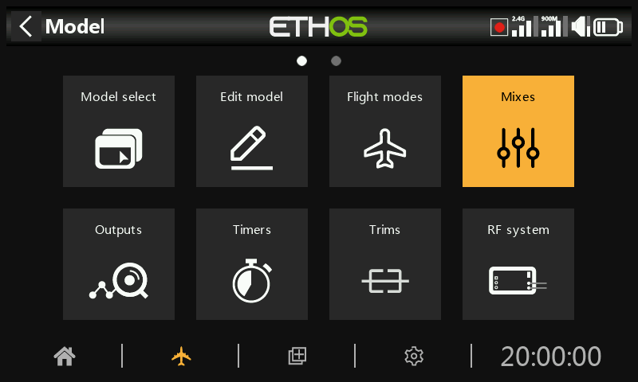

Mixes are the core of model programming in Ethos — this is where inputs
(sticks, switches, sensors, anything a [source](../getting-started/user-interface-and-navigation.md#choosing-a-source)
can reach) get routed, shaped, and combined onto output channels. Up to 120
mixes can be defined per model.

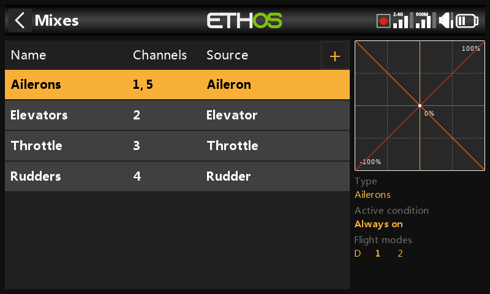

If a model was created with the **Model Select** wizard, its baseline mixes
(aileron, elevator, throttle, rudder, and whatever else the airframe needs)
are already populated here. Selecting a mix and pressing `ENT` opens a
contextual menu to edit it, add a new mix, switch to the
[per-channel view](#per-channel-view), reorder it, duplicate it, or delete
it. Inactive mixes are greyed out, and deleting one always asks for
confirmation first.

## Anatomy of a mix

Every mix shares the same set of fields, regardless of which category it
came from. The **aileron** mix is a representative example — elevator and
rudder mixes are laid out identically.

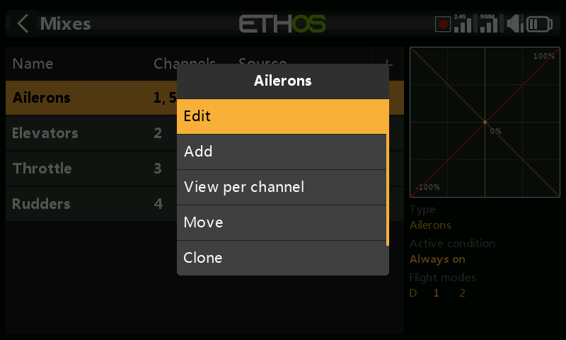

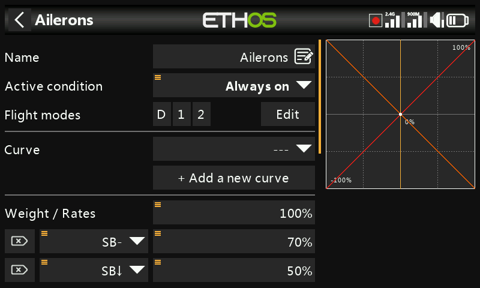

**Name** — defaults to the mix type, editable.

**Condition** — defaults to *Always*. Can be restricted to a switch
position, a function switch, a logical switch, a flight mode, a system
event (throttle cut/hold), or a trim position, in which case the mix only
applies while the condition is true.

**Flight modes** — if flight modes are defined, the mix can additionally be
restricted to one or more of them.

**Curve** — an **Expo** curve is available by default (0 = linear; positive
softens the response around center, negative sharpens it):

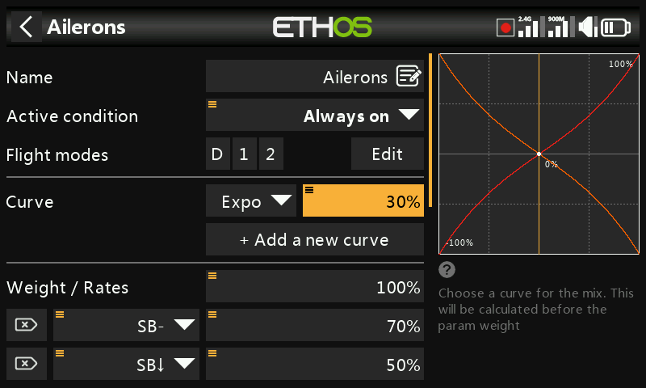

Any curve previously defined under [Curves](curves.md) can be selected
instead. Up to 6 curves can be stacked on one mix, each with its own
condition — if more than one condition is true simultaneously, the curve
higher in the list wins. Curves are applied **before** rates.

**Rates** — one or more weight rows, each optionally gated by a switch,
function switch, logical switch, trim position, or flight mode. The first
row is the default, active whenever no other row's condition is met:

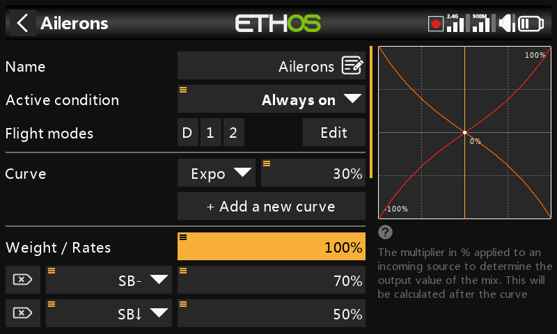

Rather than a fixed percentage, a rate can be driven from a
[source](../getting-started/user-interface-and-navigation.md#choosing-a-source)
— for example a pot, to adjust the rate in flight:

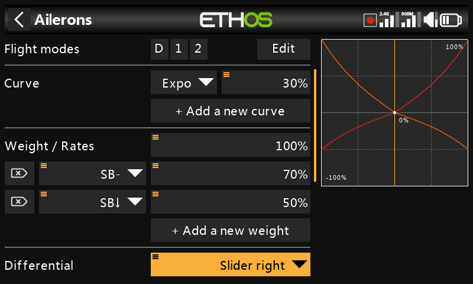

**Differential** (-100 to 100, default 0) — gives more travel in one
direction than the other. For ailerons this is the classic trick of more
up-throw than down-throw to reduce adverse yaw. Only shown once the mix has
more than one output channel; differential specifically requires a V-tail
or twin-aileron style output configuration to make sense.

**Number of channels / outputs** — how many output channels this mix drives
and which physical outputs they map to:

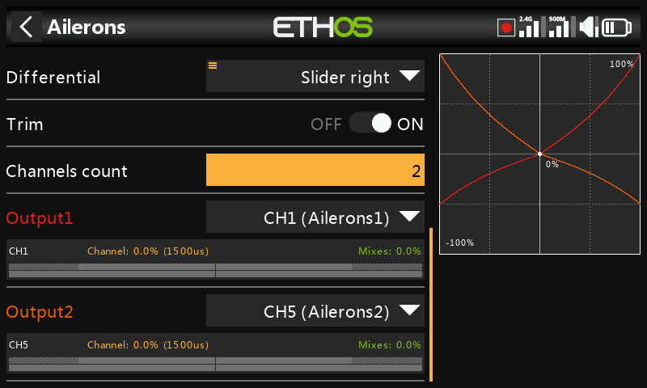

`ENT` long-pressed on an output channel elsewhere in the UI (e.g. in
[Outputs](outputs.md)) jumps straight back to this page.

## The throttle mix

The throttle mix is an aileron/elevator/rudder mix plus engine-specific
safety options.

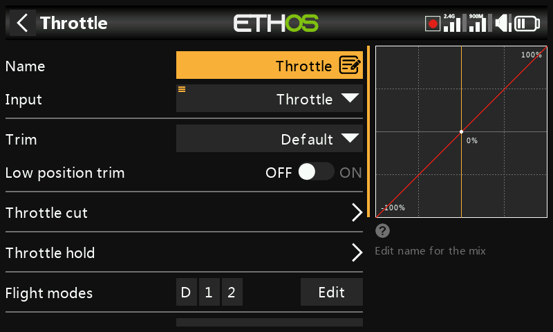

**Input** — the throttle source, normally the throttle stick but
swappable for a pot, slider, switch, trim, channel, gyro axis, trainer
channel, timer, or any other source.

**Idle trim** — for combustion engines, lets a dedicated trim adjust idle
speed without touching full-throttle position. With idle trim enabled the
throttle channel sits at -75% with the stick at low idle, and the throttle
trim then adjusts idle between -100% and -50%:

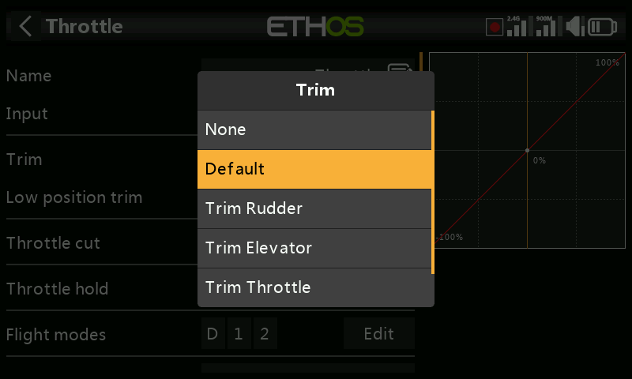

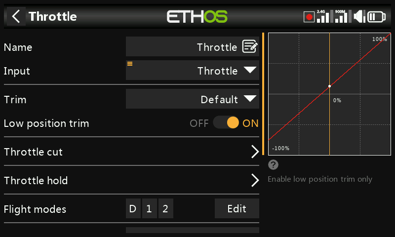

**Throttle cut** — a hard safety interlock: the channel is only live once
the throttle stick has passed through idle, so an accidental switch flip
can't spin up the motor from a high-throttle position:

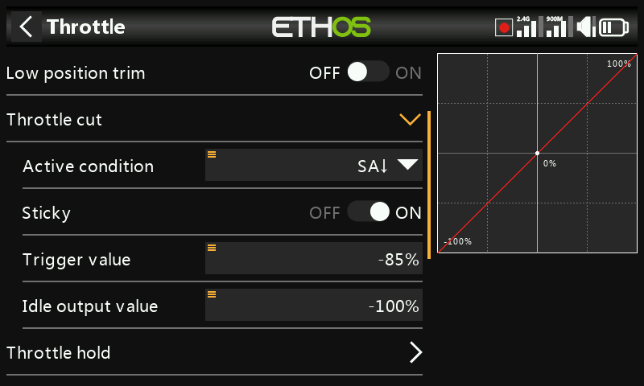

**Throttle hold** — holds the channel at a fixed value regardless of stick
position, without the safety interlock throttle cut provides:

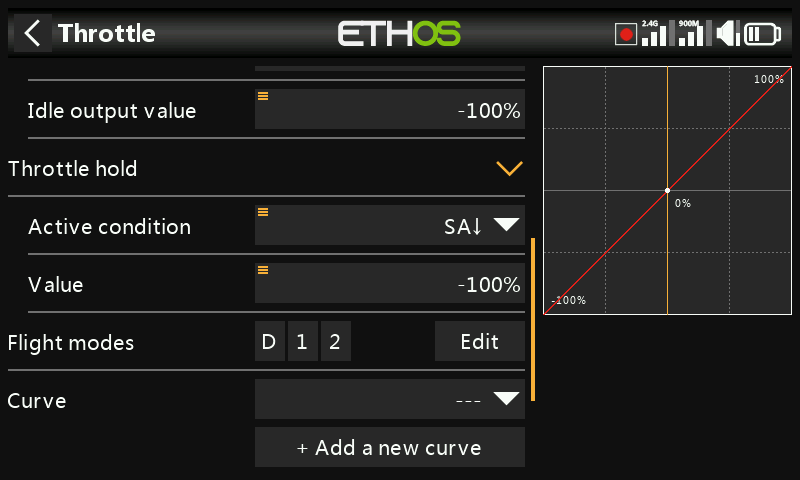

Throttle also exposes its own output channel count, the same as any other
mix:

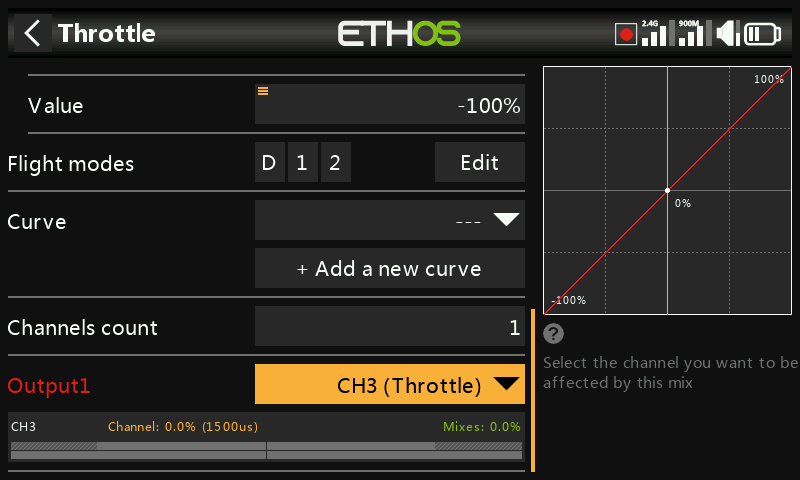

!!! note "Throttle interlock"
    Ethos requires the throttle mix's input to pass through -100% before it
    will arm, regardless of throttle cut/hold settings — a model-select
    wizard-created model already accounts for this, but hand-built throttle
    mixes should too.

## Mix libraries

The **Add mix** dialog's library of predefined mixes is tailored to the
model category chosen when the model was created — airplane, glider, heli,
and multirotor each expose a different set:

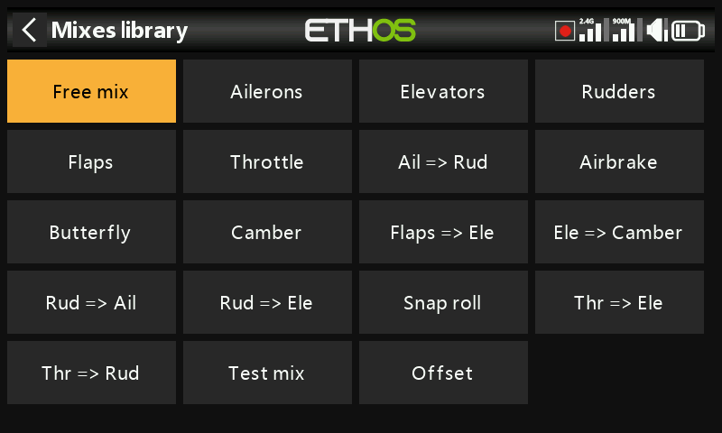

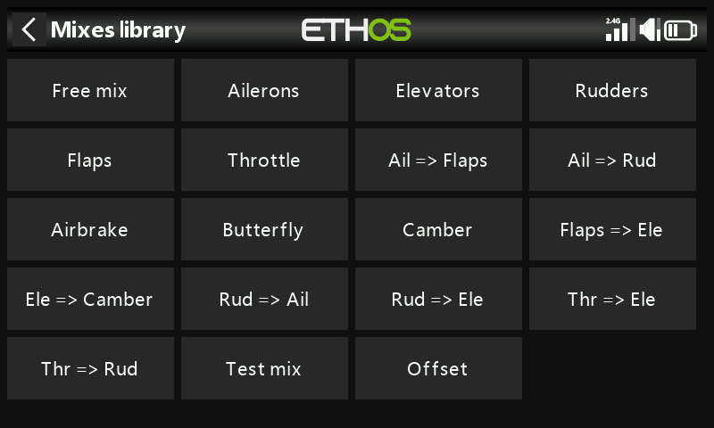

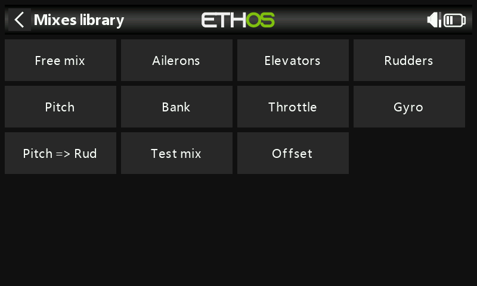

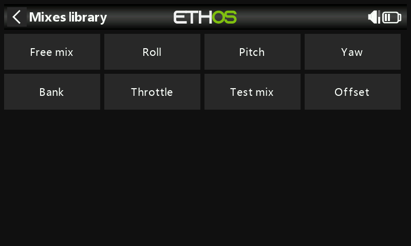

Every library also includes **Free Mix** — a general-purpose mix type
without a preset input/output, more flexible than the specialized entries
but requiring more setup to reach the same result.

## Per-channel view

With enough mixes stacked on the same output, it can be hard to see their
combined effect from the flat table above. Selecting a mix and choosing
**View by channel** groups every mix affecting one output together instead:

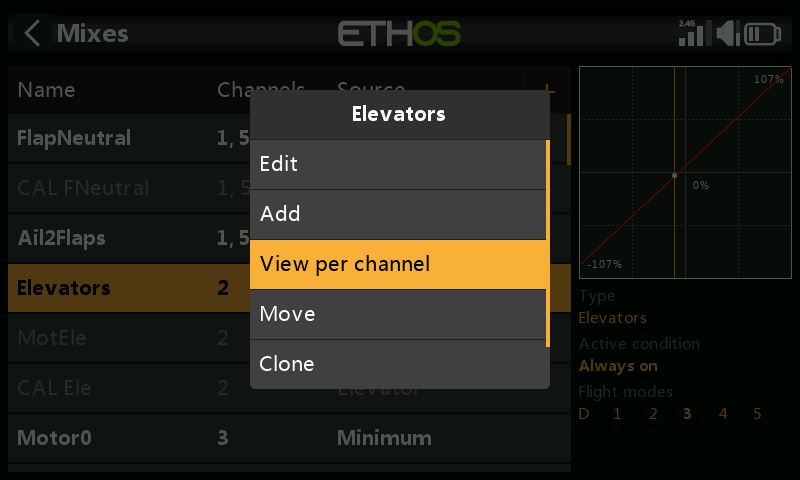

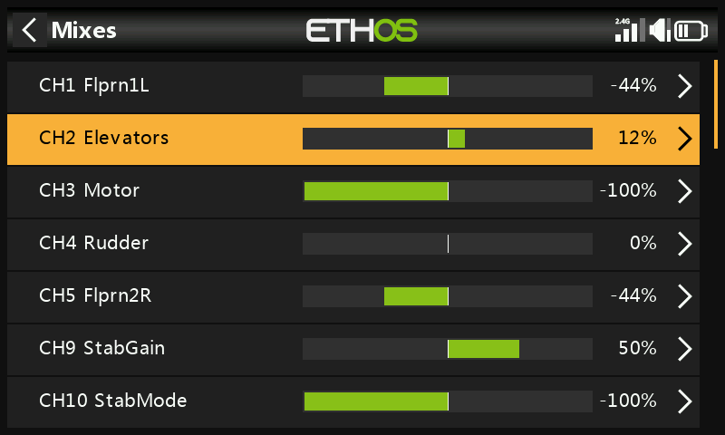

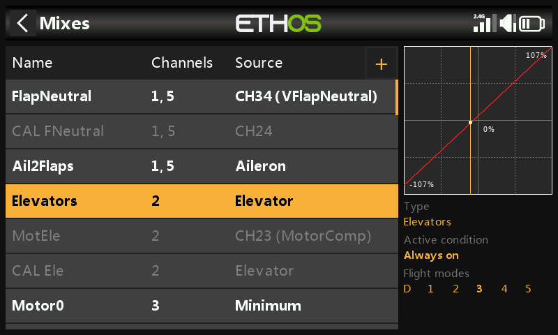

Expanding a channel's summary row shows every mix contributing to it, each
with its live numeric and graphical output — useful for confirming exactly
how much a secondary mix (e.g. flaps-to-elevator compensation) is adding on
top of the primary stick input:

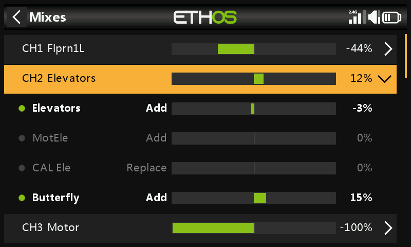

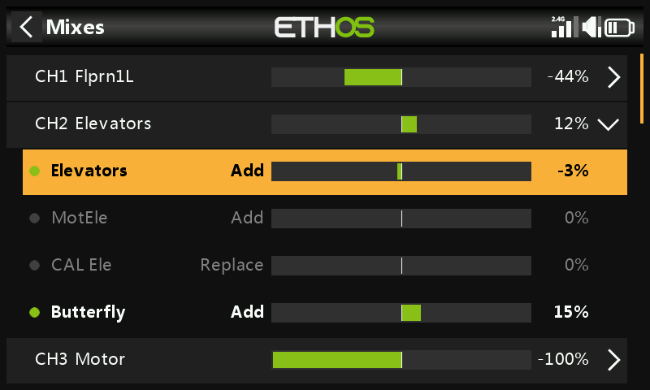

Selecting a sub-mix instead of the summary row opens the same contextual
menu as the flat table (edit, switch back to table view, delete):

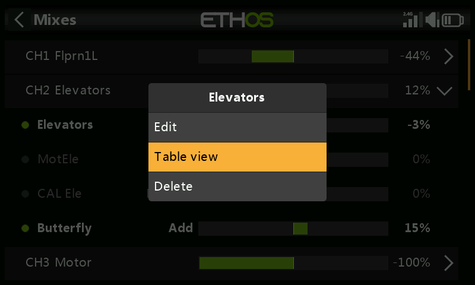

