# Mixes

The Mixes function forms the heart of the radio. This is where the model’s control functions are configured. The Mixes section allows any of the many sources of input to be mixed or combined as desired and mapped to any of the output channels.

## High level control path overview

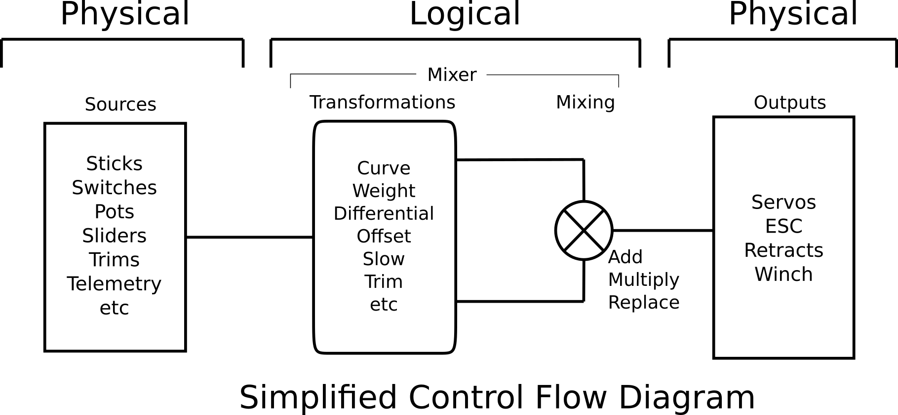

The control path starts from the hardware controls, goes through the programming logic in the Mixes, and ends up being adapted to the mechanical characteristics of the model in the Outputs section. This approach goes from a physical model, to a logical model, and then back to a physical model again.

In the Mixes section we set up what we want our different controls to do. We can transform the inputs using weights, offsets, curves, differential or slow, and then mix or combine them as required.

The Output section then allows these pure logical outputs to be adapted to the mechanical characteristics of the model. It is the interface between the setup "logic" and the real world with servos, linkages and control surfaces as well as motors and transducers.

Ethos has 100 mix channels available for programming your model. Normally the lowest numbered channels will be assigned to the servos, because the channel numbers map directly to the channels in the receiver. The Internal RF (Radio Frequency) module has up to 24 output channels available.

The upper mix channels can be used as 'virtual channels' in more advanced programming, or as real channels by using multiple RF modules (Internal + External) and SBus. The channel order is a matter of personal preference or convention, or it may be dictated by the receiver. We will use AETR (Aileron, Elevator, Throttle, Rudder) for our example.

The source or input to a mix can be chosen from analog inputs such as the sticks, pots and sliders; the toggle switches or buttons; any defined logic switches; the trim switches; any defined channels; a gyro axis; a trainer channel; a timer; a telemetry sensor; a system value such as the main radio voltage or RTC battery voltage; or a ‘special’ value such as 'minimum', 'maximum' or 0.

This section also allows the source to be conditioned by defining weights/rates and offsets, and adding curves (eg Expo). The mix can be made subject to a switch and/or flight modes, and a slow function can be added. (Note that Delays are implemented in the logic switches because they are related to switches.)

The mix editor includes contextual help information that dynamically changes as mix options are touched. The first line shows the type of mix used, such as ‘Aileron’, ‘Elevators’, or ‘Free Mix’ etc.

Up to 120 mixes may be defined.

If your model was created using one of the model creation wizards in the ‘Model select’ function in the System menu, the base mixes will be shown when you tap on ‘Mixes’. A graph is displayed for the highlighted mix, and underneath the current Flight Mode and the Active Condition will be written in BOLD if they are active.

In addition, the most common predefined mixes can be added as well as free mixes that are user configurable. In the main mixes screen (see above) new mixes may be added by tapping on the ‘+’ symbol next to the column headings, or selecting ‘Add’ in the options below.

There is one mix for each control and a graphic display for that mix.

To edit a mix, touch the mix and touch again for the popup menu, then select Edit. Other options are to add a new mix, to switch to the ‘[View per channel](mixes.md)’ grouping view (described in a section lower down), to move the mix up or down, to clone a mix, or to delete a mix.

Please note that inactive mixes are shown greyed out, to assist in debugging.

The radio asks for confirmation before deleting a mix, in case of inadvertent selection.

## Aileron, Elevator, Rudder mixes

We will use the Ailerons as an example, but the Elevator and Rudder mixes are very similar.

Name

Ailerons has been filled in as the default name, but it can be changed.

Active condition

The default active condition is ‘Always on’, which is appropriate for Ailerons. It may be made conditional by choosing from switch or button positions, function switches, flight modes, logic switches, a system event such as throttle cut or hold, or trim positions.

Flight modes

If any flight modes have been defined in the ‘Flight modes’ section, then this parameter becomes available. The mix can then be made conditional to one or more flight modes. Click on ‘Edit’ and check the boxes for the flight modes in which this mix must be active.

Curve

A standard curve option is Expo, which by default has a value of 0, which means the response is linear (i.e. no curve). A positive value will soften the response around 0, while a negative value will sharpen the response. The example above shows an Expo of 30%.

Any previously defined curve may also be selected. The mix output will then modified by this curve. Alternatively, a new curve may be added.

You can specify up to 6 curves, each with a condition. If more than one condition is true, the curve higher in the list prevails. Note that the curve is applied before the Weight.

Weight / Rates

Multiple weights or rates can be defined, subject to a switch position, function switch, logic switch, trim position or flight mode. A line is added for each rate. The default rate (i.e. first rates line) is active when none of the other rates are active. There is a small cross inside an arrow on the left of defined rates that can be used to delete a rates line. In the example above three rates have been set up on switch SB.

Differential

Differential provides more travel in one direction. For example, for ailerons typically more up aileron travel than down is utilized to reduce adverse yaw and to improve turning/ handling characteristics. A positive value will result in the ailerons having less downward travel, as can be seen in the graph above. (Default = 0. Range -100 to +100).

In this example a long press on Enter brought up the dialog to select a source instead of the default fixed value, in this case ‘Slider right’ was selected. The graph on the right shows that the slider is at 50%, so this would be the weight for the Aileron Rates, but adjustable in flight.

On Elevator differential may be used for planes wanting less down than up elevator, typically in racing situations.

Note that the Differential parameter is only present when you have more than one output channel.

The Rudders mix will only have the Differential parameter if the model is configured for V-tail.

Trim

Provides the ability to disconnect a mix’s associated trim without disabling it, so it can be used elsewhere.

Channels count

Channel count defines how many Output channels are allocated. In this example two ailerons were configured in the model creation wizard.

Output1, Output2

The model creation wizard assigned channels 1 and 2 to the ailerons, because the default channel order in the System – Sticks menu was set to AETR, i.e. ailerons, elevator, throttle, rudder.

The default can be altered if required, but care must be exercised to assess any other impacts to making a change here.

Note that \[ENT\_long\] on the selected output channel will take you directly to that page in the Outputs.

Note also that the graph is color-coded to the outputs. In the example above Output1 is red which corresponds to the red curve in the graph, and Output2 is orange which corresponds to the orange curve in the graph.

## Throttle mix

The Throttle mix has parameters for managing throttle cut and throttle hold. Throttle cut features a throttle input safety interlock, while throttle hold has a simple on/off function.

Input

The source for the Throttle mix can be selected here. It defaults to the throttle stick, but can be changed to an analog, switch, trim, channel, gyro axis, trainer channel, timer or special value.

The direction of the throttle control may be reversed, please refer to the Invert section under [Source Options](../getting-started/user-interface-and-navigation.md).

Trim

Allows the throttle trim behavior to be changed from the default.

It can be changed to allow the throttle output to be trimmed by the rudder, elevator, throttle, aileron trim switches. The X20 Pro/R/RS and X18 also allow the T5 or T6 trims to be assigned.

Low position trim

For glow and gas engines 'Low position trim' is used to adjust the idle speed. The idle speed can vary depending on the weather, etc., so having a way to adjust the idle speed without impacting the full throttle position is important.

If 'Low position trim' is enabled, the throttle channel goes to an idle position of -75% when the throttle stick is at the low position (please refer to the channel bar display at the bottom of the screenshot above). The throttle trim lever can then be used to adjust the idle speed between -100% and -50%. Throttle Cut can then be configured to cut the engine with a switch.

Throttle cut

Throttle cut features a throttle input safety interlock which ensures that the engine or throttle only starts from a low throttle position.

When combined with ‘Low position trim’ (see above), it can be used for managing the throttle and idle settings on glow or gas powered models.

Active condition

The active condition may be chosen from switch or button positions, function switches, flight modes, logic switches or trim positions.

Sticky

When Sticky is in the ON position, the throttle channel output will be switched to the Idle Output Value (default -100%) as soon as throttle cut becomes active.

When Sticky is in the OFF position, once throttle cut becomes active, the throttle channel output will be switched to the ‘Idle output value’ (default -100%) only when the throttle stick goes below the trigger value (default -85%).

Trigger value

The trigger value determines the value below which the throttle input triggers the throttle safety interlock.

Idle output value

For safety, once throttle cut becomes inactive, the throttle channel output will only leave the ‘Idle output value’ if the throttle input has been below the trigger value. This ensures that the engine or motor only starts from a low throttle input value.

Note that Ethos will start safely at power on, even if the ‘Throttle cut’ condition is not active and the throttle input not at minimum. You have to move the throttle input below the trigger value before the throttle channel will arm, and allow the motor to start running from a low throttle input value.

Throttle hold

Throttle hold provides a simple throttle hold function without the throttle input safety interlock of ‘Throttle cut’ above.

For safety reasons, with electric motors it is highly recommended to use the ‘Throttle cut’ option with its safety interlock instead of ‘Throttle hold’.

Active condition

The active condition may be chosen from switch or button positions, function switches, flight modes, logic switches or trim positions.

Value

Once the throttle hold function goes active, the Value setting will be output on the throttle channel. On electric powered models, the throttle hold value is normally (-100%).

The throttle hold value can also come from a source.

Flight modes

If any flight modes have been defined in the ‘Flight modes’ section, then this parameter becomes available. The mix can then be made conditional to one or more flight modes.  Click on ‘Edit’ and check the boxes for the flight modes in which this mix must be active.

Curve

A curve may be defined to modify the throttle channel output. Any previously defined curve may also be selected.

Channel count

Channel count defines how many Output channels are allocated, by default 1 for Throttle.

## View per channel option (mixes grouping)

With complex mixes it can be difficult to see the effect of other mixes on a particular channel. The ‘View per channel’ option is particularly useful in debugging your mixes, because all the mixes that affect the selected channel are grouped together.

For this example we will look at the Elevators channel. We can see from the mixes ‘Table view’ above that the Elevator is on channel 2, and that there are other mixes also with channel 2 as output.

To see the effect of all mixes on the Elevator channel, tap on the Elevators mix, and select ‘View per channel’ from the popup dialog.

The example view above shows there are two mixes impacting on this channel: the Elevators mix itself (controlled by the Elevator stick) and a Butterfly mix which adds Elevator compensation when the flaps are deployed. Looking at the CH2 Elevators summary line (highlighted), we can see that the elevator channel output is at 12%. The sub mixes show that currently the elevator stick is at -3%, but the Butterfly mix is adding +15% to the channel. Operating the Flaps control will cause this compensation mix to change.

With this ‘View per channel’ layout the contribution of the various mixes affecting a channel can be easily seen, because the value of each mix is shown in both graphical and numerical format.

Managing the ‘View per channel’ display

a) Moving between channels in ‘View per channel’

Tapping on the summary line (highlighted above) will collapse the channel’s sub mixes.

As can be seen above, the sub mixes for CH2 Elevators have been collapsed. You can now scroll up or down and select another channel to be expanded to show the mixes contributing to that channel.

b) ***Switching back to ‘Table*** ***v******iew’***

Clicking on a sub mix instead, for example the line highlighted above, will bring up a popup dialog to allow editing the mix, switching to Table View, or to delete the mix.

Selecting Table View will switch you back to the normal mixes view in table format. Alternately you can Edit the highlighted mix or delete it.

We are back in the mixes Table View.

## Mixes libraries

Airplane library

The list of available predefined mixes in the airplane library is shown above.

Please note that some mixes only appear if the requisite channels exist in the model. For example, mixes with flaps as the target are only populated if there are valid flaps configurations defined.  Flap related mixes will appear in the mixes library if flaps are defined in Edit Model.

Add mix

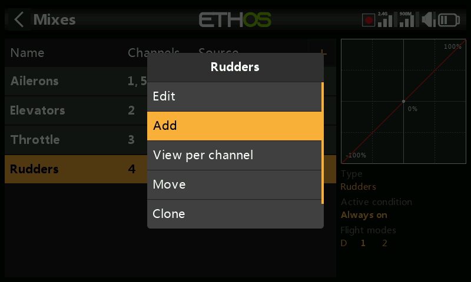

Tap on any Mix, and select ‘Add’ mix from the popup menu to add a new mix.

Select a mix from the list of available predefined mixes in the airplane library (see library screenshot above).

The Free Mix is used in this example.

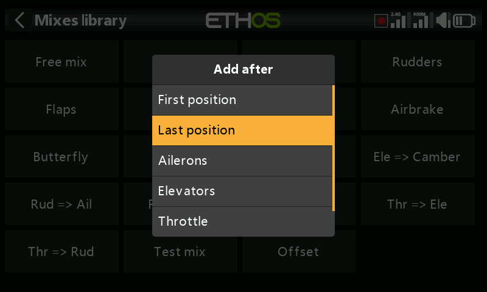

Next the position for the new mix must be chosen, in this example added after ‘Last position’.

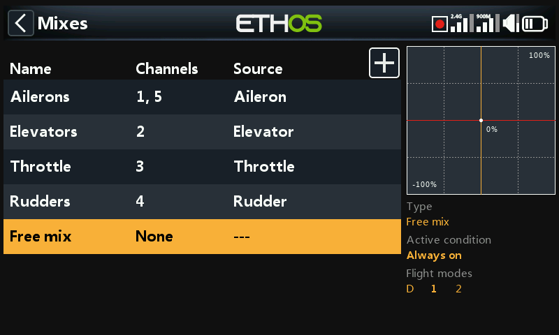

Tap on ‘Free mix’ to bring up the edit sub-menu.

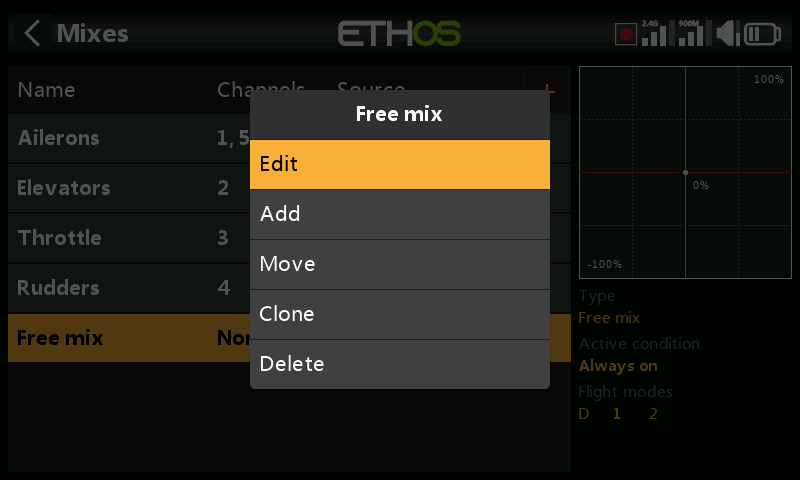

Select Edit to open a new screen showing the detailed parameters for the ‘Free mix’.

Free mix

Free mixes are the do-anything general purpose mix. The predefined mixes are in some ways more powerful, but are also more limited to their specific application. Not all options are necessarily available in Free mixes, but anything can be done with them, it just might require more than one Free mix to duplicate a single specialty mix.

The graph display on the right will display the mix output, and the effect of any setting changes that are made.

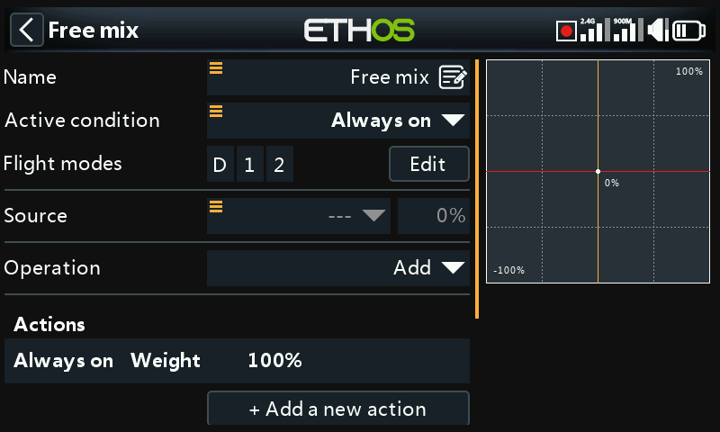

##### Name

A descriptive name can be entered for the Free Mix.

##### Active condition

The default active condition is ‘Always on’. It may be made conditional by choosing from switch or button positions, function switches, flight modes, logic switches, a system event such as throttle cut or hold, or trim positions.

##### Flight modes

If any flight modes have been defined in the ‘Flight modes’ section, then this parameter becomes available. The mix can then be made conditional to one or more flight modes. Click on ‘Edit’ and check the boxes for the flight modes in which this mix must be active.

##### Source

The source or input to this mix can be chosen from:

a) analog inputs such as the sticks, pots and sliders

b) the toggle switches or buttons

c) any defined logic switches

d) the trim switches

e) any defined channels

f) a gyro axis

g) a trainer channel

h) a timer

i) a telemetry sensor

j) a system value (e.g. main radio voltage, RTC battery voltage, clock (i.e real time), RAM available)

k) a ‘special’ value, i.e. minimum, maximum or 0

The mix will take the value of the source at any instant as its input.

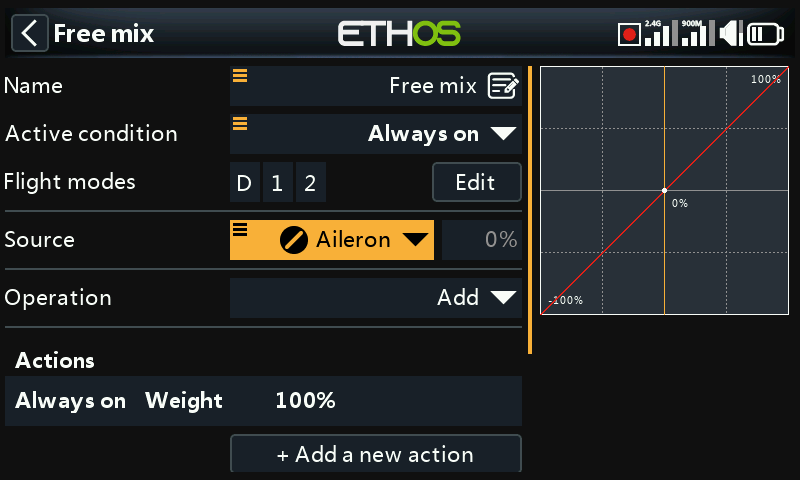

In this example the Aileron stick has been chosen as the source.

##### Operation

The Operation type defines how the current mix interacts with the others on the same channel. There are three function types:

##### Addition

The output of this mix will be added to any other mixes on the same output channel. Please note that Addition mixes can be in any order (A+B+C = C+B+A).

##### Multiply

The output of this mix will be multiplied with the result of other mixes above it on the same output channel.

##### Replace

The output of this mix will replace the result of any other mixes on the same output channel.

##### Lock

A channel which is "locked" will never be changed by any other mix while the locked mix is active. (This is a good alternative to the Override function of OpenTX.)

The combination of these operations allows the creation of complex mathematical operations.

##### Actions

The free mix is extremely flexible in that up to 50 mix actions can be defined.

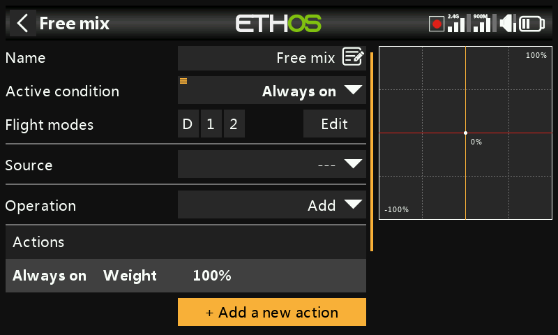

Tap on ‘+ Add a new action’ to add a free mix action.

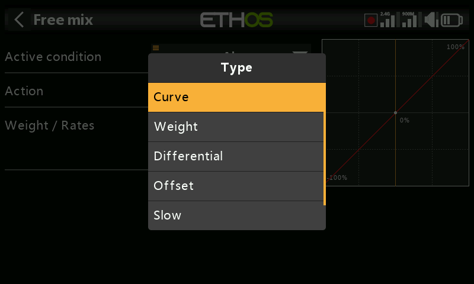

The available actions are:

- Curve
- Weight
- Differential 
- Offset
- Slow
- Trim

The actions can be combined to create for example multiple rates with multiple expo curves, different amounts of differential etc.

The recommended actions order is Slow, Curve, Weight, Differential, Offset then Trim. This should be adhered to unless there is a specific reason for using a different order. For example, you may want to remove an offset from an input. To change the order, please refer to the [Reordering free mix actions](mixes.md) section below.

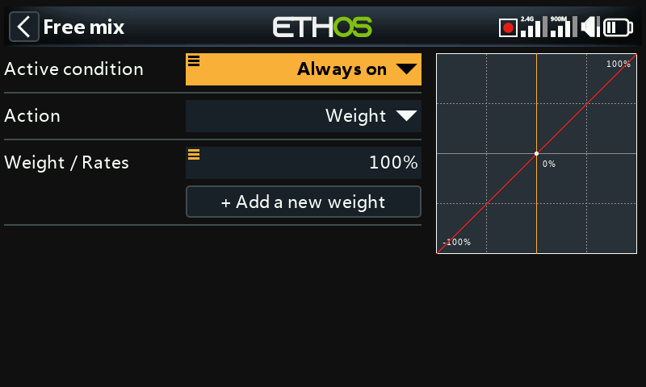

Every free mix action can have its own ‘Active condition’.

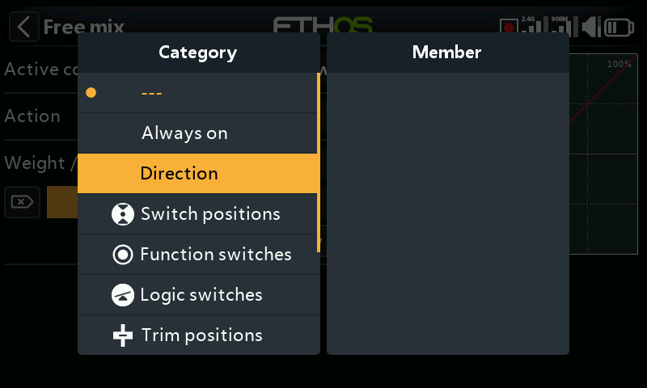

The default active condition is ‘Always on’. It may be made conditional by choosing from switch or button positions, function switches, flight modes, logic switches, a system event such as throttle cut or hold, or trim positions.

In addition, in the active conditions for free mix actions, there is a ‘Direction’ constraint available.

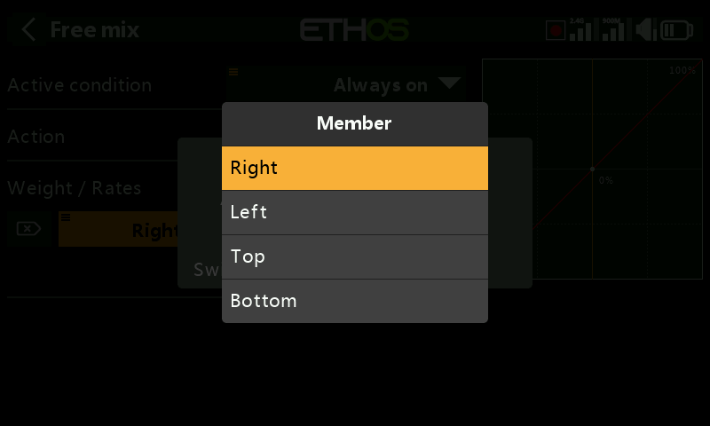

The available direction constraints are Top, Bottom, Right, and Left.

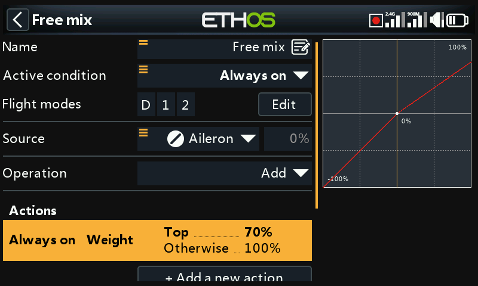

For different Up and Down weights (to mimic the previous ‘Weight up’ and ‘Weight down’) the conditions can be set to ‘Top’ and the default ‘Otherwise’. See also the Weight action below.

##### Weight action

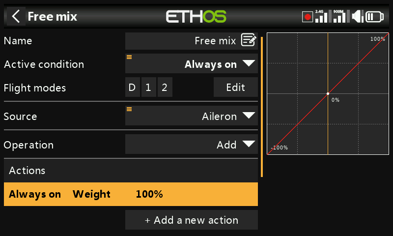

By default the free mix starts with a ‘Weight’ action of 100% that is ‘Always on’. Note: the Source has been set to ‘Aileron’ for example purposes.

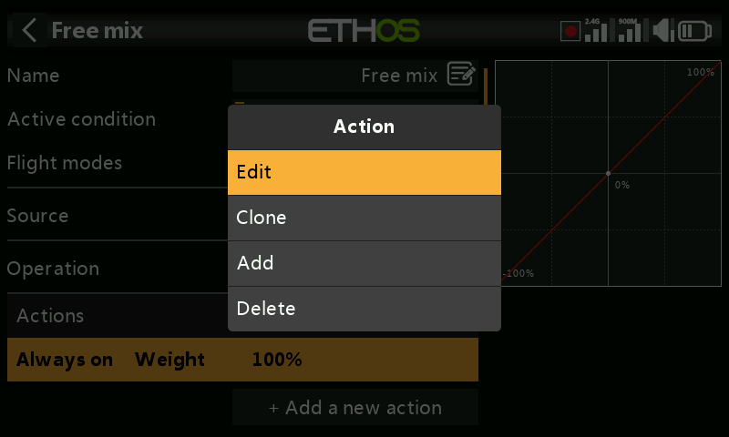

**Important**: To configure the Weight of the free mix, tap on the default Weight line, and select Edit to make changes or additions. Selecting ‘+Add a new action’ would add a second Weight action instead.

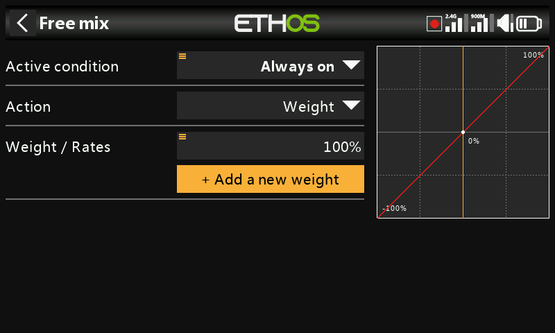

Tap on ‘Add a new weight’ to add additional weights. For example, to create multiple rates, simply add more ‘Weight’’ actions made conditional by for example a 3 position switch.

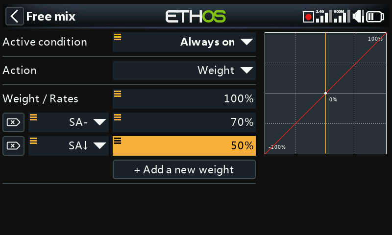

In the example above two extra weights (or rates) have been added using switch SA.

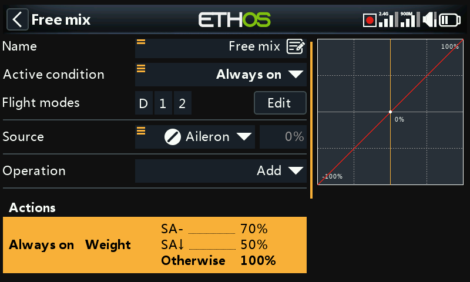

When switch is not in the middle or down positions, the weight will be 100%

##### Curve

To add curves to the mix, select ‘Curve’ from the actions drop-down menu.

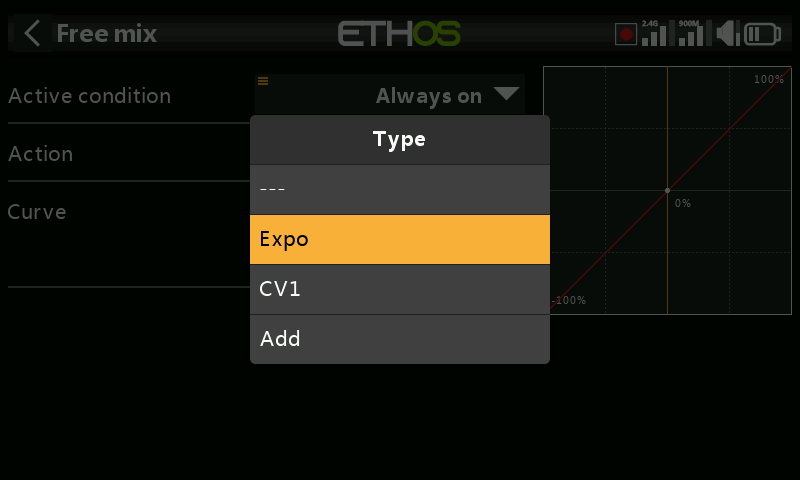

A standard curve option is Expo, which by default has a value of 0, which means the response is linear (i.e. no curve). A positive value will soften the response around 0, while a negative value will sharpen the response.

##### Example for multiple expo ‘rates’

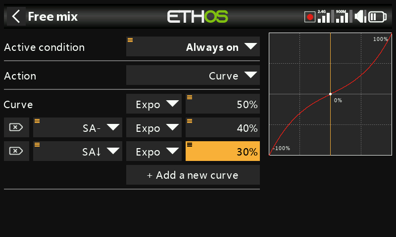

In this example 3 expo rates have been defined to accompany the weight rates defined above.

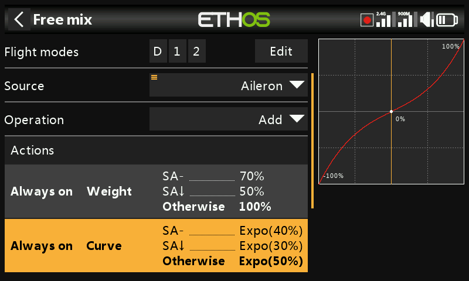

With the SA switch in the mid position, the weight rate is 70% while the expo is 40%. With the SA switch in the down position, the weight rate is 50% while the expo is 30%. With the SA switch in the default (up) position, the default weight rate is 100% while the default expo curve is 50%.

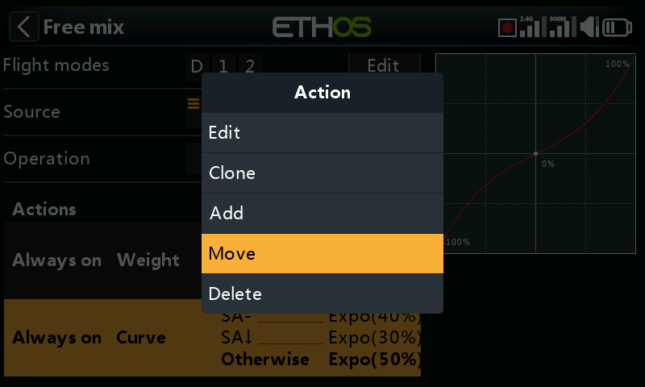

The recommended actions order is Slow, Curve, Weight, Differential, Offset then Trim, so we will move our curve action up to be before Weight. Tap \[ENT\] on the highlighted curve action, then select the Move option.

Tap on the highlighted up arrow or use the rotary encoder to move the curve action up above weight.

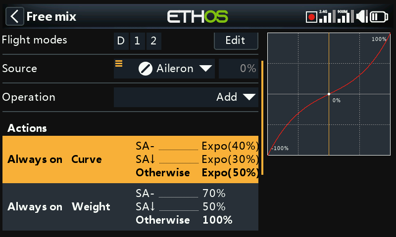

The curve action is now in the first position.

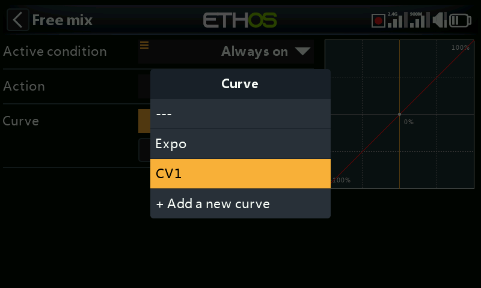

Instead of the expo curve in the example above, any previously defined curve may also be selected (for example CV1 above). The mix output will then modified by this curve.

With the Free Mix and some other mixes, you can specify up to 6 curves, each with a condition. If more than one condition is true, the curve higher in the list prevails.

##### Differential

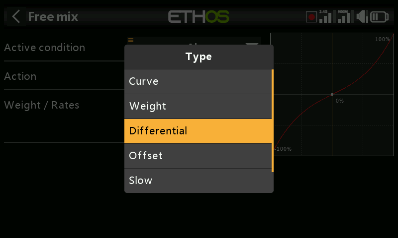

To add differential to the mix, select ‘Differential’ from the actions drop-down menu.

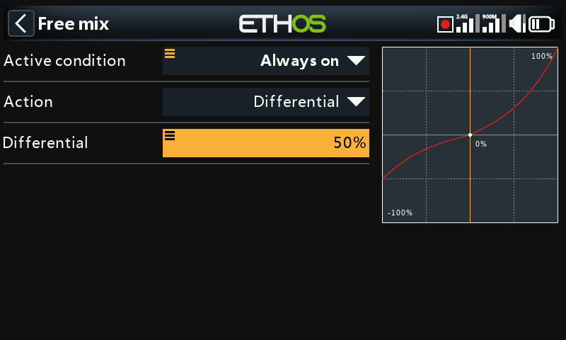

A positive value will result in the mix output having less downward travel. (Default = 0. Range -100 to +100). With a value of 50% downward travel is half of the upward travel, as can be seen in the example above.

Please refer to the Ailerons mix description for more details.

##### Offset

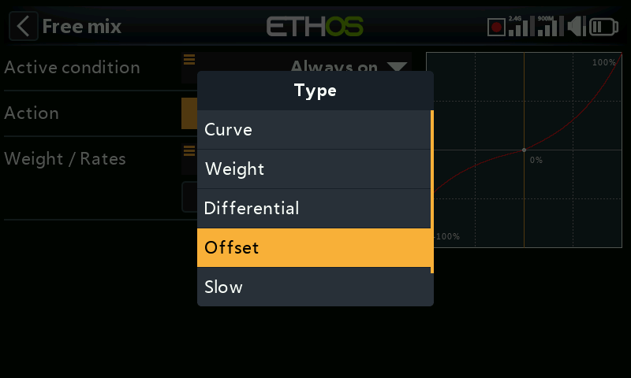

To add an offset to the mix, select ‘Offset’ from the actions drop-down menu.

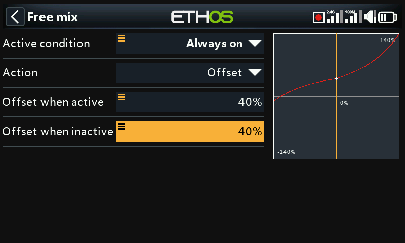

An offset will shift the mix output up or down by the offset value entered here. Negative values are allowed.

Two offset values may be defined, one for when the free mix is active, and another for when the free mix is inactive.

##### Adding a trim to a Free Mix

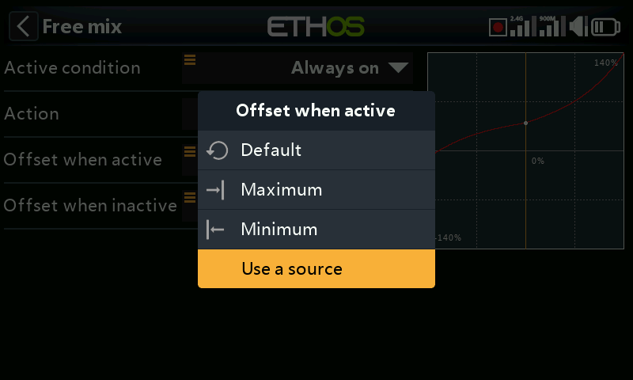

A trim may be assigned to a free mix by using the trimmer as a source (long press on the value field) for the Offset parameter.

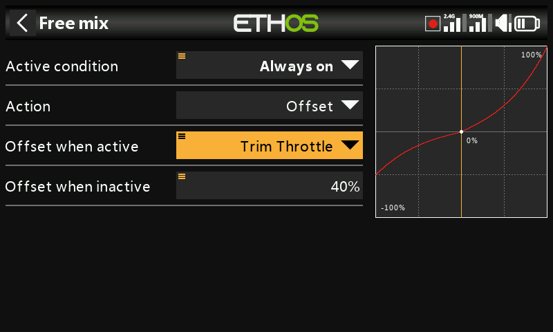

In the example above, the throttle trim has been selected as the source for adjusting the Offset.

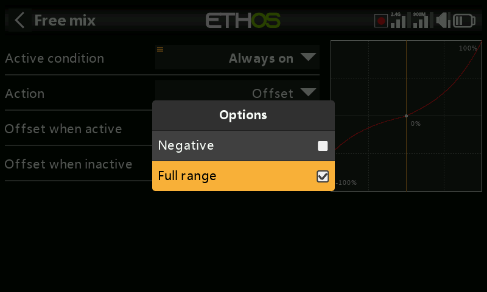

By default trims have a range of +/- 25%. When used as a source, trims can optionally be changed to full range +/- 100% (long press Enter on the trim).

The trim direction can be changed by selecting ‘Negative’.

##### Slow

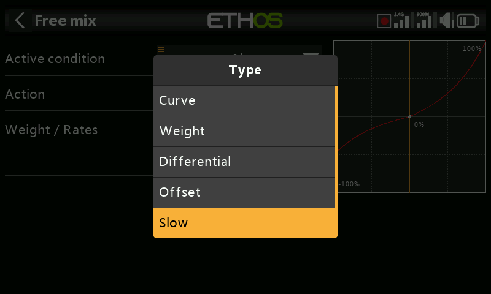

To add an action to slow down the response of the mix output with regard to the input change, select ‘Slow’ from the actions drop-down menu.

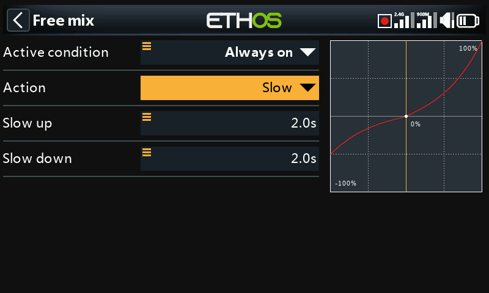

Slow is (for example) commonly used for slowing down the deployment of flaps, because sudden increases in lift can cause control problems.

If you put Slow as the first action, then the slow values are the time in seconds that the output will take to go from 0 to +100% (or change by 100%).

For example:

Action 1 - Slow up/down=2s/2s

Action 2 – Weight=50%

If the input changes from -100% to +100%,

the output will take (2+2)=4s to change from -50% to +50%.

If on the other hand the Slow action follows the Weight action, then the slow transition will be proportionally shorter.

For example:

Action 1 – Weight=50%

Action 2 -  Slow up/down=2s/2s

If the input changes from -100% to +100%,

the output will only take (2+2)\*50% ‎ = 2s to change from -50% to +50%.

Different values may be defined for the up and down directions.

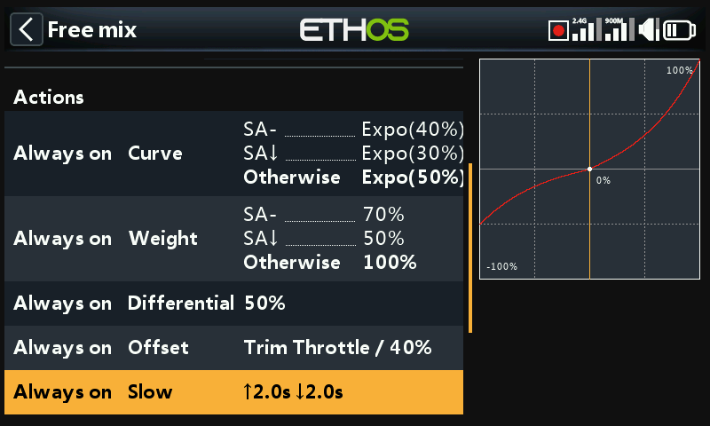

A summary of the mix actions is shown above. Also refer to the summary below showing the Slow action at the top.

##### Trim

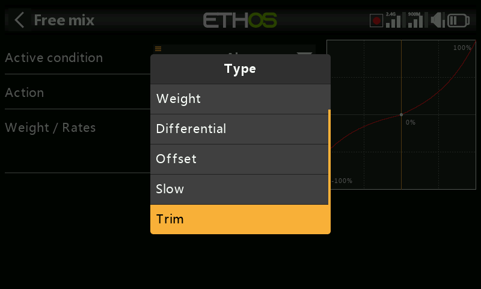

To add a trim to the mix, select ‘Trim’ from the actions drop-down menu. This is simper than adding the trim under the Offset action.

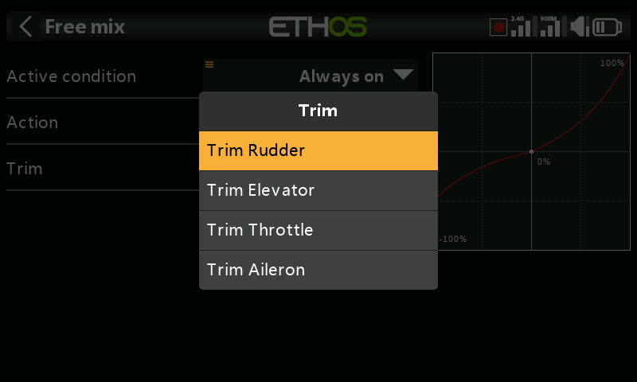

Select the trim switch to be used.

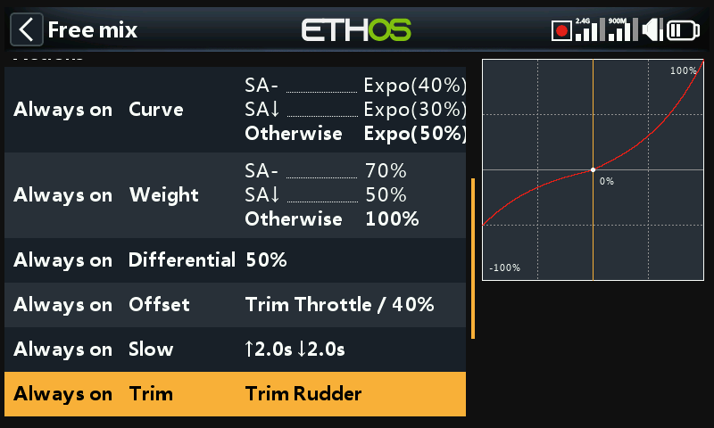

A summary of all the mix actions is shown above.

##### Reordering free mix actions

As discussed earlier, the recommended actions order is Slow, Curve, Weight, Differential, Offset then Trim. This should be adhered to unless there is a specific reason for using a different order. For example, you may want to remove an offset from an input.

Since Weight is the default action when you create a free mix, any additional actions created will be lower order, unless you delete the Weight action first. However, it is easier to simply change the order of mix actions to suit by using the ‘Move’ option in the edit sub-menu.

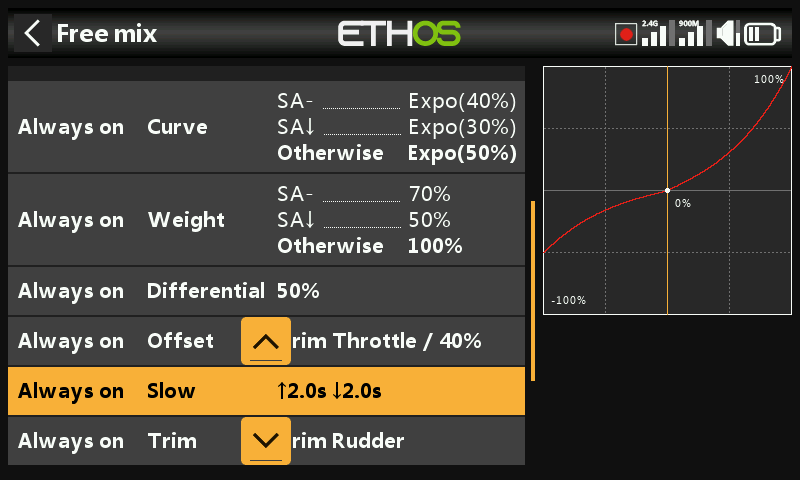

Tap on the action to be moved, for example the ‘Slow’ action in the example above, then select the ‘Move’ option in the edit sub-menu. Move arrows will appear, allowing the action to be moved up or down in the order.

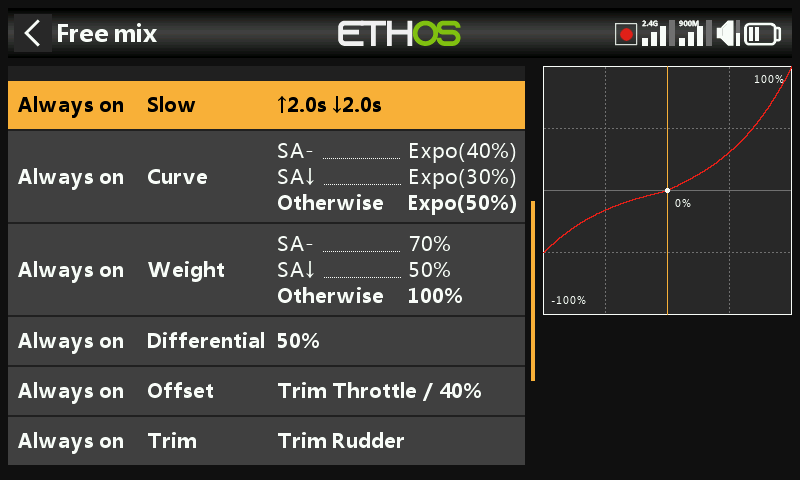

This summary shows that the Slow and Curve actions have been moved up in the actions order.  Note that Trim should always be last.

##### Channels count

Channel count defines how many Output channels are allocated.

##### Reverse

The output of this mix can be reversed or inverted by enabling this option. Please note that servo reversal should be done under Outputs. This option is for getting the logic of the mixing right.

##### Output

Any channel can be selected to receive the output from this mix. If the Channels Count above is greater than one, then a channel must be configured for each Output.

***Mixe******s*** ***l******ibrary continued…***

Aileron, Elevator, Rudder

Please refer to the detailed [Aileron Elevator Rudder mixes](mixes.md) description above.

Flaps

The Flaps mix will mix an Input to one or more channels with individual Weights. It also offers Slow Up and Slow Down options.

Throttle

The Throttle mix is for motor control and includes Throttle Cut and Throttle Hold options. Please refer to the detailed [Throttle Mix](mixes.md) discussion above.

Aileron to Flap

This mix is commonly used on sailplanes so that the flaps move together with the ailerons to increase the model’s aileron response.

Aileron to Rudder

This mix is commonly used to reduce sideslipping in turns. However, this mix will only be right at one particular airspeed and orientation. It is better to learn to correct the sideslipping with manual control of the rudder.

Airbrake

The Airbrake mix is similar to the Butterfly mix below, except that it is controlled by an on-off active condition.

Butterfly

Butterfly or crow braking is used to control the rate of descent of an aircraft. The ailerons are set to go up a modest amount, while the flaps go down a large amount. This combination creates a lot of drag, and is very effective for braking and therefore ideal for controlling the landing approach. The input is normally set to a slider (or the throttle stick on a glider).

Compensation is also needed on the elevator to avoid the glider ballooning up when crow is applied.

Please note that the mix has a built-in offset so that the mix output is zero at the flaps neutral position, i.e. when the throttle stick (or alternate source) is at its low position, and at maximum at the flaps fully deployed position, i.e. the throttle stick (or alternate source) high position. This offset is disabled when a user curve is added to give that curve full control.

Camber

The Camber mix is usually used to apply some camber to the wing surfaces to increase lift.

Flap to Elevator

The Flap to Elevator mix is useful for flap/camber/crow compensation, where a custom compensation curve is required.

Elevator to Camber

Also known as Snap Flap, this mix adds camber to the wing as elevator is applied. This allows the wing to generate lift more efficiently when the plane is given pitch commands.

Rudder to Aileron

This mix is used to counter rudder-induced yaw in knife-edge flight.

Rudder to Elevator

This mix can help to improve knife-edge flight when there are coupling issues.

Snap Roll

The snap roll is an auto-rotation maneuver in a stalled condition. During a snap, one wing is stalled while the other is accelerated about the roll axis. This creates a sudden roll-rate acceleration that you cannot obtain by simply inputting aileron. To achieve this condition in a model, several inputs must be given, including elevator, rudder and aileron. For example, you can perform an inside left snap by programming the mix to simultaneously apply up-elevator, left rudder and left aileron for 1 to 2 seconds. Recover from the maneuver by neutralizing the sticks and immediately adding right rudder to correct your loss of heading.

Throttle to Elevator

This mix allows elevator compensation for planes that change pitch on changing throttle.

Please note that the mix has a built-in offset so that the mix output is zero when the throttle stick is at its low position, and at maximum at the throttle stick high position. This offset is disabled when a user curve is added to give that curve full control.

Throttle to Rudder

This mix will help the plane fly straight when at full throttle; it’s generally needed when flying a vertical up-line.

Please note that the mix has a built-in offset so that the mix output is zero when the throttle stick is at its low position, and at maximum at the throttle stick high position. This offset is disabled when a user curve is added to give that curve full control.

Test Mix

This mix is great for soak testing servos. It includes a range setting, as well as Slow Up and Slow Down.

Offset

The Offset mix is used to add a fixed value to the mix when an offset is required. A common application is for flaps, where the servo horn is offset in one direction in order to maximize the downward flap travel. This results in the flaps being in a half way down position at servo neutral. The Offset mix can then be used to bring the flaps up to the ‘surface neutral’ position when the flaps mix output is zero.

Glider library

The list of available predefined mixes in the glider library is shown above.

Please note that some mixes only appear if the requisite channels exist in the model. For example, mixes with flaps as the target are only populated if there are valid flaps configurations defined.  Flap related mixes will appear in the mixes library if flaps are defined in Edit Model.

Free mix

Please refer to the [Free mix](mixes.md) description under the Airplane Library section above.

Aileron, Elevator, Rudder

Please refer to the detailed [Aileron Elevator Rudder](mixes.md) mixes description above.

Flaps

The Flaps mix will mix an Input to one or more channels with individual Weights. It also offers Slow Up and Slow Down options.

Throttle

The Throttle mix is for motor control and includes Throttle Cut and Throttle Hold options. Please refer to the detailed [Throttle Mix](mixes.md) discussion above.

Aileron to Flap

This mix is commonly used on sailplanes so that the flaps move together with the ailerons to increase the model’s aileron response.

Aileron to Rudder

This mix is commonly used to reduce sideslipping in turns. However, this mix will only be right at one particular airspeed and orientation. It is better to learn to correct the sideslipping with manual control of the rudder.

Airbrake

The Airbrake mix is similar to the Butterfly mix below, except that it is controlled by an on-off active condition.

Butterfly

Butterfly or crow braking is used to control the rate of descent of an aircraft. The ailerons are set to go up a modest amount, while the flaps go down a large amount. This combination creates a lot of drag, and is very effective for braking and therefore ideal for controlling the landing approach. The input is normally set to a slider (or the throttle stick on a glider).

Compensation is also needed on the elevator to avoid the glider ballooning up when crow is applied.

Please note that the mix has a built-in offset so that the mix output is zero at the flaps neutral position, i.e. when the throttle stick (or alternate source) is at its low position, and at maximum at the flaps fully deployed position, i.e. the throttle stick (or alternate source) high position. This offset is disabled when a user curve is added to give that curve full control.

Camber

The Camber is usually used to apply some camber to the wing surfaces to increase lift.

Flap to Elevator

The Flap to Elevator mix is useful for flap/camber/crow compensation, where a custom compensation curve is required.

Elevator to Camber

Also known as Snap Flap, this mix adds camber to the wing as elevator is applied. This allows the wing to generate lift more efficiently when the plane is given pitch commands.

Rudder to Aileron

This mix may be used to counter rudder-induced yaw.

Rudder to Elevator

This mix can help when there are coupling issues. It can also be used for adding a V-Tail differential function.

Throttle to Elevator

This mix allows elevator compensation for planes that change pitch on changing throttle.

Throttle to Rudder

This mix will help the plane fly straight when at full throttle; it’s generally needed when flying a vertical up-line.

Test mix

This mix is great for soak testing servos. It includes a range setting, as well as Slow Up and Slow Down.

Offset

The Offset mix is used to add a fixed value to the mix when an offset is required. A common application is for flaps, where the servo horn is offset in one direction in order to maximize the downward flap travel. This results in the flaps being in a half way down position at servo neutral. The Offset mix can then be used to bring the flaps up to the ‘surface neutral’ position when the flaps mix output is zero.

Heli library

Free mix

Please refer to the [Free mix](mixes.md) description under the Airplane Library section above.

Aileron, Elevator, Rudder

Please refer to the detailed [Aileron Elevator Rudder](mixes.md) mixes description above.

Pitch

The Pitch mix mixes the pitch control (default Throttle Stick) to the pitch channel, which is normally channel 6. It controls the collective.

Flight mode

This mix is used to provide a flight mode control to the FBL controller on the Heli. It may be Normal/Idle Up 1/Idle Up 2 or for example Beginner/Sport/3D.

Throttle

The Throttle mix is for motor control and includes Throttle Cut and Throttle Hold options. Please refer to the detailed [Throttle Mix](mixes.md) discussion above.

Gyro

This mix is used to provide gain settings to the FBL controller, which may for example be flight mode dependent. The gyro channel is often channel 5.

Pitch to Rudder

This is for mixing pitch to the rudder channel.

Test mix

This mix is great for soak testing servos. It includes a range setting, as well as Slow Up and Slow Down.

Offset

The Offset mix is used to add a fixed value to the mix when an offset is required.

Multirotor library

Free mix

Please refer to the [Free mix](mixes.md) description under the Airplane Library section above.

Roll, Pitch, Yaw

These mixes are similar to Aileron, Elevator and Rudder mixes. Please refer to the [Aileron Elevator Rudder Mixes](mixes.md) description above.

Flight mode

This mix is used to provide a flight mode control to the FBL controller on the Multirotor. It may be Arm, Acro, Angle, Horizon, Acro Trainer, GPS Rescue, Failsafe, 3D, etc.

Throttle

The Throttle mix is for motor control and includes Throttle Cut and Throttle Hold options. Please refer to the detailed [Throttle mix](mixes.md) discussion above.

Test mix

This mix is great for soak testing servos. It includes a range setting, as well as Slow Up and Slow Down.

Offset

The Offset mix is used to add a fixed value to the mix when an offset is required.
