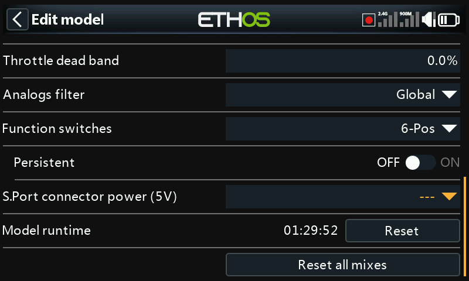
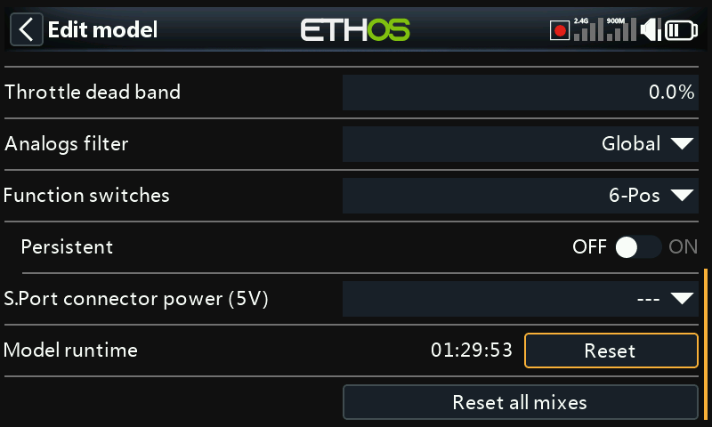

# Model Edit

Edits the model-level parameters the wizard set up initially — mostly
identity, but also a few per-model overrides and utilities.

## Name, Picture

Rename the model or change its picture; browsing for an image shows a
preview thumbnail.

## Model type

!!! warning
    Changing the model type resets **all** mixes.

## Channel assignments

Changing tail type or (on a heli) swashplate type also resets all mixes.
Other channels can have their assigned count changed, or be unassigned.

## Analogs filter

[System Setup → Hardware](../system-setup/hardware.md) has a global
analog-to-digital filter that can reduce jitter around stick center; this
per-model setting overrides it for just this model.

## Function switches {: #function-switches }

The six function switches are available anywhere an **Active condition**
parameter appears, but — unlike ordinary switches — can't be used as a
general-purpose source. They're configured as one of:

- **6-Pos with OFF** — pressing a function switch latches it on; pressing
  the *same* one again turns all six off.
- **6-POS** — pressing a function switch latches it on until a *different*
  one is pressed, which takes over.
- **2 × 3-Pos** — splits the six into two groups of three, one active
  switch per group.
- **6 × 2-Pos** — six independent latching on/off switches.
- **Momentary** — six independent switches, each on only while held.
- **Persistent** — if enabled, a function switch keeps its state across
  power-off/model reload instead of resetting.

## SPort connector

The transmitter's S.Port connector's 5V pin can be switched per model —
useful for powering an external receiver in a trainer setup, for example.

## Model runtime

Tracks total time this model has been flown/run.

## Reset all mixes

Resets every mix on the model back to its default state.
