# **Model** **s****elect**

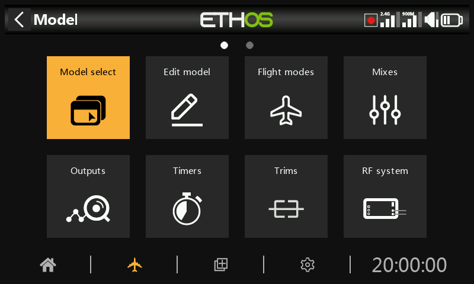

The model select option is accessed by selecting ‘Model select’ from the Model menu. It is used to select the current model, add a new model, clone a model, send or receive a model via Bluetooth, or delete it.

## Managing model folders

Ethos allows you to create your own model folders to categorize and group your models. Typical model folder names may be Airplane, Glider, Heli, Quad, Warbird, Boat, Car, Template, Archive etc.

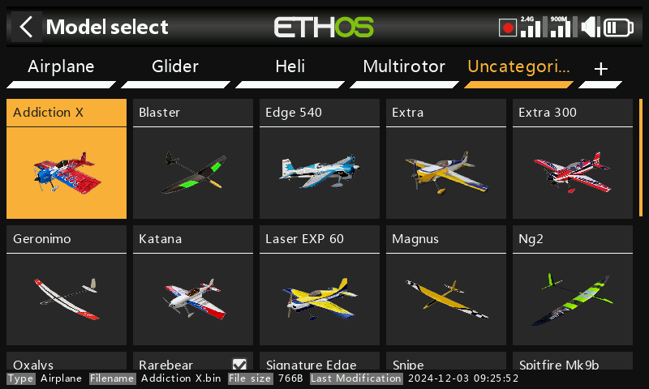

Until you have created and organized your folders, Ethos will automatically create the ‘Uncategorized’ folder. This happens when you upgrade to Ethos version 1.1.0 alpha 17 or later, or when you copy a model from the net or a friend into the \\Models folder on the SD or eMMC card.  Ethos will automatically delete the ‘Uncategorized’ folder when no longer needed.

To create your first folder, tap on the ‘+’ to the right of the ‘Uncategorized’ label, or long press the Page Up/Down key.

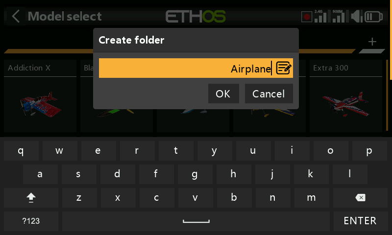

Enter the name into the ‘Create folder’ dialog, and tap OK. The folder names can be up to 15 characters. Repeat for your other categories. Note that these folders appear as subfolders beneath the \\Models folder on the SD card or eMMC.

Model category folders are sorted alphabetically, but the ‘Uncategorized’ folder will always appear last in the list.

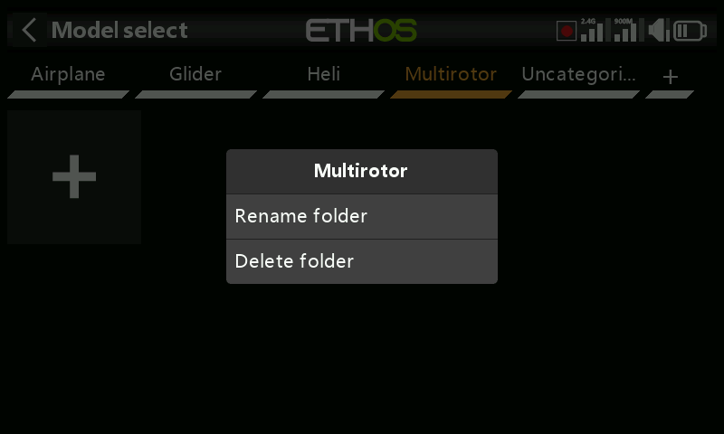

Tapping on a folder name will bring up a dialog allowing the folder to be renamed or deleted. If there were models in the folder being deleted, Ethos will automatically place them in the ‘Uncategorized’ folder.

## Adding a new model

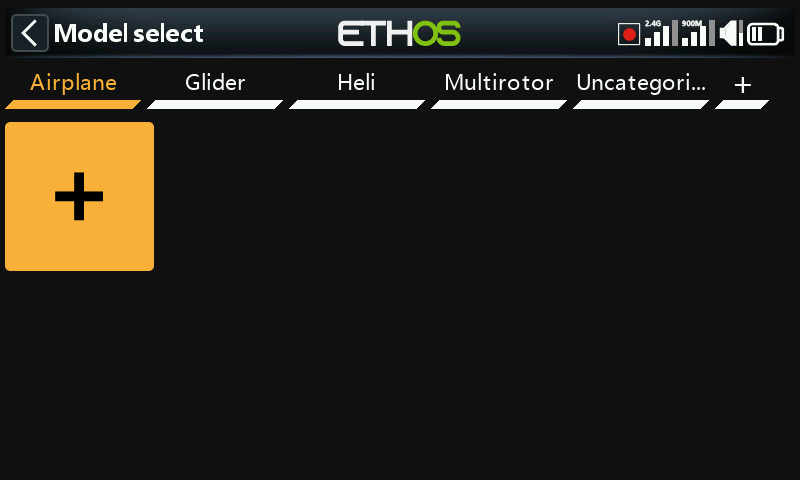

To add a new model, select the model category you wish to create the model under, then tap on the \[+\] icon to create a new model or to receive a model from another Ethos radio via Bluetooth.

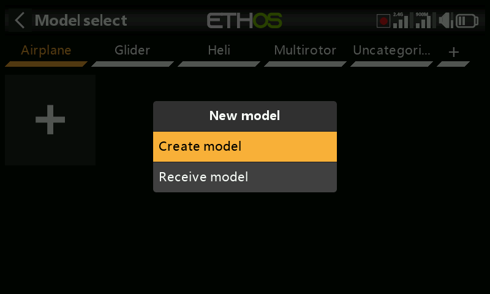

Tap on ‘Create model’ to start the new model wizard. (You may need to create your model categories first, see above.)

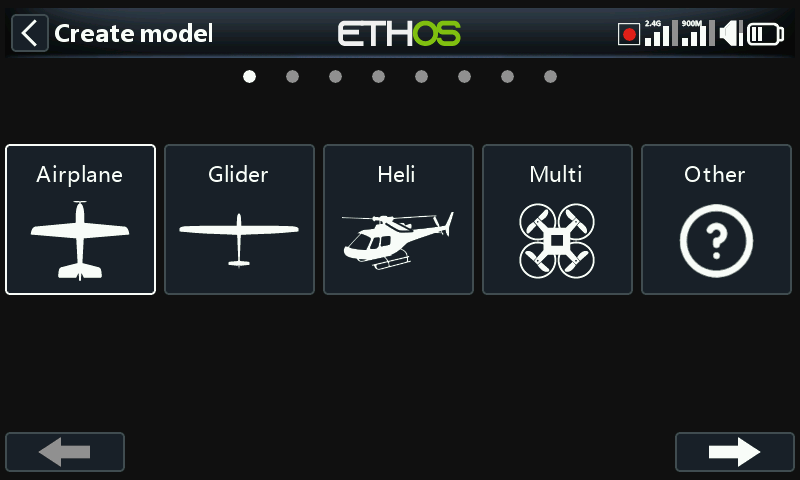

Choose the type of model you wish to create, and follow the prompts.

There are wizards for:

- Airplane
- Glider
- Helicopter
- Multirotor
- Other

The wizards assist you with the basic setup for the given type of model.

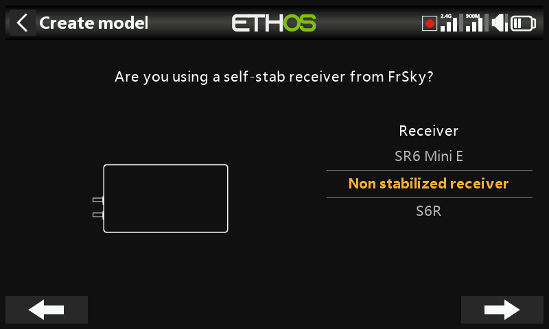

The wizards include optionally setting up additional pre-set mixes for FrSky stabilized receivers, such as gain and stabilization mode.

### Stabilized receivers

The FrSky stabilized receivers require a specific channel order, namely AETR. Therefore the ‘Channel order’ in the Sticks menu should be left at the default AETR setting and the ‘First four channels fixed’ option should be On, to ensure that the channel order created by the wizard will suit the receiver.

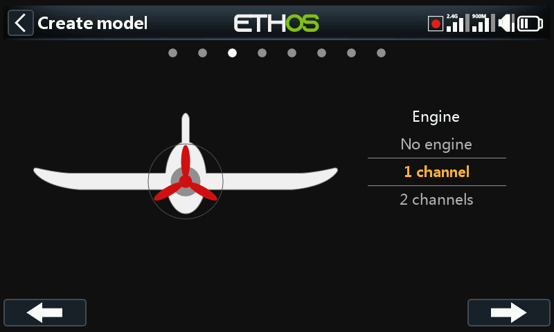

For an Airplane type of model, the next page is Engine, which allows selection of the desired number of engine channels (if any).

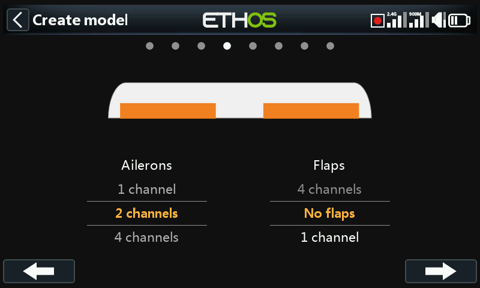

For an Airplane type of model, the number of aileron and flap channels are selected next.

As from Ethos 26.1.0 the new model wizards assign channels starting from the left and alternating from the outside in, bringing it into line with FrSky receiver documentation.

Hence for a simple model with 2 ailerons, 1 elevator, 1 rudder and 1 motor the channel order will be as follows (assuming the default ‘Channel order’ of AETR and the ‘First four channels fixed’ option is On):

CH1 Aileron Left

CH2 Elevators

CH3 Throttle

CH4 Rudders

CH5 Aileron Right

### Upgrading models to Ethos 26.1.0

During the upgrade to Ethos 26.1.0 existing models may be converted to suit the new scheme of counting from the left.

There are 3 scenarios:

a) Existing models with the default 1.6.x channel order counting from the right will have their mixes rearranged to suit the new scheme of counting from the left. However the output channel allocation is kept the same so no wiring changes are required in the model. Only the mixes will be rearranged into a the new sequence, but the original output channel allocations are kept for the model to continue operating correctly. For example the mixes order will be:

from

CH1 Aileron Right

CH2 Elevators

CH3 Throttle

CH4 Rudders

CH5 Aileron Left

to

CH5 Aileron Left

CH2 Elevators

CH3 Throttle

CH4 Rudders

CH1 Aileron Right

b) Existing models that have had their channels swapped to count from the left will have their mixes rearranged to ensure that the aileron differential continues to work correctly, but the channel assignments remain the same as before.

c) Existing models that have had their channels swapped by inverting the Aileron mix and renaming the output channels will work correctly after the upgrade but will suffer a conflict in the channel naming. To resolve this, you need to undo the mix inversion changes made previously:

i) Re-invert the Aileron mix with positive values for the Weight and Differential.

ii) Swap the Aileron mix output channels using the ‘Swap function’ in the Channels menu.

iii) Also rename the two channels to their correct left and right functions.

iv) **Warning!** After making the changes, confirm that the mixes and output channels work correctly in the right order with the propellor(s) removed.

For a more detailed review of the three conversion scenarios, please refer to [Appendix A - Conversion of Ethos models from 1.6.x to 26.1.x](../appendix-a-conversion-of-ethos-models-from-1-6-x-to-26-1-x/index.md).

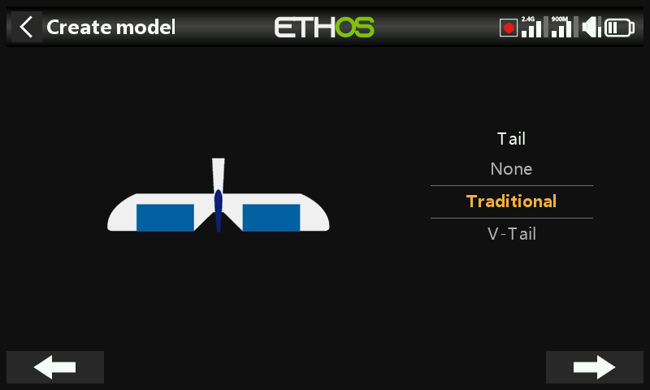

For an Airplane type of model, the tail configuration is chosen between Traditional cross tail, V-tail or no tail (e.g. on a delta or flying wing).

### Delta wings

An Elevon setup can be achieved by creating a new Airplane model with 2 Ailerons and No Tail surfaces, which will result in Elevon mixing being automatically built. The default mix weights are 50% to give a total 100% if both aileron and elevator are applied simultaneously.

Alternatively, when using a stabilized receiver, the delta mixing can be performed by the receiver. In the wizard, for this situation you should select 1 aileron and 1 elevator, because the elevon mixing will be done in the receiver. Please refer to the stabilized receiver manual for details.

For a delta wing model having both aileron and elevator surfaces, allow the wizard to complete as though the model has a tail. It will configure the needed aileron and elevator channels, with or without a rudder as required.

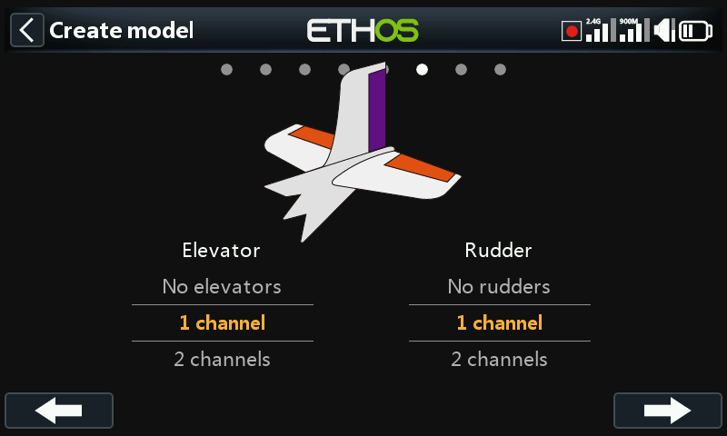

For an Airplane type of model, having chosen for example a traditional cross tail, the number of elevator and rudder channels may be configured.

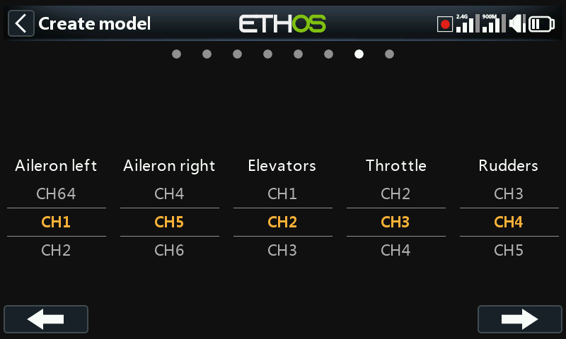

After setting up the channel options, the step shown above allows you to reassign the model functions to different channels. The wizard obeys the ‘Channel order’ configured in Sticks, but this screen allows you to reassign the channels, bearing in mind that FrSky stabilized receivers require the stabilized channels to be in a specific order. Please refer to the receiver’s instructions for details.

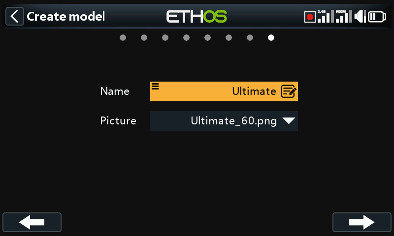

In the last step the model name can be defined, and a model image linked. Note that model names can be up to 15 characters.

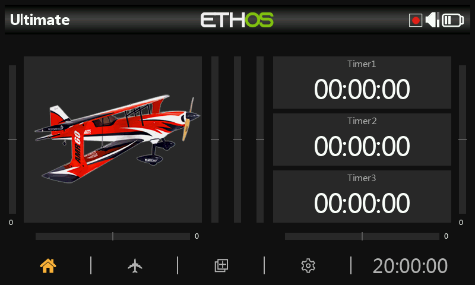

The new model has been created.

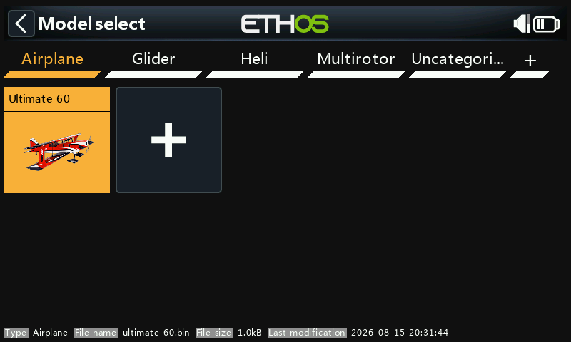

The created model will appear in the user-defined model category folder that was active when the wizard was started, and will be sorted alphabetically within each group.

Please also refer to the [Basic Fixed Wing Airplane example](../programming-tutorials/basic-fixed-wing-airplane-example.md) in the Programming Tutorials section for a worked example.

## Wizard output channel naming

The new model wizards use the following channel naming rules:

- When the mix has only one output, there is no numbering, no naming suffix.
    - When the mix does something different on the outputs, then the output channels need an explicit name (i.e. "left" / "right" for ailerons).
    - When the mix does exactly the same calculations on all outputs, then the name will just have a number as a suffix.

## Selecting a model

Tap on ‘Model select’ to bring up a list of your models.

Please note that after an Ethos version upgrade, ETHOS converts the models individually when they are selected with the model selection screen. There is no need to select each model after an update because the conversion can take place at a later date when they are selected, even with a later release of Ethos. There is no noticeable delay in the conversion process when a model is selected. When the conversion takes place, the Last Modification date at the bottom of the model selection screen will change to the current date. If no conversion is needed the date only changes if you make an edit to the model.

### Quick select

Touch\_long or Enter\_long on a model icon will switch to that model immediately. Also refer to ‘Set current model’ below.

## Model management menu

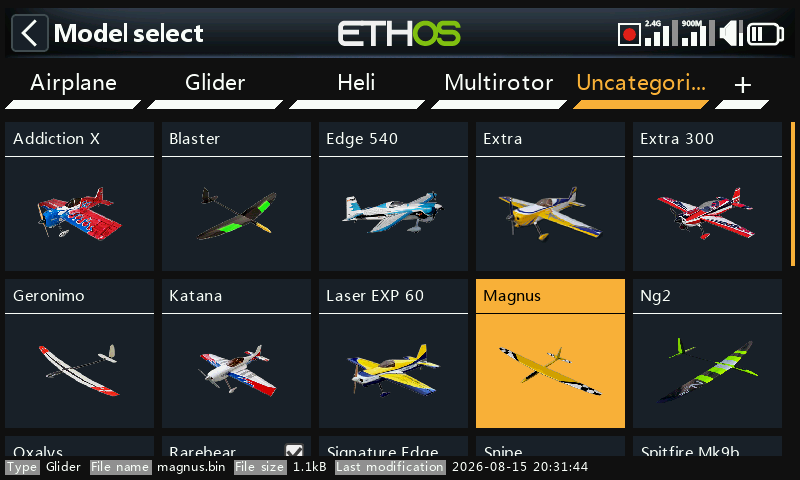

Tap on a model to highlight it, then tap on it again to bring up the model management menu.

### Set current model

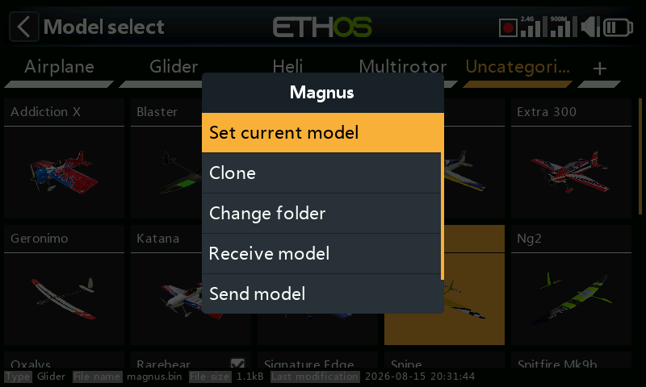

Tap on ‘Set current model’ to make the highlighted model current.

Alternately, use the ‘Quick select’ method described above.

### Clone a model

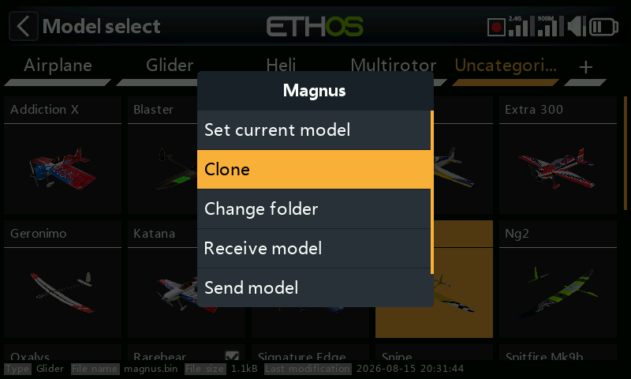

Tap on ‘Clone’ to make a clone copy of the highlighted model.

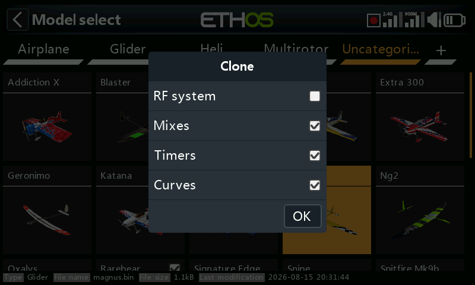

A dialog will open allowing you to customize the clone.

By default the RF system is not cloned, meaning that the RF module will be turned off in the clone but with a different model number set. If the ‘RF system’ option is selected, the RF configuration including the model number will be cloned.

The model mixes, timers and curves will not be cloned if deselected.

Tap on ‘OK’ to proceed. A confirmation ‘Model cloned successfully!’ dialog will follow on completion.

### Change folder

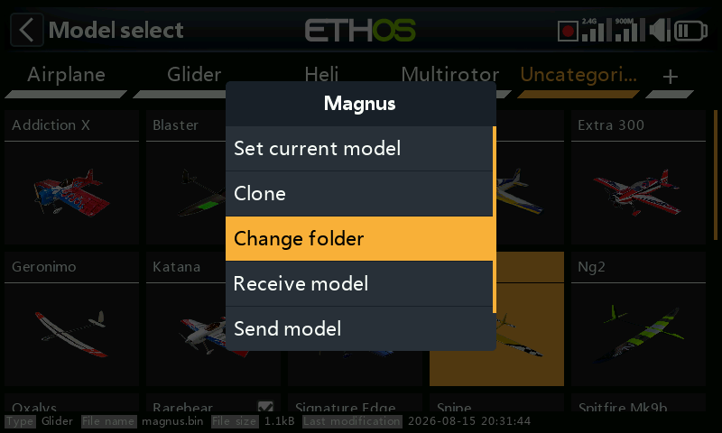

To move a model to another folder, tap on the model’s icon, then select ‘Change folder’ from the dialog.

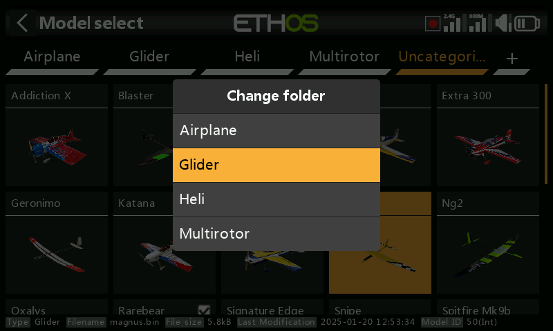

Tap on the folder to move it to.

### Receive model

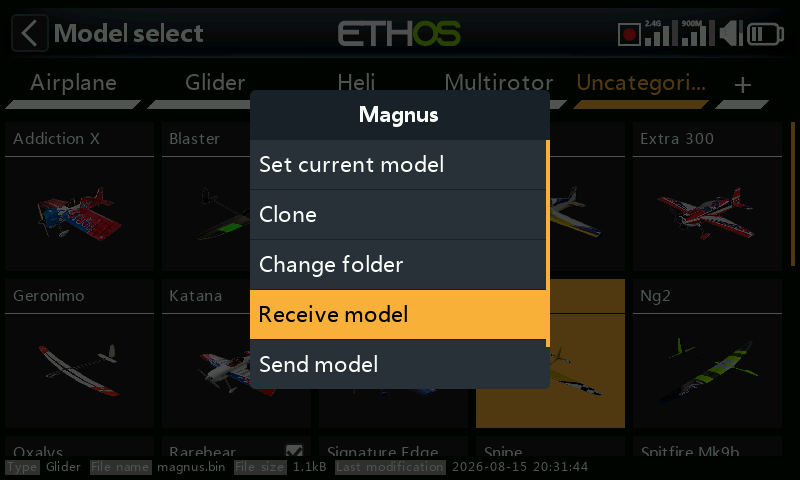

Tap on ‘Receive model’ to initiate the process to receive a model from another Ethos radio via Bluetooth. Please note that the ‘Receive model’ must be initiated before the ‘Send model’ in the sending radio.

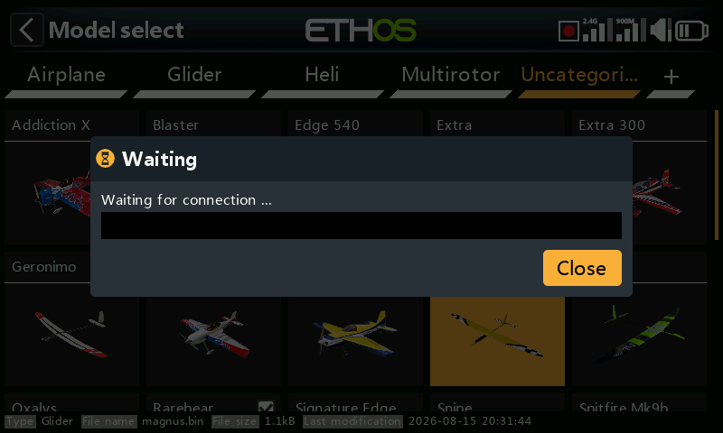

Until a Bluetooth connection is found, a ‘Waiting for connection’ dialog is displayed.

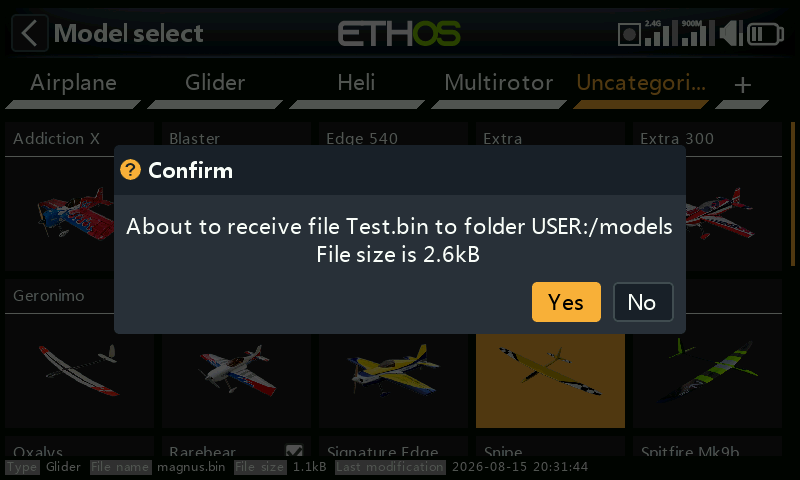

Once a connection has been established, an ‘About to receive’ dialog is displayed waiting for confirmation to proceed.

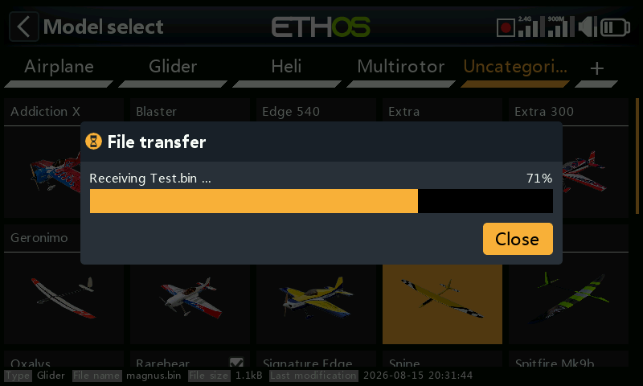

File transfer commences and a progress bar is displayed, followed by a success message on completion.

### Send model

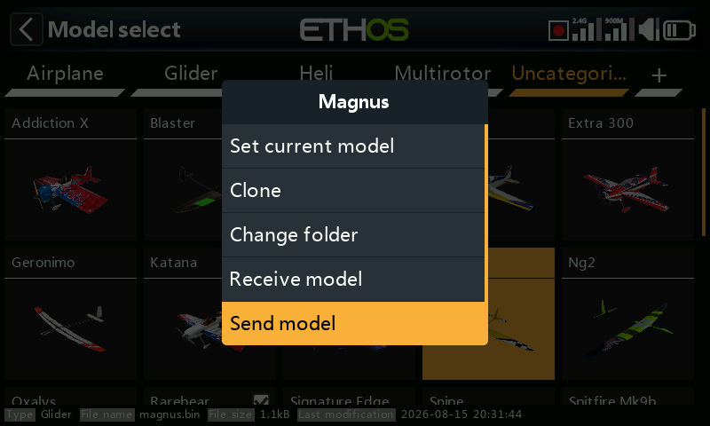

Tap on ‘Send model’ to initiate the transfer of a model to another Ethos radio via Bluetooth. Please note that the ‘Receive model’ must be initiated before the ‘Send model’ in the sending radio.

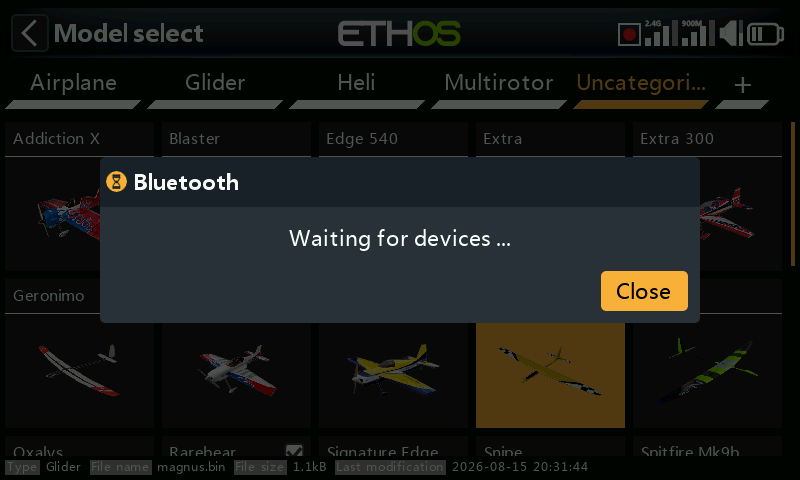

Until a Bluetooth connection is found, a ‘Waiting for devices’ dialog is displayed.

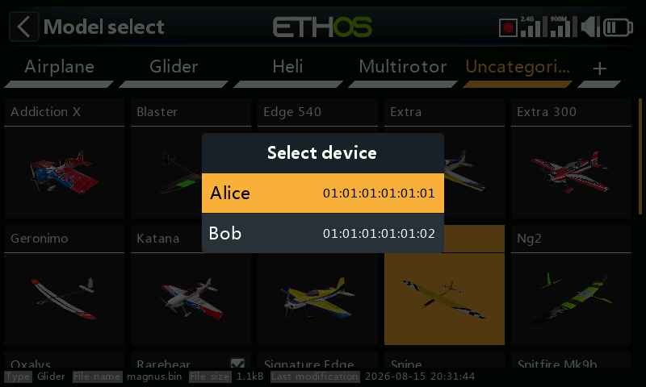

Once devices have been found, a device selection dialog is displayed. Select the device the model is to be sent to.

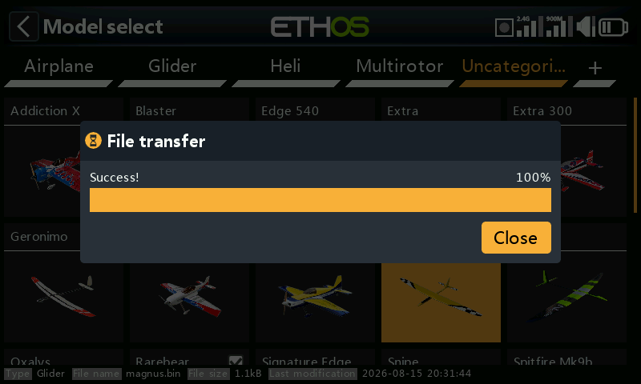

File transfer commences and a progress bar is displayed. A success message pops up on completion.

### Delete

Tap on ‘Delete’ to delete a model. This option is not available on the active model.

## Receiving a model from another Ethos radio

You can also initiate receiving a model directly from the ‘Model select’ menu. Simply tap on the \[+\] icon after selecting the model category you wish to create the model in.

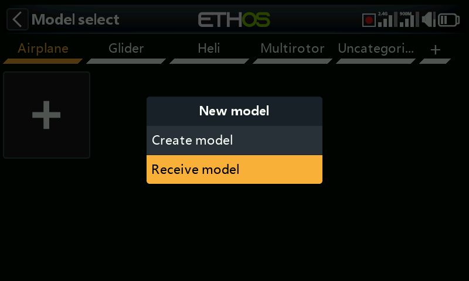

Tap on ‘Receive model’ to initiate the process to receive a model from another Ethos radio via Bluetooth.

Please refer to the [Receive model](../model-setup/model-select.md) section above for further details.
