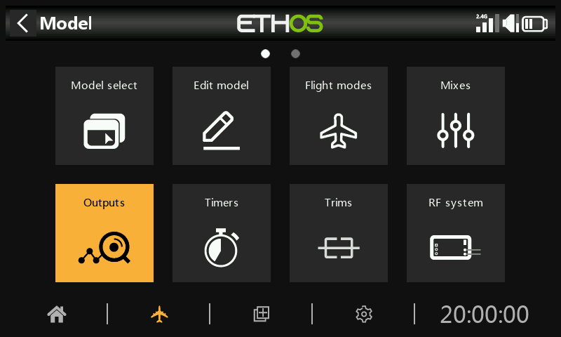

# Outputs

The Outputs section is the interface between the setup "logic" and the real world with servos, linkages and control surfaces as well as actuators and transducers. In the Mixes we have set up what we want our different controls to do. This section allows these pure logical outputs to be adapted to the mechanical characteristics of the model. This is where we configure minimum and maximum throws, servo or channel reverse, and adjust the servo or channel center point using the PPM center adjustment, or add an offset using subtrim. We can also define a curve to correct any real world response issues. For example, a curve can be used to ensure that left and right flaps track accurately. The various channels are outputs, for example CH1 corresponds to servo plug #1 on your receiver (with the default protocol settings).

Although the radio is configured using percentages as input, servos and output devices are controlled by a PWM (Pulse Width Modulation) signal in μs (microseconds). The relationship between the units is as follows:

−150%	=	732 μs

−100%	=	988 μs

0%	=	1500 μs

100%	=	2012 μs

150%	=	2268 μs

Note that a channel not assigned to any mix will have an output at neutral = 0% = 1500us. The same applies when a channel’s mix or mixes are inactive, so care must be taken to ensure that used channels always have an active mix. A throttle channel at neutral = 0% = 1500us will be at half throttle!!

The Outputs screen shows two bar graphs for each channel. The lower (green) bar shows the value of the mixes for the channel, while the upper (orange) bar shows the actual value (in both % and µS terms) of the Output after the Outputs processing, which is what is sent to the receiver. In the example above you can see that both the mixes and output values for CH4 Throttle are at -100%.

The Channel min and max settings are indicated by the greyed-out sections in the upper (orange) bar. For their adjustment see the section below.

The channels that are not being output to the RF module are shown with a darker background.  In the example above, all eight channels are being transmitted, so they have a lighter grey background.

The icons         appear in a channel’s display if the defaults for output [Direction](outputs.md), output [Curve](outputs.md), [Slow Up/Down](outputs.md) have been changed or [Balance Channels](#Balance channels) has been configured. For details, please refer to their respective settings below.

Note: For quick access to this monitor screen, a long press of the enter key from the ‘Mixes’ screen and ‘Flight modes’ screens will jump to the Outputs.

## Outputs setup

Tap on the Output channel to be edited or reviewed.

Channel preview

A channel preview is shown at the top of the Outputs setup screen. The mixes value is shown in green, while the channel output value is shown in orange (default theme). A little white marker denotes the Min/Max points.

Name

The name can be edited.

Direction

Will change the direction of the channel output, typically to reverse servo direction.

	When enabled, a double-arrow icon is displayed in the channel’s graph display, please refer to CH7 Flaps2L in the Outputs screenshot above.

Please note that this does not affect the mixes driving the output, and also does not swap the min/max limits (see below).

Min/Max

The Channel min and max settings are ‘hard’ limits, i.e. they will never be overridden. They should be set to avoid mechanical binding. Note that they serve as gain or ‘end point’ settings, so reducing these limits will reduce throw rather than induce clipping. Note that the limits default to +/- 100.0%, but may be increased here to +/- 150.0%.

The Channel min and max settings are indicated by the greyed-out sections in the upper (orange) bar.

Warning:

When using a redundancy system involving SBUS, servo movements beyond about +/- 125% are not possible.

Note:  The Min/Max parameters have ranges of (-150% to 0%) and (0% to +150%) respectively. When using VARs as a source to adjust the Min/Max parameters, unless the Var has an identical range, it will be necessary to set the Var range to be ignored to avoid unexpected values due to range conversion. Please refer to the [Var options](../getting-started/user-interface-and-navigation.md) section for details of this option.

If using more than 125% on the main receiver driving PWM outputs, and this receiver enters failsafe, the servo positions then received from a redundant receiver via SBUS are limited to 125%.

In particular, if an output on the main receiver is beyond 125%, then at the point of switching to the redundant receiver, the output will change to 125%.

Setup aid

When adjusting the min/max output limits, the end to be adjusted is highlighted bold.

For example, if you want to set the Max endpoint for the elevator channel, when you slightly move the elevator stick forward, the max value is shown in bold to indicate that is the end to be adjusted. If you move the stick back, the min value will be in bold.

Center/Subtrim

Used to introduce an offset on the output, typically used to center a servo arm. Note that the endpoints are not affected.

Warning:

Don't be tempted to use Subtrim to add large offsets - it will build a large amount of differential into the servo response. The correct way is to add an offset mix.

PWM center

This is similar to subtrim, with the difference that an adjustment done here will shift the entire servo band of movement (including hard limits). This adjustment won't be visible on the channel monitor because it is effectively done in the servo. The advantage of using ‘PWM center’ to mechanically center the control surface is that this separates the centering function from the trimming function.

Curve

Allows you to select an Expo or custom curve to condition the output. The popup allows to to either select an existing curve, or to add a new curve.  After configuring the curve, an Edit button is added so that you can edit the curve easily.

	When enabled, a curve icon is displayed in the channel’s graph display, please refer to CH5 Rudders in the Outputs screenshot above.

Slow up/down

Response of the output can be slowed down with regard to the input change. Slow could for example be used to slow retracts that are actuated by a normal proportional servo. The value is time in seconds that the output will take to go from 0 to +100%.

 When configured, a clock icon is displayed in the channel’s graph display.

Delay

Please note that a delay function is available under logic switches.

Swap channels

This feature allows two output channels to be swapped.

The swap dialog opens with the first channel already filled in. Select the channel to be swapped, and click OK. Note that the swap takes place immediately.  All mixes etc will be adjusted accordingly.

Reset settings

Reset settings will clear all parameters for the Output channel if the channel is no longer required. A confirmation dialog will avoid accidental resetting.

This will avoid settings not being at their defaults if the channel is re-used for something else.

Balance channels

This feature allows you to balance selected pairs or a group of up to 4 channels to ensure that they move in unison. For example, unbalanced flaps can result in unwanted roll, while unbalanced throttles on multi-engine models can result in unwanted yaw.

Overview

This feature automatically creates a differential balance curve for each channel selected. The number of balance points may be chosen. By comparing the physical positions of control surfaces (such as flaps) at each point of the curves, they can be easily adjusted to be equal. The final result is perfectly tracking surfaces.

Prerequisites

Prior to balancing channels, this recommended process should be followed:

1. Set the servo directions for correct surfaces travel.
2. With mixes at neutral, optionally use PWM Center to set servo horns at right angles.
3. Configure the Min/Max limits and Subtrim.
4. Configure any other curves.
5. Configure Slow.
6. Proceed with Balance Channels to balance and equalize control surfaces at multiple points of travel.

How to use



When activated, the channels to be balanced are chosen.



Select the channels in the order you wish to display them.

The channels will be displayed in the order of selection. In this example, CH7 Flap Left was selected first, then CH6 for Flap Right. The mix outputs are shown along the X axes, while the balance adjustment differential values are shown on the Y axes.

Tap on a channel graph (or scroll to it and press ENTER) to edit the balance curve. The PAGE key will switch between the channels while editing.

##### Menu buttons

 The source(s) configured in the channel mixes may be used, or optionally any other convenient analog input. If you select this 'Auto analog input' option, the first stick, slider or pot you move will be used as the source for X, not only in the graph, but also in the model.

When enabled, the nearest curve point on the X axis will be automatically selected for adjustment with the rotary encoder, as in the example above.

The input must be adjusted to align the X value with a curve point before adjustment is made.

 Tapping in the icon, or pressing the ENTER key while in graph edit mode will toggle Lock mode on and off. When enabled, all inputs are locked so that you can release the stick input, allowing you to observe the control surfaces while you adjust your curve.

 Open the configuration dialog for the chosen channels. It is possible to modify the number of points of all curves, or only some, and choose if they are smoothed or not.

**?** This button will call up the help file. It can also be called up with the MDL key.

In the example above, the Magnet option has been deselected. The curve point to be adjusted is highlighted, and can be moved using the 'SYS' and 'DISP' keys.

Again, the input should be adjusted to align the cursor (X value) with a curve point before adjustment is made.

Multichannel option

Up to 4 channels may be balanced simultaneously.

Review, edit or clear balance curve

Once a channel has been balanced, its balance curve can be reviewed, edited or cleared from the channel’s config page.

	Note that a balance icon is displayed on the channel’s graph display (orange bar). In the example above a Direction icon is also displayed, indicating that the output has been reversed, which can also be seen from the graph showing that the output direction is opposite to that of the mixer.
