# Outputs

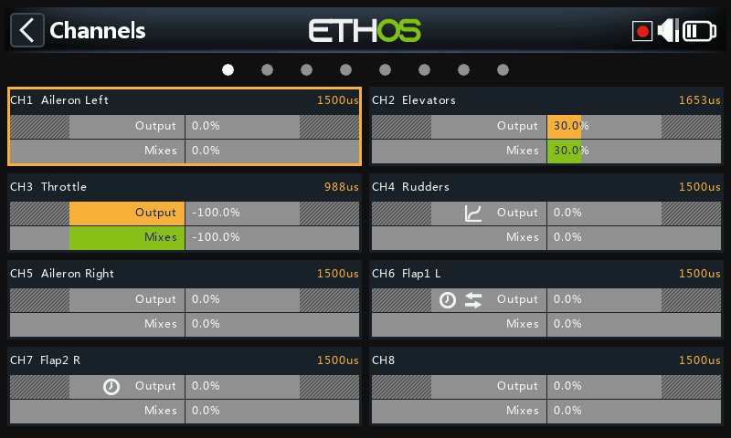

Outputs is the boundary between [Mixes](mixes.md)'s pure "logic" and the
physical world — servos, linkages, control surfaces, actuators,
transducers. It's where endpoints, reversing, centering, and
correction curves get adapted to what the model actually needs
mechanically. Each output channel corresponds to a receiver servo output
(CH1 → servo plug #1, with default protocol settings).

Ethos works in percentages, but servos are ultimately driven by PWM pulse
width in microseconds:

| % | µs |
|---|---|
| −150% | 732 |
| −100% | 988 |
| 0% | 1500 |
| 100% | 2012 |
| 150% | 2268 |

!!! warning
    A channel with **no active mix** outputs neutral (0% / 1500µs) — this
    includes a channel whose only mix(es) are currently inactive. Make
    sure every channel you actually use always has an active mix backing
    it. On a throttle channel specifically, neutral means **half throttle**.

The Outputs screen shows two bars per channel: the lower (green) bar is
the mixer's value for that channel, the upper (orange) bar is the
post-Outputs value actually sent to the receiver (in both % and µs).
Min/Max limits show as greyed-out sections of the orange bar. Channels not
currently being transmitted to the RF module have a darker background.
Small icons appear on a channel when its Direction, Curve, Slow, or
Balance settings have been changed from default, as a way to spot
non-default channels at a glance.

!!! tip
    A long press on `ENT` from either the Mixes or Flight Modes screen
    jumps straight here.

## Editing a channel

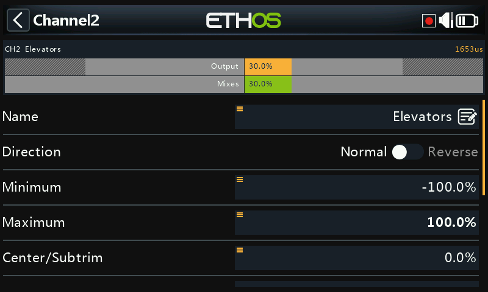
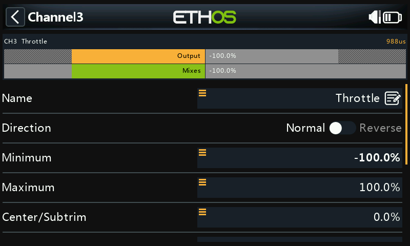

Tap a channel to open it. A preview at the top shows the mix value
(green) against the output value (orange), with a small white marker for
the Min/Max points.

- **Name** — editable.
- **Direction** — reverses the channel's output, typically to reverse
  servo rotation direction. Shown as a double-arrow icon on the channel.
  This does **not** affect the mixes feeding it, and does **not** swap the
  Min/Max limits.
- **Min/Max** — hard limits that are never overridden — set to avoid
  mechanical binding. These act as endpoint/gain settings: reducing them
  reduces throw rather than causing clipping. Default is ±100%, adjustable
  up to ±150%. While adjusting, whichever end is currently being moved
  toward is shown in bold (e.g. nudge the elevator stick forward and the
  Max value bolds, to confirm that's the end you're setting).

  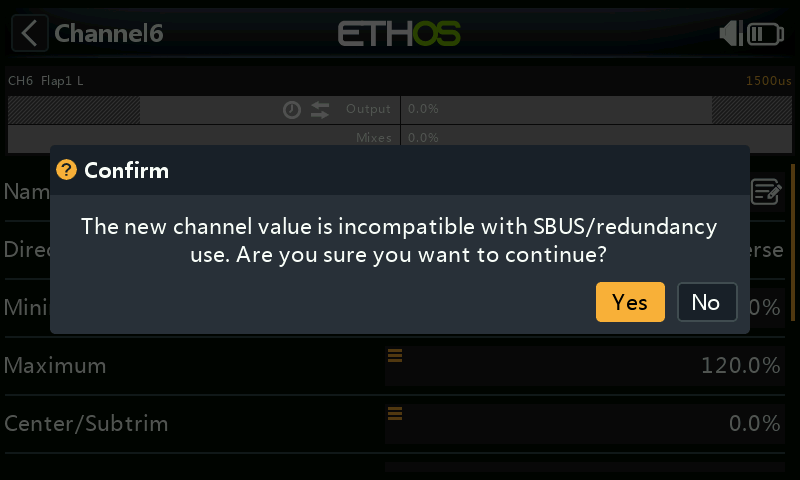

  !!! warning "SBUS redundancy"
      A redundancy setup using SBUS can't move a servo beyond roughly
      ±125%. The Min/Max fields themselves have asymmetric ranges (−150–0%
      and 0–150%) — if driving them from a [Var](variables.md), give that
      Var an identical range or set **Ignore range** (see [source
      options](../getting-started/user-interface-and-navigation.md#choosing-a-source)),
      or the automatic range conversion will produce unexpected values. If
      the main receiver's output exceeds 125% and it enters failsafe, the
      redundant receiver taking over via SBUS clamps it back to 125%.

- **Center/Subtrim** — offsets the output, typically to center a servo
  arm; endpoints are unaffected.

  !!! warning
      Don't use subtrim for large offsets — it builds significant
      differential into the servo's response. Use an **offset mix**
      instead for anything beyond fine centering.

- **PWM center** — like subtrim, but shifts the *entire* servo travel band
  including the hard limits, done effectively inside the servo itself
  rather than shown on the channel monitor. This keeps mechanical
  centering separate from trimming.
- **Curve** — attaches an Expo or custom curve (existing or new, with an
  **Edit** shortcut once set) to correct real-world response — e.g.
  keeping left/right flaps tracking accurately. Shown as a curve icon on
  the channel.
- **Slow up/down** — slows the output's response to input changes, in
  seconds to travel 0→100% — e.g. slowing retracts driven by an ordinary
  proportional servo. Shown as a clock icon on the channel. (A **delay**,
  as distinct from slow, is available under [logical
  switches](logical-switches.md).)

## Swap channels

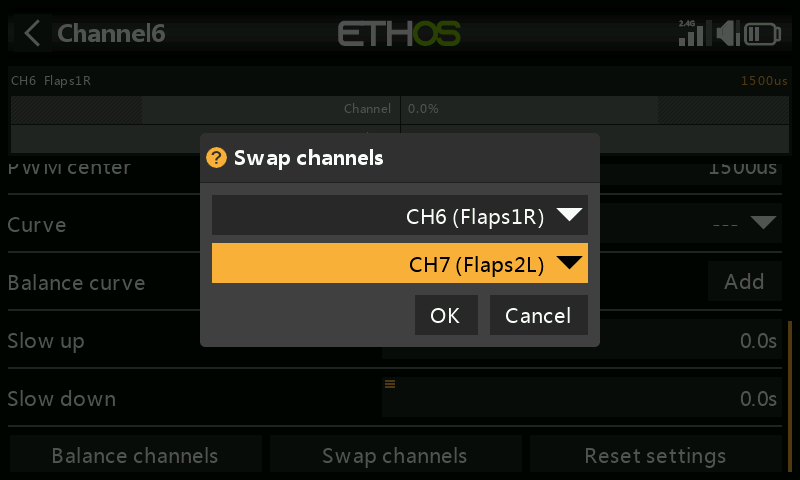
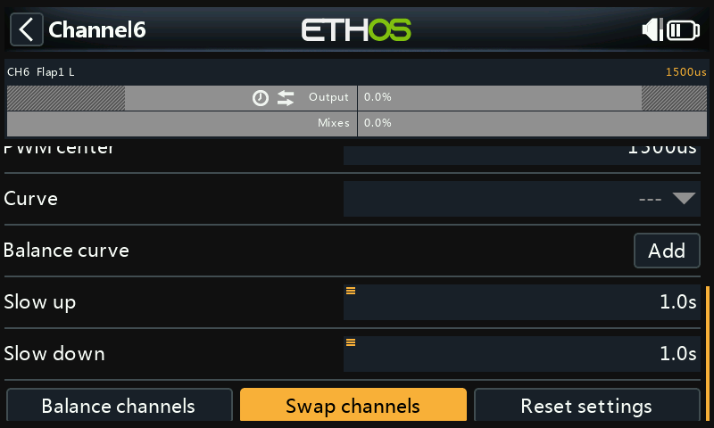

Swaps two output channels. The dialog opens with the current channel
pre-filled; pick the other and confirm — the swap is immediate, and every
mix referencing either channel is updated accordingly.

## Reset settings

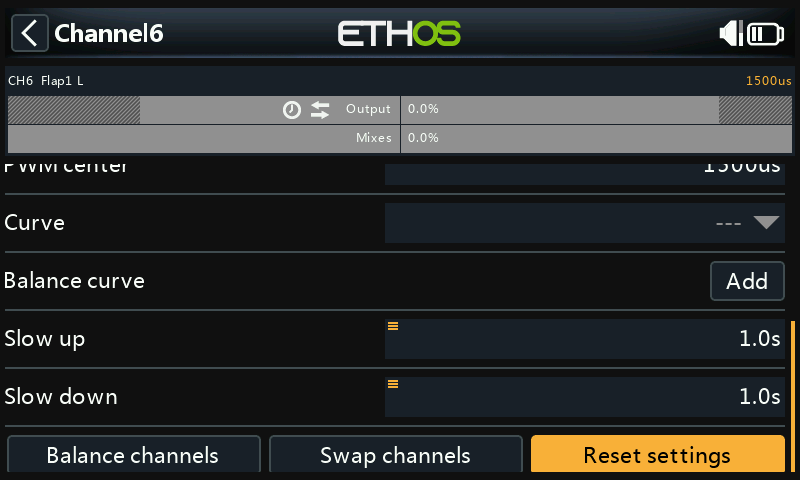

Clears every parameter on a channel back to default — useful before
repurposing a channel for something else, with a confirmation dialog to
prevent accidents.

## Balance channels

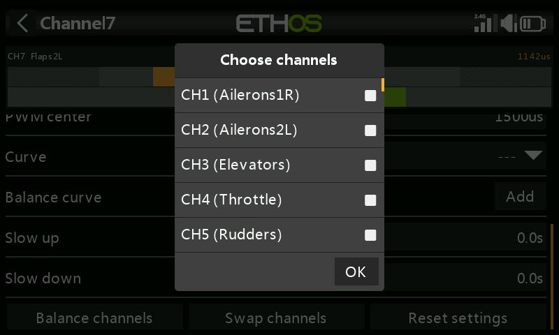
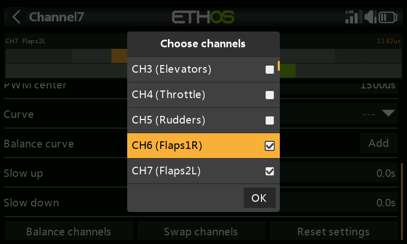

Balances a pair (or up to 4) of channels so they move in unison — e.g.
flaps that don't move together can induce unwanted roll; unbalanced
throttles on a multi-engine model can induce unwanted yaw. Ethos builds a
differential balance curve per selected channel; comparing the physical
surface positions at each curve point lets you adjust them to match,
ending in perfectly tracking surfaces.

**Before balancing**, in order:

1. Set servo directions for correct travel.
2. With mixes at neutral, optionally use **PWM center** to square up the
   servo horns.
3. Set Min/Max and Subtrim.
4. Configure any other curves.
5. Configure Slow.
6. *Then* balance and equalize across the travel range.

**Using it**: choose the channels to balance and the order to display
them in —

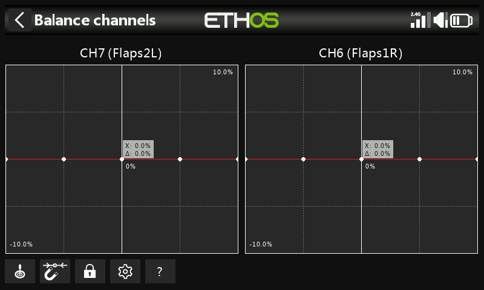

— mix output on the X axis, balance-adjustment differential on the Y
axis. Tap a channel's graph (or select it and press `ENT`) to edit its
balance curve; `PAGE` switches between channels mid-edit:

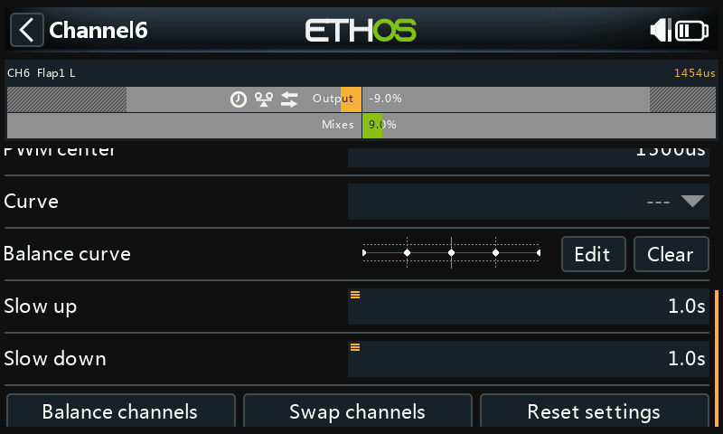

Editor controls:

- **Source** — normally the mix's own source(s), or any other convenient
  analog input; **Auto analog input** picks up the first stick/slider/pot
  you move as X, both in the graph and in the model itself.
- **Magnet** — snaps the rotary encoder's adjustment to the nearest X-axis
  curve point automatically:

  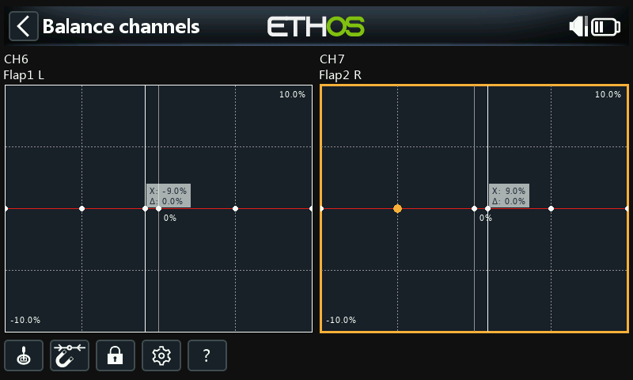
  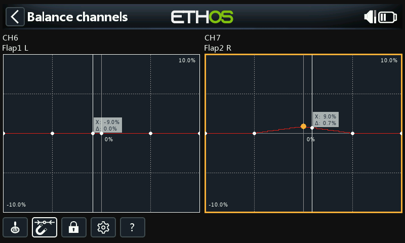

  The input still needs to be moved to align X with a curve point before
  adjusting it.
- **Lock** — toggled by tapping its icon or pressing `ENT` in graph-edit
  mode; locks all inputs so you can release the stick and observe the
  control surfaces while adjusting the curve.
- **Configuration** — change point count per channel (all or individually)
  and whether each curve is smoothed.
- **Help** (`?`, also the `MDL` key) — opens the built-in help.

**Multichannel**: up to 4 channels can be balanced together —

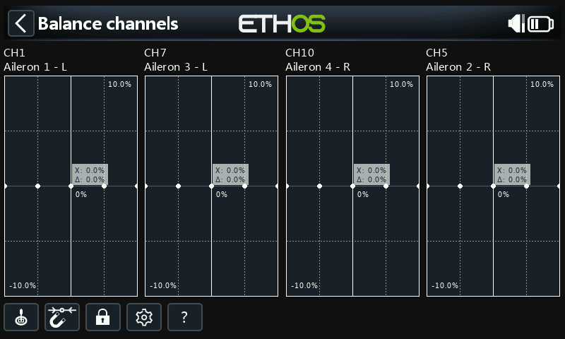

Once set, a balance curve can be reviewed, edited, or cleared from the
channel's own config page — a balance icon marks it on the channel graph
(alongside a Direction icon too, if that's also non-default).
