# RF System

This section is used to configure internal and/or external RF modules, including the ‘Owner registration ID’.

## Disabling RF output

The internal and external RF modules can be deactivated by holding the Page key down during system power up. You will receive a warning that the HF is permanently switched off. However, the State of the RF modules remains ON. If you restart the transmitter, the normal status is restored.

## Owner registration ID

The ‘Owner registration ID’ is an 8 character ID that contains a unique random code, which can be changed if desired. This ID becomes the ‘Registration ID’ when registering a receiver (see below). Enter the same code in the ‘Owner registration ID’ field of your other transmitters you want to use the Smart Share feature with them. This must be done before creating the model you want to use it on.

### Note on compatibility with OpenTX and EdgeTX

The ‘Owner registration ID’ is compatible with EdgeTX but only partly compatible with OpenTX. It must have eight characters; it can have a mix of uppercase, lowercase and numbers, but no special characters.

## Internal module TD-ISRM (X18 and X20/S/HD)

For the TD ISRM Pro RF module please refer to the [Internal Module TD-ISRM Pro](rf-system.md) section.

### Overview

The internal RF module for the X18 and X20/S/HD radios is a new design that provides tandem 2.4GHz and 900MHz RF paths. It can operate in 3 modes, i.e. ACCESS, ACCST D16 or TD MODE.

**Attention**! In this manual and the radio menus ‘900M’ is a generic term denoting the VHF band used. The actual operating frequencies are 915Mhz for FCC or 868Mhz for LBT as applicable to the user’s country of operation.

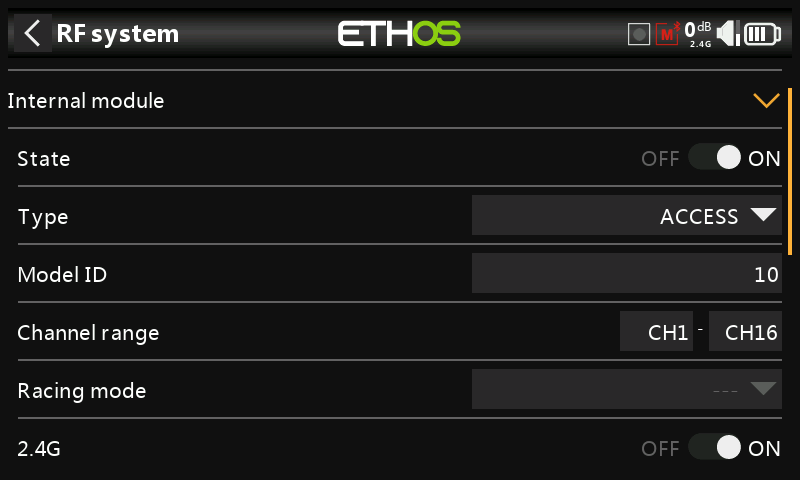

### State

The internal RF module can be On or Off.

### Type

Transmission mode of the internal RF module. The X20/X20S models operate on the 2.4GHz and/or the 900MHz band. The ACCESS and TD (Tandem) modes can operate on both the 2.4GHz and/or the 900MHz band simultaneously (or individually), while the ACCST D16 operates only on the 2.4GHz band. The mode must match the type supported by the receiver or the model will not bind! After a mode change, carefully check model operation (especially Failsafe!) and fully verify that all receiver channels are functioning as intended.

#### ACCESS mode

In ACCESS mode the 2.4G and 900M RF paths work in tandem with one set of ACCESS controls. There can be three 2.4G receivers registered and bound or three 900M receivers registered and bound or a combination of 2.4G and 900M for a total of three receivers.

In ACCESS mode with a combination of 2.4G and 900M receivers the telemetry for the 2.4G and 900M RF links are active at the same time. The sensors are identified in telemetry as 2.4G or 900M. Please note that the 2.4G band supports 24 channels, while the 900M band supports 16 channels.

There is a new ETHOS telemetry receiver source feature named RX. RX provides the receiver number of the active receiver sending telemetry. RX is available in telemetry like any other sensor for real time display, logic switches, special functions and data logging.

Please refer to the ACCESS section below for configuration details.

#### ACCST D16 mode

In ACCST D16 the RF module becomes a single 2.4G RF path.

Please refer to the [ACCST D16](rf-system.md) section below.

#### TD mode

In TD mode the RF module is in a low latency long range mode using the 2.4G and 900M RF links in Tandem to work with the new Tandem receivers. Tandem supports 24 channels on both bands.

Please refer to the [TD Mode](rf-system.md) section below.

### Flex firmware options

When it comes to choosing the firmware version, most users simply use either:

(a) the LBT (Listen Before Talk) version if in the EU, which communicates on 868Mhz in the 900M mode, or

(b) the FCC version in the rest of the world, which communicates on 915Mhz in the 900M mode.

However, the Flex version offers the ability to switch between the two when using ACCESS, ACCST D16, or TD modes.

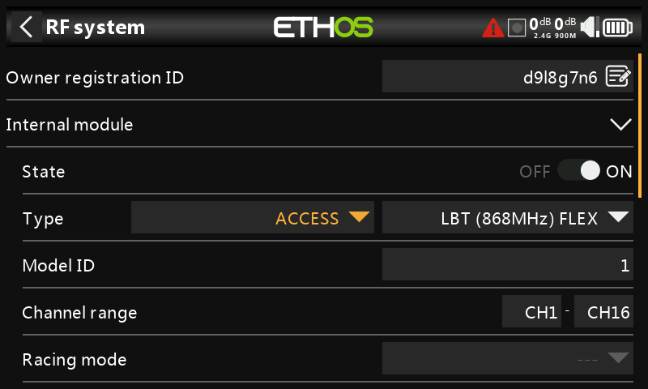

The configuration screens change as shown above.  Under Type you now have two columns. The first one is for selecting the FrSky protocol (ACCESS, ACCST D16, or TD mode).

The second column is for selecting FLEX915M or FLEX 868M.

When you select FLEX915M, the 2.4G band changes to FCC modulation. When you select FLEX868M, the 2.4G band changes to LBT European modulation.

The antennas must be changed to suit the frequency selected.

Both versions allow configuration of different power levels.

**Note for EU users**: The use of 200mW and 500 mW is allowed in the 868 MHz band. And with the latest TD Update and RF update these power levels work with telemetry also. For compliance, if you select 25mW the telemetry data will be sent via 868MHz, while with 200mW or 500 mW the telemetry data will be sent via 2.4G.

Notes:

a) with ACCESS you can have a mix of up to three 900M or 2.4G receivers

b) the ACCST D16 option is 2.4G only

c) with TD mode you can have three TD receivers

### Type: ACCESS

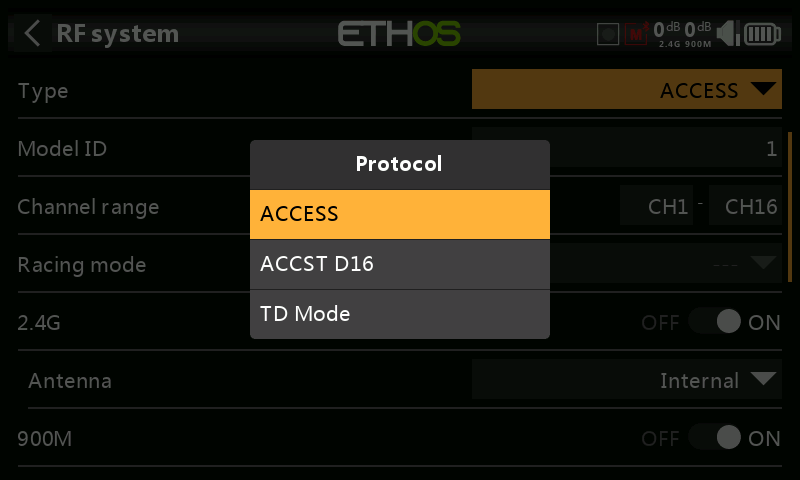

ACCESS changes the way receivers are bound and connected with the transmitter. The process is broken into two phases. The first phase is registering the receiver to the radio or radios it is to be used with. Registration only needs to be performed once between each receiver / transmitter pair. Once registered, a receiver can be bound and re-bound wirelessly with any of the radios it is registered with, without using the bind button on the receiver.

Having selected the ACCESS mode, the following parameters must be set up:

#### Model ID

When you create a new model, the Model ID is automatically allocated. The Model ID must be a unique number because the Smart Match function ensures that only the correct Model ID will be bound to. This number is sent to the receiver during binding, so that it will then only respond to the number it was bound to. Receiver matching is still as important as it was before ACCESS.

The Model ID can be changed manually from 00 to 63, with the default ID being 1.

Note also that the Model ID is changed when the model is cloned.

#### Channel range:

Since ACCESS supports up to 24 channels, you normally choose Ch1-8, Ch1-16, or Ch1-24 for the number of channels to be transmitted. Note that Ch1-16 is the default. The channels received by a receiver is configured in the receiver options for each receiver.

The choice of transmitter channel range also affects the transmitted update rates. Eight channels are transmitted every 7ms. If using more than 8 channels, then the channel update rates are as follows:

| Channel Range | Update Rate | Notes |
| --- | --- | --- |
| 1-24 | 21ms | Ch1-8, then Ch9-16, then Ch17-24 sent in rotation |
| 1-16 | 14ms | Ch1-8, Ch9-16, sent alternately |
| 1-8 | 7ms  | Ch1-8 |
| Racemode | 4ms | Digital servos only |

#### Racing mode

Racing mode offers a very low latency of 4ms with receivers like the RS. The RF module module and the RS receiver must be on v2.1.7 or later.

If the Channel Range is set to Ch1-8, it becomes possible to select a source (e.g a switch) which will enable race mode. Once the RS receiver has been bound (see below), and racing mode has been enabled, the RS receiver must be re-powered for racing mode to take effect.

#### 2.4G

Enable or disable the 2.4G RF module.

**Antenna**: Select Internal or External (on ANT1 connector) Antenna. Although the RF stage has built-in protection, it is good practice to ensure that an external antenna has been fitted before selecting the External antenna. Please note that the antenna selection is on a per model basis, so each time a model change selection is made ETHOS sets the antenna mode for the given model.

#### 900M

Enable or disable the 900M RF module.

**Antenna**:

Select Internal or External (on ANT2 connector) Antenna. Although the RF stage has built-in protection, it is good practice to ensure that an external antenna has been fitted before selecting the External antenna. Please note that the antenna selection is on a per model basis, so each time a model change selection is made ETHOS sets the antenna mode for the given model.

**Power**:

FCC: Select the RF Power desired between 10, 25, 100, 200, 500mW, 10mW~1W (Self-adaptive).

LBT: Select the RF Power desired between 25mW (telemetry via 868MHz), 200mW or 500mW (telemetry via 2.4GHz).

In ACCESS mode the 2.4g and 900m RF paths work in tandem with one set of ACCESS controls. There can be three 2.4G receivers registered and bound or three 900M receivers registered and bound or a combination of 2.4G and 900M for a total of three receivers.

#### Phase One: Registration

#### Register

1. If your receiver has not yet been registered, initiate the registration process by selecting \[Register\]. Otherwise, skip down to the Bind section.

A message box with 'Waiting for receiver...' will pop up with a repeating ‘Register’ voice alert.

2. While holding down the receiver bind button, power up the receiver, and wait for the red & green LEDs to become active.

The 'Waiting for receiver...' message changes to ‘Receiver connected’, and Rx Name field will be filled in automatically.

3. At this stage the Reg. ID and UID can be set:

- Registration ID: The ‘Registration ID is at owner or transmitter level. This should be a unique code for your radio and other transmitters to be used with Smart Share. It defaults to the value in the ‘Owner registration ID’ setting described above at the start of this section, but can be edited here. If two radios have the same Reg. ID you can move receivers (with the same Receiver No for a given model) between them by simply using the power on bind process.
- RX name: Filled in automatically, but the name can be changed if desired. This can be useful if you are using more than one receiver and need to remember for example that RX4R1 is for Ch1-8 or RX4R2 is for Ch9-16 or RX4R3 is for Ch17-24 when rebinding later. A name for the receiver can be entered here.
- The UID is used to distinguish between multiple receivers used simultaneously in a single model. It can be left at the default of 0 for a single receiver. When more than one receiver is to be used in the same model, the UID should be changed, normally 0 for Ch1-8, 1 for Ch9-16, and 2 for Ch17-24. Please note that this UID cannot be read back from the receiver, so it is a good idea to label the receiver.

4. Press \[Register\] to complete. A dialog box pops up with 'Registration ok'. Press \[OK\] to continue.

5. Turn the receiver off. At this point the receiver is registered, but it still needs to be bound to the transmitter to be used. It is now ready for binding.

#### Phase Two – Binding and module options

#### Bind

Receiver binding enables a registered receiver to be bound to one of the transmitters it has been registered with in phase 1, and will then respond to that transmitter until re-bound to another transmitter. Be certain to perform a range check before flying the model.

Warning – Very Important

Do not perform the binding operation with an electric motor connected or an internal combustion engine running.

1. Turn the receiver power off.

2. Confirm that you are in ACCESS mode.

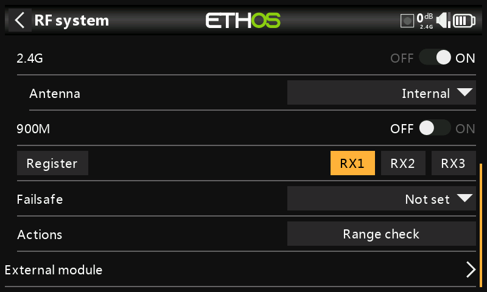

3. Receiver 1 \[Bind\]: Initiate the binding process by selecting \[RX1\], then select Bind from the drop-down list.

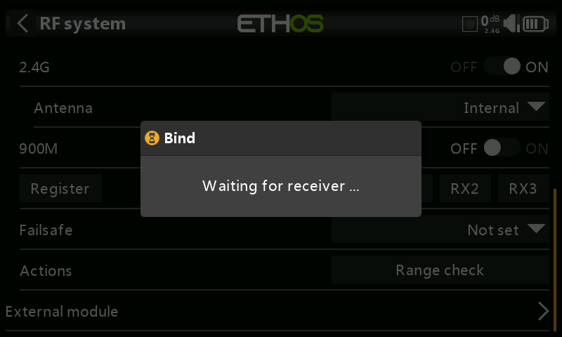

A voice alert will announce ‘Bind’ every few seconds to confirm that you are in bind mode. A popup will display ‘Waiting for receiver….’.

4. Power up the receiver without touching the F/S bind button. A message box will pop up 'Select device' and the name of the receiver you have just powered on.

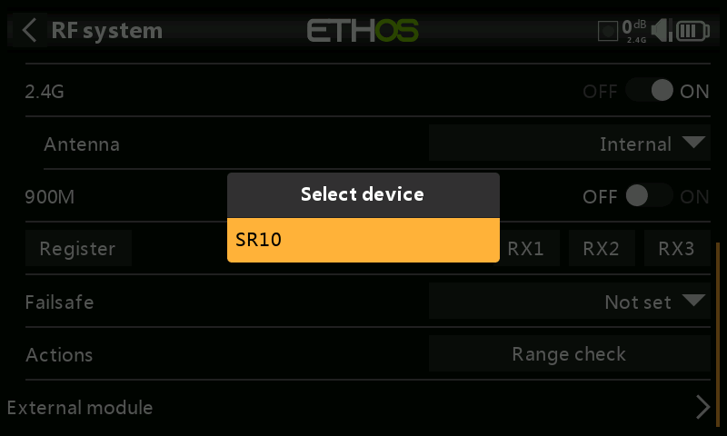

5. Scroll to the receiver name and select it.

A message box will pop up indicating that binding was successful. Click on OK.

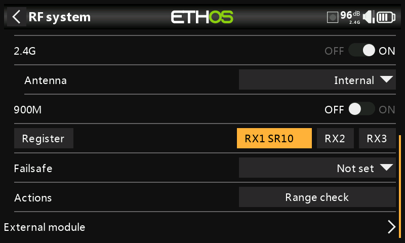

The receiver selected will now show for RX1 the name next to it.

6. Turn off both the transmitter and the receiver.

7. Turn the transmitter on and then the receiver. If the Green LED on the receiver is on, and the Red LED is off, the receiver is linked to the transmitter. The receiver/transmitter module binding will not have to be repeated, unless one of the two is replaced.

The receiver is now ready for use. The receiver will only be controlled (without being affected by other transmitters) by the transmitter it is bound to.

Repeat for Receiver 2 and 3 if applicable.

Refer also to the Telemetry section for a discussion on [RSSI](#RSSI and VFR discussion).

#### Receiver options

With the receiver powered on, tap the RX1, 2 or 3 button to bring up receiver options and other receiver operations:

Tap on Options:

*Telemetry*: Telemetry can be disabled for this receiver.

*Reduced t**elemetry* *power* *25mW*: Checkbox to limit telemetry power to 25mW (normally 100mW), possibly required if for example servos experience interference from RF being sent close to them.

*High PWM Speed*: Servo update rates are completely determined by the receiver.  This checkbox enables a 7ms PWM update rate (vs 18ms standard). Ensure that your servos can handle this update rate.

Please refer to the [Channel Range (Access) section](rf-system.md) for details on the update rate set at the transmitter.

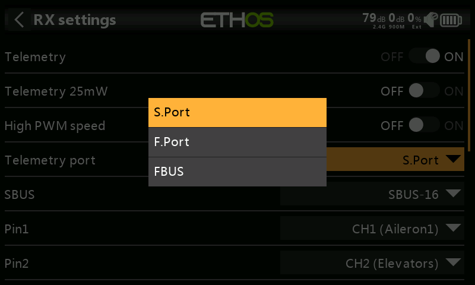

*Telemetry p**ort*: Allows selection of the SmartPort on the receiver to use either S.Port, F.Port or the FBUS (F.Port2) protocol. The F.Port protocol was developed with the Betaflight team to integrate the separate SBUS and S.Port signals. FBUS (F.Port2) also enables one Host device to communicate with several Slave devices on the same line. For more information about the port protocol, please refer to the protocol explanation on the official FrSky website.

*SBUS**:* Allows selection of SBUS-16 channel or SBUS-24 channel mode. Be aware that all connected SBUS devices have to support the SBUS-24 mode in order to activate the new protocol. SBUS-24 is an FrSky development of the SBUS-16 Futaba protocol.

*Channel Mapping*: The receiver Options dialog also gives the ability to Remap channels to the receiver pins.

The Share feature provides the ability to move the receiver to another ACCESS radio having a different ‘Owner registration ID’. When the Share option is tapped, the receiver green LED turns off.

On target radio B, navigate to the RF System section and Receiver(n) and select Bind. Note that the Share process skips the registration step on Radio B, because the ‘Owner registration ID’ is transferred from radio A. The receiver name from the source radio pops up. Select the name, the receiver will bind and its LED will go green.

A 'Bind successful' message will pop up.

Tap on OK. Radio B now controls the receiver. The receiver will remain bound to this radio until you choose to change it.

Press the EXIT button on Radio A to stop the Share process.

The receiver can be moved back to radio A by rebinding it to radio A.

Note: You do not need to use 'Share' if all your radios are using the same ‘Owner registration ID’ number. You can simply put the radio you want to use in bind mode, turn on the receiver, select the receiver in the radio and it will bind with that radio. You can switch to another radio the same way. It is best to keep the model receiver numbers the same when copying the models.

If you change your mind about sharing a model, select 'Reset bind' to clean up and restore your bind. Power cycle the receiver, and it will be bound to your transmitter.

##### Factory reset

Tap on the Reset button to Reset the receiver back to factory settings and clear the UID. The receiver is unregistered with X20. Note that a factory reset will also clear the 6-axis calibration data on stabilized receivers.

#### Receiver options (with Rx powered off)

With the receiver powered off, tap the RX1, 2 or 3 button to bring up receiver options.

If you tap on Options, the radio will attempt to connect and wait for the receiver.

If you tap on Bind, you can for example rebind a model that had been bound to another transmitter.

If you tap on clear, it will execute a Reset Bind.

#### Adding a Redundant Receiver

A second receiver may be bound to an unused slot, e.g. either RX2 or RX3 to provide redundancy in case of reception problems. Either a 2.4G or 900M receiver may be the backup for redundancy.

FrSky redundancy for control is always evaluated per-frame, with the best frame chosen. But with 2 good frames, the receiver will pick the its internal good frame. Therefore control can switch as needed on every frame (active/active failover).

Our example below shows a 900M receiver being added.

1. Connect the SBUS Out port of the redundant receiver to the SBUS IN port of the main receiver.

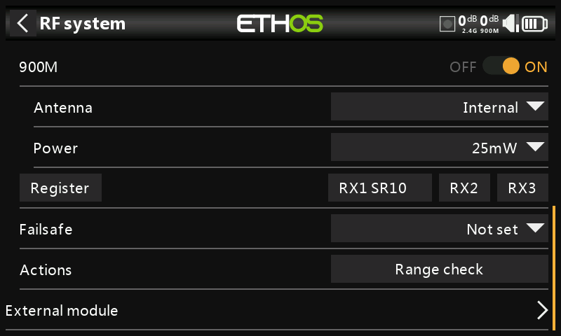

2. Enable the 900M internal RF module.

2a. Configure the antenna and RF power options.

**Antenna**:

Select Internal or External (on ANT2 connector) Antenna. Although the RF stage has built-in protection, it is good practice to ensure that an external antenna has been fitted before selecting the External antenna. Please note that the antenna selection is on a per model basis, so each time a model change selection is made ETHOS sets the antenna mode for the given model.

**Power**:

FCC: Select the RF Power desired between 10, 25, 100, 200, 500mW, 10mW~1W (Self-adaptive).

LBT: Select the RF Power desired between 25mW (telemetry via 868MHz), 200mW or 500mW (telemetry via 2.4GHz).

3. If your receiver has not yet been registered, initiate the registration process by selecting \[Register\]. Otherwise, skip down to the Bind section.

4. Register the new receiver, e.g. the R9MINI-O above.

5. Switch off the receivers.

6. Tap either the RX2 or RX3 button.

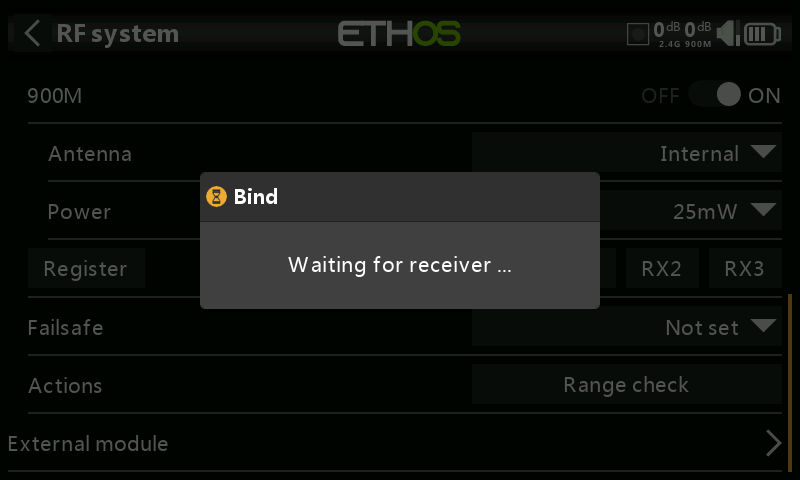

A voice alert will announce ‘Bind’ every few seconds to confirm that you are in bind mode. A popup will display ‘Waiting for receiver….’.

7. Power up the receivers.

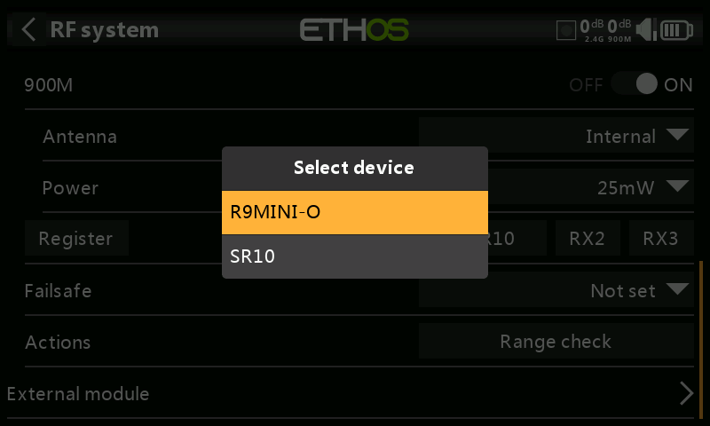

8. Select the R9 redundant receiver.

9. Tap on OK. Ensure that the Green LED on the redundant receiver is ON. The redundant receiver is now bound.

10. The redundant receiver will now be listed.

Note: Although it is possible to bind both the main and redundant receivers to the same UID by powering them up individually, you will not have access to the Rx Options while both are powered up.

#### Failsafe

The Failsafe mode determines what happens at the receiver when the transmitter signal is lost.

Failsafe data is sent from the transmitter approximately every 10 seconds. Please note that for TD, TW, AP and AP Plus receivers the failsafe data is now saved on the receiver, which means the failsafe settings are instantly available if the receiver reboots for any reason. Note that the Failsafe function must be reset and checked after upgrading receivers with this feature.

Tap on the drop-down box to see the failsafe options:

##### Hold

Hold will maintain the last received positions.

##### Custom

Custom allows moving the servos to custom predefined positions. The position for each channel can be defined separately. Each channel has the options of Not Set, Hold, Custom or No Pulses. If Custom is selected, the channel value is displayed. If the set icon with an arrow is tapped, the current value of the channel is used. Alternatively, a fixed value for that channel can be entered by tapping on the value.

##### No Pulses

No Pulses turns off pulses (for use with flight controllers having return-to-home GPS on loss of signal).

##### Receiver

Choosing “Receiver” on X series or later receivers allows failsafe to be set in the receiver.

***Warning***: Be sure to test the chosen Failsafe settings carefully, especially the channels that control the gyro on stabilized receivers.

#### Range Check

A range check should be done at the field when the model is ready to fly.

Range check is activated by selecting 'Range Check'.

A voice alert will announce ‘Range Check’ every few seconds to confirm that you are in range check mode. A popup will display the Receiver Number, and the VFR% and RSSI values to evaluate how reception quality is behaving. When the Range Check is active, it reduces transmitter power, which in turn reduces the range for range testing.

The FrSky Range check level is 0,1mW (-10dB) not 1mW (0dB)

The Normal level is +18dB +2dB for the antennae = +20dB

Under ideal conditions, with both the radio and receiver at 1m above the ground, you should only get a critical alarm at about 30m apart.

Currently ACCESS in range check mode provides range check data for one receiver at a time on the 2.4G link and one receiver at a time on the 900M link. If you have three 2.4G receivers registered and bound as Receiver 1, 2 and 3, one of the receivers will be the active telemetry receiver and its number will be displayed by the RX sensor as 0, 1, or 2. That will be the receiver that is sending the RSSI and VFR data. If you turn that receiver off the next receiver will become the active telemetry receiver in a priority of 0, 1, and then 2. Each of the three receivers can be range checked by turning off the other receivers.

RX sensor 0 = Receiver 1

RX sensor 1 = Receiver 2

RX sensor 2 = Receiver 3

Please also refer to the Telemetry section for a discussion on [VFR and RSSI](#RSSI and VFR discussion) values.

### Type: ACCST D16

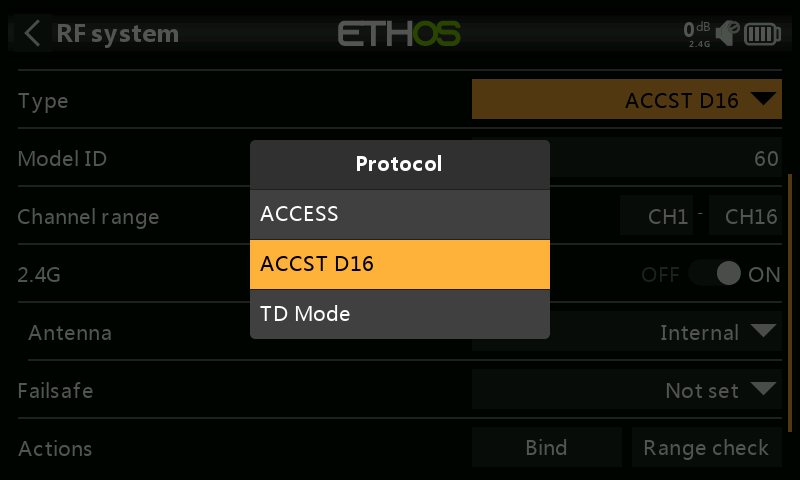

Mode ACCST D16 is for the ACCST 16ch two-way full duplex transmission, also known as the "X"-mode. For use with the legacy “X” series receivers.

#### Model ID

When you create a new model, the Model ID is automatically allocated. The Model ID must be a unique number because the Model Match function ensures that only the correct Model ID will be bound to. This number is sent to the receiver during binding, so that it will then only respond to the number it was bound to. The Model ID can be changed manually.

#### Channel range

Choice of which of the radio's internal channels are actually transmitted over the air. In D16 mode you can choose between 8 channels with data sent every 9ms, and 16 channels with data sent every 18ms.

Please note that servo update rates are completely determined by the receiver. For ACCST please refer to your receiver manual for details on selecting the 9ms HS (High PWM Speed) mode. Ensure that your servos can handle this update rate.

#### 2.4G

ACCST D16 operates on 2.4G, so the 2.4G RF section is on by default.

Select Internal or External (on ANT1 connector) Antenna. Although the RF stage has built-in protection, it is good practice to ensure that an external antenna has been fitted before selecting the External antenna. Please note that the antenna selection is on a per model basis, so each time a model change selection is made ETHOS sets the antenna mode for the given model.

#### Bind

1. Initiate the binding process by selecting \[Bind\]. A voice alert will announce ‘Bind’ every few seconds to confirm that you are in bind mode. In D16 mode a pop-up menu will open during bind to allow selection of the operation mode of the receiver. The options refer to the PWM outputs, and apply to receivers that support choosing between these 4 options using jumpers. Ensure that the receiver and RF module firmware support this option. If they do not, it is necessary to do a regular bind with the F/S button (please refer to the receiver manual).

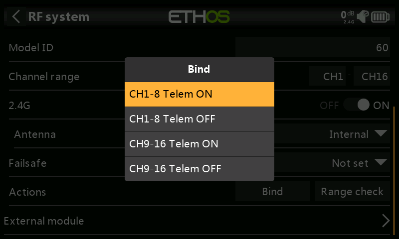

There are 4 modes with the combinations of Telemetry on/off and channel 1-8 or 9-16. This is useful when using two receivers for redundancy or to connect more than 8 servos using two receivers.

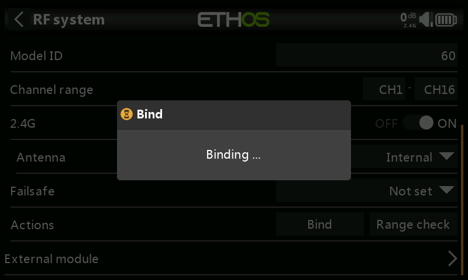

2. Power up the receiver, putting it into bind mode as per the receiver instructions. (Generally done by holding down the Failsafe button on the receiver during power up.)

3. The Red and Green LEDs will come on. The Green LED will go off, and the Red LED will flash when the binding process is completed.

4. Tap OK on the transmitter to end the Bind process, and power cycle the receiver.

5. If the Green LED on the receiver is on, and the Red LED is off, the receiver is linked to the transmitter. The receiver/transmitter module binding will not have to be repeated, unless one of the two is replaced. The receiver will only be controlled (without being affected by other transmitters) by the transmitter it is bound to.

Warnings – Very Important

Do not perform the binding operation with an electric motor connected or an internal combustion engine running.

#### Failsafe

The Failsafe mode determines what happens at the receiver when the transmitter signal is lost.

Failsafe data is sent from the transmitter approximately every 10 seconds.

Tap on the drop-down box to see the failsafe options:

Hold will maintain the last received positions.

Custom allows moving the servos to custom predefined positions. The position for each channel can be defined separately. Each channel has the options of Not Set, Hold, Custom or No Pulses. If Custom is selected, the channel value is displayed. If the set icon with an arrow is tapped, the current value of the channel is used. Alternatively, a fixed value for that channel can be entered by tapping on the value.

No Pulses turns off pulses (for use with flight controllers having return-to-home GPS on loss of signal).

Choosing “Receiver” on X series or later receivers allows failsafe to be set in the receiver.

***Warning***: Be sure to test the chosen Failsafe settings carefully, especially the channels that control the gyro on stabilized receivers..

#### Range check

A range check should be done at the field when the model is ready to fly.

Range check is activated by selecting 'Range check'.

A voice alert will announce ‘Range check’ every few seconds to confirm that you are in range check mode. A popup will display the Receiver Number, and the VFR% and RSSI values to evaluate how reception quality is behaving. When the range check is active, it reduces transmitter power, which in turn reduces the range for range testing.

The FrSky Range check level is 0,1mW (-10dB) not 1mW (0dB)

The Normal level is +18dB +2dB for the antennae = +20dB

Under ideal conditions, with both the radio and receiver at 1m above the ground, you should only get a critical alarm at about 30m apart.

Please refer to the Telemetry section for a discussion on [VFR and RSSI](#RSSI and VFR discussion) values.

### Type: TD Mode

In TD mode the receivers operate on dual bands simultaneously. There is a constant comparison step of data pack quality between both bands during the signal and telemetry transmission, so the better data pack of either band will be applied every moment to make sure the transmission is always best.

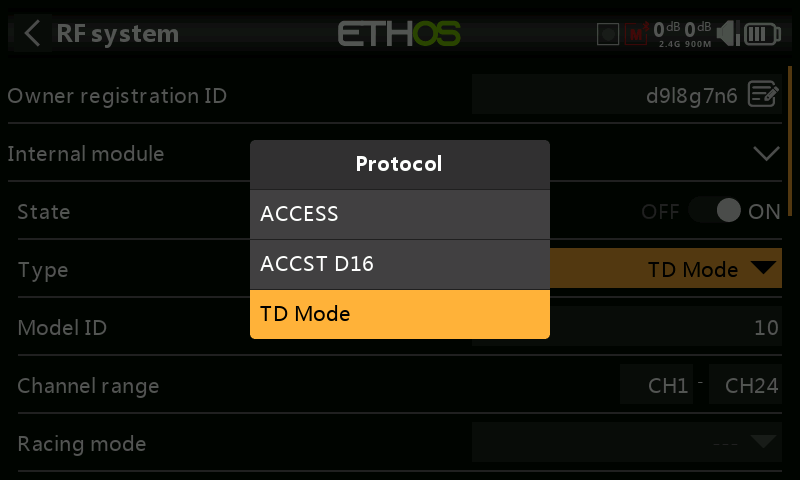

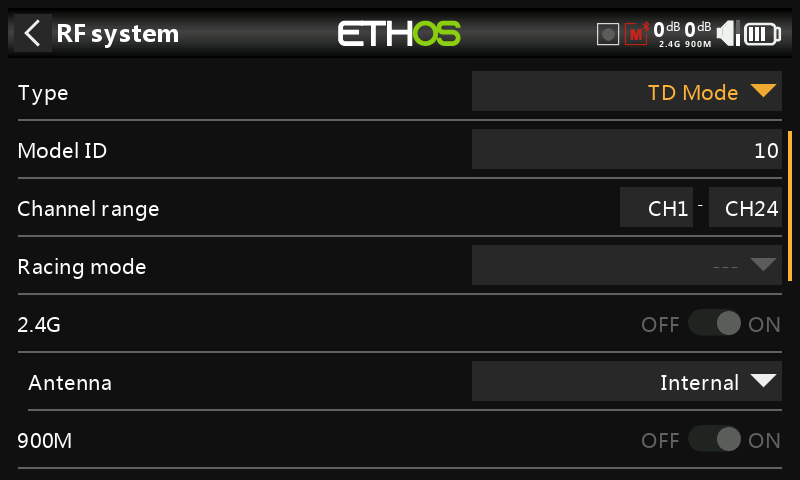

ACCESS and TD MODE change the way receivers are bound and connected with the transmitter. The process is broken into two phases. The first phase is registering the receiver to the radio or radios it is to be used with. Registration only needs to be performed once between each receiver / transmitter pair. Once registered, a receiver can be bound and re-bound wirelessly with any of the radios it is registered with, without using the bind button on the receiver.

Having selected the TD MODE, the following parameters must be set up:

#### Model ID

When you create a new model, the Model ID is automatically allocated. The Model ID must be a unique number because the Smart Match function ensures that only the correct Model ID will be bound to. This number is sent to the receiver during binding, so that it will then only respond to the number it was bound to. Receiver matching is still as important as it was before ACCESS.

The Model ID can be changed manually. Note also that the Model ID is changed when the model is cloned.

#### Channel range:

Since Tandem supports 24 channels, you normally choose Ch1-8, Ch1-16, Ch1-24, Ch9-16 or Ch17-24 for the receiver being set up. Note that Ch1-16 is the default.

#### Racing mode

Racing mode offers a very low latency of 4ms with receivers like TD MX.

If the Channel Range is set to Ch1-8, it becomes possible to select a source (e.g a switch) which will enable Race Mode. Once the receiver has been bound (see below), and Racing mode has been enabled, the receiver must be re-powered for Racing mode to take effect.

#### 2.4G

The 2.4G RF module is already enabled.

**Antenna**: Select Internal or External (on ANT1 connector) Antenna. Although the RF stage has built-in protection, it is good practice to ensure that an external antenna has been fitted before selecting the External antenna. Please note that the antenna selection is on a per model basis, so each time a model change selection is made ETHOS sets the antenna mode for the given model.

#### 900M

The 900M RF module is already enabled.

**Antenna**:

Select Internal or External (on ANT2 connector) Antenna. Although the RF stage has built-in protection, it is good practice to ensure that an external antenna has been fitted before selecting the External antenna. Please note that the antenna selection is on a per model basis, so each time a model change selection is made ETHOS sets the antenna mode for the given model.

Power

FCC: Select the RF Power desired between 10, 25, 100, 200, 500mW, 10mW~1W (Self-adaptive).

LBT: Select the RF Power desired between 25mW (telemetry via 868MHz), 200mW or 500mW (telemetry via 2.4GHz).

In TD MODE mode the 2.4g and 900m RF paths work in tandem with one set of ACCESS controls. There can be three Tandem receivers registered.

#### Phase One: Registration

#### Register:

1. If your receiver has not yet been registered, initiate the registration process by selecting \[Register\]. Otherwise, skip down to the Bind section.

A message box with 'Waiting for receiver...' will pop up with a repeating ‘Register’ voice alert.

2. While holding down the bind button, power up the receiver, and wait for the red & green LEDs to become active.

The 'Waiting for receiver...' message changes to ‘Receiver connected’, and Rx Name field will be filled in automatically.

3. At this stage the Registration ID and UID can be set:

- Registration ID: The Registration ID is at owner or transmitter level. This should be a unique code for your X20/X20S and transmitters to be used with Smart Share. It defaults to the value in the ‘Owner registration ID’ setting described above at the start of this section, but can be edited here. If two radios have the same ID you can move receivers (with the same Receiver No for a given model) between them by simply using the power on bind process.
- RX name: Filled in automatically, but the name can be changed if desired. This can be useful if you are using more than one receiver and need to remember which is bound to which channels.
- The UID is used to distinguish between multiple receivers used simultaneously in a single model. It can be left at the default of 0 for a single receiver. When more than one receiver is to be used in the same model, the UID should be changed. Please note that this UID cannot be read back from the receiver, so it is a good idea to label the receiver.

4. Press \[Register\] to complete. A dialog box pops up with 'Registration OK'. Press \[OK\] to continue.

5. Turn the receiver off. At this point the receiver is registered, but it still needs to be bound to the transmitter to be used. It is now ready for binding.

#### Phase Two – Binding and module options

#### Bind

Receiver binding enables a registered receiver to be bound to one of the transmitters it has been registered with in phase 1, and will then respond to that transmitter until re-bound to another transmitter. Be certain to perform a range check before flying the model.

Warning – Very Important

Do not perform the binding operation with an electric motor connected or an internal combustion engine running.

1. Turn the receiver power off.

2. Confirm that you are in TD MODE.

3. Receiver 1 \[Bind\]:

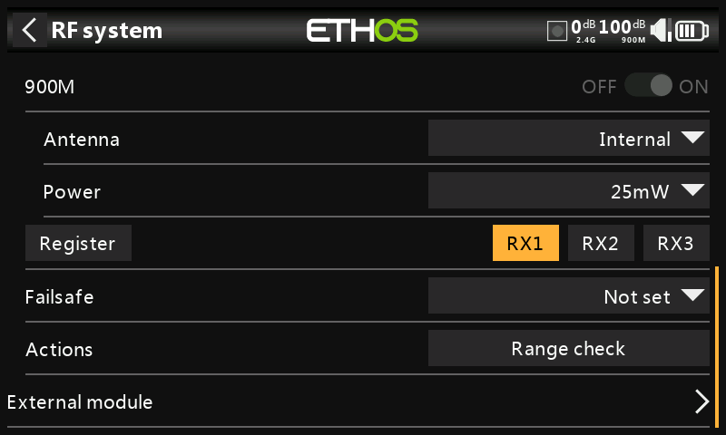

Initiate the binding process by selecting RX1.

4. A voice alert will announce ‘Bind’ every few seconds to confirm that you are in bind mode. A popup will display ‘Waiting for receiver…’.

5. Power up the receiver without touching the F/S bind button.

6. A message box will pop up 'Select device' and the name of the receiver you have just powered on. Scroll to the receiver name and select it.

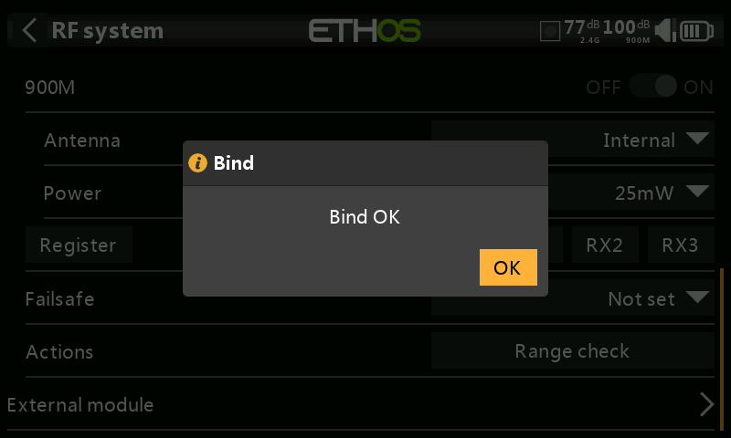

A message box will pop up indicating that binding was successful.

7. Turn off both the transmitter and the receiver.

8. Turn the transmitter on and then the receiver. If the Green LED on the receiver is on, and the Red LED is off, the receiver is linked to the transmitter. The receiver/transmitter module binding will not have to be repeated, unless one of the two is replaced.

The receiver will only be controlled (without being affected by other transmitters) by the transmitter it is bound to.

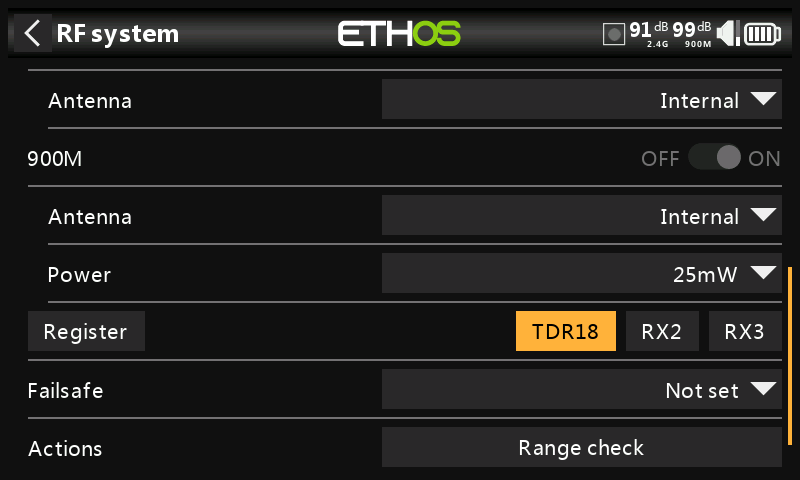

The receiver selected will now show the name in place of RX1.

Note that both 2.4G and 900M bands bind in one operation. The receiver is now ready for use.

Repeat for Receiver 2 and 3 if applicable.

Refer also to the Telemetry section for a discussion on [RSSI](#RSSI and VFR discussion).

#### Receiver options

Tap on a bound receiver to bring up receiver Options:

Tap on Options:

*Telemetry*: Telemetry can be disabled for this receiver.

*Reduced t**elemetry* *power* *25mW*: Checkbox to limit telemetry power to 25mW (normally 100mW), possibly required if for example servos experience interference from RF being sent close to them.

*High PWM Speed*: Checkbox to enable a 7ms PWM update rate (vs 20ms standard). Ensure that your servos can handle this update rate.

*SBUS**:* Allows selection of SBUS-16 channel or SBUS-24 channel mode. Be aware that all connected SBUS devices have to support the SBUS-24 mode in order to activate the new protocol. SBUS-24 is an FrSky development of the SBUS-16 Futaba protocol.

*Pin1 to Pin(nn)*: The receiver Options dialog also gives the ability to Remap channels to the receiver pins. In addition, each output port map be reassigned to Smart Port, SBUS Out, or FBUS (previously known as F.Port2) protocols. Additionally, output port 1 may be reassigned as an SBUS In port.

The F.Port protocol was developed with the Betaflight team to integrate the separate SBUS and S.Port signals. FBUS (F.Port2) also enables one Host device to communicate with several Slave devices on the same line. For more information about the port protocol, please refer to the protocol explanation on the official FrSky website.

##### Flight data record (Receiver black box)

Provides a log of receiver health.

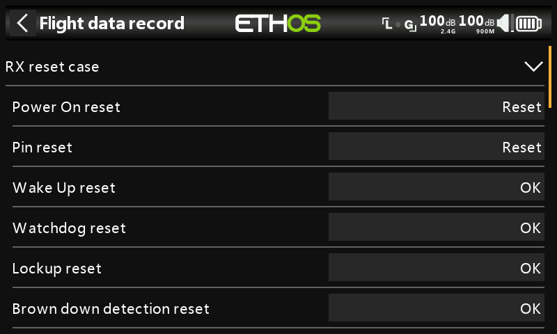

Power On reset, output Pin reset, and the results of wakeup, watchdog timer, lockup detection and power brown out detection.

Min and max values of Receiver 1 and 2 (if present) voltages since power up.

Min and max values of 2.4G RSSI and VFR (Valid Frame Rate) levels since power up.

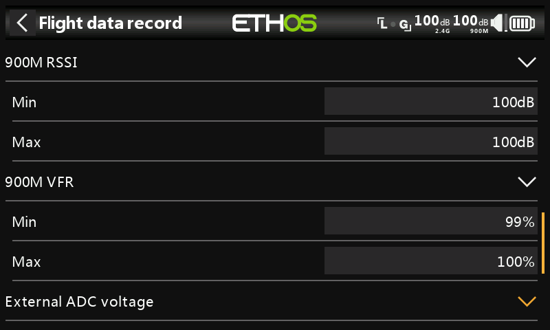

Min and max values of 900M RSSI and VFR (Valid Frame Rate) levels since power up.

Min and max values of the AIN analog input port, and the receiver board current since power up.

##### Save to file

Tap on ‘Save to file’ to save the data to a .csv file in the Logs folder. The file can be read by a text editor or more conveniently by for example LibreOffice.

##### Update

Tap the Update button to refresh the Flight Data Record data.

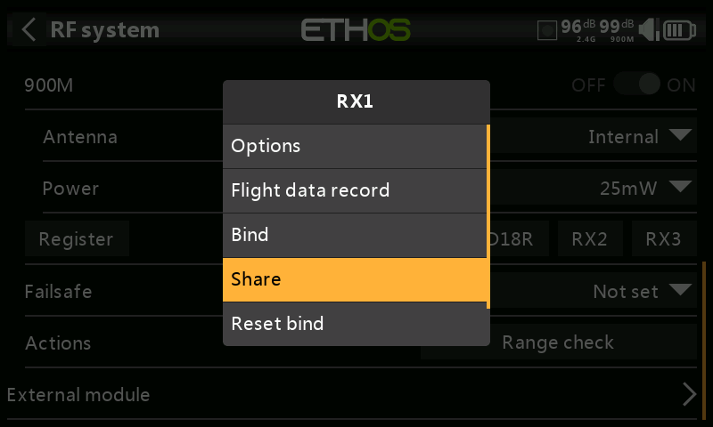

The Share feature provides the ability to move the receiver to another Tandem radio having a different ‘Owner registration ID’. When the Share option is tapped, the receiver green LED turns off.

On target radio B, navigate to the RF System section and Receiver(n) and select Bind. Note that the Share process skips the registration step on Radio B, because the ‘Owner registration ID’ is transferred from radio A. The receiver name from the source radio pops up. Select the name, the receiver will bind and its LED will go green.

A 'Bind successful' message will pop up.

Tap on OK. Radio B now controls the receiver. The receiver will remain bound to this radio until you choose to change it.

Press the EXIT button on Radio A to stop the Share process.

The receiver can be moved back to radio A by rebinding it to radio A.

Note: You do not need to use 'Share' if all your radios are using the same ‘Owner registration ID’ number. You can simply put the radio you want to use in bind mode, turn on the receiver, select the receiver in the radio and it will bind with that radio. You can switch to another radio the same way. It is best to keep the model receiver numbers the same when copying the models.

If you change your mind about sharing a model, select 'Reset bind' to clean up and restore your bind. Power cycle the receiver, and it will be bound to your transmitter.

##### Factory Reset

Tap on the Reset button to reset the receiver back to factory settings and clear the UID. The receiver is deregistered with X20.

#### Receiver options (with Rx powered off)

With the receiver powered off, tap the RX1, 2 or 3 button to bring up receiver options.

If you tap on Options, the radio will attempt to connect and wait for the receiver.

If you tap on Bind, you can for example rebind a model that had been bound to another transmitter.

If you tap on clear, it will execute a Reset Bind.

### Failsafe

The Failsafe mode determines what happens at the receiver when the transmitter signal is lost.

Failsafe data is sent from the transmitter approximately every 10 seconds. Please note that for TD, TW, AP and AP Plus receivers the failsafe data is now saved on the receiver, which means the failsafe settings are instantly available if the receiver reboots for any reason. Note that the Failsafe function must be reset and checked after upgrading receivers with this feature.

Tap on the drop-down box to see the failsafe options:

#### Hold

Hold will maintain the last received positions.

#### Custom

Custom allows moving the servos to custom predefined positions. The position for each channel can be defined separately. Each channel has the options of Not Set, Hold, Custom or No Pulses. If Custom is selected, the channel value is displayed. If the set icon with an arrow is tapped, the current value of the channel is used. Alternatively, a fixed value for that channel can be entered by tapping on the value.

#### No pulses

No Pulses turns off pulses (for use with flight controllers having return-to-home GPS on loss of signal).

#### Receiver

Choosing “Receiver” on X series or later receivers allows failsafe to be set in the receiver.

***Warning***: Be sure to test the chosen Failsafe settings carefully, especially the channels that control the gyro on stabilized receivers..

### Range check

A range check should be done at the field when the model is ready to fly.

Range check is activated by selecting 'Range check'.

A voice alert will announce ‘Range check’ every few seconds to confirm that you are in range check mode. A popup will display the receiver number, and the VFR% and RSSI values to evaluate how reception quality is behaving. When the range check is active, it reduces transmitter power, which in turn reduces the range for range testing.

The FrSky Range check level is 0,1mW (-10dB) not 1mW (0dB)

The Normal level is +18dB +2dB for the antennae = +20dB

Under ideal conditions, with both the radio and receiver at 1m above the ground, you should only get a critical alarm at about 30m apart.

Currently TD MODE in range check mode provides range check data for one receiver at a time on the 2.4G link and one receiver at a time on the 900M link. If you have three 2.4G receivers registered and bound as Receiver 1, 2 and 3, one of the receivers will be the active telemetry receiver and its number will be displayed by the RX sensor as 0, 1, or 2. That will be the receiver that is sending the RSSI and VFR data. If you turn that receiver off the next receiver will become the active telemetry receiver in a priority of 0, 1, and then 2. Each of the three receivers can be range checked by turning off the other receivers.

RX sensor 0 = Receiver 1

RX sensor 1 = Receiver 2

RX sensor 2 = Receiver 3

Please also refer to the Telemetry section for a discussion on [VFR and RSSI](#RSSI and VFR discussion) values.

## Internal Module TD-ISRM Pro (X20 Pro/R/RS)

For the TD ISRM RF module please refer to the [Internal module TD-ISRM](rf-system.md) section.

### Overview

The TD-ISRM Pro RF board offers triple RF path redundancy utilizing 2.4G FSK, 2.4G LoRa, and 900M (LoRa), which breaks new ground in RF performance.

#### FSK

FSK is a type of FM (Frequency Modulation) where the modulating signal assumes discrete values and shifts the output frequency to a set of predetermined discrete frequency values. If the information consists of only two values (binary), they are sometimes referred as the mark and space frequencies.

#### LoRa

LoRa is a wireless modulation technique derived from Chirp Spread Spectrum (CSS) technology. It encodes information on radio waves using chirp pulses - similar to the way dolphins and bats communicate! LoRa modulated transmission is robust against disturbances and can be received across great distances.

There are three separate shielded RF sections on the one ISRM board:

- The TWIN RF section has 2.4G FSK and 2.4G LoRa capability. 
- The 2.4G ACCESS RF section supports ACCESS and ACCST D16, and is also used for Tandem. 
- The 900M ACCESS RF section is also used for Tandem, as well as providing redundancy for other receivers.

With three RF sections there are many different modes and configurations that can be selected.

**Attention**! In this manual and the radio menus ‘900M’ is a generic term denoting the VHF band used. The actual operating frequencies are 915Mhz for FCC or 868Mhz for LBT as applicable to the user’s country of operation.

#### TD-ISRM Pro modes

##### ACCESS/ACCST D16

In ACCESS mode the 2.4G and 900M RF paths work in tandem with one set of ACCESS controls. There can be three 2.4G receivers registered and bound or three 900M receivers registered and bound or a combination of 2.4G and 900M for a total of three receivers.

In ACCESS mode with a combination of 2.4G and 900M receivers the telemetry for the 2.4G and 900M RF links are active at the same time. The sensors are identified in telemetry as 2.4G or 900M. Please note that the 2.4G band supports 24 channels, while the 900M band supports 16 channels.

The ACCST option offers ACCST D16 with a 900M receiver option for redundancy.

Refer to the ACCESS/ACCST D16 section below.

##### TD Tandem Dual Band 2.4G/900M

In TD Mode the RF module is in a low latency long range mode using the 2.4G and 900M RF links in Tandem to work with up to three Tandem receivers. Tandem supports 24 channels on both bands.

This mode is similar to the TD Mode in the X20. Please refer to the [TD Mode](rf-system.md) section for setup details.

##### TW 2.4G TWIN/900M.

In TW mode there is one 2.4G FSK and one 2.4G LoRa RF link for use with up to three TWIN receivers. There is a 900M receiver option for redundancy, via the SBUS IN/OUT ports. This further enhances the RF signal's reliability, particularly in scenarios involving long-distance RC operations.

Refer to the [TW Mode](rf-system.md) section below.

##### TD-Pro

For use with future FrSky TD-Pro receivers.

There is an ETHOS telemetry receiver source feature named RX. RX provides the receiver number of the active receiver sending telemetry. RX is available in telemetry like any other sensor for real time display, and in Logic Switches, Special Functions and data logging.

Please see the following sections for configuration details.

### ACCESS/ACCST D16

In ACCESS/ACCST D16 mode the 2.4G and 900M RF paths can work in tandem with one set of controls.

#### ACCESS 2.4G with a 900M receiver option for redundancy

This mode is similar to the ACCESS mode in the X20. Up to a total of three ACCESS or 900M receivers may be bound. Please refer to the [X20 ACCESS](rf-system.md) section for setup details.

#### ACCST D16 with a 900M receiver option for redundancy

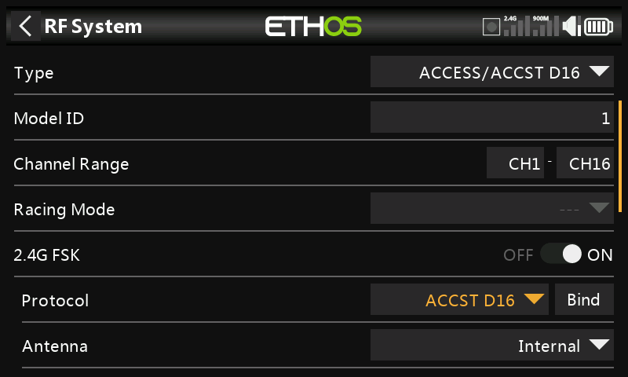

This mode is only supported in the X20 Pro. An ACCST D16 receiver may be used in conjunction with a 900M redundant receiver.

##### Model ID

When you create a new model, the Model ID is automatically allocated. The Model ID must be a unique number because the Model Match function ensures that only the correct Model ID will be bound to. This number is sent to the receiver during binding, so that it will then only respond to the number it was bound to. The Model ID can be changed manually.

##### Channel range

Choice of which of the radio's internal channels are actually transmitted over the air. In D16 mode you can choose between 8 channels with data sent every 9ms, and 16 channels with data sent every 18ms.

Please note that servo update rates are completely determined by the receiver. For ACCST please refer to your receiver manual for details on selecting the 9ms HS (High PWM Speed) mode. Ensure that your servos can handle this update rate.

##### Racing Mode

Racing mode is not supported for ACCST.

##### 2.4G FSK

Enable or disable the 2.4G RF module.

##### Protocol

Select ACCST D16.

##### Bind

Please note that the 900M module is On.

1. Initiate the binding process by selecting \[Bind\]. A voice alert will announce ‘Bind’ every few seconds to confirm that you are in bind mode.

In D16 mode a pop-up menu will open during bind to allow selection of the operation mode of the receiver. There are 4 modes with the combinations of Telemetry on/off and channel 1-8 or 9-16. This is useful when using two receivers for redundancy or to connect more than 8 servos using two receivers.

2. Power up the receiver, putting it into bind mode as per the receiver instructions. (Generally done by holding down the Failsafe button on the receiver during power up.)

3. The Red and Green LEDs will come on. The Green LED will go off, and the Red LED will flash when the binding process is completed.

4. Tap OK on the transmitter to end the Bind process, and power cycle the receiver.

5. If the Green LED on the receiver is on, and the Red LED is off, the receiver is linked to the transmitter. The receiver/transmitter module binding will not have to be repeated, unless one of the two is replaced. The receiver will only be controlled (without being affected by other transmitters) by the transmitter it is bound to.

Warnings – Very Important

Do not perform the binding operation with an electric motor connected or an internal combustion engine running.

##### Antenna

Select Internal or External (on ANT2 connector) Antenna. Although the RF stage has built-in protection, it is good practice to ensure that an external antenna has been fitted before selecting the External antenna. Please note that the antenna selection is on a per model basis, so each time a model change selection is made ETHOS sets the antenna mode for the given model.

##### Power

Select the RF Power desired between 25 and 100mW.

##### Adding a redundant 900M receiver.

FrSky redundancy for control is always evaluated per-frame, with the best frame chosen. But with 2 good frames, the receiver will pick the its internal good frame. Therefore control can switch as needed on every frame (active/active failover).

##### 900M

Connect the SBUS Out port of the redundant receiver to the SBUS IN port of the main receiver.

Ensure that the 900M RF module is enabled.

##### Power

FCC: Select the RF Power desired between 10, 25, 100, 200, 500mW, 10mW~1W (Self-adaptive).

LBT: Select the RF Power desired between 25mW (telemetry via 868MHz), 200mW or 500mW (telemetry via 2.4GHz).

##### Register

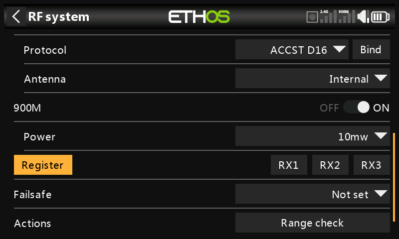

If your receiver has not yet been registered, initiate the registration process by selecting \[Register\]. The steps are the same as those described in the [ACCESS](rf-system.md) section.

Switch off the receivers.

##### Bind

Tap 'Bind' to start binding the 900M receiver.

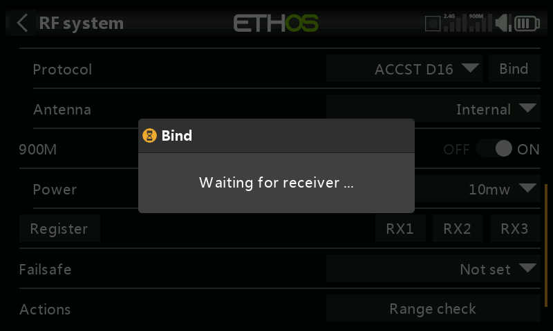

A voice alert will announce ‘Bind’ every few seconds to confirm that you are in bind mode. A popup will display ‘Waiting for receiver…’.

Power up the receivers.

Select the R9 redundant receiver.

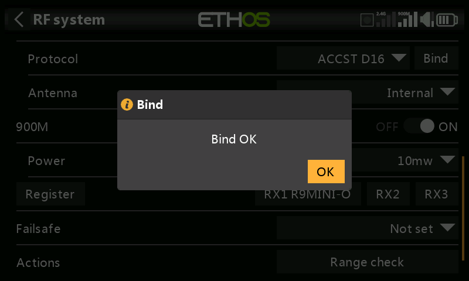

Tap on OK. Ensure that the Green LED on the redundant receiver is ON. The redundant receiver is now bound.

The redundant receiver will now be listed.

##### Receiver options

The receiver options are similar to those covered in the ACCESS section.

##### Factory Reset

Tap on the Reset button to Reset the receiver back to factory settings and clear the UID. The receiver is now unregistered.

#### Failsafe

The failsafe options are similar to those covered in the ACCESS section.

#### Range check

The range check options are similar to those covered in the ACCESS section.

#### ACCST D16 only

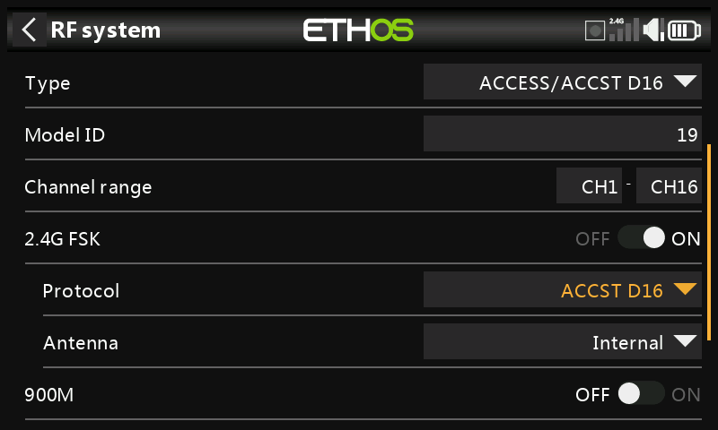

With the 900M option turned off, only the ACCST D16 mode is active.

##### Model ID

When you create a new model, the Model ID is automatically allocated. The Model ID must be a unique number because the Model Match function ensures that only the correct Model ID will be bound to. This number is sent to the receiver during binding, so that it will then only respond to the number it was bound to. The Model ID can be changed manually.

##### Channel range

Choice of which of the radio's internal channels are actually transmitted over the air. In D16 mode you can choose between 8 channels with data sent every 9ms, and 16 channels with data sent every 18ms.

Please note that servo update rates are completely determined by the receiver. For ACCST please refer to your receiver manual for details on selecting the 9ms HS (High PWM Speed) mode. Ensure that your servos can handle this update rate.

##### Racing Mode

Racing mode is not supported for ACCST.

##### 2.4G FSK

Enable the 2.4G RF module.

##### Protocol

Select ACCST D16.

##### Antenna

Select Internal or External (on ANT2 connector) Antenna. Although the RF stage has built-in protection, it is good practice to ensure that an external antenna has been fitted before selecting the External antenna. Please note that the antenna selection is on a per model basis, so each time a model change selection is made ETHOS sets the antenna mode for the given model.

##### 900M

The 900M internal RF module is turned OFF.

##### Failsafe

The failsafe options are similar to those covered in the ACCESS section.

##### Actions

##### Bind

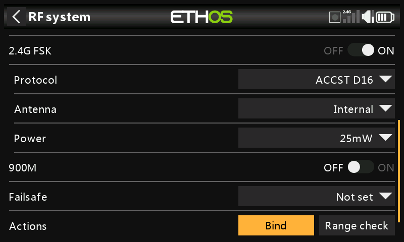

1. Initiate the binding process by selecting \[Bind\]. A voice alert will announce ‘Bind’ every few seconds to confirm that you are in bind mode.

In D16 mode a pop-up menu will open during bind to allow selection of the operation mode of the receiver. There are 4 modes with the combinations of Telemetry on/off and channel 1-8 or 9-16. This is useful when using two receivers for redundancy or to connect more than 8 servos using two receivers.

2. Power up the receiver, putting it into bind mode as per the receiver instructions. (Generally done by holding down the Failsafe button on the receiver during power up.)

3. The Red and Green LEDs will come on. The Green LED will go off, and the Red LED will flash when the binding process is completed.

4. Tap OK on the transmitter to end the Bind process, and power cycle the receiver.

5. If the Green LED on the receiver is on, and the Red LED is off, the receiver is linked to the transmitter. The receiver/transmitter module binding will not have to be repeated, unless one of the two is replaced. The receiver will only be controlled (without being affected by other transmitters) by the transmitter it is bound to.

Warnings – Very Important

Do not perform the binding operation with an electric motor connected or an internal combustion engine running.

##### Range check

Range check is activated by selecting 'Range check'.

A voice alert will announce ‘Range check’ every few seconds to confirm that you are in range check mode. A popup will display the Receiver Number, and the VFR% and RSSI values to evaluate how reception quality is behaving. When the range check is active, it reduces transmitter power, which in turn reduces the range for range testing. Under ideal conditions, with both the radio and receiver at 1m above the ground, you should only get a critical alarm at about 30m apart.

Please refer to the Telemetry section for a discussion on [VFR and RSSI](#RSSI and VFR discussion) values.

### ***TW*** Mode

In TW mode there is one 2.4G FSK and one 2.4G LoRa RF link for use with up to three TWIN receivers plus a 900M receiver option for redundancy (via the SBUS IN/OUT ports).

There can be three TW receivers registered and bound or three 900M receivers registered and bound or a combination of TW and 900M for a total of three receivers.

In TW mode with a combination of 2.4G FSK and 2.4G LoRa and 900M receivers the telemetry for the 2.4G and 900M RF links are active at the same time. The sensors are identified in telemetry as 2.4G or 900M. Please note that the 2.4G band supports 24 channels, while the 900M band supports 16 channels.

Please see the following sections for configuration details.

### Type

Transmission mode of the internal RF module. The mode must match the type supported by the receiver or the model will not bind! After a mode change, carefully check model operation (especially Failsafe!) and fully verify that all receiver channels are functioning as intended.

### Type: ***TW Mode***

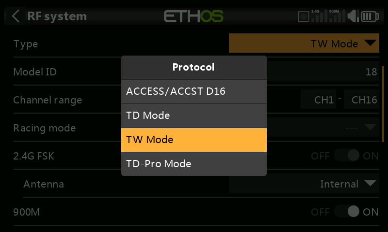

The way receivers are bound and connected with the transmitter is broken into two phases. The first phase is registering the receiver to the radio or radios it is to be used with. Registration only needs to be performed once between each receiver / transmitter pair. Once registered, a receiver can be bound and re-bound wirelessly with any of the radios it is registered with, without using the bind button on the receiver.

Having selected the TW mode, the following parameters must be set up:

#### Model ID

When you create a new model, the Model ID is automatically allocated. The Model ID must be a unique number because the Smart Match function ensures that only the correct Model ID will be bound to. This number is sent to the receiver during binding, so that it will then only respond to the number it was bound to. Receiver matching is still as important as ever.

The Model ID can be changed manually from 00 to 63, with the default ID being 1.

Note also that the Model ID is changed when the model is cloned.

#### Channel Range:

Since TW supports up to 24 channels, you normally choose Ch1-8, Ch1-16, or Ch1-24 for the number of channels to be transmitted. Note that Ch1-16 is the default. The channels received by a receiver is configured in the receiver options for each receiver.

The choice of transmitter channel range also affects the transmitted update rates. Eight channels are transmitted every 7ms. If using more than 8 channels, then the channel update rates are as follows:

| Channel Range | Update Rate | Notes |
| --- | --- | --- |
| 1-24 | 21ms | Ch1-8, then Ch9-16, then Ch17-24 sent in rotation |
| 1-16 | 14ms | Ch1-8, Ch9-16, sent alternately |
| 1-8 | 7ms  | Ch1-8 |
| Racemode | 4ms | Digital servos only |

#### Racing mode

Racing mode offers a very low latency of 4ms with receivers like TW MX.

If the Channel Range is set to Ch1-8, it becomes possible to select a source (e.g a switch) which will enable Race Mode. Once the receiver has been bound (see below), and Racing mode has been enabled, the receiver must be re-powered for Racing mode to take effect.

#### 2.4G FSK

Enable or disable the 2.4G FSK section of the internal RF module.

##### Antenna

Select Internal or External (on ANT2 connector) Antenna. Although the RF stage has built-in protection, it is good practice to ensure that an external antenna has been fitted before selecting the External antenna. Please note that the antenna selection is on a per model basis, so each time a model change selection is made ETHOS sets the antenna mode for the given model.

#### 900M

Enable or disable the 900M section of the internal RF module.

##### Antenna

The 900M RF module operates on the internal antenna only.

**Power**:

FCC: Select the RF Power desired between 10, 25, 100, 200, 500mW, 100mW~1W (Self-adaptive).

LBT: Select the RF Power desired between 25mW (telemetry via 868MHz), 200mW or 500mW (telemetry via 2.4GHz).

#### 2.4G ***Lo******R******a***

Enable or disable the 2.4G section of the internal RF module.

##### Antenna

Select Internal or External (on ANT1 connector) Antenna. Although the RF stage has built-in protection, it is good practice to ensure that an external antenna has been fitted before selecting the External antenna. Please note that the antenna selection is on a per model basis, so each time a model change selection is made ETHOS sets the antenna mode for the given model.

##### Power

Select the RF Power desired between 25 and 100mW.

In TW mode the 2.4G FSK and 2.4G LoRa and the 900m RF paths work in tandem with one set of controls. There can be three TW receivers registered and bound or three 900M receivers registered and bound or a combination of TW and 900M for a total of three receivers.

#### Phase One: Registration

#### Register

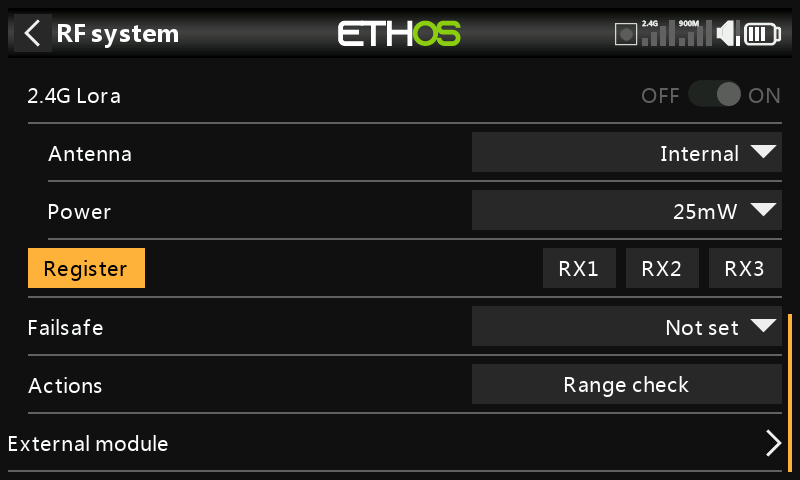

1. If your receiver has not yet been registered, initiate the registration process by selecting \[Register\]. Otherwise, skip down to the Bind section.

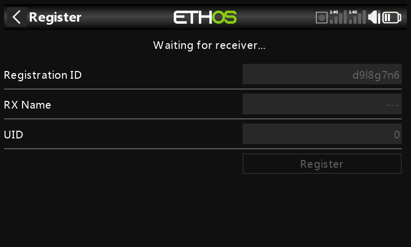

A message box with 'Waiting for receiver...' will pop up with a repeating ‘Register’ voice alert.

2. While holding down the bind button, power up the receiver, and wait for the red & green LEDs to become active.

The 'Waiting for receiver..' message changes to ‘Receiver Connected’, and Rx Name field will be filled in automatically.

3. At this stage the Registration ID and UID can be set:

- Reg. ID: The Registration ID is at owner or transmitter level. This should be a unique code for your radio and other transmitters to be used with Smart Share. It defaults to the value in the ‘Owner registration ID’ setting described above at the start of this section, but can be edited here. If two radios have the same ID you can move receivers (with the same Receiver No for a given model) between them by simply using the power on bind process.
- RX Name: Filled in automatically, but the name can be changed if desired. This can be useful if you are using more than one receiver and need to remember for example that RX4R1 is for Ch1-8 or RX4R2 is for Ch9-16 or RX4R3 is for Ch17-24 when rebinding later. A name for the receiver can be entered here.
- The UID is used to distinguish between multiple receivers used simultaneously in a single model. It can be left at the default of 0 for a single receiver. When more than one receiver is to be used in the same model, the UID should be changed, normally 0 for Ch1-8, 1 for Ch9-16, and 2 for Ch17-24. Please note that this UID cannot be read back from the receiver, so it is a good idea to label the receiver.

4. Press \[Register\] to complete. A dialog box pops up with 'Registration ok'. Press \[OK\] to continue.

5. Turn the receiver off. At this point the receiver is registered, but it still needs to be bound to the transmitter to be used. It is now ready for binding.

#### Phase Two – Binding and module options

#### Bind

Receiver binding enables a registered receiver to be bound to one of the transmitters it has been registered with in phase 1, and will then respond to that transmitter until re-bound to another transmitter. Be certain to perform a range check before flying the model.

Warning – Very Important

Do not perform the binding operation with an electric motor connected or an internal combustion engine running.

1. Turn the receiver power off.

2. Confirm that you are in TW mode.

3. Receiver 1 \[Bind\]: Initiate the binding process by selecting \[RX1\], then select Bind from the drop-down list. A voice alert will announce ‘Bind’ every few seconds to confirm that you are in bind mode. A popup will display ‘Waiting for receiver….’.

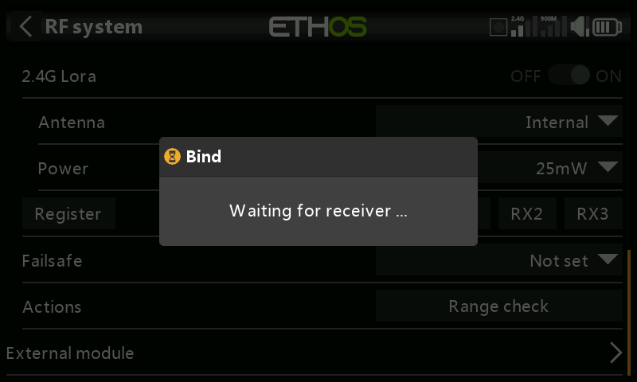

4. Power up the receiver without touching the F/S bind button. A message box will pop up 'Select device' and the name of the receiver you have just powered on.

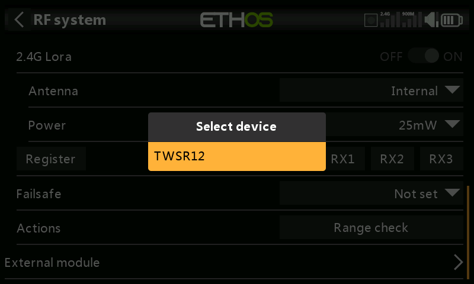

5. Scroll to the receiver name and select it.

A message box will pop up indicating that binding was successful.

6. Turn off both the transmitter and the receiver.

7. Turn the transmitter on and then the receiver. If the Blue LED on the receiver is on, and the Red LED is off, the receiver is linked to the transmitter. The receiver/transmitter module binding will not have to be repeated, unless one of the two is replaced.

The receiver will only be controlled (without being affected by other transmitters) by the transmitter it is bound to.

The receiver selected will now show for RX1 the name next to it:

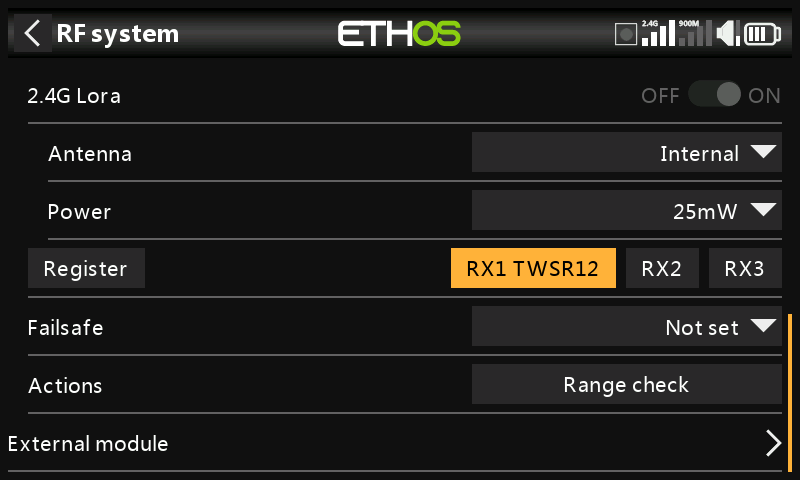

The receiver is now ready for use.

Repeat for Receiver 2 and 3 if applicable.

Refer also to the Telemetry section for a discussion on [RSSI](#RSSI and VFR discussion).

#### Receiver Options

Tap the RX1, RX2 or RX3 button to bring up Receiver Options:

Tap on Options:

*Telemetry*: Telemetry can be disabled for this receiver

*Reduced t**elemetry* *power* *25mW*: Checkbox to limit telemetry power to 25mW (normally 100mW), possibly required if for example servos experience interference from RF being sent close to them.

*High PWM Speed*: Servo update rates are completely determined by the receiver.  This checkbox enables a 7ms PWM update rate (vs 18ms standard). Ensure that your servos can handle this update rate.

Please refer to the [Channel Range (TW) section](rf-system.md) for details on the update rate set at the transmitter.

*SBUS**:* Allows selection of SBUS-16 channel or SBUS-24 channel mode. Be aware that all connected SBUS devices have to support the SBUS-24 mode in order to activate the new protocol. SBUS-24 is an FrSky development of the SBUS-16 Futaba protocol.

*Channel Mapping*: The receiver Options dialog also gives the ability to remap radio channels to the receiver pins.

*Pin1-**12* *Options*: Gives the ability to remap radio channels to the receiver pins. In addition, each output port may be reassigned to Smart Port, SBUS Out, or FBUS (previously known as F.Port2) protocols.

The F.Port protocol was developed with the Betaflight team to integrate the separate SBUS and S.Port signals. FBUS (F.Port2) also enables one Host device to communicate with several Slave devices on the same line. For more information about the port protocol, please refer to the protocol explanation on the official FrSky website.

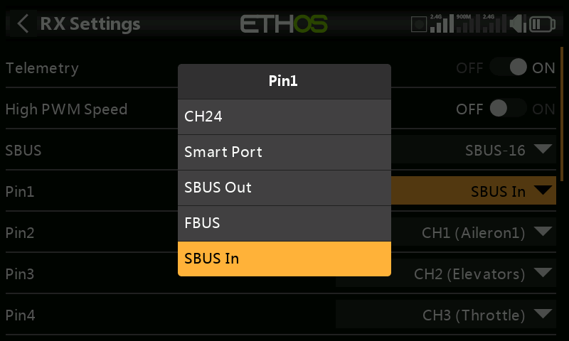

Pin 1 may also be set SBUS IN. Please note in the above example that the channels have been bumped down by one to make room for having SBUS IN on port 1 (CH1 Aileron1 is on pin 2).

##### Flight Data Record (Receiver black box)

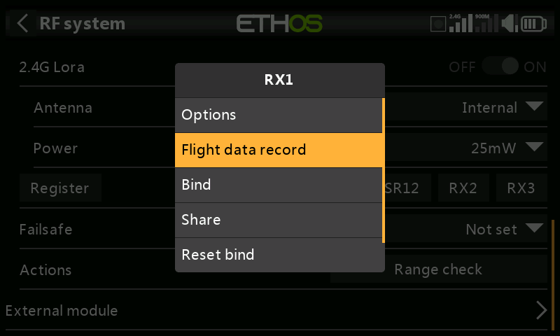

Provides a log of receiver health, including power on reset, output pins reset, and results of wakeup, watchdog timer, lockup detection and power brown out detection.

Min and max values of Receiver 1 and 2 (if present) voltages since power up.

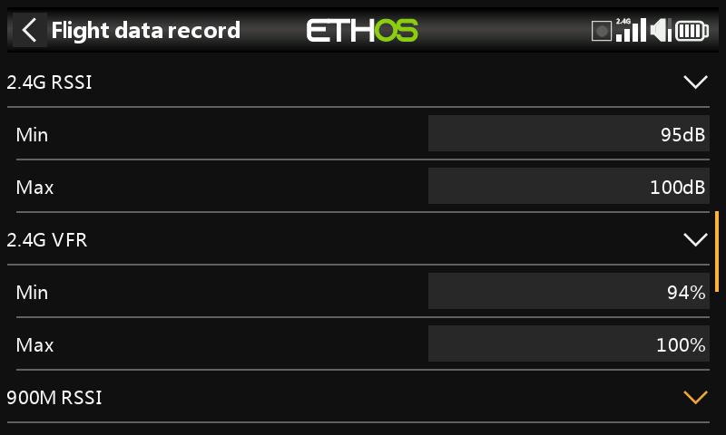

Min and max values of 2.4G RSSI and VFR (Valid Frame Rate) levels since power up.

Min and max values of 900M RSSI and VFR (Valid Frame Rate) levels since power up.

Min and max values of the AIN analog input port, and the receiver board current since power up.

##### Save to File

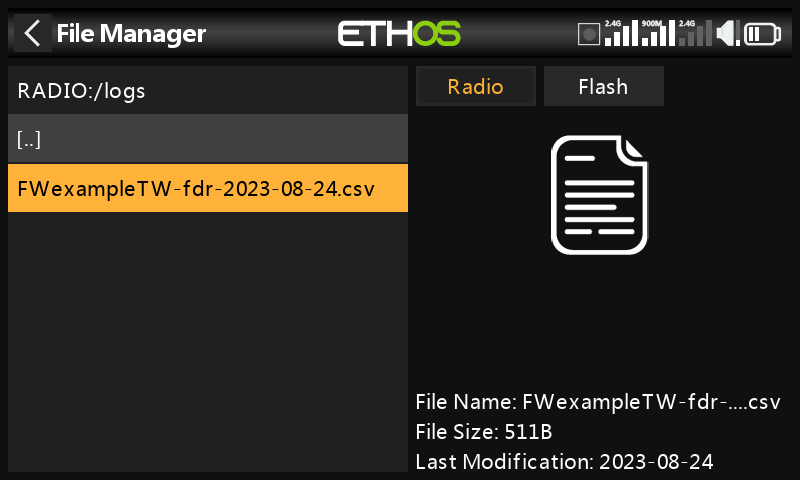

Tap on ‘Save to File’ to save the data to a .csv file in the Logs folder. The file can be read by a text editor or more conveniently by for example LibreOffice.

##### Update

Tap the Update button to refresh the Flight Data Record data.

The Share feature provides the ability to move the receiver to another TW mode radio having a different ‘Owner registration ID’. When the Share option is tapped, the receiver green LED turns off.

On target radio B, navigate to the RF System TW mode and Receiver(n) and select Bind. Note that the share process skips the registration step on Radio B, because the ‘Owner registration ID’ is transferred from radio A. The receiver name from the source radio pops up. Select the name, the receiver will bind and its LED will go green.

A 'Bind successful' message will pop up.

Tap on OK. Radio B now controls the receiver. The receiver will remain bound to this radio until you choose to change it.

Press the EXIT button on Radio A to stop the Share process.

The receiver can be moved back to radio A by rebinding it to radio A.

Note: You do not need to use 'Share' if all your radios are using the same ‘Owner registration ID’ number. You can simply put the radio you want to use in bind mode, turn on the receiver, select the receiver in the radio and it will bind with that radio. You can switch to another radio the same way. It is best to keep the model receiver numbers the same when copying the models.

If you change your mind about sharing a model, select 'Reset bind' to clean up and restore your bind. Power cycle the receiver, and it will be bound to your transmitter.

##### Factory Reset

Tap on the Reset button to Reset the receiver back to factory settings and clear the UID. The receiver is unregistered with X20.

#### Adding a redundant receiver

A second receiver may be bound to an unused slot, e.g. either RX2 or RX3 to provide redundancy in case of reception problems.

FrSky redundancy for control is always evaluated per-frame, with the best frame chosen. But with 2 good frames, the receiver will pick the its internal good frame. Therefore control can switch as needed on every frame (active/active failover).

Our example below shows a 900M receiver being added.

1. Connect the SBUS Out port of the redundant receiver to the SBUS IN port of the main receiver.

Please note that you may have to reassign a receiver port to the SBUS IN function. Please refer to the [Channel Mapping](rf-system.md) section.

2. Enable the 900M internal RF module. Note that the 900M RF module operates on the internal antenna only.

2a. Configure the RF power options.

**Power**:

FCC: Select the RF Power desired between 10, 25, 100, 200, 500mW, 100mW~1W (Self-adaptive).

LBT: Select the RF Power desired between 25mW (telemetry via 868MHz), 200mW or 500mW (telemetry via 2.4GHz).

3. If your receiver has not yet been registered, initiate the registration process by selecting \[Register\]. Otherwise, skip down to the Bind section.

4. Register the new receiver, e.g. the R9MINI-O above.

5. Switch off the receivers.

6. Tap 'Bind' on either the RX2 or RX3 line.

A voice alert will announce ‘Bind’ every few seconds to confirm that you are in bind mode. A popup will display ‘Waiting for receiver…’.

7. Power up the receivers.

8. Select the R9 redundant receiver.

9. Tap on OK. Ensure that the Green LED on the redundant receiver is ON. The redundant receiver is now bound.

10. The redundant receiver will now be listed, e.g. the R9MINI above.

Note: Although it is possible to bind both the main and redundant receivers to the same UID by powering them up individually, you will not have access to the Rx Options while both are powered up.

### Failsafe

The Failsafe mode determines what happens at the receiver when the transmitter signal is lost.

Failsafe data is sent from the transmitter approximately every 10 seconds. Please note that for TD, TW, AP and AP Plus receivers the failsafe data is now saved on the receiver, which means the failsafe settings are instantly available if the receiver reboots for any reason.

Tap on the drop-down box to see the failsafe options:

#### Hold

Hold will maintain the last received positions.

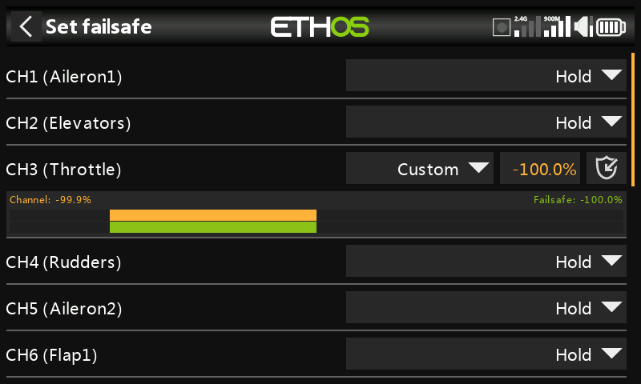

#### Custom

Custom allows moving the servos to custom predefined positions. The position for each channel can be defined separately. Each channel has the options of Not Set, Hold, Custom or No Pulses. If Custom is selected, the channel value is displayed. If the set icon with an arrow is tapped, the current value of the channel is used. Alternatively, a fixed value for that channel can be entered by tapping on the value.

#### No Pulses

No Pulses turns off pulses (for use with flight controllers having return-to-home GPS on loss of signal).

#### Receiver

Choosing “Receiver” on X series or later receivers allows failsafe to be set in the receiver.

*Warning*: Be sure to test the chosen Failsafe settings carefully.

### Range Check

A range check should be done at the field when the model is ready to fly.

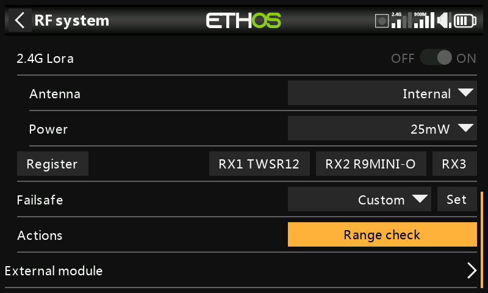

Range check is activated by selecting 'Range Check'.

A voice alert will announce ‘Range Check’ every few seconds to confirm that you are in range check mode. A popup will display the receiver number, and the VFR% and RSSI values to evaluate how reception quality is behaving. When the range check is active, it reduces transmitter power, which in turn reduces the range for range testing. Under ideal conditions, with both the radio and receiver at 1m above the ground, you should only get a critical alarm at about 30m apart.

Currently TW in range check mode provides range check data for one receiver at a time on the 2.4G link and one receiver at a time on the 900M link. If you have three 2.4G receivers registered and bound as Receiver 1, 2 and 3, one of the receivers will be the active telemetry receiver and its number will be displayed by the RX sensor as 0, 1, or 2. That will be the receiver that is sending the RSSI and VFR data. If you turn that receiver off the next receiver will become the active telemetry receiver in a priority of 0, 1, and then 2. Each of the three receivers can be range checked by turning off the other receivers.

RX sensor 0 = Receiver 1

RX sensor 1 = Receiver 2

RX sensor 2 = Receiver 3

Please also refer to the Telemetry section for a discussion on [VFR and RSSI](#RSSI and VFR discussion) values.

## External RF module - FrSky

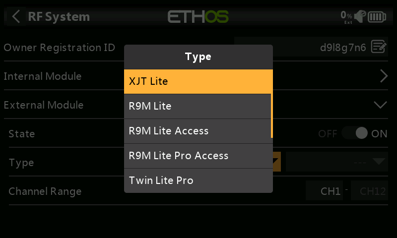

Currently the following external FrSky modules are supported: XJT Lite, R9M Lite, R9M Lite Access, R9M Lite Pro Access, TWIN Lite Pro, PPM and SBUS. For third party modules please refer to the next section.

The External modules can operate in ACCESS, ACCST D16, TD MODE, ELRS or TWIN MODE. Please see the following sections for configuration details.

### State

The external module can be On or Off.

### Type: XJT Lite

#### Protocol

The XJT Lite can operate in D16 (up to 16 channels), D8 (up to 8 channels) or LR12 (up to 12 channels) modes.

### Type: R9M Lite

##### 

#### Protocol

The R9M Lite can operate in the following modes:

| Mode | RF Operating Frequency | RF Power |
| --- | --- | --- |
| FCC | 915MHz | 100mW (with telemetry) |
| EU | 868MHz | 25mW (with telemetry) / 100mW (without telemetry) |
| FLEX 868MHz | Adjustable | 100mW (with telemetry) |
| FLEX 915MHz | Adjustable | 100mW (with telemetry) |

### Type: R9M Lite ACCESS

#### Protocol

The R9M Lite ACCESS operates in ACCESS mode.

### Type: R9M Lite Pro ACCESS

#### Protocol

The R9M Lite Pro ACCESS operates in ACCESS mode.

| Mode | RF Operating Frequency | RF Power |
| --- | --- | --- |
| FCC | 915MHz | 10mW / 100mW / 500mW / 100mW~1W (Self-adaptive) |
| EU | 868MHz | Telemetry mode (25mW) / Non-Telemetry mode (200mW / 500mW) |

### Type: TWIN Lite Pro

The Twin Lite PRO is a powerful RF module which enables ETHOS capable radios to bind to the TW series receivers and support the TW protocol’s dual 2.4G frequencies simultaneously on the same receiver. The TW active-active protocol is different from the general active-standby redundancy solutions (where one receiver takes over signal control only when the other is in Failsafe mode), with the TW protocol, dual 2.4G frequency bands are active on the TW series module, and receiver at the same time.

The RF module has two 2.4G external antennas RF mounted to provide multi-directional and wider coverage for transmitting signals compared to a single antenna design. Taking advantage of these features, the Twin system can provide less latency and higher reliability at a faster data rate with confidence.

In addition to the TW mode, this module also supports ACCST D16, ACCESS, and ELRS 2.4G modes. This means users can benefit from a wide range of compatible receiver options to choose and bind to when building the RC model. The Twin Lite Pro module offers resilient RF power options up to 500mW, constructed with the CNC machined metal module shell that helps aid heat dissipation, this system can ensure a stable long-range control further around tens of kilometers under long working hours.

#### State

The External Module can be On or Off.

#### Protocol

Transmission mode of the TWIN Lite Pro RF module. In addition to the TW mode, this module also supports ACCST D16, ACCESS, and ELRS 2.4G modes.

The Mode must match the type supported by the receiver or the model will not bind! After a Mode change, carefully check model operation (especially Failsafe!) and fully verify that all receiver channels are functioning as intended.

#### Protocol: TW Mode

In terms of binding, TW Mode is similar to ACCESS in the way receivers are bound and connected with the transmitter. The process is broken into two phases. The first phase is registering the receiver to the radio or radios it is to be used with. Registration only needs to be performed once between each receiver / transmitter pair. Once registered, a receiver can be bound and re-bound wirelessly with any of the radios it is registered with, without using the bind button on the receiver.

Having selected the TW Mode mode, the following parameters must be set up:

##### Model ID

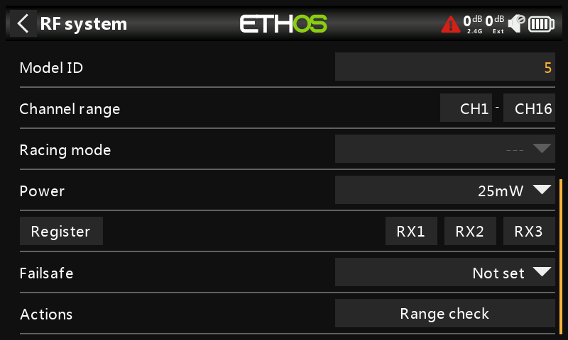

When you create a new model, the Model ID is automatically allocated. The Model ID must be a unique number because the Smart Match function ensures that only the correct Model ID will be bound to. This number is sent to the receiver during binding, so that it will then only respond to the number it was bound to. The Model ID can be changed manually. Note also that the Model ID is changed when the model is cloned.

##### Channel Range:

Since TW Mode supports up to 24 channels, you normally choose Ch1-8, Ch1-16, or Ch1-24 for the number of channels to be transmitted. Note that Ch1-16 is the default. The channels received by a receiver is configured in the receiver options for each receiver.

The choice of transmitter channel range also affects the transmitted update rates. Eight channels are transmitted every 7ms. If using more than 8 channels, then the channel update rates are as follows:

| Channel Range | Update Rate | Notes |
| --- | --- | --- |
| 1-24 | 21ms | Ch1-8, then Ch9-16, then Ch17-24 sent in rotation |
| 1-16 | 14ms | Ch1-8, Ch9-16, sent alternately |
| 1-8 | 7ms  | Ch1-8 |
| Racemode | 4ms | Digital servos only |

##### Racing mode

Racing mode offers a very low latency of 4ms with receivers like TW MX. The RF module module and the RS receiver must be on v2.1.7 or later.

If the Channel Range is set to Ch1-8, it becomes possible to select a source (e.g a switch) which will enable Race Mode. Once the RS receiver has been bound (see below), and Racing mode has been enabled, the RS receiver must be re-powered for Racing mode to take effect.

##### Power

Select the RF Power desired between 10, 25, 100, 200, 500mW.

##### Phase One: Registration

##### 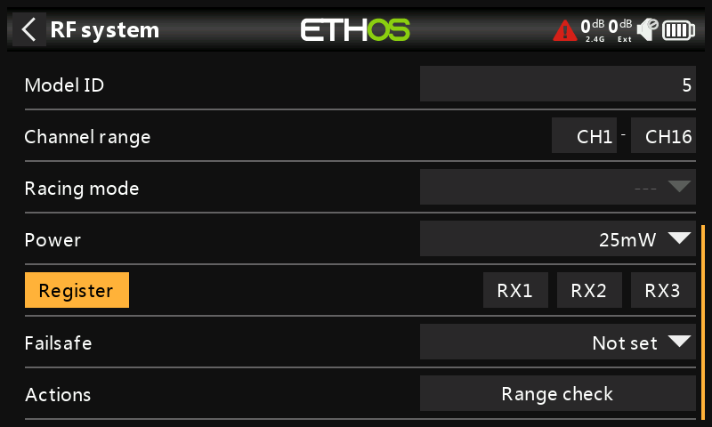

1. If your receiver has not yet been registered, initiate the registration process by selecting \[Register\]. Otherwise, skip down to the Bind section.

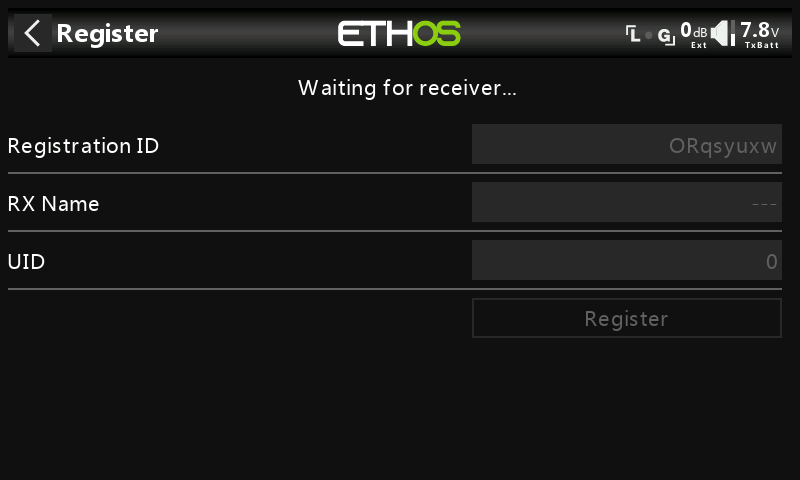

A message box with 'Waiting....' will pop up with a repeating ‘Register’ voice alert.

2. While holding down the bind button, power up the receiver, and wait for the red & green LEDs to become active.

The 'Waiting...' message changes to ‘Receiver Connected’, and Rx Name field will be filled in automatically.

3. At this stage the Registration ID and UID can be set:

- Reg. ID: The Registration ID is at owner or transmitter level. This should be a unique code for your radio and other transmitters to be used with Smart Share. It defaults to the value in the Owner Registration ID setting described above at the start of this section, but can be edited here. If two radios have the same ID you can move receivers (with the same Receiver No for a given model) between them by simply using the power on bind process.
- RX Name: Filled in automatically, but the name can be changed if desired. This can be useful if you are using more than one receiver and need to remember for example that RX4R1 is for Ch1-8 or RX4R2 is for Ch9-16 or RX4R3 is for Ch17-24 when rebinding later. A name for the receiver can be entered here.
- The UID is used to distinguish between multiple receivers used simultaneously in a single model. It can be left at the default of 0 for a single receiver. When more than one receiver is to be used in the same model, the UID should be changed, normally 0 for Ch1-8, 1 for Ch9-16, and 2 for Ch17-24. Please note that this UID cannot be read back from the receiver, so it is a good idea to label the receiver.

4. Press \[Register\] to complete.

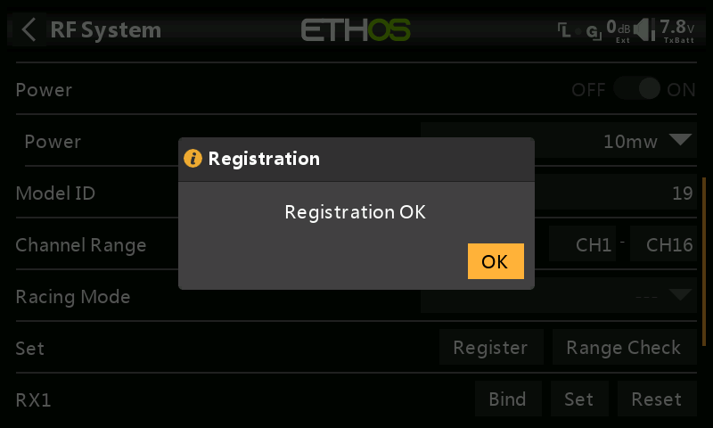

5. A dialog box pops up with 'Registration ok'. Press \[OK\] to continue.

6. Turn the receiver off. At this point the receiver is registered, but it still needs to be bound to the transmitter to be used.

##### Phase Two – Binding and module options

Receiver binding enables a registered receiver to be bound to one of the transmitters it has been registered with in phase 1, and will then respond to that transmitter until re-bound to another transmitter. Be certain to perform a range check before flying the model.

Receiver No: Confirm the receiver number the model is to operate under. Receiver matching is still as important as it was before ACCESS.  The receiver number defines the behavior of the Smart Match function. This number is sent to the receiver during binding, which will then only respond to the number it was bound to. The Model ID can be changed manually.

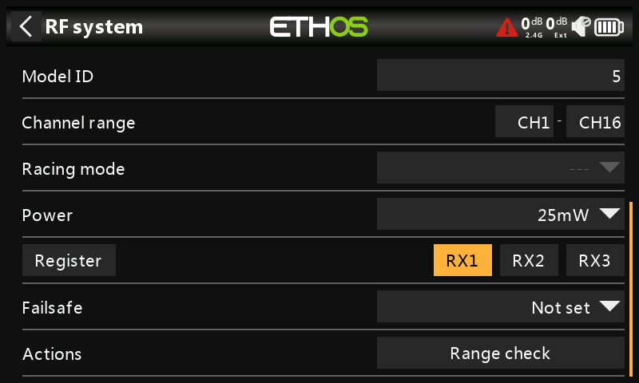

Warning – Very Important

Do not perform the binding operation with an electric motor connected or an internal combustion engine running.

1. Turn the receiver power off.

2. Confirm that you are in ACCESS mode.

3. Receiver 1 \[Bind\]: Initiate the binding process by selecting \[RX1\], then select Bind from the drop-down list. A voice alert will announce ‘Bind’ every few seconds to confirm that you are in bind mode. A popup will display ‘Waiting for receiver….’.

4. Power up the receiver without touching the F/S bind button. A message box will pop up 'Select device' and the name of the receiver you have just powered on.

5. Scroll to the receiver name and select it. A message box will pop up indicating that binding was successful.

6. Turn off both the transmitter and the receiver.

7. Turn the transmitter on and then the receiver. If the Green LED on the receiver is on, and the Red LED is off, the receiver is linked to the transmitter. The receiver/transmitter module binding will not have to be repeated, unless one of the two is replaced.

The receiver will only be controlled (without being affected by other transmitters) by the transmitter it is bound to.

The receiver selected will now show for RX1 the name next to it: TDMX

The receiver is now ready for use.

Repeat for Receiver 2 and 3 if applicable.

Refer also to the Telemetry section for a discussion on [RSSI](#RSSI and VFR discussion).

##### Receiver Options

Tap the RX1, RX2 or RX3 button to bring up Receiver Options:

Tap on Options:

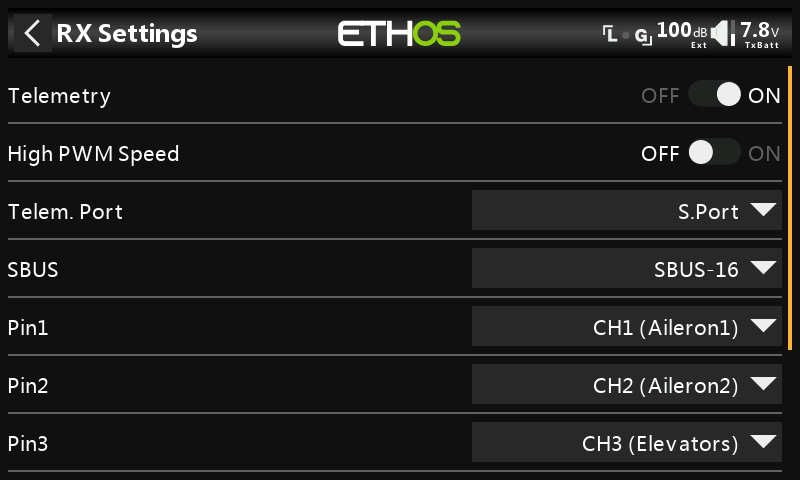

##### Options

*Telemetry 25mW*: Checkbox to limit telemetry power to 25mW (normally 100mW), possibly required if for example servos experience interference from RF being sent close to them.

*High PWM Speed*: Servo update rates are completely determined by the receiver.  This checkbox enables a 7ms PWM update rate (vs 18ms standard). Ensure that your servos can handle this update rate.

Please refer to the [Channel Range (Access) section](rf-system.md) for details on the update rate set at the transmitter.

*Port*: Allows selection of the SmartPort on the receiver to use either S.Port, F.Port or the FBUS (F.Port2) protocol. The F.Port protocol was developed with the Betaflight team to integrate the separate SBUS and S.Port signals. FBUS (F.Port2) also enables one Host device to communicate with several Slave devices on the same line. For more information about the port protocol, please refer to the protocol explanation on the official FrSky website.

*SBUS**:* Allows selection of SBUS-16 channel or SBUS-24 channel mode. Be aware that all connected SBUS devices have to support the SBUS-24 mode in order to activate the new protocol. SBUS-24 is an FrSky development of the SBUS-16 Futaba protocol.

*Channel Mapping*: The receiver Options dialog also gives the ability to Remap channels to the receiver pins.

##### Flight Data Record

Log of receiver health, including power on reset, output pins reset, and results of wakeup, watchdog timer, lockup detection and power brown out detection.

##### Share

The Share feature provides the ability to move the receiver to another ACCESS radio having a different ‘Owner registration ID’. When the Share option is tapped, the receiver green LED turns off.

On target radio B, navigate to the RF System section and Receiver(n) and select Bind. Note that the Share process skips the registration step on Radio B, because the ‘Owner registration ID’ is transferred from radio A. The receiver name from the source radio pops up. Select the name, the receiver will bind and its LED will go green.

A 'Bind successful' message will pop up.

Tap on OK. Radio B now controls the receiver. The receiver will remain bound to this radio until you choose to change it.

Press the EXIT button on Radio A to stop the Share process.

The receiver can be moved back to radio A by rebinding it to radio A.

Note: You do not need to use 'Share' if all your radios are using the same ‘Owner registration ID’ number. You can simply put the radio you want to use in bind mode, turn on the receiver, select the receiver in the radio and it will bind with that radio. You can switch to another radio the same way. It is best to keep the model receiver numbers the same when copying the models.

##### Reset bind

If you change your mind about sharing a model, select 'Reset bind' to clean up and restore your bind. Power cycle the receiver, and it will be bound to your transmitter.

##### Factory Reset

Tap on the Reset button to Reset the receiver back to factory settings and clear the UID. The receiver is unregistered with X20.

#### Failsafe

The Failsafe mode determines what happens at the receiver when the transmitter signal is lost.

Tap on the drop-down box to see the failsafe options:

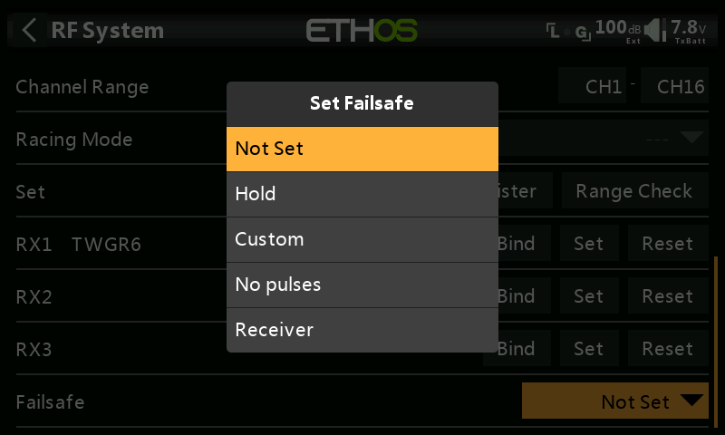

##### Hold

Hold will maintain the last received positions.

##### Custom

Custom allows moving the servos to custom predefined positions. The position for each channel can be defined separately. Each channel has the options of Not Set, Hold, Custom or No Pulses. If Custom is selected, the channel value is displayed. If the set icon with an arrow is tapped, the current value of the channel is used. Alternatively, a fixed value for that channel can be entered by tapping on the value.

##### No Pulses

No Pulses turns off pulses (for use with flight controllers having return-to-home GPS on loss of signal).

##### Receiver

Choosing “Receiver” on X series or later receivers allows failsafe to be set in the receiver.

***Warning***: Be sure to test the chosen Failsafe settings carefully.

#### Range check

A range check should be done at the field when the model is ready to fly.

Range check is activated by selecting 'Range Check'. A voice alert will announce ‘Range Check’ every few seconds to confirm that you are in range check mode. A popup will display the Receiver Number, and the VFR% and RSSI values to evaluate how reception quality is behaving. When the Range Check is active, it reduces transmitter power, which in turn reduces the range for range testing. Under ideal conditions, with both the radio and receiver at 1m above the ground, you should only get a critical alarm at about 30m apart.

Currently TW Mode in range check mode provides range check data for one receiver at a time, showing both the 2.4G links. If you have three receivers registered and bound as Receiver 1, 2 and 3, one of the receivers will be the active telemetry receiver and its number will be displayed by the RX sensor as 0, 1, or 2. That will be the receiver that is sending the RSSI and VFR data. If you turn that receiver off the next receiver will become the active telemetry receiver in a priority of 0, 1, and then 2. Each of the three receivers can be range checked by turning off the other receivers.

RX sensor 0 = Receiver 1

RX sensor 1 = Receiver 2

RX sensor 2 = Receiver 3

Please also refer to the Telemetry section for a discussion on [VFR and RSSI](#RSSI and VFR discussion) values.

#### Type: ELRS

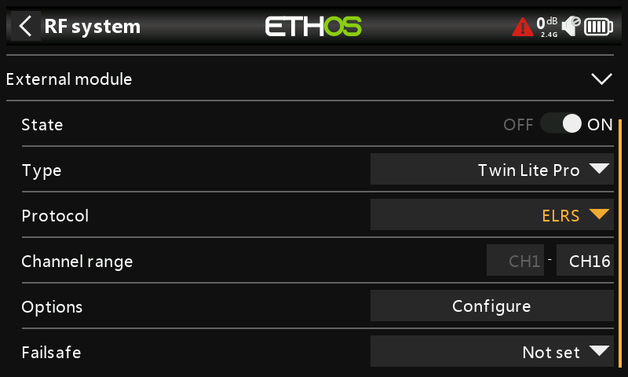

The ELRS protocol supports the ExpressLRS open-source project. ExpressLRS 2.4G aims to achieve comprehensive performance in both speeds, latency, and range.

If using an actual ELRS module (rather than the TWIN Lite Pro RF module in ELRS mode), you need the ELRS Lua script installed in scripts/elrs, before you will get ELRS as a module option.

##### Channel Range

Twelve channels are supported. Please refer to the Switch Mode section below for more details on the configuration options.

##### Set - Config

##### Packet Rate

Packet rate allows a compromise to be made between range and latency. A higher packet rate results in lower latency, but at the cost of range.

##### Telemetry Ratio

The Telemetry Ratio determines how often telemetry data is sent. For example, 1:64 means telemetry data is sent every 64 frames. The options are 1:128, 1:64, 1:32, 1:16, 1:8, 1:4 and 1:1.

##### Switch Mode

The Switch Mode setting controls how the AUX channels AUX1-AUX8 (channel 5 to 12) are sent to the receiver. The first 4 main channels are always 10-bit. The options are Hybrid & Wide.

With Hybrid mode, most of your channels will only be 2- or 3-position, this is done to reduce latency.

The “Wide” option makes your channels 64 or 128 bit, which is sufficient resolution for most things.

Note that AUX1 (channel 5) is meant for arming, so it is always 2-position. Low position (1000) for disarming and High position (2000) for arming.

##### Model Match

If enabled, Model Match ensures that the correct model has been selected.

##### Tx Power

##### Dynamic Power

By enabling the option Dynamic Power, allows the system to automatically adjust output power depending on VFR and RSSI, this can potentially save battery life. However to do this you must have telemetry enabled.

##### Power

Available power settings are 10mW, 25mW, 50mW, 100mW, 250mW, 500mW or 1000mW.

##### ELRS Telemetry

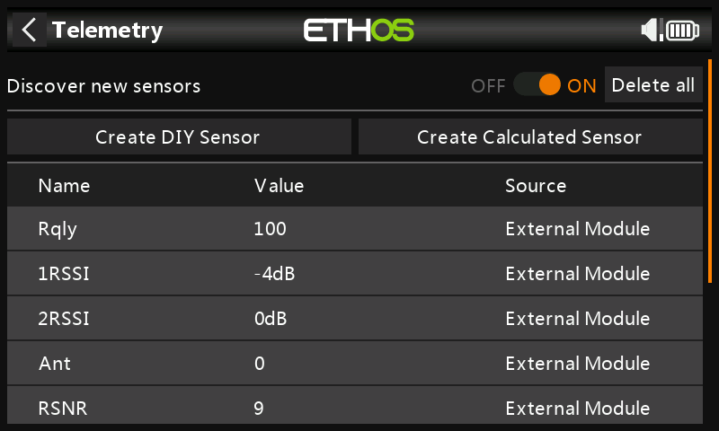

The above two screenshots show the typical sensors received from an ELRS receiver.

### Type: PPM

The External RF Module can operate in PPM mode. Please refer to the [External module](trainer.md) section in Model / Trainer for details on configuring a slave trainer using PPM Out on the PXX OUT pin in the external module bay.

##### Channels Range

By default channels 1 to 8 are transmitted.

### Type: SBUS

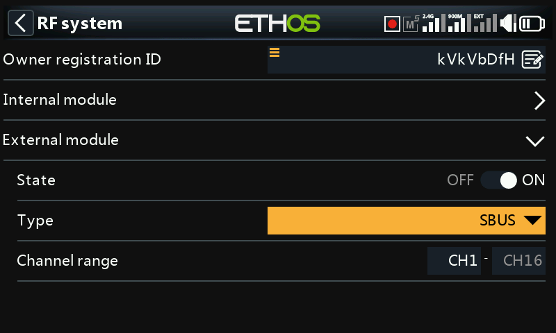

The External RF Module can operate in SBUS mode. Please refer to the [External module](trainer.md) section in Model / Trainer for details on configuring a slave trainer using SBUS Out on the PXX OUT pin in the external module bay.

##### Channels Range

By default 16 channels are transmitted in SBUS.

### Type: Trainer master (PPM)

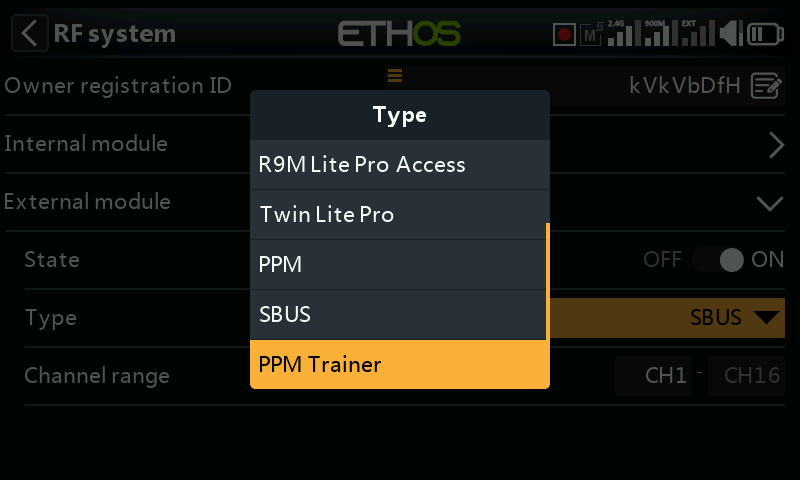

The External RF Module can be configured to operate as ‘Trainer master’ in PPM mode.

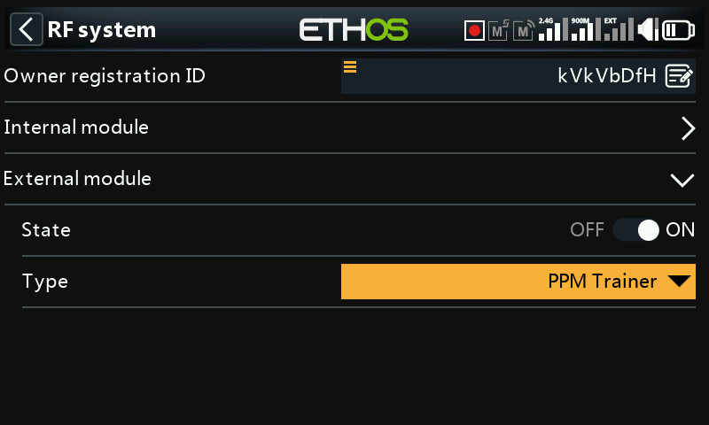

##### Trainer master configuration

Please refer to the [Trainer master configuration](trainer.md) section for details on configuring Trainer master mode.

##### External module connections

Please refer to the external module connection details given below for the SBUS (Trainer master) option.

Similarly, the Trainer master PPM option provides a PPM input on the PXX IN pin in the external module bay, to be used with a legacy receiver having a CPPM output in a similar fashion to the SBUS option below.

### Type: Trainer master (SBUS)

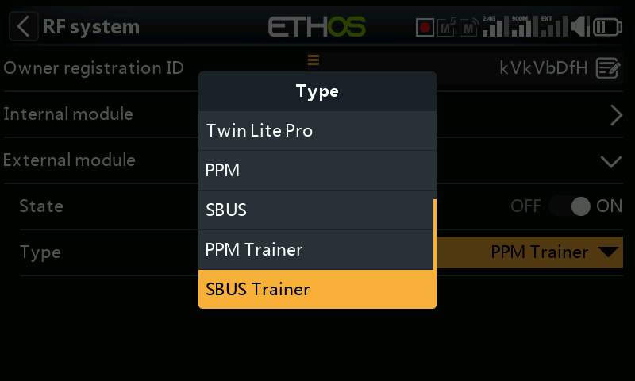

The External RF Module can be configured to operate as ‘Trainer master’ in SBUS mode.

##### Trainer master configuration

Please refer to the [Trainer master configuration](trainer.md) section for details on configuring Trainer master mode.

##### External module connections

This option provides an SBUS input on on the PXX IN pin in the external module bay. This allows installation of an FrSky receiver with SBUS output (i.e Archer RS or similar) in the module bay to act as the receiving end of a wireless trainer link to connect ANY FrSky radio to X20 as a buddy box.

The slave or student radio is then bound to this receiver, and transmits as normal. While the master trainer function is active, the received channels are allowed to control the model.

##### External module pinout diagram

## External RF modules – Third Party

### Type

Currently the Ghost, Multimodule, Express LRS and Crossfire external RF modules are supported. Support for more third-party modules will be supported in future.

Third party module support must be user installed and is achieved by the user installing a Lua script that adds the module support to ETHOS. This mechanism will always be needed to use third-party modules and the Lua scripts user installed. The selection for the third-party modules only appears as a selection on the RF screen after the Lua script is installed.

Please refer to the [Third-Party External Modules](https://www.rcgroups.com/forums/showpost.php?p=49550649&postcount=18844) post on the X20 and Ethos thread on rcgroups for more information, as well as the [scripts for external modules](#scripts for external modules) section for details on the location for storing the Lua scripts for installing supported third party modules.

#### Multimodule

Ethos supports flashing of the IRX4 Lite Multimodule.

Copy the multimodule firmware file to the Firmware folder on the radio, then use File Manager to browse to the file. Tap on the highlighted filename, and select ‘Flash external multimodule’. Flashing will commence, with a bar chart showing progress.
