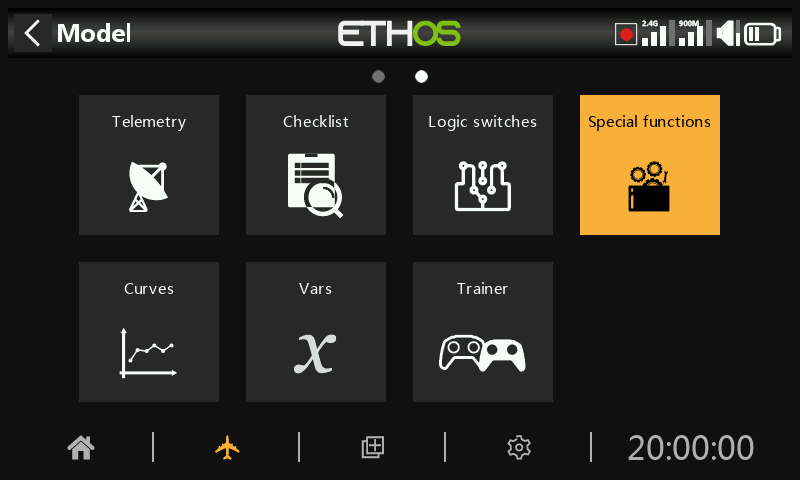
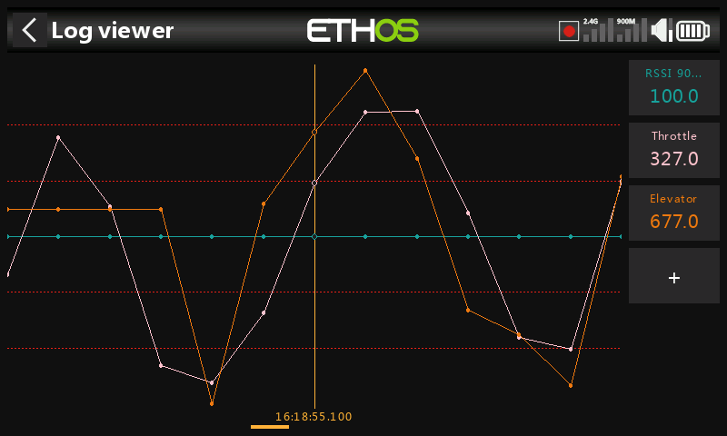

# Special Functions

Special functions can be configured to play values, play sounds, etc. Up to 100 special functions supported.

There are no default special functions. Tap on the ‘+’ button in the initial empty menu to add a special function.

Once special functions have been defined, tapping on one will bring up the above popup menu, allowing you to edit, move, copy/paste, clone or delete that special function. You can also add a new special function by selecting ‘Add’, or by tapping on the ‘+’ symbol next to the column headings.

Selecting 'Move' will bring up arrow keys allowing the special function to be moved up or down.

## Special functions

Currently the following special functions are supported:

- Reset
- Screenshot
- Set failsafe
- Play audio
- Haptic
- Write logs
- Play text (X20 Pro only)
- Go to page
- Lock touchscreen
- Load model
- Play vario

Action: Reset

State

Enable or disable this special function.

Active condition

The special function may be 'Always on', or activated by switch positions, function switches, flight modes, logic switches, trim positions or flight modes.

To select the inverse of for example switch SG-up, if you long press Enter on the switch name and select the Negative check box in the popup the switch value will change to !SG-up. This means the special function will be active when switch SG is not in the up position.

Global

When selecting Global, the special function is added to all existing models and any new model created in the future. If an existing model already has the function the global function is added as a new function. Turning off the global function on any model removes the function from all models except the current model selected.

Global special functions are stored in the radio.bin file, while local ones are stored in the model file.

Reset

The following categories may be reset:

-	Flight data: resets both telemetry and timers

-	All timers: resets all 8 timers

-	Whole telemetry: resets all telemetry values.

Action: Screenshot

Will save a screenshot into the location:

SD Card (drive letter)/screenshots/ or

RADIO (drive letter)/screenshots/

State

Enable or disable this special function.

Active condition

The special function may be 'Always on', or activated by switch positions, function switches, flight modes, logic switches, trim positions or flight modes.

To select the inverse of for example switch SG-up, if you long press Enter on the switch name and select the Negative check box in the popup the switch value will changes to !SG-up. This means the special function will be active when switch SG is not in the up position.

Global

When selecting Global, the special function is added to all existing models and any new model created in the future. If an existing model already has the function the global function is added as a new function. Turning off the global function on any model removes the function from all models except the current model selected.

Action: Set failsafe

State

Enable or disable this special function.

Active condition

The ‘Set failsafe’ function may be activated by switch positions, function switches, logic switches, trim positions etc.

Global

When selecting Global, the special function is added to all existing models and any new model created in the future. If an existing model already has the function the global function is added as a new function. Turning off the global function on any model removes the function from all models except the current model selected.

Module

Select whether to set failsafe via the internal or the external RF module.

Action: Play ***audio***

State

Enable or disable this special function.

Active condition

The special function may be 'Always on', or activated by switch positions, function switches, logic switches, trim positions or flight modes.

Global

When selecting Global, the special function is added to all existing models and any new model created in the future. If an existing model already has the function the global function is added as a new function. Turning off the global function on any model removes the function from all models except the current model selected.

Voice

Up to 3 voices may be configured in Ethos. Select the voice to be used for this ‘Play audio’.

Please refer to the [Choice of Voices](#Audio (Voices)) section in General for more details on configuring custom and system voices.

Repeat

The audio may be played once, or repeated at the frequency entered here, up to 10 minutes.

Skip on startup

If enabled, the speech text will not be played on startup.

Sequence

A sequence of up to 100 ‘Play file’ and/or ‘Play value’ commands may be configured, which will be played in sequence.

The available actions are:

##### Play file

Play file will play the selected audio file.

Please refer to the ‘User sound files’ section in [Choice of Voices](../system-setup/general.md) for details on file location etc.

##### Play value

Play value will play the value of the selected source. The source may be from any of the following:

- Analogs, i.e. sticks, pots or sliders
    - Switches
    - Logic switches
    - Trims
    - Channels
    - Gyro
    - System clock (Time)
    - Trainer
    - Timers
    - Telemetry

##### Wait duration

Wait duration will insert a delay for the time required, up to 10 minutes.

##### Wait condition

Wait condition will pause until the wait condition is satisfied.

Examples

In the example above, the active condition is logic switch VFRlow. When it becomes active, ‘Play file’ is used to play a VFR low warning sound file called ‘vfrlow.wav’, which is then followed by ‘Play value’ playing the minimum VFR value recorded (from Telemetry).

This example shows the use of ‘Wait condition’ to pause the sequence until switch SH is moved to the down position.

Sequence management

Tapping on a sequence line will bring up a dialog allowing you to edit the line, add a new line, move the line up or down, or to delete the line.

Action: Haptic

This special function assigns haptic vibration

State

Enable or disable this special function.

Active condition

The special function may be 'Always on', or activated by switch positions, function switches, logic switches, trim positions or flight modes.

Global

When selecting Global, the special function is added to all existing models and any new model created in the future. If an existing model already has the function the global function is added as a new function. Turning off the global function on any model removes the function from all models except the current model selected.

Pattern

Sets the pattern of the haptic. Options are single, double, triple, quintuple and very brief.

Strength

Select the strength of the haptic vibration, between 1 and 10. The default is 5.

Repeat

The haptic may be executed once, or repeated at the frequency entered here.

Select haptic motors

The X20 Pro AW and X20RS have haptic feedback motor options for the gimbal sticks.

Note that X20 Pro and X20R can be upgraded by fitting MC20R haptic gimbals. Please refer to the ‘[Enabling haptic gimbal upgrades](../system-setup/hardware.md)’ to enable the option.

You can select between:

- Default (internal haptic)
- All motors
- Left stick haptic
- Right stick haptic

Action: Write Logs

Log files are stored in a ‘.csv’ format in the ‘Logs’ folder on the SD card or eMMC. The RTC time and date are logged with the data, and are important to make sense of the data by separating the log data into sessions.

State

Enable or disable this special function.

Active condition

The special function may be 'Always on', or activated by switch positions, function switches, logic switches, trim positions or flight modes.

Global

When selecting Global, the special function is added to all existing models and any new model created in the future. If an existing model already has the function the global function is added as a new function. Turning off the global function on any model removes the function from all models except the current model selected.

Write Interval

The logs write interval is user adjustable between 100 and 500ms.

Sticks/Pots/Sliders

Enables logging of Sticks/Pots/Sliders.

Switches

Enables logging of Switches.

Logic Switches

Enables logging of logic switches.

Channels

Enables logging of channels sent to the RF module.

Log viewer

To view log files, navigate to the /Logs folder on eMMC or the SD card with File Explorer, then tap on the desired log file and select open.

1. The log file will be read into memory, but can be cancelled while reading.

2. Select the channels to be viewed on the RHS. In this example the Throttle and Elevator channels have been selected. RSSI is selected by default.

The \[DISP\] button moves the focus to the first button in the right hand column.

3. The display can be panned with the rotary encoder or by swiping left or right. The above screenshot was panned to the left compared to the previous one.

4. The display can be zoomed in or out by rotating the rotary encoder while holding down the page key.

Action: Play Text (X20 Pro only)

This special function utilizes an internal hardware TTS (Text-To-Speech) processor to generate spoken text from the user specified text string, rather than playing previously prepared .wav files.

State

Enable or disable this special function.

Active Condition

The special function may be Always On, or activated by switch positions, function switches, logic switches, trim positions or flight modes.

Global

When selecting Global, the special function is added to all existing models and any new model created in the future. If an existing model already has the function the Global function is added as a new function. Turning off the Global function on any model removes the function from all models except the current model selected.

Text

The user specified text string to be converted to speech and played. Using all capitals will have the result of spelling out the word letter by letter, for example ‘OFF’ will say O-F-F. Using lowercase tells TTS that you want to say the word ‘off’.

Repeat

The speech text may be played once, or repeated at the frequency entered here.

Skip on startup

If enabled, the speech text will not be played on startup.

Action: Go to screen

This special function will switch the display to a selected screen.

State

Enable or disable this special function.

Active Condition

The special function may be Always On, or activated by switch positions, function switches, logic switches, trim positions or flight modes.

Global

When selecting Global, the special function is added to all existing models and any new model created in the future. If an existing model already has the function the Global function is added as a new function. Turning off the Global function on any model removes the function from all models except the current model selected.

Screen

Select the radio screen to be displayed.

In this example the display will be switched to the flight data record for RX1 when the pushbutton SI is depressed.

Action: Lock touchscreen

This special function will lock the touchscreen to prevent inadvertent operation.

Please note that ‘lock touchscreen’ is also available by pressing \[ENT\] and \[Page\] simultaneously for 1 second from the Home screen.

State

Enable or disable this special function.

Active Condition

The special function may be Always On, or activated by switch positions, function switches, logic switches, trim positions or flight modes.

Global

When selecting Global, the special function is added to all existing models and any new model created in the future. If an existing model already has the function the Global function is added as a new function. Turning off the Global function on any model removes the function from all models except the current model selected.

Action: Load model

This special function will load a specified model when the ‘Active condition’ is met.

State

Enable or disable this special function.

Active Condition

The special function may be Always On, or activated by switch positions, function switches, logic switches, trim positions or flight modes.

Global

When selecting Global, the special function is added to all existing models and any new model created in the future. If an existing model already has the function the Global function is added as a new function. Turning off the Global function on any model removes the function from all models except the current model selected.

Model

Select the desired model to be loaded.

Confirmation

Select whether confirmation of the model load is required.

Action: Play vario

Allows a source for the vario to be selected.

The default is normally the VSpeed sensor on FrSky varios, but any sensor with units of m/s can be used.

Once the source has been selected, the Range and Center parameters appear.

Range

The default rate of climb or descent is +/- 10m/s, but may be increased up to +/- 100m/s.

When the climb rate is above the Center value below, the pitch of the Vario beeps increases linearly until the maximum Range value is reached. The tone pitch at maximum climb rate can be configured in the [Vario](../system-setup/general.md) section of the Audio settings.

The tone is continuous when the climb rate is falling. The pitch of the tone decreases linearly until the minimum Range value is reached.

Center

The default range defining a climb rate of zero is +/- 0.3m/s, but may be increased up to +/- 2m/s.

The pitch of the Vario beeps is steady when the climb rate is between these center values. The tone pitch when the climb rate is zero can be configured in the [Vario](../system-setup/general.md) section of the Audio settings.

These beeps may be silenced by switching from ‘Beep’ to ‘Silent’.
