# Special Functions

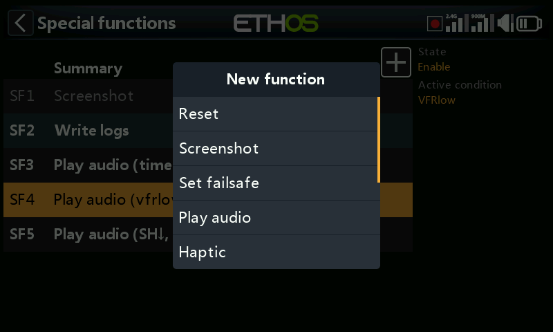

Special functions trigger an action — playing audio, taking a
screenshot, writing logs, haptic feedback, and more — when a condition
becomes true. Up to 100 are supported; none exist by default. Add one
with **+**; tap an existing one for **Edit**/**Move**/**Copy-paste**/
**Clone**/**Delete**.

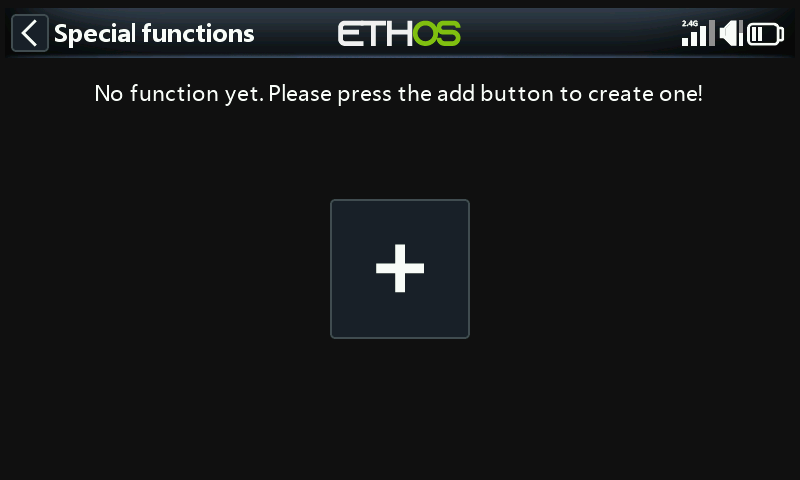
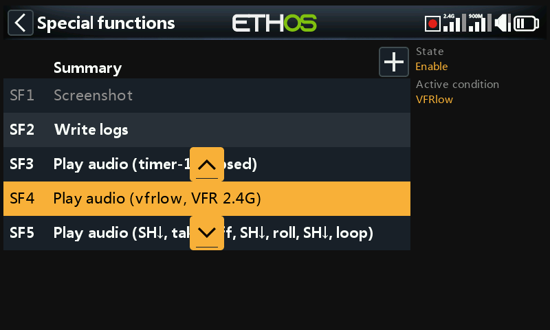

## Fields common to every action

- **State** — enable/disable this function without deleting it.
- **Active condition** — **Always on**, or gated by switch/function
  switch/logical switch/trim positions or flight modes. Long-press `ENT`
  on a switch and tick **Negative** to invert it (e.g. `SG-up` becomes
  `!SG-up`, active whenever SG is *not* up).
- **Global** — adds this function to **every** model, existing and future.
  If a model already has an identically-configured local function, Global
  adds it as an additional entry; turning Global off again removes it
  from every model except the one currently selected. Global functions
  live in `radio.bin`; local ones live in the model file.

## Actions {: #actions }

**Reset** — resets **Flight data** (telemetry + timers), **All timers**,
or **Whole telemetry**.

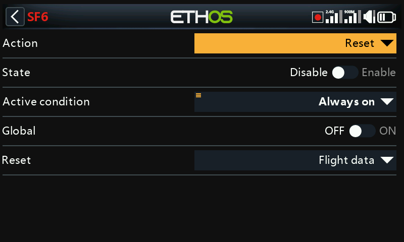

**Screenshot** — saves a screenshot to `screenshots/` on the SD
card/eMMC.

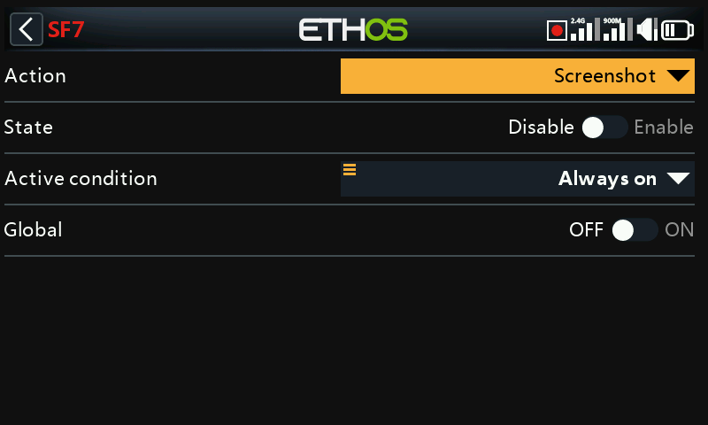

**Set failsafe** — captures the current channel positions as failsafe,
via either the internal or external RF **Module**.

**Play audio** — the richest action, supporting a full sequence:

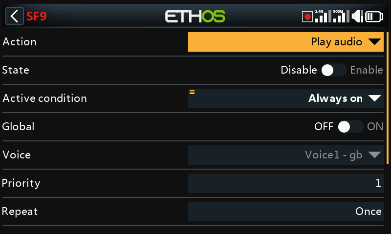

- **Voice** — which of up to 3 configured voices to use (see
  [General](../system-setup/general.md#audio-settings)).
- **Repeat** — play once, or repeat at a configurable interval (up to
  10 minutes).
- **Skip on startup** — suppress this function firing during startup.
- **Sequence** — up to 100 steps, each one of:

  - **Play file** — plays a chosen audio file.

    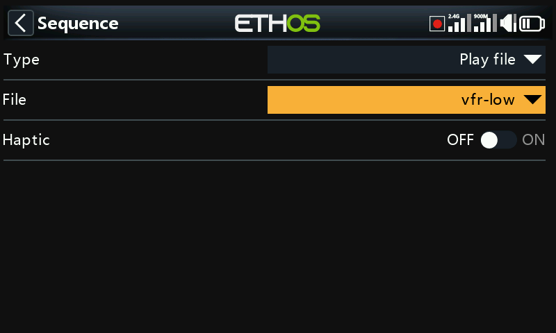

  - **Play value** — speaks the value of a source: analogs, switches,
    logical switches, trims, channels, gyro, system clock, trainer,
    timers, or telemetry.

    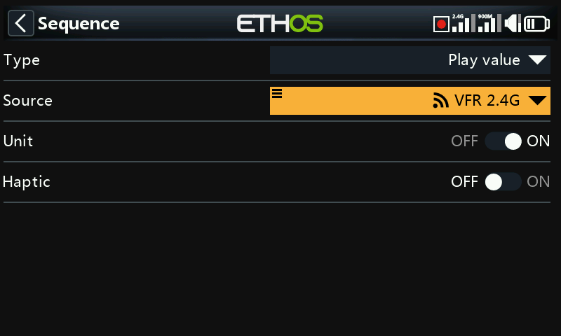

  - **Wait duration** — a fixed pause, up to 10 minutes.
  - **Wait condition** — pauses the sequence until a condition is met.

  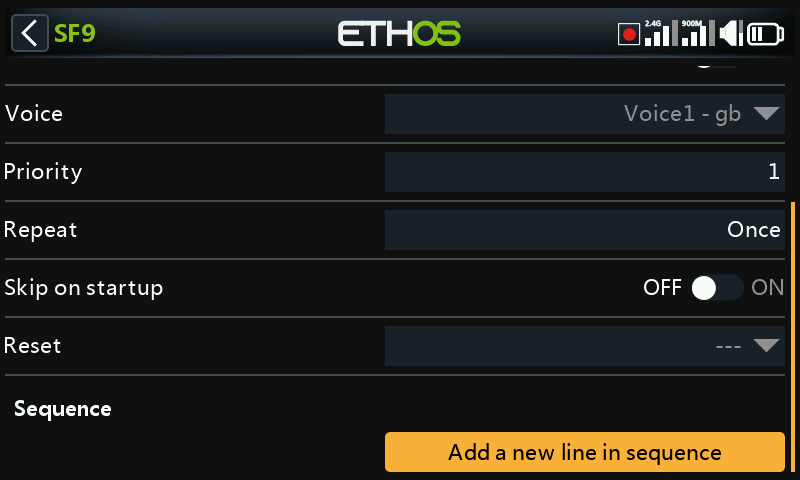
  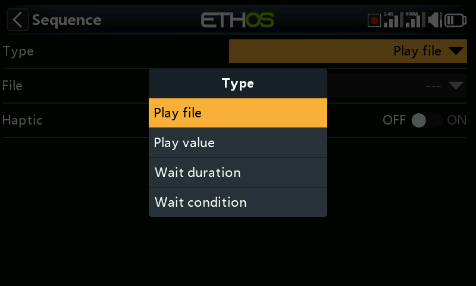

  For example: play `vfrlow.wav` when logical switch `VFRlow` becomes
  active, then speak the recorded minimum VFR value —

  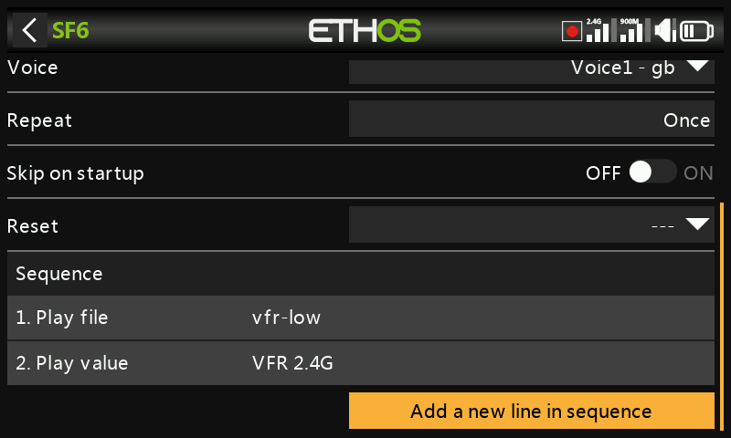

  — or pause a sequence until switch SH moves down before continuing:

  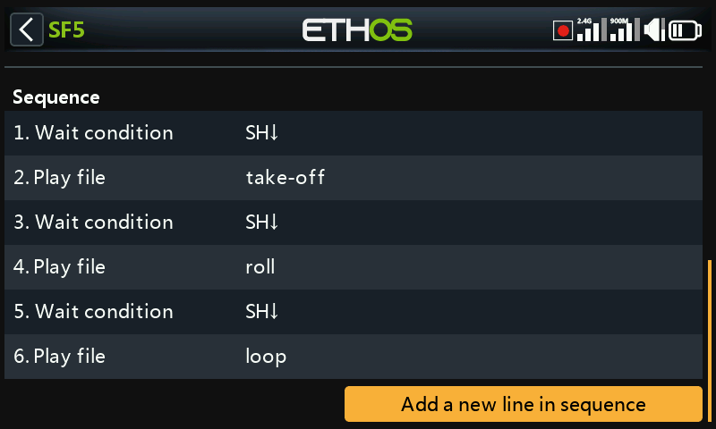

  Tap any sequence line to edit, add, reorder, or delete it:

  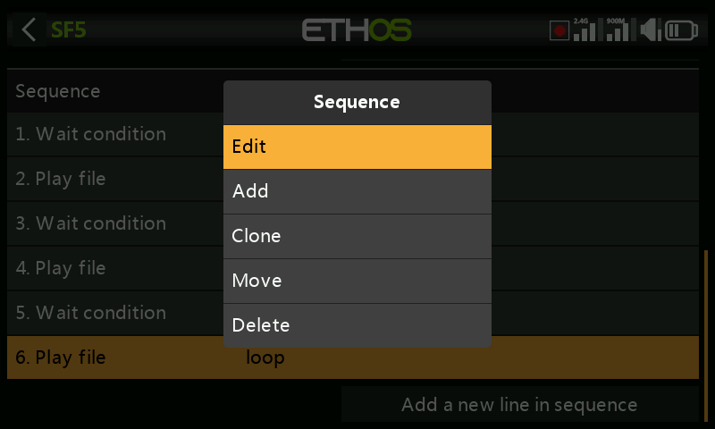

**Haptic** — vibration feedback:

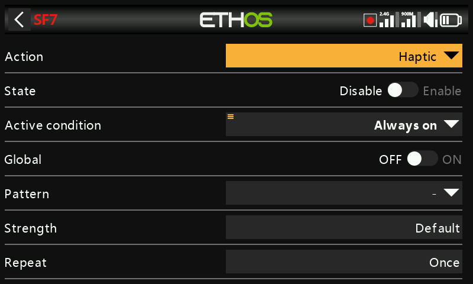

- **Pattern** — single, double, triple, quintuple, or very brief.

  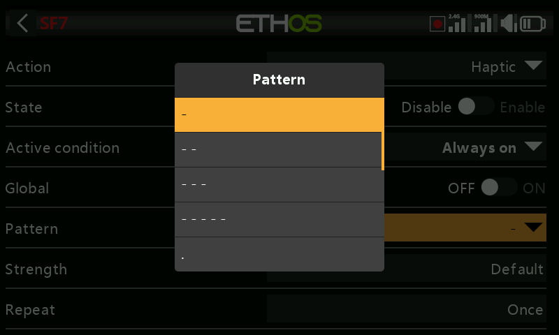

- **Strength** — 1–10 (default 5).
- **Repeat** — once, or at a set interval.
- **Select haptic motors** — on radios with gimbal haptic motors (X20 Pro
  AW, X20RS, or an X20 Pro/X20R upgraded with MC20R gimbals — see
  [Hardware](../system-setup/hardware.md#radio-specific-hardware-options)):
  **Default** (internal haptic), **All motors**, **Left stick**, or
  **Right stick**.

  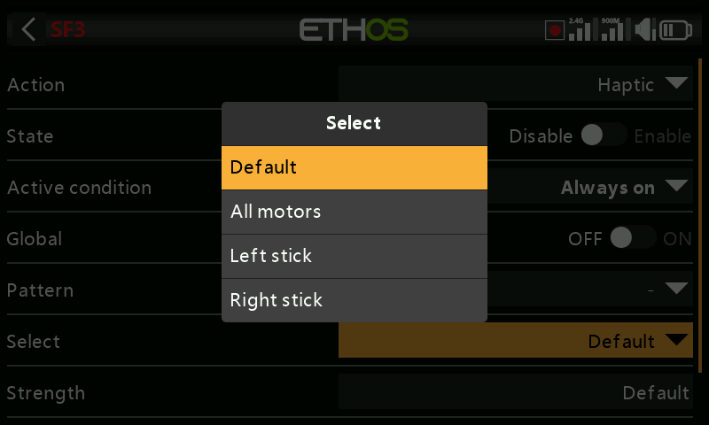

**Write Logs** — writes `.csv` logs to `Logs/` on the SD card/eMMC,
timestamped from the RTC (essential for telling flight sessions apart
afterward):

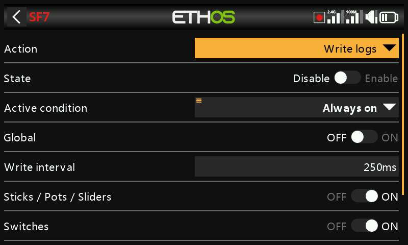

- **Write Interval** — 100–500ms.
- **Sticks/Pots/Sliders**, **Switches**, **Logic Switches**, **Channels**
  — independently toggled logging categories.

  **Viewing logs**: open a log file from `/Logs` in File Manager. Choose
  which channels to plot (RSSI is selected by default); pan with the
  rotary encoder or a swipe, and zoom by rotating the encoder while
  holding `PAGE`. `DISP` jumps focus to the first right-hand column
  button.

**Play Text** (X20 Pro only) — on-device text-to-speech instead of a
pre-recorded file:

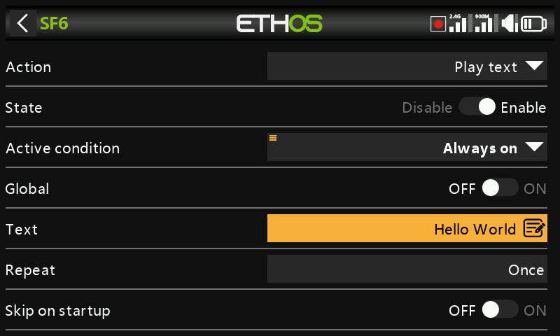

- **Text** — the string to speak. ALL CAPS spells letter-by-letter (e.g.
  "OFF" → "O-F-F"); lowercase speaks it as a word ("off").
- **Repeat**, **Skip on startup** — as above.

**Go to screen** — switches the display to a chosen screen, e.g. jumping
to a receiver's flight data record when a button is pressed:

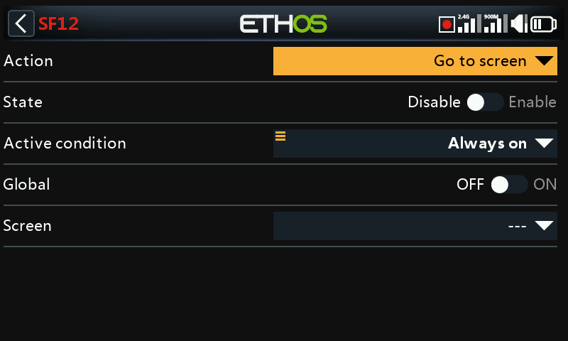
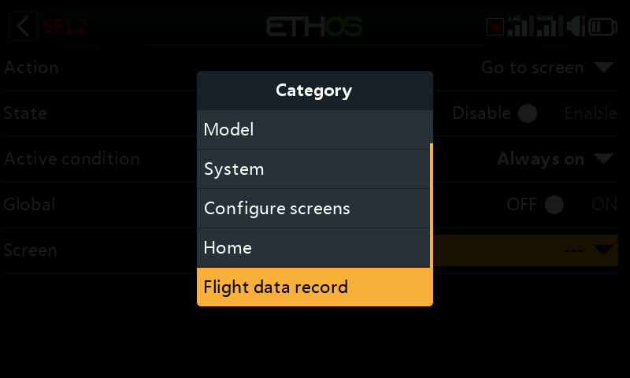

**Lock touchscreen** — locks the touchscreen against inadvertent input
(also reachable directly via `ENT` + `PAGE` held together for 1s from the
home screen):

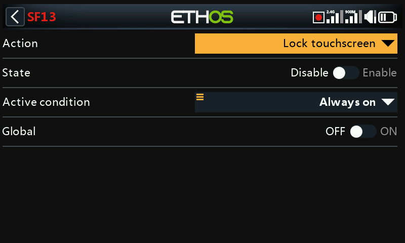

**Load model** — loads a specified **Model** when triggered, with an
optional **Confirmation** prompt before it actually switches:

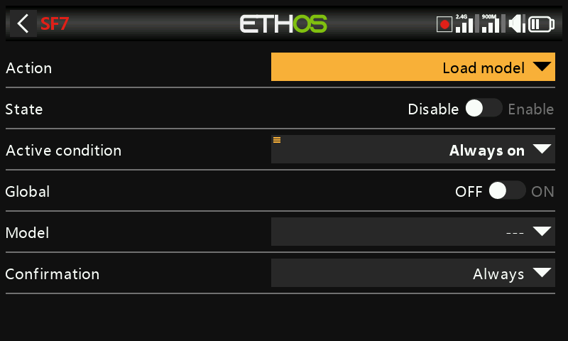

**Play vario** — drives vario audio from a chosen source (normally a
FrSky vario's VSpeed sensor, but any m/s-unit sensor works):

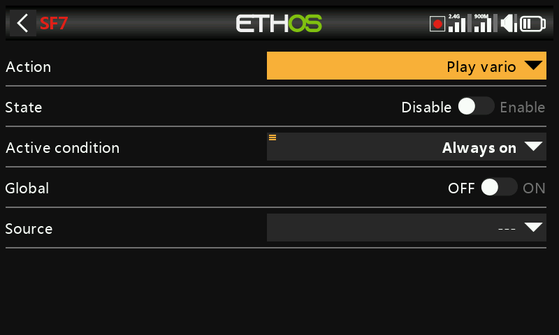
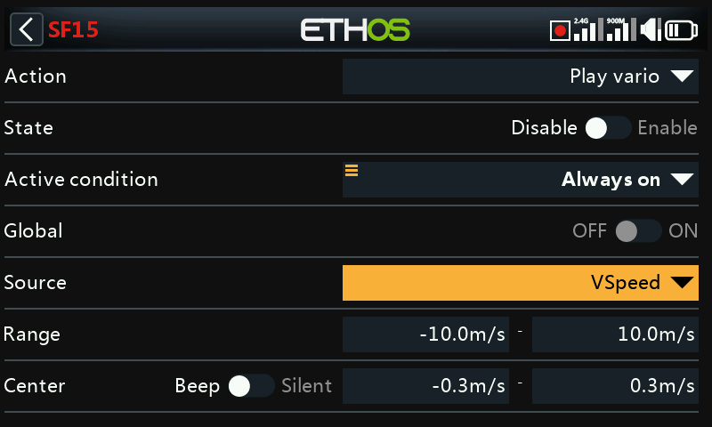

- **Range** — climb/descent rate mapped to tone pitch, default ±10m/s
  (up to ±100m/s). Above **Center**, pitch rises linearly with climb rate
  up to the max Range value (max-rate pitch is set in [General →
  Vario](../system-setup/general.md#vario)); descending gives a
  continuous tone falling in pitch toward the minimum Range value.
- **Center** — the "zero climb" band, default ±0.3m/s (up to ±2m/s); pitch
  is steady within it (zero-rate pitch also set in General → Vario).
  Switch **Beep**→**Silent** to mute the tone entirely.

  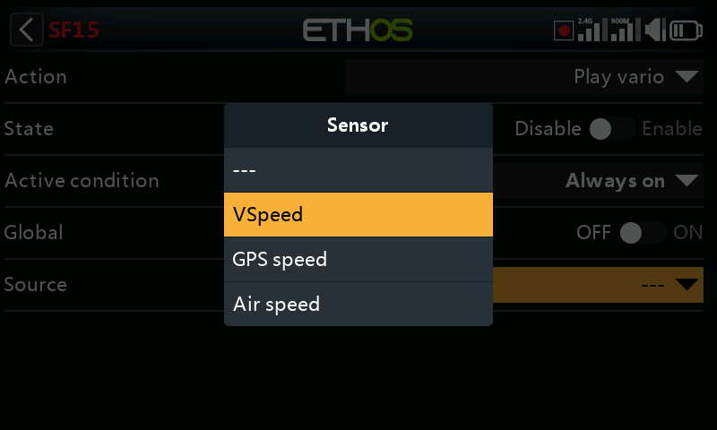
