# Telemetry

Telemetry carries information back from the model to the pilot — link
quality (RSSI, VFR), voltages and currents, and anything else a connected
sensor reports (GPS position, altitude, and so on). Up to 100 sensors are
supported per model; discovery and configuration happens here, but
telemetry is actually *displayed* as [display screen
widgets](../displays/index.md), configured separately under Configure
Screens.

## How FrSky telemetry works

FrSky's sensors are hub-less: **Smart Port (S.Port)** is a 3-wire bus
(Gnd, V+, Signal), daisy-chained in any order into the S.Port connection
on X/S-series-and-later receivers, running half-duplex at 57,600 bps
(F.Port and FBUS are faster).

- **Physical ID** — up to 28 nodes (including the receiver) share the
  bus, each needing a unique Physical ID (00–1B hex). FrSky devices ship
  with sensible defaults (e.g. Vario = 00, FLVSS = 01, Current = 02,
  GPS = 03) — if you connect two of the same device, the second's
  Physical ID must be changed via [Device
  Config](../system-setup/devices.md).
- **Application ID** — independent of Physical ID: one sensor can report
  multiple values, each its own Application ID. A Vario has one Physical
  ID but two Application IDs (Altitude, Vertical Speed); an FLVSS has one
  Physical ID and one Application ID (Voltage). Monitoring two 6S packs
  with two FLVSS sensors means changing **both** IDs on the second one —
  Physical ID for exclusive bus communication, Application ID so the
  receiver can tell Lipo 1 and Lipo 2 apart (e.g. `0300` → `0301`). The
  4th hex digit is what's normally varied, 0–F.

  !!! note
      Sensors sharing an Application ID but different Physical IDs is
      only valid with [sensor conflict
      detection](../system-setup/alerts.md) disabled — a special-purpose
      setup, not the default case.

Each received value is tracked as its own sensor: value, Physical/
Application ID, an editable name, unit, decimal precision, an optional
SD-card logging flag, and its own running min/max. Sensors are
auto-discovered every power-up once set up, but must be **manually**
discovered the first time. Once discovered, a sensor can be spoken by
voice, fed into [calculated sensors](#calculated-sensors), used in
[logical switches](logical-switches.md), [Vars](variables.md), or
[mixes](mixes.md), shown on a custom telemetry screen, or read directly
from this setup page without building a screen at all.

**FBUS** (formerly F.Port2) upgrades this further, folding SBUS control
and S.Port telemetry onto one line at 460,800 bps (vs. F.Port's 115,200
and S.Port's 57,600 — the three are mutually incompatible bit rates), and
lets one host talk to several slave accessories on that single line, all
configurable wirelessly from the radio.

### Multi-receiver telemetry (ACCESS Trio)

With up to three receivers registered under [RF
System](rf-system.md#registering-and-binding-a-receiver-access), each
bound receiver can be individually configured (port pins, etc.) via RX1/
RX2/RX3. Ordinarily there's one inbound telemetry path per RF link — the
Tandem/TD systems are the exception, running 2.4GHz and 900MHz as two
paths on one module. The active telemetry source can change mid-flight
depending on RF conditions; the **RX** sensor reports which receiver is
currently sending telemetry in real time (and logs it).

The common setup: daisy-chain the S.Port sensor bus across all three
receivers, sharing a common power supply, then register/bind each
receiver and discover sensors as normal — the telemetry source switches
automatically as the active RX changes, and *external* S.Port sensor data
follows along transparently. (Internal receiver sensors — RSSI, VFR,
RxBatt, ADC2, RX itself — don't link this way; they're always reported
for whichever receiver is currently the source. Simultaneous telemetry
from all three at once is planned but not yet available.)

## Link-quality sensors

- **RSSI** (Receiver Signal Strength Indicator) — how strong the model's
  transmission is at the receiver. Default alarms: **ACCESS**/**TD**/
  **TW** 35 (low) / 32 (critical), loss of control around 28; **ACCST**
  45 / 42, loss of control around 38. "Telemetry Lost" fires when the
  link is gone entirely — at that point **no further alarms can sound**,
  since the radio has no telemetry left to evaluate; treat it as a cue to
  turn back immediately. (At under ~1m separation, the receiver can be
  swamped and produce spurious Lost/Recovered alarm loops — not a real
  fault.) RSSI approximates effective range well, but VFR is the more
  reliable link-quality indicator.

  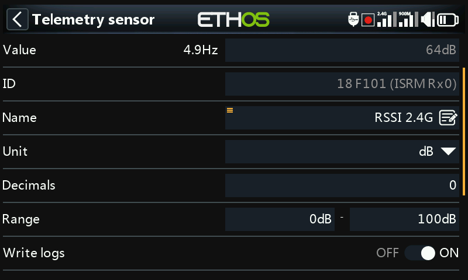

  TD receivers report a per-band RSSI (2.4G, 900M); TW receivers report
  one per band too (2.4FSK, 2.4LoRa, 900M) — enable **Individual RSSI
  alert per band** to get separate voice alerts for each rather than one
  combined alert:

  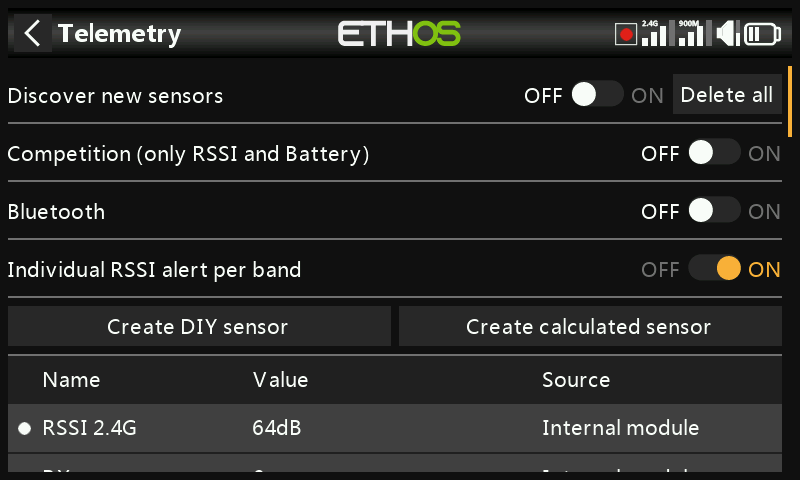

- **VFR** (Valid Frame Rate) — valid packets per 100 received; the
  post-ACCESS-2.1 replacement for folding lost-frame-rate into RSSI.
  Default **Low value warning** is 50%.

  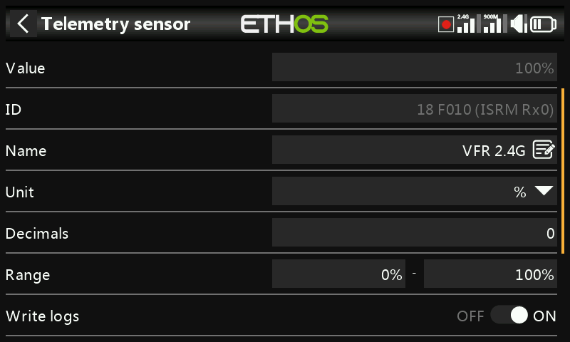

  TD/TW receivers report two VFR streams (one per band); **Rx VFR** (on
  TD/TW/AP/AP Plus receivers) instead counts every good frame regardless
  of which band it arrived on — the one to watch if only tracking a
  single VFR value.

- **RxBatt** — receiver battery voltage.
- **ADC2** — a second analog voltage input, on receivers that support it.
- **SWR** — antenna SWR, when using an external antenna.
- Attitude/motion sensors, where supported: **R.Angle**, **P.Angle**,
  **AccX/Y/Z**.

Every numeric sensor also gets automatic `<name>-`/`<name>+` min/max
sensors, even though they're not shown in the main sensor list.

## Discovering sensors

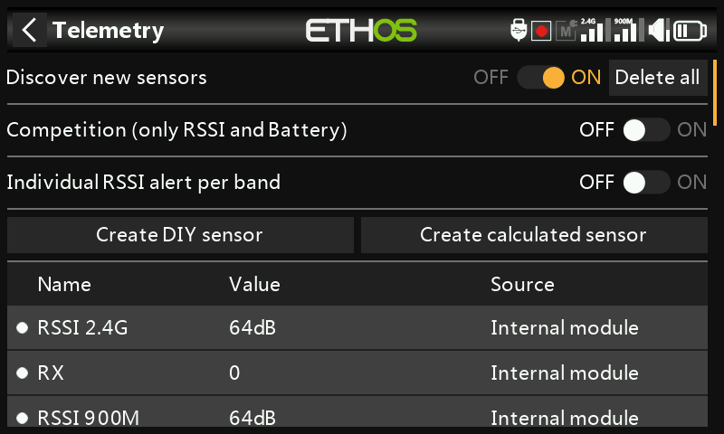

With everything bound and powered up, enable **Discover new sensors** — a
flashing dot (or a red value, if no data yet) marks each sensor as it's
found, and the screen populates automatically. This has to be repeated
**per model**, and again whenever a new sensor is added.

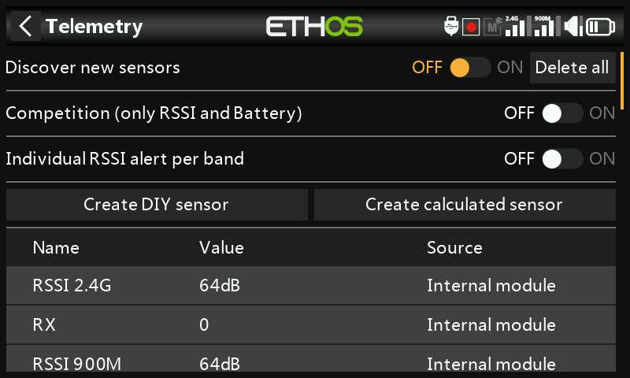

- Switch discovery back **Off** once done.
- **Delete all** clears every sensor to start over.

  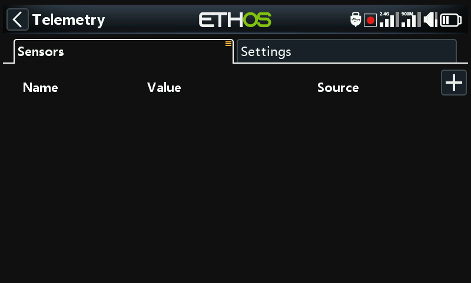

- **Competition mode** strips telemetry down to just RSSI and RxBatt —
  for contests that allow only link-status sensors. Turning it off again
  requires a power cycle before sensors can be rediscovered.

  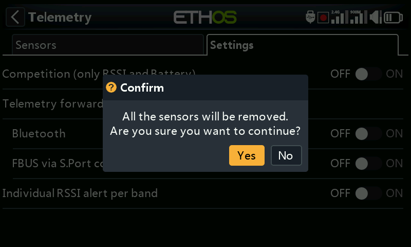

- **Bluetooth** telemetry mode pairs with the FrSky FreeLink phone app,
  which can display telemetry live and also configure FrSky devices like
  stabilized receivers.

  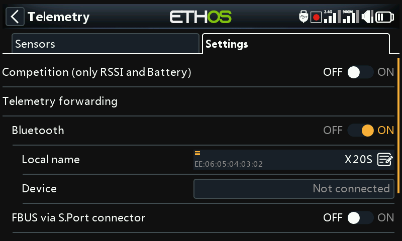

## Editing a sensor

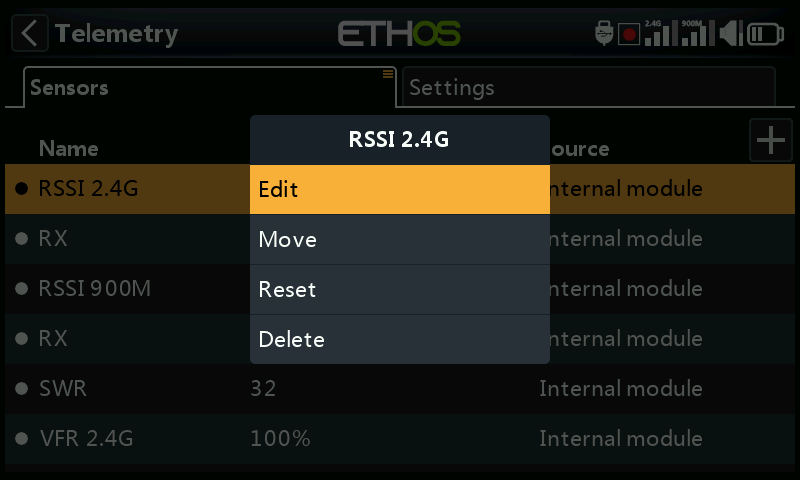

Tap a sensor for **Edit**, **Move**, **Reset**, or **Delete**. Common
fields: **Value** (read-only), **ID** (Physical + Application ID, and
sending receiver), **Name**, **Unit**, **Decimals**, **Range** (fixed
scaling limits — mainly relevant when the sensor is used as a channel
source), **Write logs**, **Reset** (a source that resets this sensor), and
**Sensor lost warning delay** (disable entirely, or 1–30s, default 10s, to
filter brief dropouts — understand the risk of setting this too high; the
"sensor lost" message only plays once even if many sensors drop at once;
disabled by default for receiver-internal sensors, since those rarely go
missing).

Some sensors add their own fields:

- **ADC2** — **Ratio** and **Offset**, to correct scaling.

  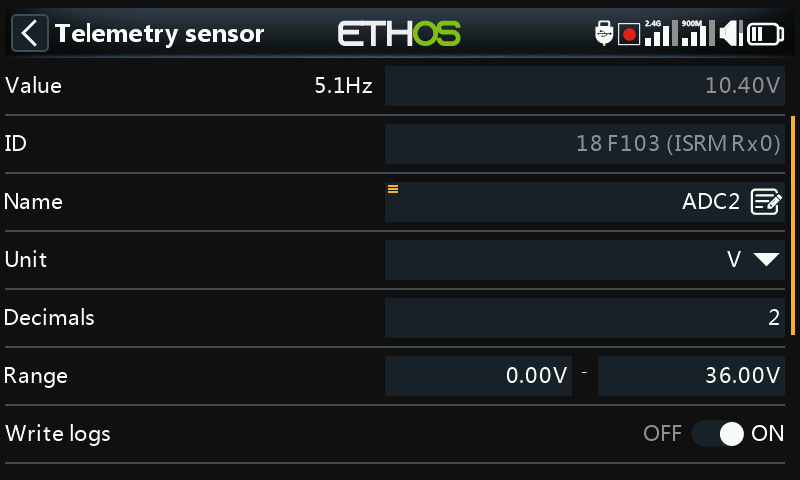

- **RSSI** — **Critical value** and **Low value warning** thresholds.
- **VFR** — **Low value warning** (default 50%).
- **VSpeed** (vario vertical speed) — **Range** up to ±100m/s (default
  ±10m/s). Vario audio behavior itself now lives under the [Play Vario
  special function](special-functions.md), not here.

  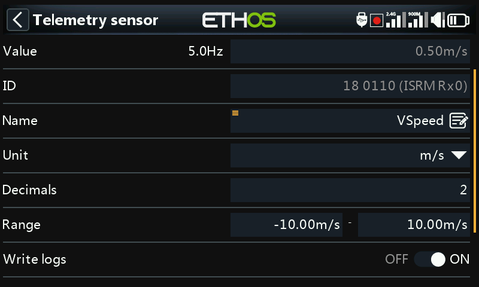

## DIY / third-party sensors

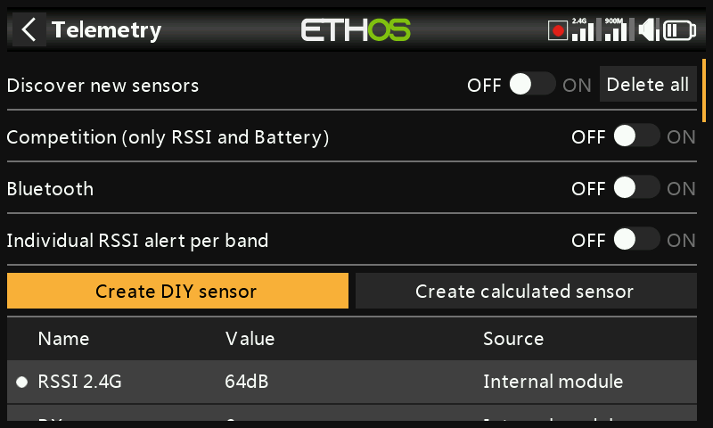

**Create DIY Sensor** adds a non-FrSky sensor manually: **Auto detect**
(populates Physical ID, Application ID, and Module automatically, if
possible), or set them by hand, plus **Protocol decimals/unit** (incoming
precision, 0–3 decimals, and its native unit) and **Display decimals/
unit** (independent of the protocol's own) alongside the same **Range**/
**Ratio**/**Offset**/**Write logs**/**Reset**/**Sensor lost warning
delay** fields as any other sensor.

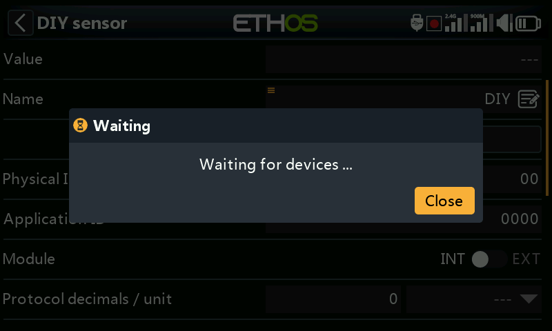

## Calculated sensors

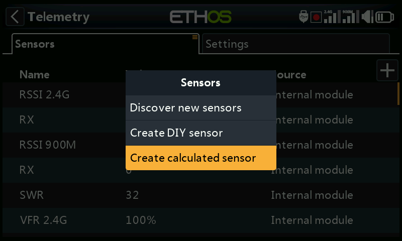

Derive a new sensor from one or more existing ones:

- **Consumption** — energy used, integrated from a current sensor (e.g.
  FAS series). Unit mAh/Ah, range up to 1000Ah.

  

- **Distance** — from a GPS source (plus an altitude source, for 3D
  distance). Units cm/m/km/ft, up to 20km.

  

- **Trip** — accumulated distance between successive GPS fixes. Same
  units, up to 1000km.

  

- **Multi Lipo** — cascades two or more Lipo voltage sensors to monitor
  packs bigger than 6S (up to 67.2V/8S). Select each cell sensor
  low-to-high; every additional Lipo sensor needs its Physical **and**
  Application IDs changed in [Device Config](../system-setup/devices.md)
  first (the Lipo Voltage setup tool there helps), discovered one at a
  time, and renamed so they're distinguishable.

  

- **Percent** — rescales a sensor to 0–100%, with an **Invert** option
  (e.g. to show *remaining* percentage instead of consumed).

  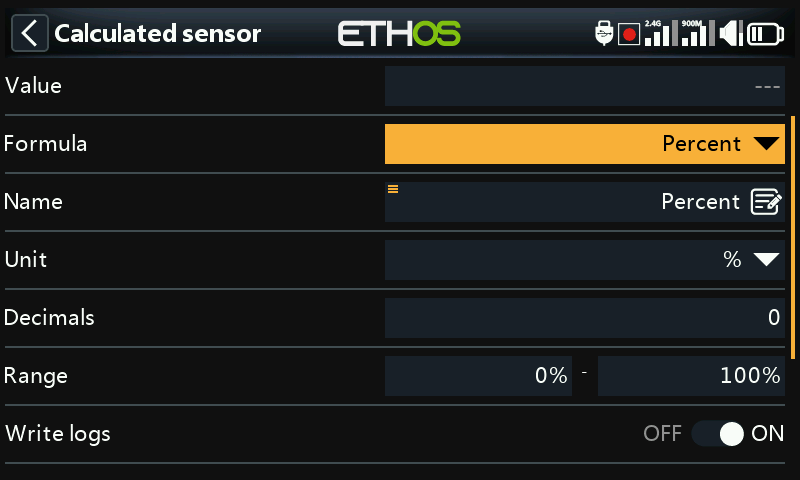

- **Power** — Wattage from a **Current** and **Voltage** source pair, up
  to 1,000,000W.

  

- **Custom** — an arbitrary formula chained from one or more sources.

Every calculated sensor also has **Persistent** (survives power-off/model
change, reloaded next use) and a **Reset** button right on the edit
screen.

### Custom sensors

Starts from one source, then **Add** chains further operations:
**Add(+)**, **Minus(-)**, **Multiply(×)**, **Divide(/)**, **Min**,
**Max**, **Sqrt**. Units are selectable from a long list covering
voltage, current, capacity, power, distance, speed, time, temperature,
percentage, angles, pressure, and more; range −1,000,000 to 1,000,000,
0–4 decimals.

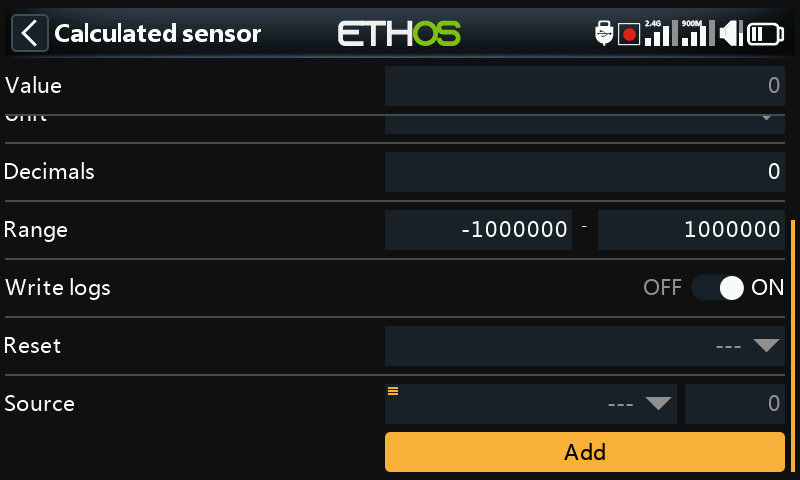

!!! example "Peak power"
    Multiply a voltage sensor (`VFAS`) by a current sensor (`Current`),
    then add a **Max** step referencing the sensor's own current value
    (`MaxPower`) to track the highest reading seen — 288W in this
    example run:

    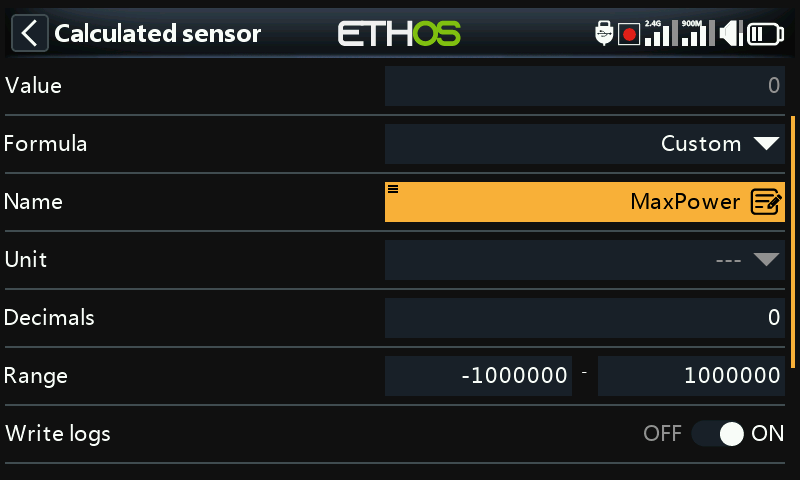

!!! example "Arithmetic against a constant"
    Source set to `RSSI 2.4G` (reading 64dB), then a **Subtract** action
    whose own source is long-pressed and **Convert to value** applied,
    turning it into an editable constant (20) rather than a live source —
    the result is a steady 44dB (64 − 20):

    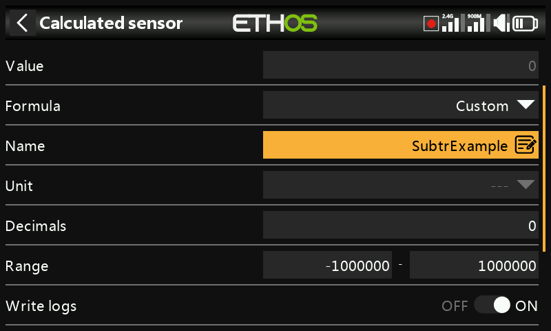
    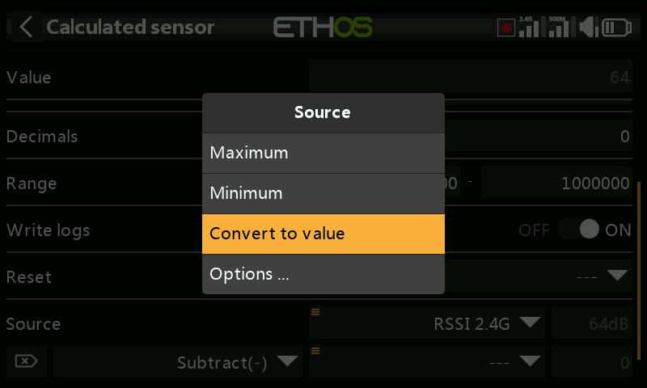

!!! note "A source's internal value"
    Every [source](../getting-started/user-interface-and-navigation.md#choosing-a-source)
    has an internal integer range of ±1024 corresponding to its ±100%
    displayed range — visible directly by pointing a Custom sensor at,
    say, Throttle: full throttle reads **+1024** internally, full reverse
    reads **−1024**.

    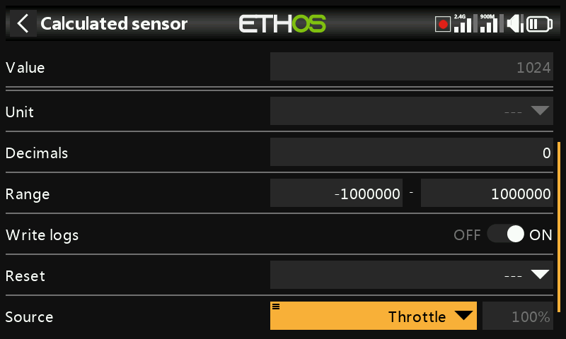
    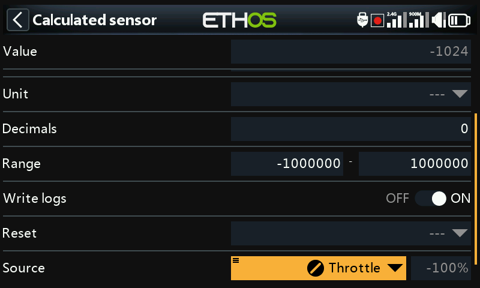
