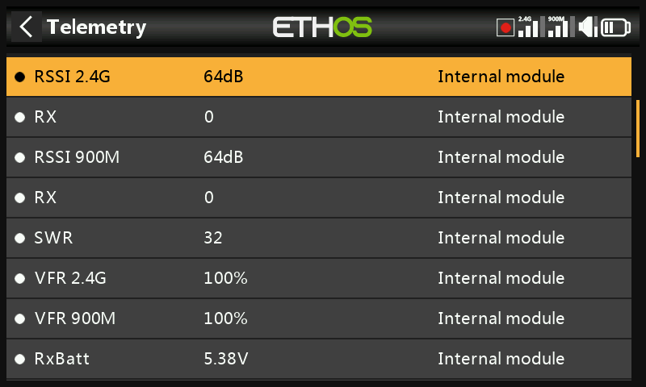
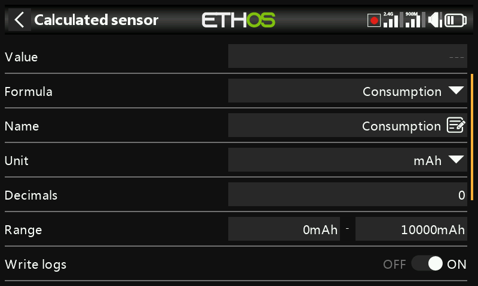
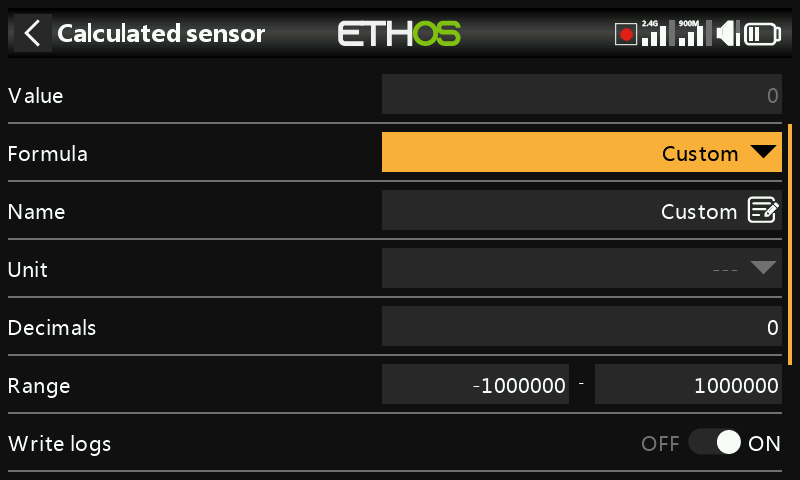

# Telemetry

Telemetry sensor discovery and configuration is per-model, tied to
whichever receiver is bound to it. Beyond the sensors a receiver reports
automatically, this section also covers **calculated sensors** (derived
values like consumption, distance, or multi-battery sums) and fully custom
sensors built from arithmetic on other sensors.

!!! note "Draft"
    This page is a placeholder — full content coming in a later pass.
