# Telemetry

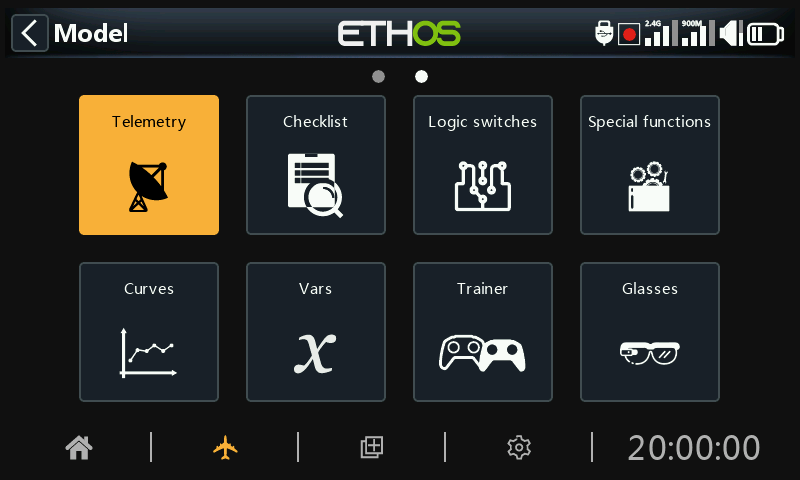

FrSky offers a very comprehensive telemetry system. The power of telemetry has lifted the RC hobby to a whole new level, and allows much more sophistication and a much richer modeling experience.

## Smart Port telemetry

FrSky's series of sensors are a hub-less design. Smart Port (S.Port) uses a three wire physical bus comprising of Gnd, V+ and Signal. S.Port telemetry devices are daisy chained together in any sequence and plugged into the S.Port connection on compatible X and S and later series receivers. The receiver can achieve half duplex communication at a rate of 57600bps (F.Port and FBUS are faster) with many compatible devices through this connection with little or no manual set up.

### Physical ID

Smart Port supports up to 28 nodes including the host receiver. Each node must have a unique Physical ID to ensure that there are no clashes in communication. Physical IDs may range between 00 hex and 1B hex (between 00 and 27 decimal).

| Dec. | Hex | Default Physical ID |  | Dec. | Hex | Default Physical ID |
| --- | --- | --- | --- | --- | --- | --- |
| 00 | 00 | Vario |  | 14 | 0E |  |
| 01 | 01 | FLVSS |  | 15 | 0F |  |
| 02 | 02 | Current |  | 16 | 10 | SD1 |
| 03 | 03 | GPS |  | 17 | 11 |  |
| 04 | 04 | RPM |  | 18 | 12 | VS600 |
| 05 | 05 | SP2UART (Host) |  | 19 | 13 |  |
| 06 | 06 | SP2UART (Remote) |  | 20 | 14 |  |
| 07 | 07 | FAS-xxx |  | 21 | 15 |  |
| 08 | 08 | TBD(SBEC) |  | 22 | 16 | Gas Suite |
| 09 | 09 | Air Speed |  | 23 | 17 | FSD |
| 10 | 0A | ESC |  | 24 | 18 | Gateway |
| 11 | 0B |  |  | 25 | 19 | Redundancy Bus |
| 12 | 0C | XACT Servo |  | 26 | 1A | SxR |
| 13 | 0D |  |  | 27 | 1B | Bus Master |

The table above lists the default Physical IDs of FrSky S.Port devices. Please note that if you have more than one of any of them, the Physical ID of the duplicate devices must be changed to ensure that each device in the S.Port chain has a unique Physical ID.

### Application ID

Each sensor may have multiple Application IDs, one for each sensor value being sent. The Physical ID and the Application ID are independent and unrelated. For example the Variometer sensor has just one Physical ID (default 00), but two Application IDs: one for Altitude (0100) and the other for Vertical Speed (0110).

Another example is the FLVSS Lipo Voltage sensor, which has a Physical ID (default 01), and an Application ID for Voltage (0300). If you want to use two FLVSS sensors to monitor two 6S Lipo packs, you will need to use Device Config to change the Physical ID of the second FLVSS to an empty slot (say 0F hex), and also to change the Application ID from say 0300 to 0301. Because the Physical ID and the Application ID are independent and unrelated, both must be changed. The Physical ID must be changed for exclusive communication with the host receiver, and the Application ID must be changed so the receiver can distinguish between the data from Lipo 1 and 2.

Note: For special applications it is possible to have sensors with the same Application ID and different Physical IDs when the sensor conflict warning is disabled. Please refer to the [Sensor conflict warning](#Sensor conflict warning) section on how to disable the warning.

| Device | Application ID (hex) | Parameter |
| --- | --- | --- |
| Vario | 010x | Altitude |
|  | 011x | Vertical Speed |
| FLVSS Lipo Voltage Sensor | 030x | Lipo Voltage |
| FAS100S Current Sensor | 020x | Current |
|  | 021x | VFAS |
|  | 040x | Temperature 1 |
|  | 041x | Temperature 2 |
| Xact Servo | 680x | Current, Voltage, Temp |

Above are a few example Application IDs. Please note that the Application ID parameter in Device Config presents a drop-down list of 4 digits to choose from; the default 4th digit is 0, but may be changed in a range of 0 to F hex (0, 1, 2, 3, 4, 5, 6, 7, 8, 9, A, B, C, D, E, F) to ensure that all Application IDs are unique.

Please also note that:

1. A device may have more than one range of Application IDs, see for example the Current Sensor above.
2. Where two redundant receivers have their S.Port telemetry ports connected, then packets for a particular sensor received by either receiver will be merged even if the redundant receiver is on a different band or module.

### S.Port key features:

Each value received via telemetry is treated as a separate sensor, that has its own properties such as

- the sensor value
- the S.Port Physical ID number and Data ID (aka Application ID)
- the name of the sensor (editable)
- the unit of measurement
- the decimal precision

- option to log to the SD card or eMMC

The sensor also keeps track of its min/max value.

As already mentioned more than one of the same sensor type can be connected, but the Physical ID must be changed in ‘Device config’ (or using the FrSky Airlink App or SBUS servo changer SCC) to ensure that each sensor in the S.Port chain has a unique Physical ID. Examples are a sensor for each cell in a 2 x 6S Lipo, or monitoring individual motor currents in a multi-motor model.

The same sensor can be duplicated, for example with different units, or for use in calculations such as absolute altitude, altitude above starting point, distance, etc.

Each sensor can be individually reset with a special function, so for example you can reset your altitude offset to your starting point without losing all the other min/max values.

With FrSky sensors, once set up, they are auto-discovered whenever the complete system is powered up. However, when initially installed, they must be manually 'discovered' in order for the system to recognize them.

Telemetry Sensors can be

- played in voice announcements
- used in calculated sensors
- used in logical switches for alerts etc.
- used in vars
- used in mixes for proportional actions
- displayed in custom telemetry screens
- seen directly on the telemetry setup page without having to configure a custom telemetry screen

Displays are updated as data is received, and loss of sensor communication is detected.

## FBUS control and telemetry

The FBUS (previously F.Port 2.0) protocol is the upgraded protocol which integrates SBUS for control and S.Port for telemetry into one line. This new protocol enables one Host device to communicate on one line with several Slave accessories. For example FBUS servos are controlled on one daisy-chained connection while also sending their servo telemetry back to the receiver on the same connection. All FBUS devices connected to a receiver (Host) can be configured wirelessly from the radio on this protocol.

The FBUS baud rate is 460,800 bps, while F.Port was 115,200 and S.Port 57,600 bps. This fact alone makes the three protocols incompatible with each other.

## Telemetry features in ACCESS

Single receiver telemetry with ACCESS works in the same way as before with ACCST.

### Multi receiver telemetry

ACCESS Trio Control provides the ability to have three receivers for each RF path registered and bound in ACCESS transmitters. The three receivers are bound in the transmitter RF screen in positions RX1, RX2 and RX3 that enables the ability to access the receivers individually to map the port pins and make other changes to the RX.

ACCESS normally has one inbound telemetry path for each RF link or one link for each RF module. The Tandem systems are an exception with one RF module that has a 2.4 and 900m section for two RF paths. The telemetry source receiver may change during a flight depending on RF conditions. ETHOS has an RX sensor that displays the telemetry source real-time and data logs the RX sensor data.

The most common application using S.Port would be by daisy chaining the S.Port sensor chain to all 3 receivers, which should be sharing a common power supply.

- Register and bind the receivers (refer to [Model Setup](../model-setup/index.md)).
- Connect the sensor and receiver Smart Ports in a daisy chain fashion.
- Discover new sensors (refer to [Telemetry](#Telemetry settings) Setup), and test carefully that Smart Port switching is working correctly.

The telemetry source will automatically switch depending on the active RX. The RX internal sensor displays the ID of the active RX that is sending telemetry, i.e. RX1, RX2 or RX3.

When the receiver telemetry source changes, linking of the receiver S.Ports will automatically continue telemetry from S.Port connected external sensors. However please note that it does not link internal receiver sensors. RSSI, VFR, RxBatt, ADC2 and RX(n) sensor data is sent for the source receiver, so that does change depending on the source.

Simultaneous telemetry from three receivers will come later. Further developments are expected in this area.

### Sensor Types:

#### 1. Internal sensors

FrSky radios and receivers have built-in telemetry functions to monitor the strength of the signal being received by the model.

Receiver Signal Strength Indicator (RSSI): A value transmitted by the receiver in your model to your transmitter that indicates how strong the signal is that is being received by the model. Warnings can be set up to warn you when it drops below a minimum value, indicating that you’re in danger of flying out of range. Factors affecting the signal quality include external interference, excessive distance, badly oriented or damaged antennas etc.

The default alarms for ACCESS, TD and TW modes are 35 for 'RSSI Low' and 32 for 'RSSI Critical'. Loss of control will happen when the RSSI drops to around 28.

##### Individual RSSI alert per band

When using TD or TW protocols, there is an option to receive Individual RSSI voice alerts per band in the Settings tab.

With this option off, you will receive only one RSSI low or critical alert per internal or external RF module. The ETHOS logic monitors both RSSIs to be below the threshold setting before it plays the warning message. It will also give an alert when no RSSI sensors are discovered.

With this option on, for a TD receiver you will receive RSSI alerts for each band in use, i.e. 2.4G and 900M. For a TW receiver you will receive RSSI alerts for each band in use, i.e. 2.4FSK and 2.4LoRa and 900M.

The default alarms for ACCESS are also 35 for 'RSSI Low' and 32 for 'RSSI Critical'. Loss of control will happen when the RSSI drops to around 28.

The default alarms for ACCST are 45 and 42 respectively. Loss of control will happen when the RSSI drops to around 38 for ACCST.

The warning for when telemetry is lost completely is announced as 'Telemetry Lost'. Be aware that further alarms will NOT sound, because the telemetry link has failed, and the radio can no longer warn you of an RSSI or any other alarm condition. In this situation it is wise to turn back to investigate the problem.

Note that when the radio and receiver are too close (less than 1m) the receiver may be swamped causing spurious alarms, resulting in an annoying "Telemetry Lost" - "Telemetry Recovered" alarm loop.

RSSI is less valuable than VFR for determining the state of the control link, but approximates well to the effective range of the link.

Prior to ACCESS V2.1, RSSI was based on a combination of received signal strength and lost frame rate. Lost frames have now been removed from the RSSI calculation, and added as a new sensor VFR (Valid Frame Rate) to provide a measure of link quality.

VFR is the number of valid data packets per 100 packets received.

A warning can be set up to warn you when VFR drops below a minimum value, indicating that the link quality is becoming dangerously low. The default 'Low value warning' is 50.

Receivers like the TD (2.4 FSK and 900m) and TW (2.4 FSK and 2.4 LoRa) receivers each have two RSSI and two VFR telemetry streams and warnings. Currently ETHOS logic monitors both VFRs to be below the threshold setting before it plays the warning message.

##### Rx VFR

Note that the TD, TW, AP and AP Plus receivers have a new "Rx VFR" telemetry value. Depending on the receiver type you will see a VFR for FSK, a VFR for Lora, a VFR for 900M as well as the new RX VFR.

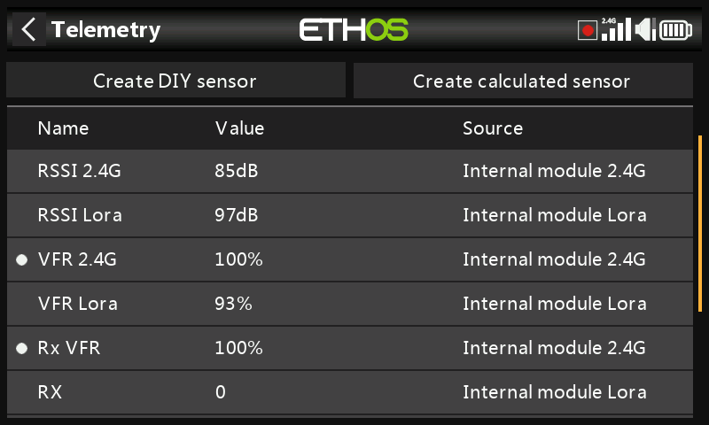

The Rx VFR takes its data from FSK or Lora or 900M depending on which band frames are being received from. It counts every good frame regardless of which band it came from. If you are only going to monitor one VFR, then ‘Rx VFR’ is the one.

Another standard internal sensor is the receiver battery voltage.

Some receivers support a second analog voltage input, which is available in telemetry as sensor ADC2.

#### 2. 'External' sensors

The current FrSky telemetry system makes use of FrSky Smart Port sensors. The X and S and later series of telemetry enabled receivers have the Smart Port interface. Multiple Smart Port sensors can be daisy chained together, making the system easy to implement. Most receivers also have either one or both A1/A2 analog input ports, which are useful for monitoring battery voltages, etc.

## Telemetry configuration

### Overview

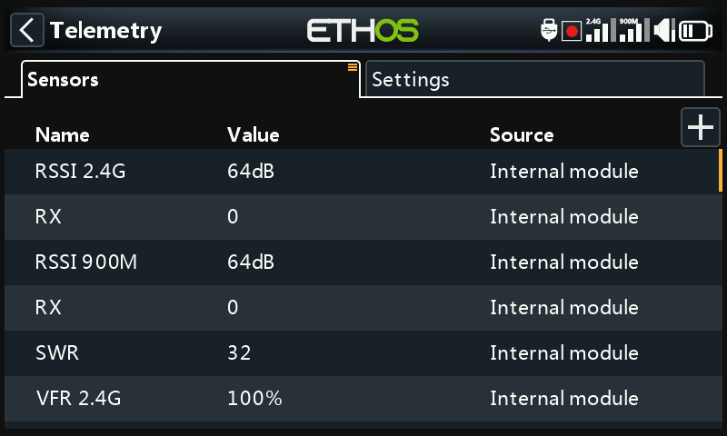

There are two tabs in Telemetry.

#### Sensors tab

The sensors tab is used for discovering new sensors, adding DIY and calculated sensors, and when editing sensors. Up to 100 sensors are supported.

Calculated sensors may be added, including Consumption, Distance and Trip, Multi Lipo, Percent, Power and Custom.

Edit sensor options include data logging and configuring thresholds. When the sensors are discovered they have an individual description for 2.4G or 900M so the sensor values can be used throughout the system.

#### Settings tab

The settings tab is used for enabling ‘competition only’ mode, and enabling Bluetooth for sending telemetry and for enabling an ‘Individual RSSI alert per band’ for TD and TW receivers. Please refer to the ‘[Settings tab](../model-setup/telemetry.md)’ below.

### Sensors tab options

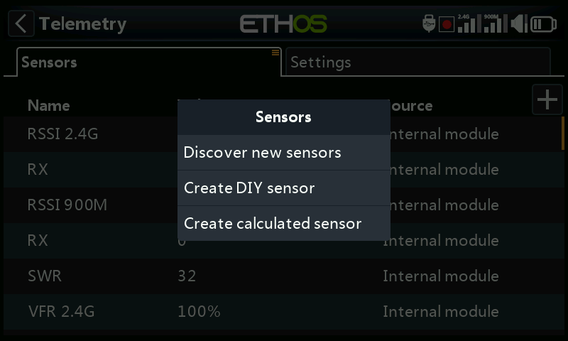

Tap on the ‘+’ button on the right of the Sensors tab page to open the options dialog.

#### Discover new sensors

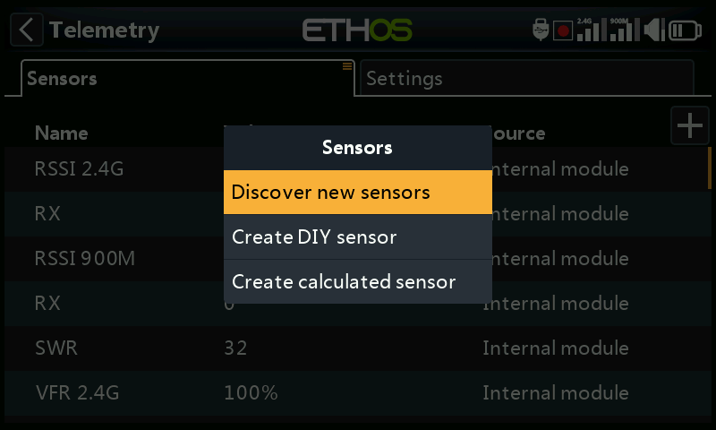

Once the sensors have been connected, and the radio and receiver have been bound and are powered up, tap on ‘Discover new sensors’ to discover new sensors available.

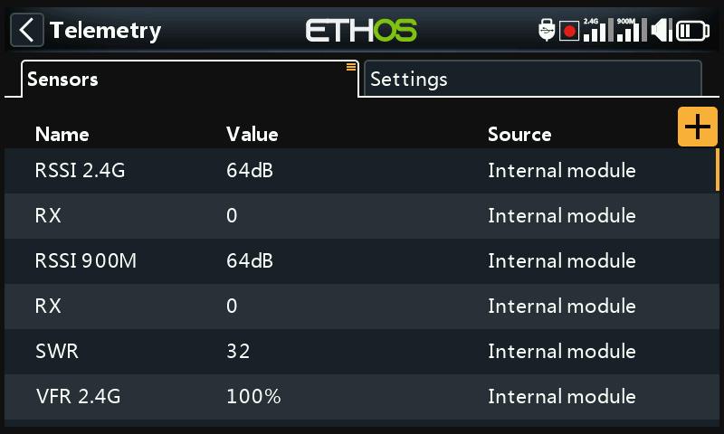

During discovery the screen will be automatically populated with all the sensors found. Once all sensors have been discovered, the discovery process should be terminated. Please refer to the ’Stop discovery’ option below

A flashing white dot in the left column indicates sensor data being received, or the value shows in red if no data is being received. As mentioned above up to 100 sensors are supported.

The above example screen shows an SR10 Pro receiver's 'internal' and external sensors, which are:

RSSI 2.4G (Receiver Signal Strength Indicator)

RX 0: There is a new ETHOS telemetry receiver source feature named RX. RX provides the receiver number of the active receiver sending telemetry. RX is available in telemetry like any other sensor for real time display, logic switches, special functions and data logging.

RSSI 900M (Receiver Signal Strength Indicator)

RX 0: See above.

SWR, antenna SWR value if using an external antenna

VFR 2.4G, the Valid Frame Rate percentage of the 2.4G receiver

Other sensors may include:

VFR 900M, the Valid Frame Rate percentage of the 900M receiver

RxBatt, the receiver battery voltage measurement

ADC2, the receiver analog voltage input

R.Angle, the Roll Angle of the receiver

P.Angle, the Pitch Angle of the receiver

AccY, the Acceleration in the Y axis of the receiver

AccZ, the Acceleration in the Z axis of the receiver

AccX, the Acceleration in the X axis of the receiver

Note that the minimum and maximum values are also defined for each sensor, even though they are not displayed on the sensor list. For example, when Altitude is defined, Altitude- and Altitude+ for the minimum and maximum altitude also become available. Please refer to [Sensor options](../user-interface-and-navigation/editing-controls.md) for details.

Sensor discovery must be done for every model, and every time a new sensor is added.

##### Sensor lost / conflict alerts

When a sensor is lost a red dot appears next to the sensor instead of the normal white flashing dot which indicates that telemetry for the sensor is being received.

When there is a sensor conflict a red dot also appears next to the sensor(s). A sensor conflict occurs when its Physical ID or its Application ID is not unique. Please refer to the sections above for more details.

The red dot alerts are only cleared on a sensor or telemetry reset. (Note that a flight reset also resets telemetry.)

##### Stop discovery

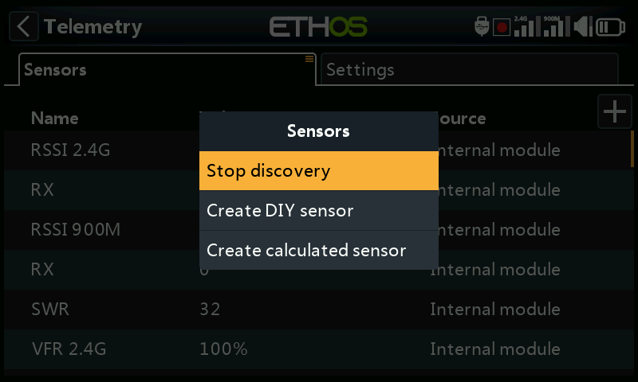

Once all the sensors have been discovered, tap on the ‘+’ button on the Sensors tab, then tap on ‘Stop discovery’ to end the discovery process.

#### Delete all sensors

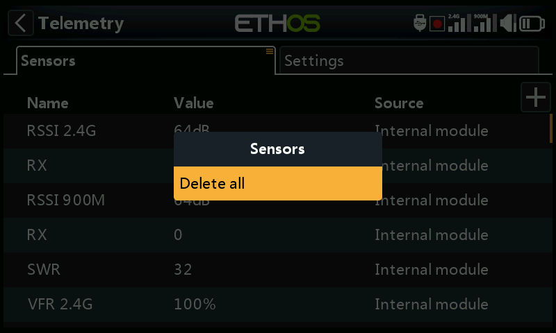

Tap on the Sensors tab itself to bring up the ‘Delete all’ option. After confirmation this option will delete all sensors so you can begin again.

All sensor have been deleted. Tap on the ‘+’ button on the right of the Sensors tab page to open the options dialog, then select ‘Discover new sensors’ to begin again (see above).

#### Editing and configuring sensors

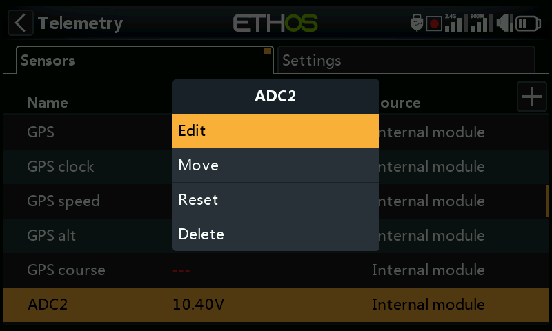

Tap on a sensor, then select 'Edit' from the popup dialog to edit the sensor settings. Alternatively select 'Move' to reorder sensors, ‘Reset’ to reset the sensor or 'Delete' to remove it.

##### Value

Displays the current sensor reading, as well as the sensor update rate.

##### ID

The ID is the sensor Physical ID and Application ID. The sending receiver ID is also shown.

##### Name

The sensor name, which may be edited (Analog input ADC2 in this example).

##### Unit

The unit of measurement (Volts in this example).

##### Decimals

The decimal precision.

##### Range

The low and high limits of a range can be set as a fixed value for scaling. This is mostly used when using a telemetry value as a source for a channel. This allows the Range to set to the desired scale. (On the newer FrSky receivers the analog input has a range of 0-36V.)

##### Write logs

When enabled, the sensor data will be logged to the SD card or eMMC.

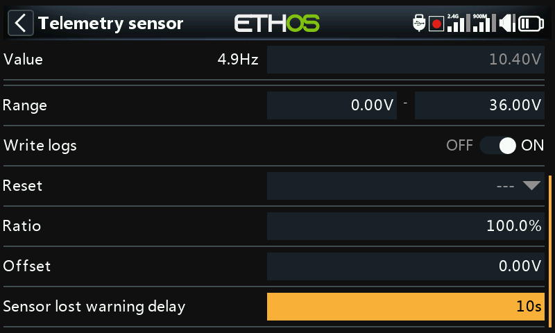

##### Reset

A source can be configured to reset the sensor. Note that the reset will also clear any ‘sensor lost’ or ‘sensor conflict’ red dot alerts. Please refer to [Sensor lost / conflict alerts](../model-setup/telemetry.md).

##### Sensor lost warning delay

When set to ‘Warning disabled’ it will suppress the sensor lost warning. Alternatively, a delay of 1 to 30 seconds may be set, with a default of 10s. This makes it possible to filter out short losses, but the risks must be understood.

The "sensor-lost" audio message is played only once when many sensors are lost simultaneously.

For the receiver sensors, this warning is disabled by default, as being internal they are unlikely to be lost.

#### Sensor specific warnings

The edit menu may vary for depending on the sensors, for example:

##### ADC2

Please refer to the example screenshot above.

##### Ratio

The ratio can be adjusted to correct the scale of the sensor input.

##### Offset

Similarly, an offset can be introduced.

##### RSSI

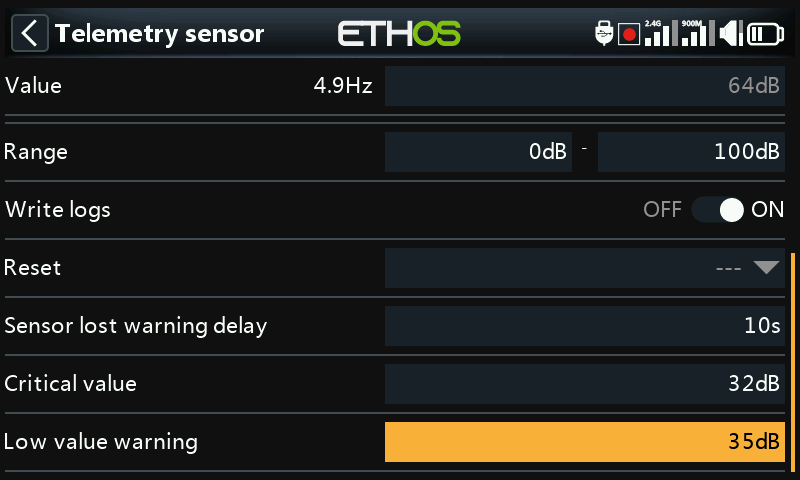

##### Critical value

Some sensors such as RSSI have built-in alerts. RSSI has two alerts, the first being the critical value threshold setting.

##### Low value warning

The second alert is the RSSI low value threshold setting.

Please refer to the Access Telemetry section for a discussion of the [RSSI alerts](#RSSI and VFR discussion).

##### VFR

VFR is the valid frame rate for the receiver.

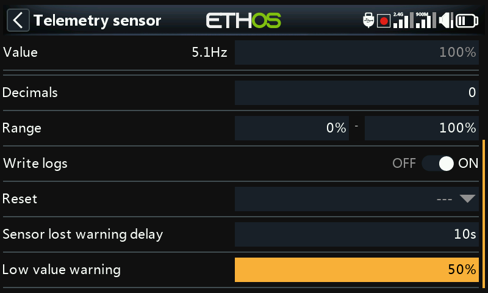

##### Low value warning

The VFR sensor has a low value threshold setting. The default alert is at 50%. Values below this indicate that the link quality has deteriorated to a concerning level.

##### VSpeed

Vspeed is the vertical speed of the model measured by a vario sensor.

##### Value

Displays the current sensor reading, as well as the sensor update rate.

##### ID

The ID is the sensor Physical ID and Application ID. The sending receiver ID is also shown.

##### Name

The sensor name, which may be edited (VSpeed in this example).

##### Unit

The unit of measurement (m/s in this example).

##### Decimals

The decimal precision.

##### Range

The default range is +/- 10m/s, but may be increased up to +/- 100m/s.

##### Write logs

When enabled, the sensor data will be logged to the SD card or eMMC.

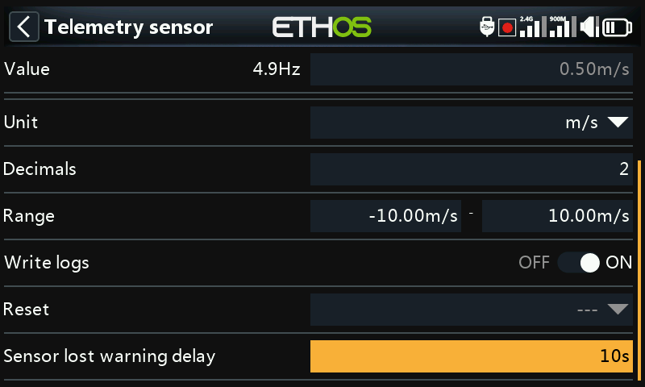

##### Reset

A source can be configured to reset the sensor. Note that the reset will also clear any ‘sensor lost’ or ‘sensor conflict’ red dot alerts. Please refer to [Sensor lost / conflict alerts](../model-setup/telemetry.md).

##### Sensor lost warning delay

When set to ‘Warning disabled’ it will suppress the sensor lost warning. Alternatively, a delay of 1 to 10 seconds may be set, with a default of 5s. This makes it possible to filter out short losses, but the risks must be understood.

On the receiver this warning is disabled by default because it is unlikely to be lost because it is internal.

Note: The vario related settings are now in the ‘[Play vario](../model-setup/special-functions.md)’ special function.

#### Create DIY Sensor

Tap on the ‘+’ button on the right of the Sensors tab to open the options dialog. Then select ‘Create DIY sensor’ to add a DIY or 3rd party sensor.

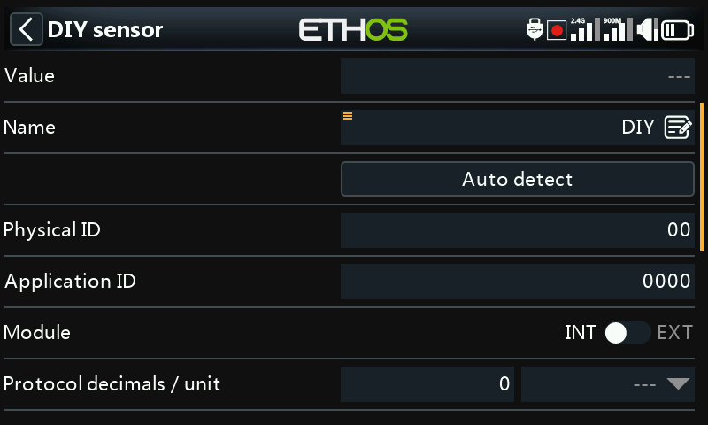

##### Value

Sensor value being received.

##### Name

The sensor name, which may be edited.

##### Auto detect

‘Auto detect’ will try to discover your DIY sensor. If it is already discovered, then ‘Auto detect’ will not find it. If any other sensors have not been discovered, they will also be shown in the list.

##### Physical ID

Two character physical ID of the sensor. This will be populated by Auto Detect if selected.

##### Application ID

Four character Application ID of the sensor. This will be populated by ‘Auto detect’ if selected.

##### Module

Allows Internal or External RF module to be selected. This will be populated by ‘Auto detect’ if selected.

##### Protocol decimals / unit

Allows the precision for the incoming protocol to be set, from 0 to 3 decimals. It also allows the measurement units to be selected.

##### Display decimals / unit

Allows the precision to be displayed to be set, from 0 to 3 decimals. It also allows the display measurement units to be selected.

##### Range

The low and high limits of a range can be set as a fixed value for scaling. This is mostly used when using a telemetry value as a source for a channel. This allows the Range to set to the desired scale.

##### Ratio

The default 100% ratio may be changed to correct readings being received.

##### Offset

The default offset of 0 may be changed to correct readings being received.

##### Write logs

When enabled, the sensor data will be logged to the SD card or eMMC. Logs are enabled by default.

##### Reset

A source can be configured to reset the sensor. Note that the reset will also clear any ‘sensor lost’ or ‘sensor conflict’ red dot alerts. Please refer to [Sensor lost / conflict alerts](../model-setup/telemetry.md).

##### Sensor lost warning delay

When set to ‘Not Set’ will suppress the sensor lost warning. Alternatively, a delay of 1 to 10 seconds may be set, with a default of 5s. This makes it possible to filter out short losses, but the risks must be understood.

#### Create Calculated Sensor

Tap on the ‘+’ button on the right of the Sensors tab to open the options dialog. Then select ‘Create calculated sensor’ to add a calculated sensor.

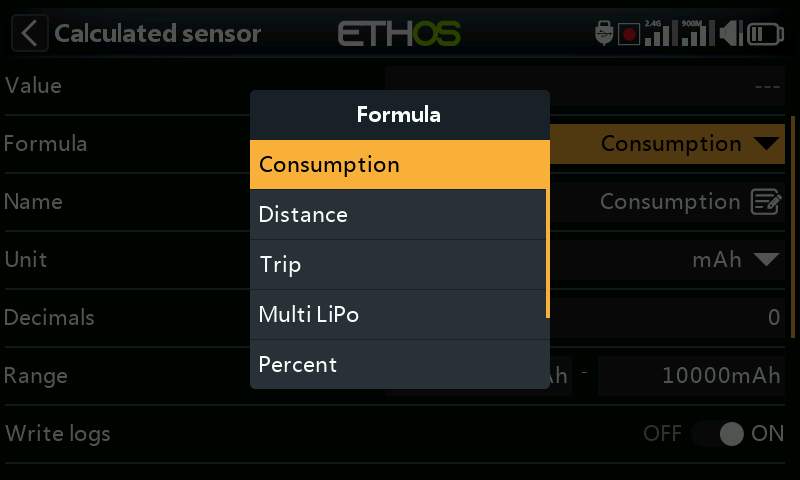

Calculated sensors may be added, including Consumption, Distance, Trip, Multi Lipo, Percent, Power and Custom.

##### Consumption sensor

The Consumption calculated sensor allows the energy consumed by your motor to be calculated from a current sensor such as the FAS series.

##### Value

Displays the current value of the selected sensor (see Source below).

##### Formula

Select the Consumption formula.

##### Name

The sensor name, which may be edited.

##### Unit

The measurement may be in mAh or Ah.

##### Decimals

The display may have between 0 and 4 decimals.

##### Range

The range may be from 0 up to a maximum of 1000Ah.

##### Write logs

Logs will be written to the SD card or eMMC in the Logs folder if enabled.

##### Reset

A source can be configured to reset the sensor.

##### Source

After discovering sensors, select your current sensor.

##### Persistent

Persistent allows storing the sensor value in memory when the radio is powered off or model is changed, and will be reloaded next time the model is used.

The Reset button allows the sensor to be reset while in the edit screen.

##### Distance sensor

The Distance calculated sensor allows the distance traveled to be calculated from a GPS sensor.

##### Value

Displays the current value of the selected sensor (see Source below).

##### Formula

Select the Distance formula.

##### Name

The sensor name, which may be edited.

##### Unit

The measurement may be in cm, m, km or feet.

##### Decimals

The display may have between 0 and 4 decimals.

##### Range

The range may be from 0 up to a maximum of 20km.

##### Write logs

Logs will be written to the SD card or eMMC in the Logs folder if enabled.

##### Reset

A source can be configured to reset the sensor.

##### GPS source

After discovering sensors, select your GPS sensor.

##### **Altitude** source

After discovering sensors, select your altitude sensor.

##### Persistent

Persistent allows storing the sensor value in memory when the radio is powered off or model is changed, and will be reloaded next time the model is used.

The Reset button allows the sensor to be reset while in the edit screen.

##### Trip sensor

The Trip calculated sensor allows the accumulated distance between GPS coordinates to be calculated from a GPS sensor.

##### Value

Displays the current value of the selected sensor (see Source below).

##### Formula

Select the Trip formula.

##### Name

The sensor name, which may be edited.

##### Unit

The measurement may be in cm, m, km or feet.

##### Decimals

The display may have between 0 and 4 decimals.

##### Range

The range may be from 0 up to a maximum of 1000km.

##### Write logs

Logs will be written to the SD card or eMMC in the Logs folder if enabled.

##### Reset

A source can be configured to reset the sensor.

##### Source

After discovering sensors, select your GPS sensor.

##### Persistent

Persistent allows storing the sensor value in memory when the radio is powered off or model is changed, and will be reloaded next time the model is used.

The Reset button allows the sensor to be reset while in the edit screen.

##### Multi Lipo sensor

The Multi Lipo calculated sensor allows two lipo sensors to be cascaded for monitoring lipos greater than 6S.

##### Value

Displays the current value of the selected sensor (see Source below).

##### Formula

Select the Multi Lipo formula.

##### Name

The sensor name, which may be edited.

##### Unit

The measurement may be in Volts or mV.

##### Decimals

The display may have between 0 and 4 decimals.

##### Range

The range may be from 0 up to a maximum of 67.2V (for 8S).

##### Write logs

Logs will be written to the SD card or eMMC in the Logs folder if enabled.

##### Reset

A source can be configured to reset the sensor.

##### Count

The number of lipo sensors to be configured.

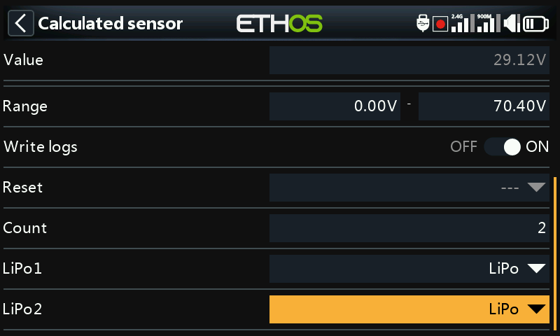

##### LiPo1, LiPo2, to LiPo ’n’

Select the lipo sensors in the correct order from low cell to high cell.

To avoid S.Port clashes, the additional lipo sensors must have both their Physical and Application IDs altered using the Lipo Voltage setup tool in the Device Config menu. It is also wise to discover them one at a time, and to change the sensor name so that you can tell them apart.

##### Percent sensor

The Percent calculated sensor allows sensor values to be converted to a percentage.

##### Value

Displays the current value of the selected sensor (see Source below).

##### Formula

Select the Percent formula.

##### Name

The sensor name, which may be edited.

##### Unit

The units are fixed as ‘%’.

##### Decimals

The display may have between 0 and 4 decimals.

##### Range

The range may be from 0% up to 100%.

##### Write logs

Logs will be written to the SD card or eMMC in the Logs folder if enabled.

##### Reset

A source can be configured to reset the sensor.

##### Sensor

After discovering sensors, select the sensor to be converted to a percentage.

Invert

Allows the source to be inverted, to show for example remaining percentage.

##### Power sensor

The Power calculated sensor allows power to be calculated from a voltage and a current source.

##### Value

Displays the current Wattage calculation of the selected sensors (see Current and Voltage below).

##### Formula

Select the Power formula.

##### Name

The sensor name, which may be edited.

##### Unit

The units may be mW or ‘W’.

##### Decimals

The display may have between 0 and 4 decimals.

##### Range

The range may be from 0 up to a 1000000W.

##### Write logs

Logs will be written to the SD card or eMMC in the Logs folder if enabled.

##### Reset

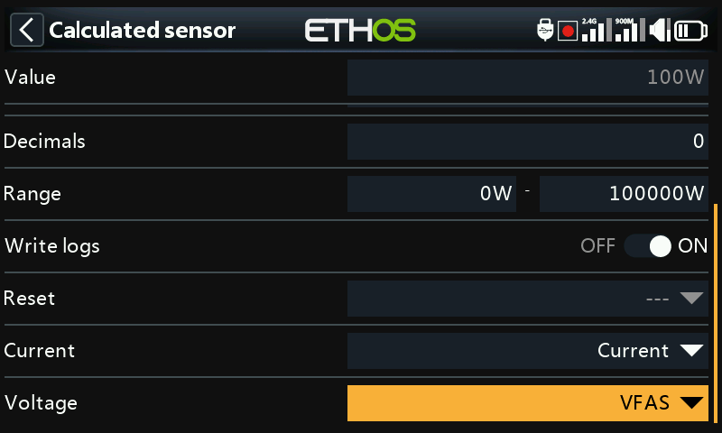

Allows the sensor to be reset.

##### Current

After discovering sensors, select the sensor to be used for the current.

##### Voltage

After discovering sensors, select the sensor to be used for the voltage.

##### ***Custom*** Sensor

The Custom calculated sensor allows a user defined sensor to be calculated from multiple sources.

##### Value

Displays the current calculated value of the custom sensor.

##### Formula

Select the Custom formula.

##### Name

The sensor name, which may be edited.

##### Unit

The units are selectable between ‘mV’, ‘V’, ‘mA’, ‘A’, ‘mAh’, ‘Ah, ‘mW’, ‘W’, ‘cm’, ‘m’, ‘km’ ‘ft’, ‘cm/s’, ‘m/s’, m/min’, ‘ft/s’, ‘ft/min’, ‘km/h’, ‘mph’, ‘knots’, ‘°C’, ‘°F’, ‘%’, ‘us’, ‘ms’, ‘s’, ‘m’, ‘h’, ‘dB’, ‘dBm’, ‘Hz’, ‘MHz’, ‘g’, ‘°’, ‘rad’, ‘ml’, ‘ml/m’, ‘ml/p’, ‘r/m’, ‘Pa’, ‘kPa’, ‘MPa’, ‘bar’, and ‘PSI’.

##### Decimals

The display may have between 0 and 4 decimals.

##### Range

The range may be from -1000000 up to a 1000000.

##### Write logs

Logs will be written to the SD card or eMMC in the Logs folder if enabled.

##### Reset

Allows the sensor to be reset.

##### Source

After discovering sensors, select the first sensor to be used for the calculation.

Then click on ‘Add’ to add more calculation lines may as needed.

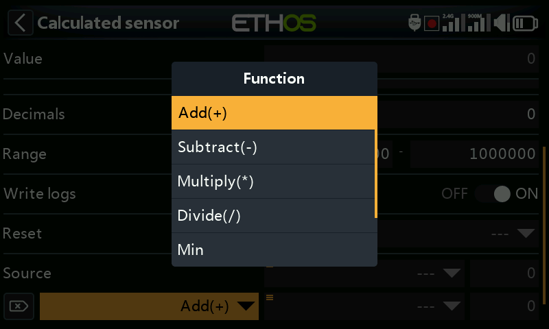

The following math operators are available:

- Add(+)
- Minus(-)
- Multiply(x)
- Divide (/)
- Min
- Max
- Sqrt (square root)

##### Examples

##### Power sensor

The custom sensor has been named MaxPower.

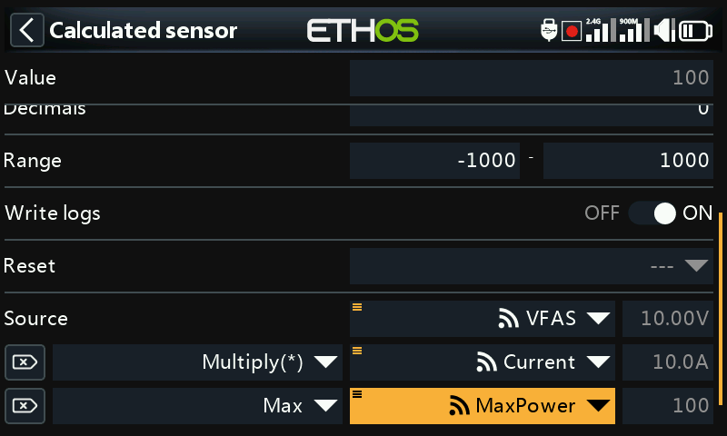

In the simple example above, a voltage sensor VFAS and a current sensor Current have been multiplied to calculate the power. Then a Max function has been added by referencing the current value of our custom sensor ‘MaxPower’ to calculate the maximum value. The Value field shows 288W which was the maximum reached during the test.

##### Arithmetic with a constant

The custom sensor has been named SubtrExample.

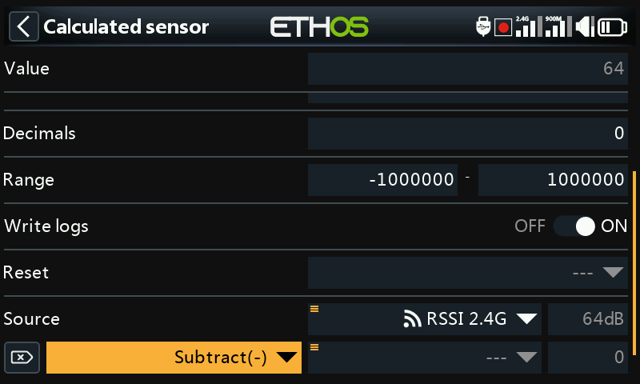

The source has been set to ‘RSSI 2.4G’. Note that the RSSI value is 64dB.

Then add an action, and select ‘Subtract’.

Scroll to the source for this action line, and long press Enter, then select ‘Convert to value’.

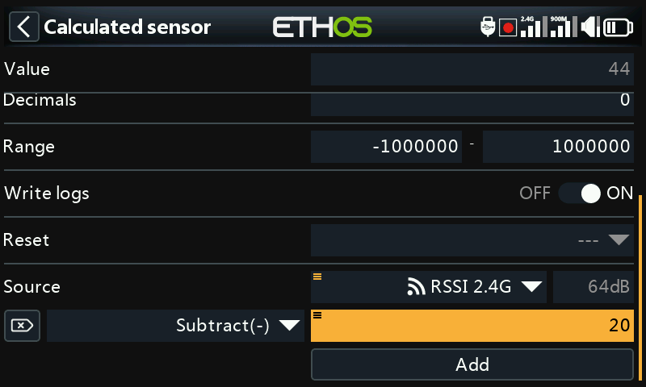

You can now edit the value (which is now a constant) to be used in the Subtract function.

The Value now shows 44dB, the result of subtracting 20 from the original source value of 64dB.

##### Internal calculation value of a source

This example is simply to show the internal calculation value of a source. We will use a custom calculated sensor with the source set to Throttle. With the throttle at 100%, we can see that the internal value is +1024.

With the throttle at -100%, we can see that the internal value is at -1024. So the internal value of a source is between +/-1024 when the source is +/-100%.

### Settings tab

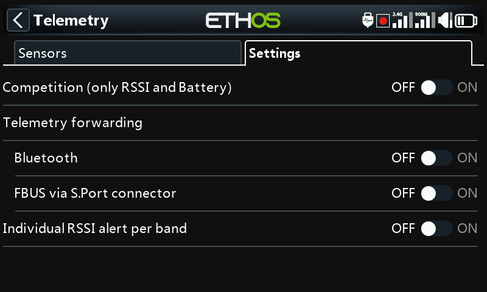

The settings tab is used for enabling ‘competition only’ mode, configuring telemetry forwarding and for enabling an ‘Individual RSSI alert per band’ for TD and TW receivers.

#### Competition (only RSSI and battery)

Ethos has a competition mode that allows you to disable telemetry for some local contests that allow telemetry sensors to be installed if they are disabled. They allow link status type sensor data like RSSI and Rx battery.

Turning this mode on will delete all sensors except RSSI and RxBatt. The radio must be power cycled before sensors can be rediscovered with this setting in the off position.

#### Telemetry forwarding

Telemetry may be forwarded via Bluetooth or with the FBUS protocol via the S.Port connector.

##### Bluetooth

In Bluetooth telemetry mode the radio can work with a the FrSky FreeLink app to display telemetry data on your mobile phone. The Freelink app can also be used to configure FrSky devices like the stabilized receivers.

##### FBUS via S.Port connector

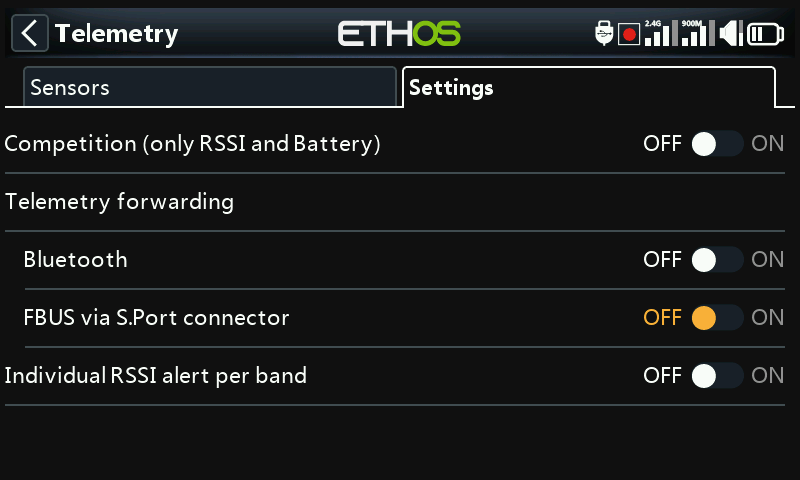

Telemetry may also be forwarded in FBUS format via the S.Port connector on top of the radio.

#### Individual RSSI alert per band

When using TD or TW protocols, there is an option to receive Individual RSSI voice alerts per band. Please refer to the [RSSI](../model-setup/telemetry.md) section above.
