# Timers

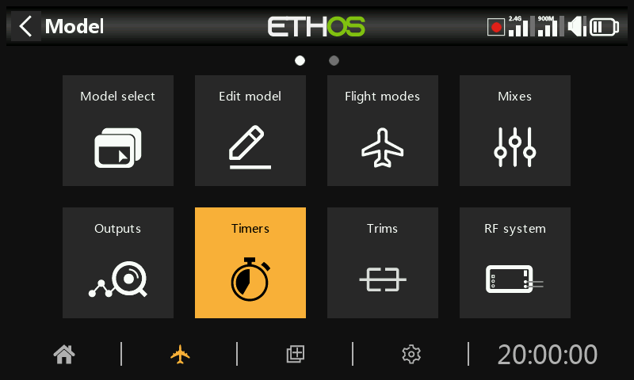

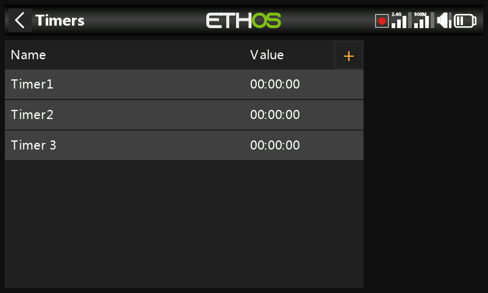

There are 8 fully programmable timers that can count either up or down.

In the main timers screen (see above) new timers may be added by tapping on the ‘+’ symbol next to the column headings, or selecting ‘Add’ in the options below.

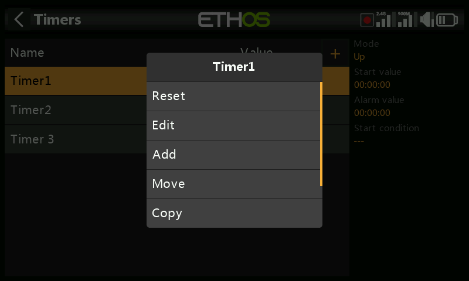

Touching any timer line brings up a popup with options to reset or edit that timer, add a new timer, or to move or copy/paste the timer.

## Countdown timer

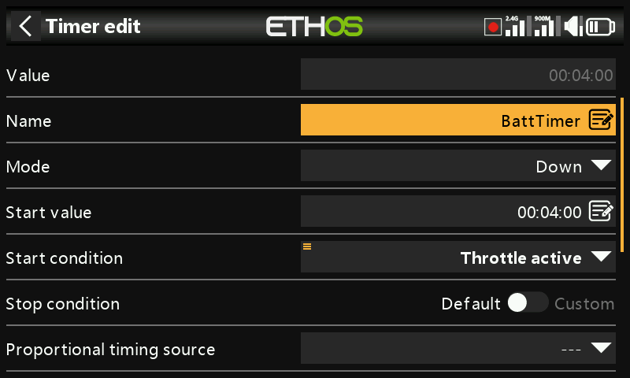

Value

Shows the current value of the timer.

Name

Allows the timer to be named.

Mode

The timer can count Up or **Down**.

Start value

If the timer has been set to count Down, the start value is the value from which the timer counts down to zero.

Start condition

The start condition starts the timer. If the stop condition below is at the default setting, then the timer starts and stops with just the start condition. If the stop condition below is not ‘default’, then the timer starts when the start condition first becomes True, and then continues running.

Stop condition

If the stop condition is ‘default’, the timer is only controlled by the start condition.

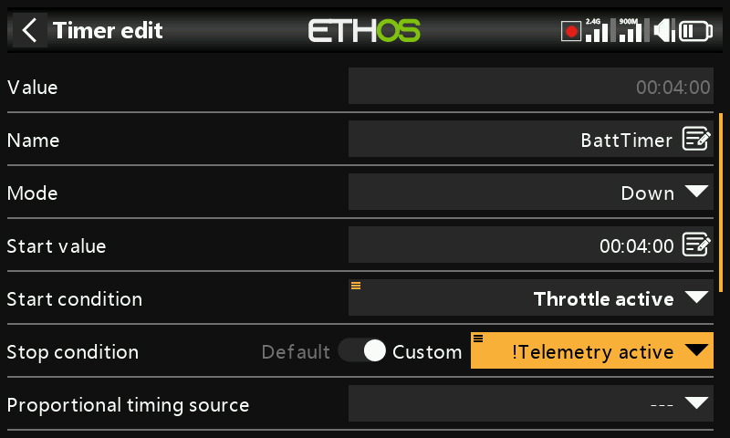

If it is not ‘default’, once the timer is running, the stop condition controls the timer. The timer stops running while the stop condition is True, but continues running while the stop condition is False.

In the example above, the timer is started when ThrottleActive becomes True, and is stopped when telemetry is no longer active.

Proportional timing source

If set to ‘---’ the timer counts in real time. If a proportional timing source is selected, then the speed of the timer is controlled by this source, for example the throttle stick or even the throttle channel. When the throttle value is -100%, the timer is stopped. When the throttle value is +100%, the timer is counts in real time. With intermediate throttle values, the timer counts proportionally.

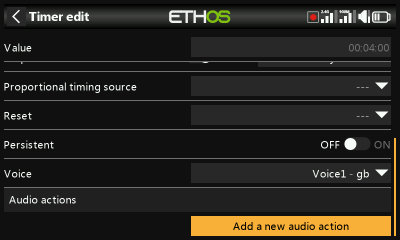

Reset

The timer can be reset by switch positions, function switches, logic switches or trim switch positions. Note that the timer will be held in reset while the reset condition is valid.

Persistent

Turning Persistent to On allows storing the timer value in memory when the radio is powered off or the model is changed. The value will be reloaded next time the model is used.

Voice

Select the Voice to be used for speech announcements. Refer to the [Choice of Voices](../system-setup/general.md) section for more details.

Audio actions

Audio actions are very powerful and flexible, allowing the timer alerts to be configured exactly to the user’s requirements.

Click on ‘Add a new audio action’.

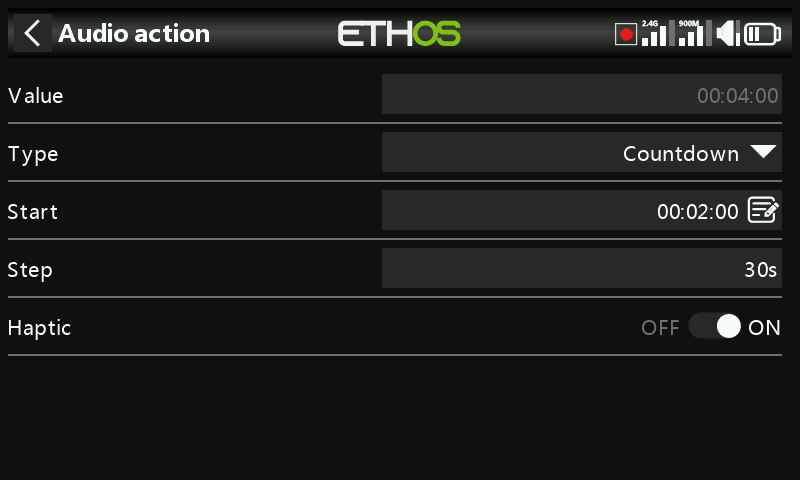

Select the type of audio action required, i.e. ‘Countdown’ in the example above.

Start

The start value is the value from which this countdown action starts.

Step

The step value sets the intervals at which the timer value will be announced. The step value can be up to 10 minutes (600 seconds).

Haptic

If enabled haptic feedback will accompany the announcements.

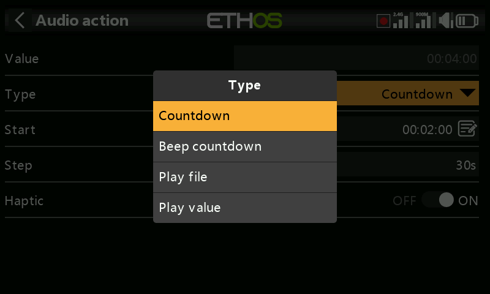

Audio action types include ‘Countdown’ (by voice), ‘Beep countdown’ (with beeps instead of voice), ‘Play file’ and ‘Play value’.

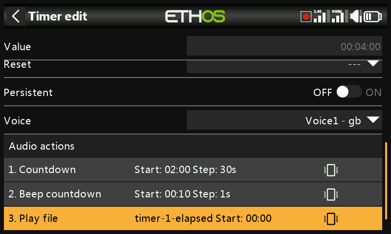

In this example above three audio actions have been configured:

1. Firstly a countdown alert starting at 2 minutes remaining will be given every 30 seconds. The alert will be speech and haptic feedback has also been enabled.
2. Secondly a countdown alert starting at 10 seconds remaining, after which a beep will be played every second. Haptic feedback has also been enabled.
3. Lastly a custom audio file ‘timer-1-elapsed’ will be played when the timer elapses (i.e reaches zero), accompanied by haptic feedback.

Further audio actions can be added by touching the ‘Add’ button. Please note that the list should be in priority order, with the highest priority at the end of the list.

## Count up timer

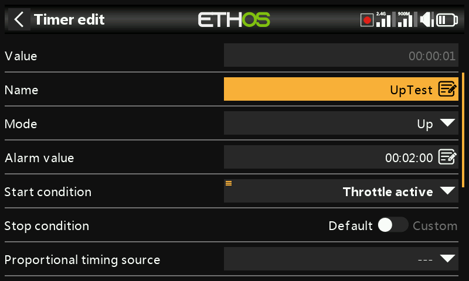

Value

Shows the current value of the timer.

Name

Allows the timer to be named.

Mode

The timer can count **Up** or Down.

***Alarm*** Value

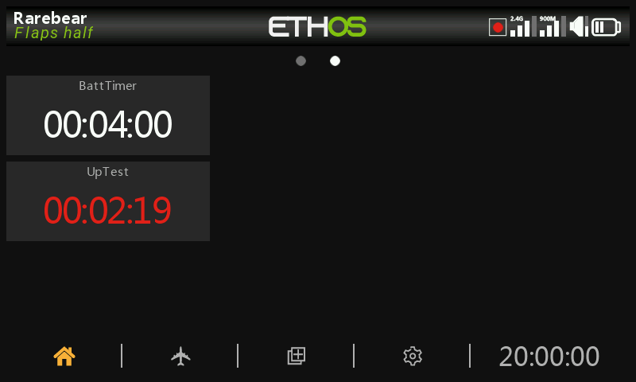

If the timer has been set to count Up, the alarm value parameter sets the value at which the timer elapses. The timer continues to count, but the value goes red in the timer widgets.

***S******tart condition***

The start condition starts the timer. If the stop condition below is at the default setting, then the timer starts and stops with just the start condition. If the stop condition below is not ‘default’, then the timer starts when the start condition first becomes True, and then continues running.

***S******top condition***

If the stop condition is ‘default’, the timer is only controlled by the start condition.

If it is not ‘default’, once the timer is running, the stop condition controls the timer. The timer stops running while the stop condition is True, but continues running while the stop condition is False.

Proportional timing source

If set to ‘---’ the timer counts in real time. If a proportional timing source is selected, then the speed of the timer is controlled by this source, for example the throttle stick or even the throttle channel. When the throttle value is -100%, the timer is stopped. When the throttle value is +100%, the timer is counts in real time. With intermediate throttle values, the timer counts proportionally.

Reset

The timer can be reset by switch positions, function switches, logic switches or trim switch positions. Note that the timer will be held in reset while the reset condition is valid.

Persistent

Turning Persistent to On allows storing the timer value in memory when the radio is powered off or the model is changed. The value will be reloaded next time the model is used.

Voice

Select the Voice to be used for speech announcements. Refer to the [Choice of Voices](../system-setup/general.md) section for more details.

Audio actions

Audio actions are very powerful and flexible, allowing the timer alerts to be configured exactly to the user’s requirements.

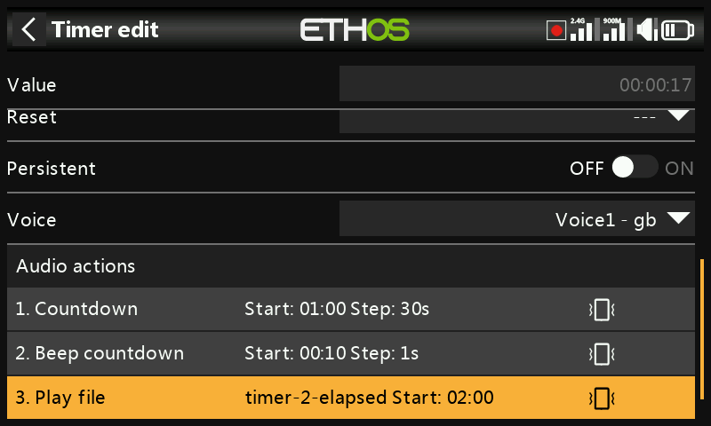

In this example three audio actions have been configured:

1. Firstly a countdown to the alarm value starting at 2 minutes remaining will be given every 30 seconds. The alert will be speech and haptic feedback has also been enabled.
2. Secondly a countdown starting at 10 seconds remaining, after which a beep will be played every second. Haptic feedback has also been enabled.
3. Lastly a custom audio file ‘timer-2-elapsed’ will be played when the timer elapses by reaching the alarm value, accompanied by haptic feedback.

Further audio actions can be added by touching the ‘Add’ button. Please note that the list should be in priority order, with the highest priority at the end of the list.
