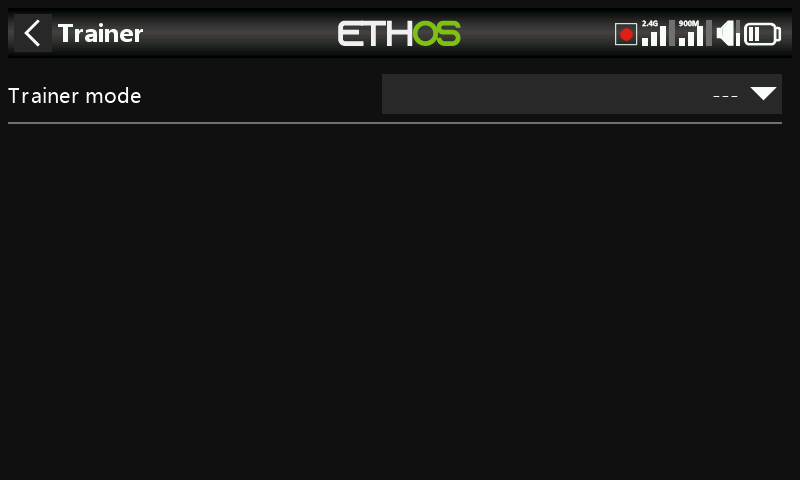
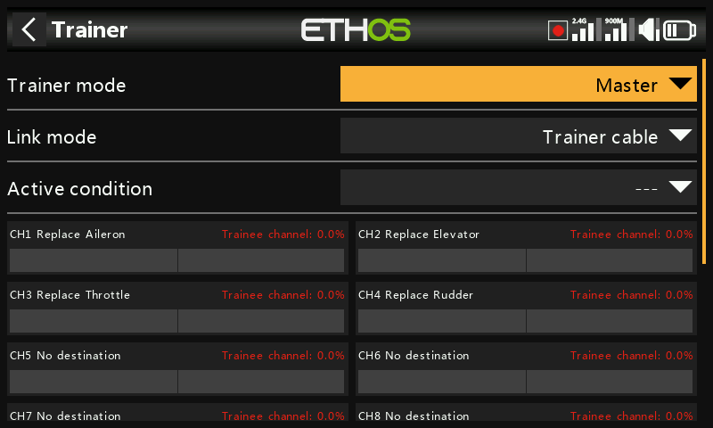
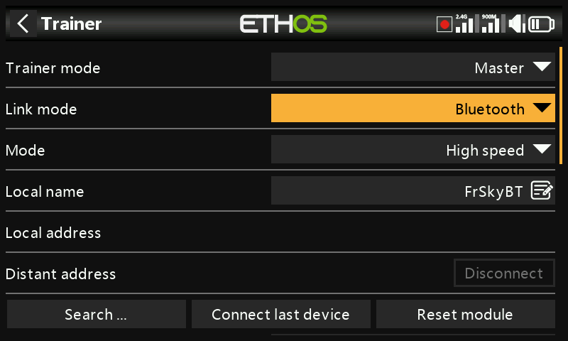

# Trainer

Configures the model as a trainer master (handing selected channels to a
student radio) or slave, including wireless (Bluetooth) trainer links in
addition to the traditional trainer cable.

See also [How-To: nothing yet](../how-to/index.md) — a take-back/failsafe
walkthrough using the `trainer-take-back` example is planned.

!!! note "Draft"
    This page is a placeholder — full content coming in a later pass.
