# Trainer

The Trainer function is off by default.

The Trainer function can be configured as master or slave. In master mode, up to 16 controls may be transferred from the student radio to the master radio when the 'Active condition' set above is active. In slave mode a configurable number of channels are transferred to the master.

## Trainer mode = Master

With Trainer mode set to Master, the radio can be configured for the tutor.

Link mode

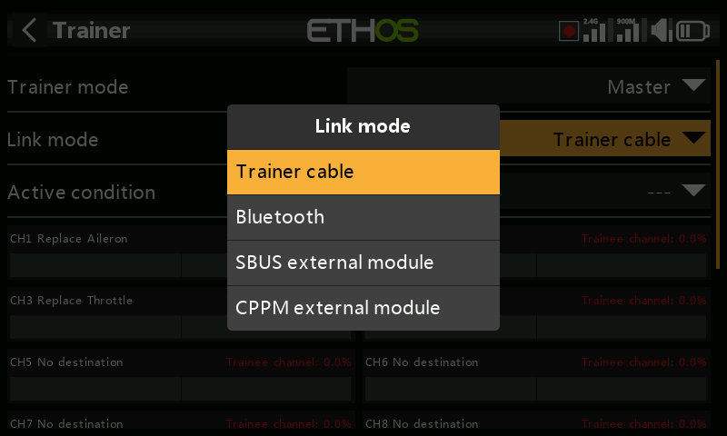

The trainer link can be either via trainer cable, Bluetooth, or SBUS or CPPM external module.

Trainer cable

The trainer link can be via a cable, which should be a 3.5mm mono audio lead.

Bluetooth

##### Mode

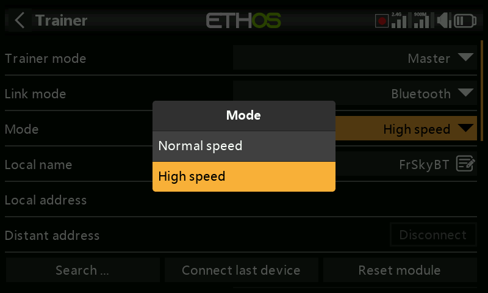

Allows selection between normal speed and high speed for the Bluetooth link. For lower latency the high speed setting should be used if both radios support it.

##### Local name

This is the local BT name that will be displayed in devices being connected. The default name is FrSkyBT, but may be edited here.

##### Local address

This is the local Bluetooth address of the radio.

##### Distant address

Once a Bluetooth device has been found and linked, the remote device's Bluetooth address is displayed here.

##### Search devices

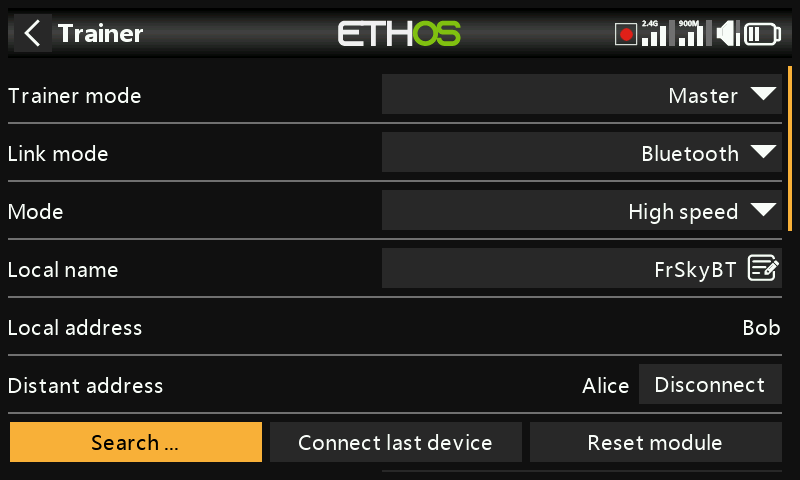

The Search Devices button will be available if the Trainer Mode is Master.

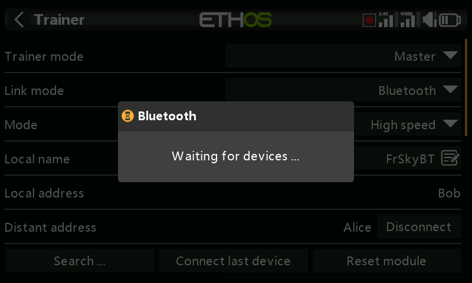

Tap on 'Search devices' to put the radio into BT search mode.

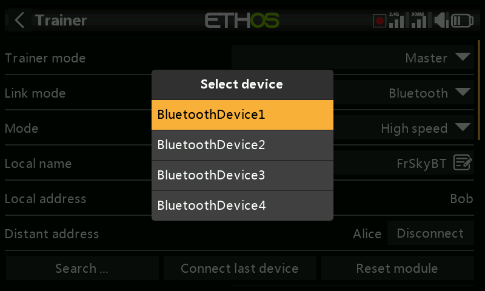

Found devices are listed in a popup dialog with a request to select a device. Select the BT address that matches the radio to be used as training mate.

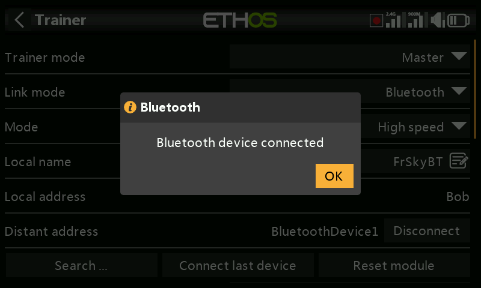

The selected BT device has been connected.

##### Connect Last Device

Will connect to the last configured device.

##### Reset Module

Will reset the module and clear the configuration settings.

SBUS external module.

This option provides an SBUS input on on the PXX IN pin in the external module bay. This allows installation of an FrSky receiver with SBUS output (i.e Archer RS or similar) in the module bay to act as the receiving end of a wireless trainer link to connect ANY FrSky radio to X20 as a buddy box.

The slave or student radio is then bound to this receiver, and transmits as normal. While the master trainer function is active, the received channels are allowed to control the model.

##### External module pinout diagram

CPPM external module

Similarly, the CPPM option provides a PPM input on the PXX IN pin in the external module bay, to be used with a legacy receiver having a CPPM output in a similar fashion to the SBUS option above.

Active condition

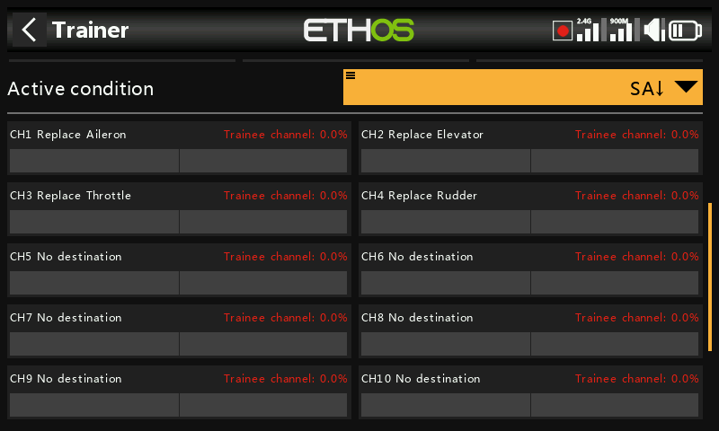

Control of the model can be transferred to the student radio by a switch or button, a function switch, logic switch, trim position, or flight mode.

Trainer channels

Up to 16 controls may be transferred from the student radio to the master radio when the 'Active condition' set above is active.

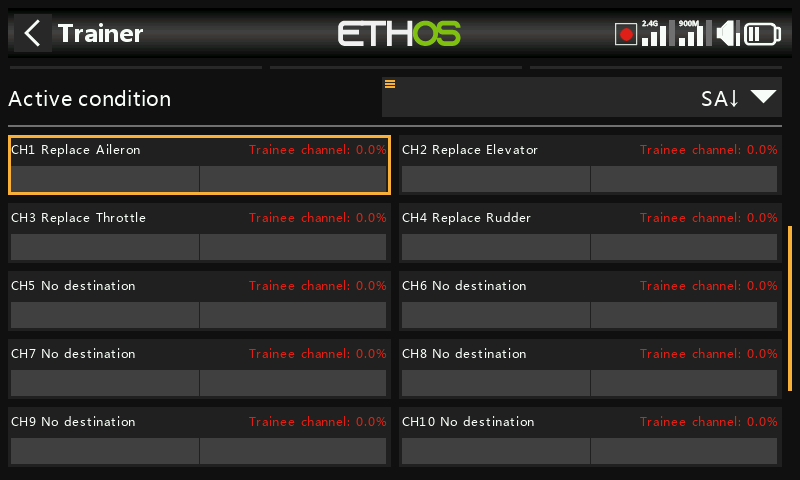

Tap on each channel to configure it individually:

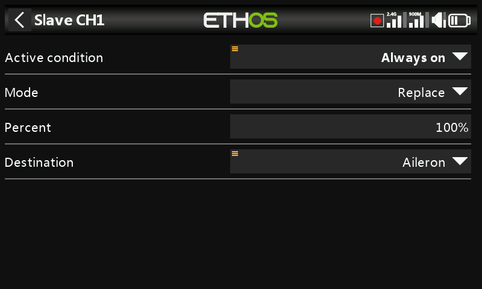

Active condition

Each individual slave channel can also be controlled by the selected source. So for example the student’s elevator input can be disabled during a session.

Mode

##### OFF

Disables the channel for trainer use.

##### Add

Selects additive mode, where both master and slave signals are added so both teacher and student can act upon the function.

##### Replace

Replaces the master radio's control with the student's, so the student has full control while the 'Active condition' is active. This is the normal mode of use.

Percent

Normally set to 100%, but can be used to scale the Slave input.

Destination

Maps the slave radio's channel to the corresponding function.

Option to Ignore Trainer Input

In logic switches the sources may have this option set to ignore sources coming from the trainer input. A typical application is where a logic switch is configured to detect movement of the master trainer’s sticks (e.g. Elevator stick) to allow for instant intervention if things go wrong. This option is needed to prevent the student stick inputs from triggering the logic switch.

## Trainer Mode = Slave

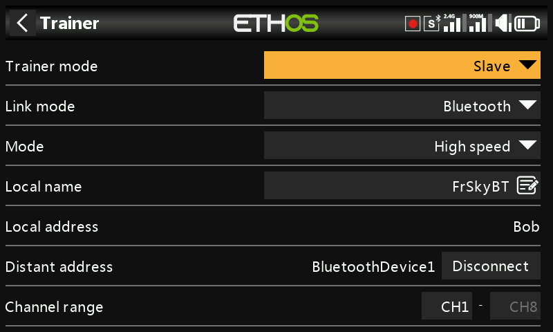

Link Mode

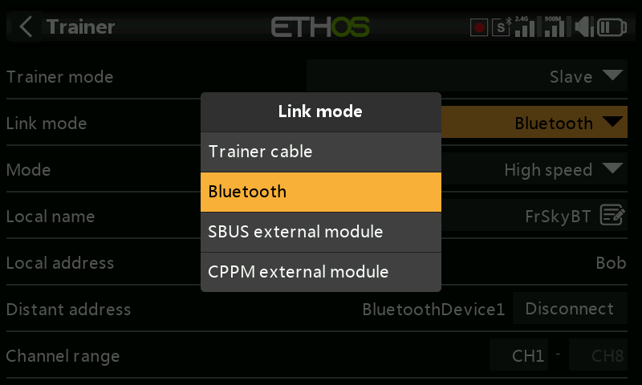

The trainer link can be either via trainer cable, Bluetooth, or SBUS or CPPM external module. The trainer cable should be a 3.5mm mono audio lead.

Bluetooth

##### Mode

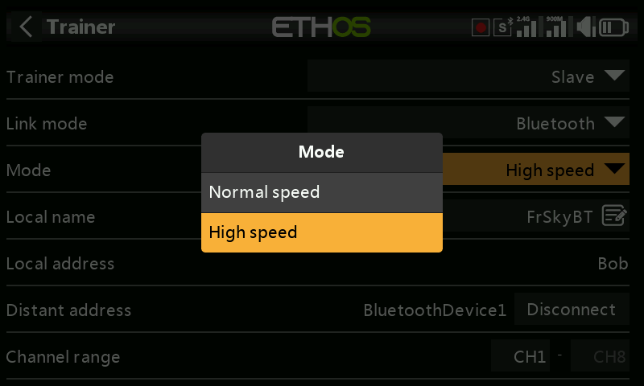

Allows selection between normal speed and high speed for the Bluetooth link. For lower latency the high speed setting should be used if both radios support it.

##### Local Name

This is the local BT name that will be displayed in devices being connected. The default name is FrSkyBT, but may be edited here.

##### Local Address

This is the local Bluetooth address of the radio.

##### Dist Address

Once a Bluetooth device has been found and linked, the remote device's Bluetooth address is displayed here.

Channel Range

Selects which channel range is transferred to the master radio.
