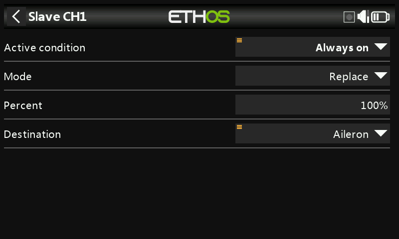

# Trainer

Off by default. Set the radio as **Master** (the instructor's radio,
receiving up to 16 controls from the student) or **Slave** (the student's
radio, sending a configurable number of channels to the instructor).

## Master mode

### Link mode

- **Trainer cable** — a 3.5mm mono audio lead between the two radios.
- **Bluetooth** —

  

  - **Mode** — normal or high speed; use high speed for lower latency if
    both radios support it.

    

  - **Local name** — the BT name shown to other devices (default
    `FrSkyBT`, editable).
  - **Local address** — this radio's Bluetooth address.
  - **Distant address** — the paired radio's address, once linked.
  - **Search devices** (Master mode only) — scans for nearby devices:

    
    
    
    

  - **Connect Last Device** / **Reset Module** — reconnect to the
    previous pairing, or wipe the Bluetooth module's configuration
    entirely.

- **SBUS external module** — an SBUS input on the PXX-IN pin of the
  external module bay, for fitting an SBUS-output FrSky receiver (e.g.
  Archer RS) as the receiving end of a wireless link — letting **any**
  FrSky radio act as the student (buddy box) side, bound to that
  receiver.
- **CPPM external module** — the same idea via a CPPM input, for a legacy
  receiver with CPPM output.

### Active condition

A switch/button, function switch, logical switch, trim position, or
flight mode that hands control to the student while active.

### Trainer channels

Up to 16 channels can transfer from student to master while Active
condition is true. Tap a channel to configure it individually:

- **Active condition** — a per-channel override, e.g. to disable just the
  student's elevator input for part of a session.
- **Mode** — **OFF** (disabled for trainer use), **Add** (master and
  student signals sum together, so both can act on the control at once),
  or **Replace** (the normal mode — student has full control of this
  channel while active).
- **Percent** — scales the student's input, normally 100%.
- **Destination** — which function the student's channel maps to.

See [How-To: Instant Take-Back](../how-to/instant-takeback.md) for a
worked example of an instructor reclaiming control instantly via a
switch, and [Ignore trainer
input](../getting-started/user-interface-and-navigation.md#choosing-a-source)
for excluding the student's stick movement from a logical switch that's
watching the instructor's own sticks.

## Slave mode

- **Link Mode** — the same choice of trainer cable, Bluetooth, or
  SBUS/CPPM external module as Master (same Bluetooth **Mode**/**Local
  Name**/**Local Address**/**Dist Address** fields).

  

- **Channel Range** — which range of this radio's channels is sent to the
  master.

  
  
