# Trainer

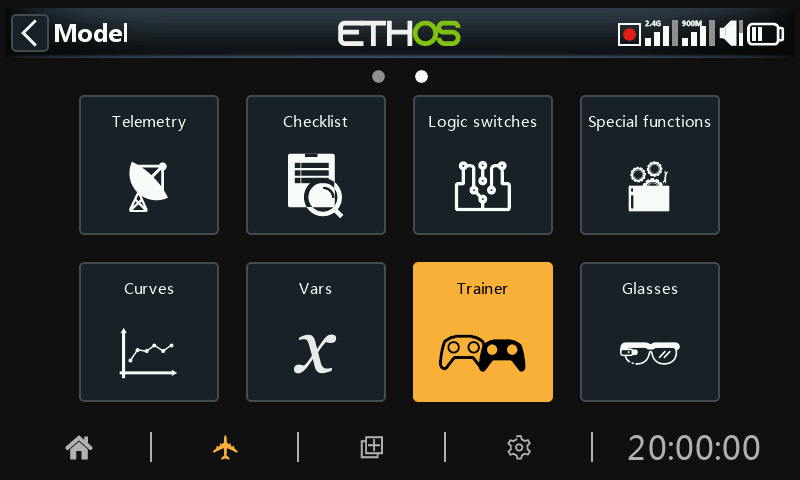

The Trainer function can be configured as master or slave. In master mode, up to 16 controls may be transferred from the slave or student radio to the master or tutor radio when the 'Active condition' is active. In slave mode a configurable number of channels are transferred to the master.

There are 5 methods for configuring trainer links, which can be used simultaneously in any direction using:

- Trainer cable
    - Bluetooth
    - SBUS on the external module connector 
    - PPM on the external module connector (this one cannot be used at the same time as SBUS on external module)
    - SBUS on the radio’s S.Port connector

The above can also be used for other applications like a head tracker module sending signals which the radio uses to control an FPV camera view.

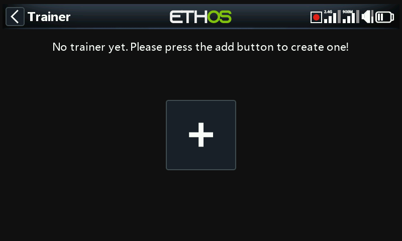

There are no default trainer links. Tap on the ‘+’ button to add a new trainer link.

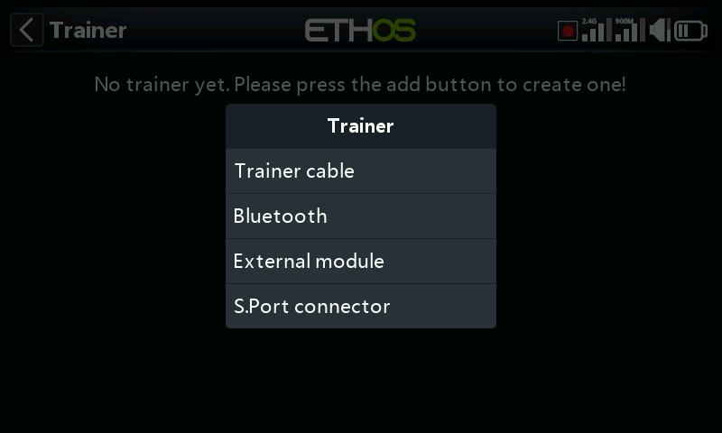

Choose the connection method from the four options listed.

## Trainer cable

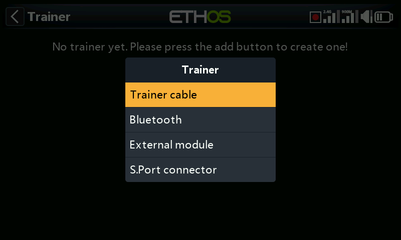

Tap on the ‘Trainer cable’ option to configure a trainer link using a physical cable, which should be a 3.5mm mono audio lead.

### State

The trainer cable function may be disabled. This allows the user to enable only one trainer tab at a time, while preserving the different configurations.

### Trainer mode

#### Slave

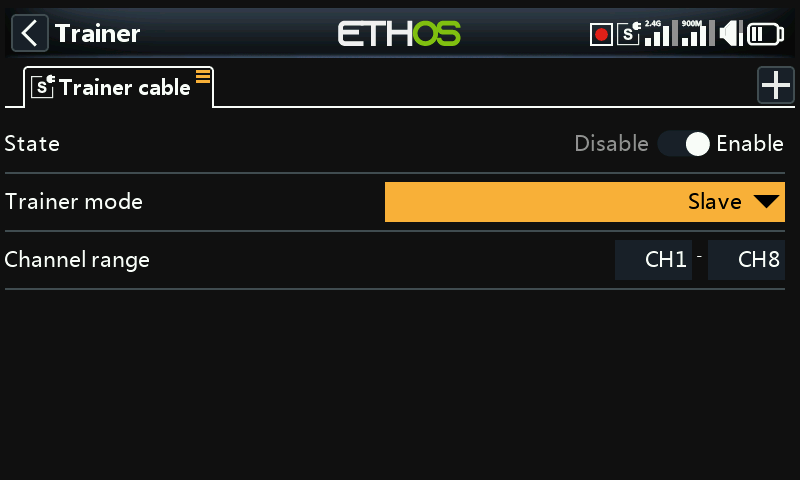

The default mode for a trainer cable is Slave.

##### Channel range

Eight channels are transmitted, with the starting channel number configurable.

#### Master

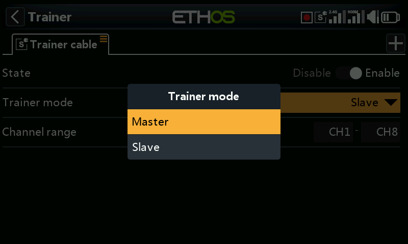

The trainer cable mode may be changed to Master to configure the radio for the tutor.

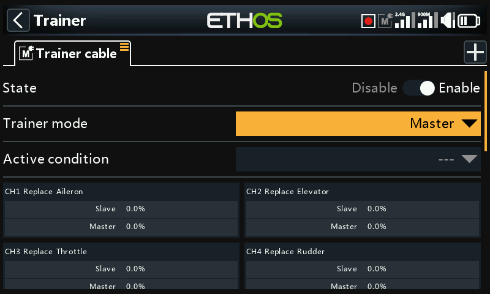

##### Trainer master configuration

Please refer to the [Trainer master configuration](trainer.md) section below for details on configuring the Trainer master mode ‘Active condition’ and slave channels.

#### Trainer cable options

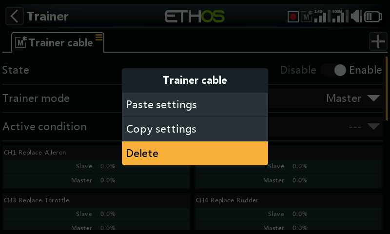

Tapping on the ‘Trainer cable’ tab brings up the tab options.

If a trainer cable master has been configured, then the copy followed by the paste options become available. This allows the trainer master settings to be copied and pasted between the trainer methods.

Finally a delete option is available to delete the trainer cable configuration tab.

## Bluetooth

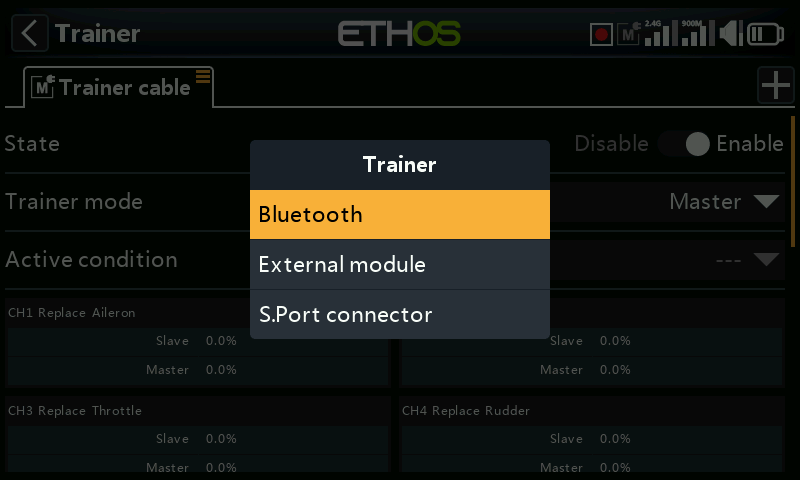

Select the ‘Bluetooth’ option to configure a trainer link using Bluetooth.

### State

The Bluetooth trainer function may be disabled. This allows the user to enable only one trainer tab at a time, while preserving the different configurations.

### Trainer mode

#### Slave

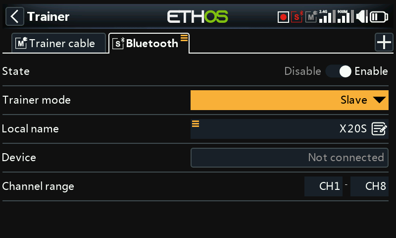

The default trainer mode for Bluetooth is Slave.

##### Local name

##### Local address

This is the local Bluetooth address of the radio.

This is the local BT name that will be displayed in devices being connected. The default name is the radio model, but may be edited here.

##### Device

Details of the Bluetooth connection.

##### Channel range

By default the first eight channels are transmitted, but this is configurable.

#### Master

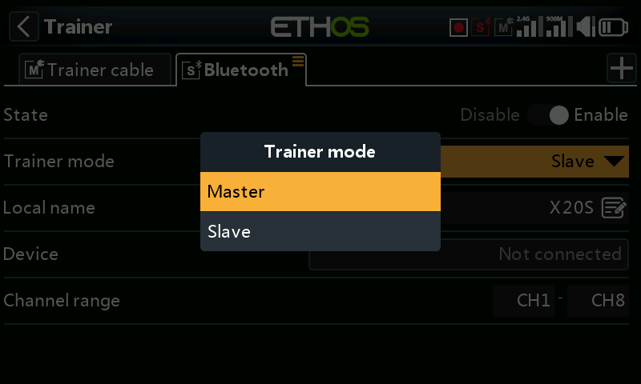

The Bluetooth trainer mode may be changed to Master to configure the radio for the tutor.

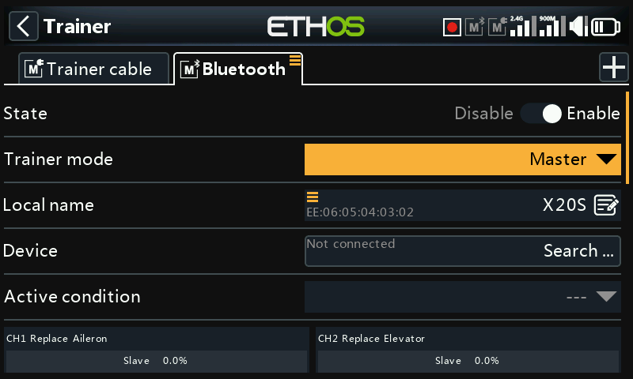

##### Local name

##### Local address

This is the local Bluetooth address of the radio.

This is the local BT name that will be displayed in devices being connected. The default name is the radio model, but may be edited here.

##### Device

##### Search

Tap on 'Search devices' to put the radio into BT search mode.

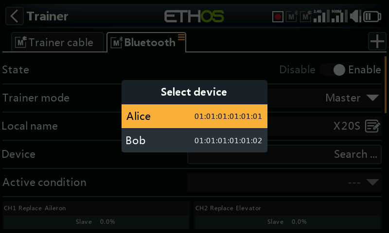

Found devices are listed in a popup dialog with a request to select a device. Select the BT address that matches the radio to be used as training mate.

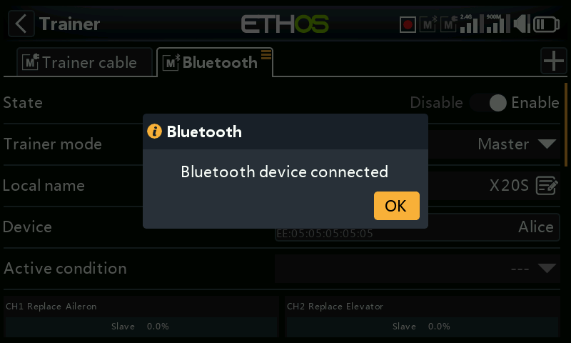

The selected BT device has been connected.

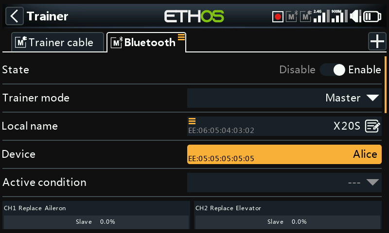

Once a Bluetooth device has been found and linked, the remote device's Bluetooth address is displayed on the Device line.

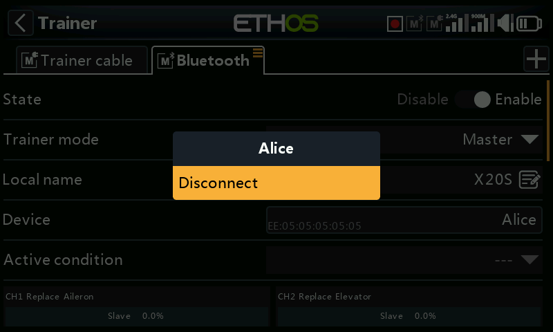

##### Disconnect

Tap on the Device to bring up a Disconnect option.

#### Trainer master configuration

##### Active condition

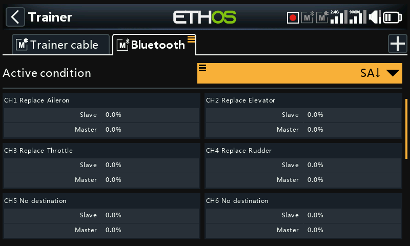

Control of the model can be transferred to the student radio by a switch or button, a function switch, logic switch, trim position, or flight mode.

##### Trainer channels

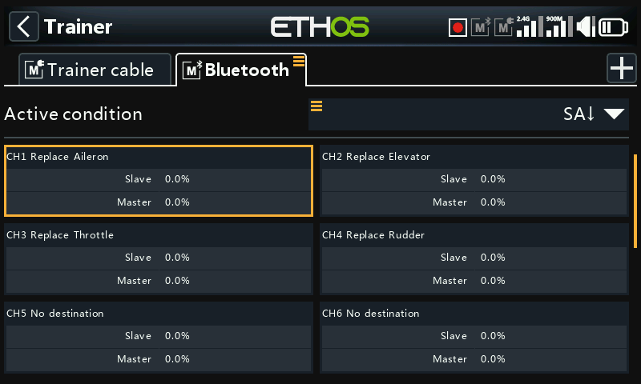

Up to 16 controls may be transferred from the student radio to the master radio when the 'Active condition' set above is active.

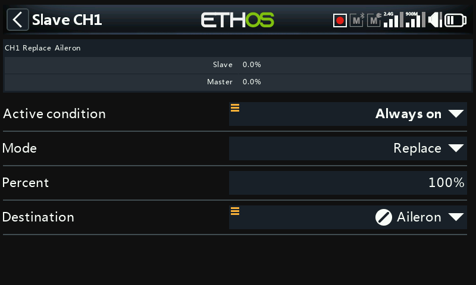

Tap on each channel to configure it individually.

##### Active condition

Each individual slave channel can also be controlled by the selected source. So for example the student’s elevator input can be disabled during a session.

##### Mode

##### OFF

Disables the channel for trainer use.

##### Add

Selects additive mode, where both master and slave signals are added so both teacher and student can act upon the function.

##### Replace

Replaces the master radio's control with the student's, so the student has full control while the 'Active condition' is active. This is the normal mode of use.

##### Percent

Normally set to 100%, but can be used to scale the Slave input.

##### Destination

Maps the slave radio's channel to the corresponding function.

### Option to Ignore Trainer Input

In logic switches the sources may have this option set to ignore sources coming from the trainer input. A typical application is where a logic switch is configured to detect movement of the master trainer’s sticks (e.g. Aileron stick) to allow for instant intervention if things go wrong. This option is needed to prevent the student stick inputs from triggering the logic switch.

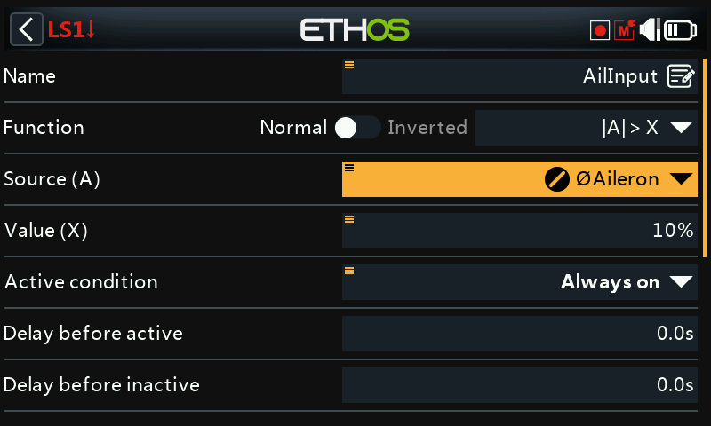

The little ‘crossed-out circle’ icon shows that the Aileron source will ignore Aileron inputs from the student radio.

### Bluetooth trainer options

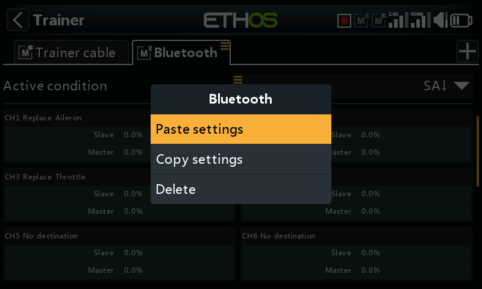

Tapping on the ‘Bluetooth’ tab brings up the Bluetooth tab options.

If a Bluetooth master has been configured, then the copy followed by the paste options become available. This allows the trainer master settings to be copied and pasted between the trainer methods.

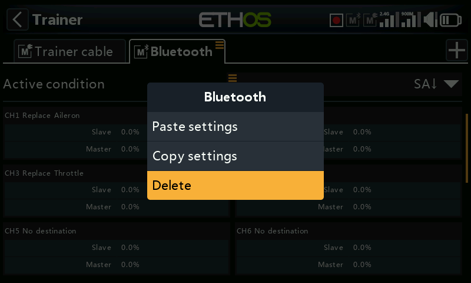

Finally a delete option is available to delete the Bluetooth configuration tab.

## External module

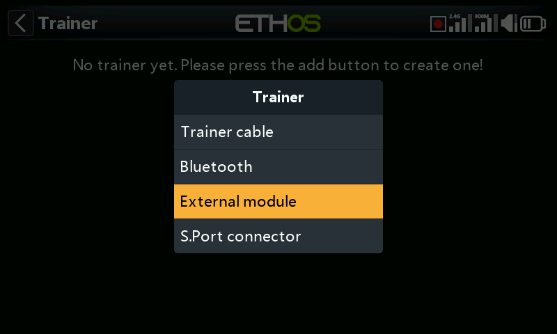

Select the ‘External module’ option to configure a trainer link using an external module.

### State

The external module trainer function may be disabled. This allows the user to enable only one trainer tab at a time, while preserving the different configurations.

### Trainer mode

#### Slave

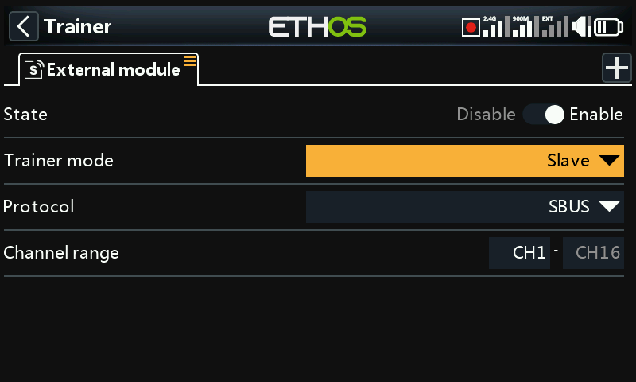

The default trainer mode for an external module is Slave.

##### Protocol

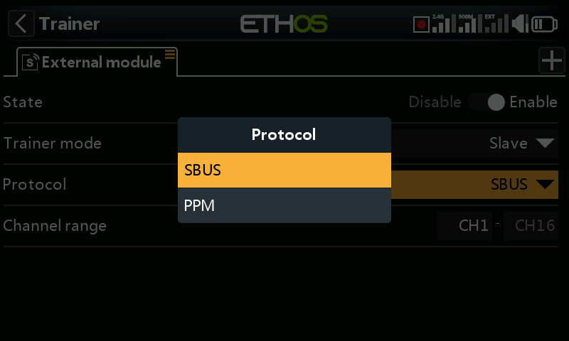

There are 2 protocol options for a for slave trainer link using the external module interface on the back of the radio:

##### SBUS

Please refer to the [SBUS](rf-system.md) section in Model /RF for details on configuring the external module interface for an SBUS trainer connection.

##### PPM\`

Please refer to the [PPM](rf-system.md) section in Model /RF for details on configuring the external module interface for a PPM trainer connection.

##### Channel range

With SBUS 16 channels are transmitted. With PPM eight channels are transmitted, but the starting channel number is configurable.

#### Master

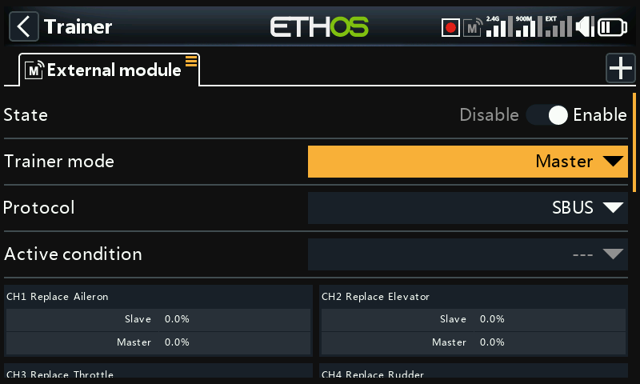

##### Protocol

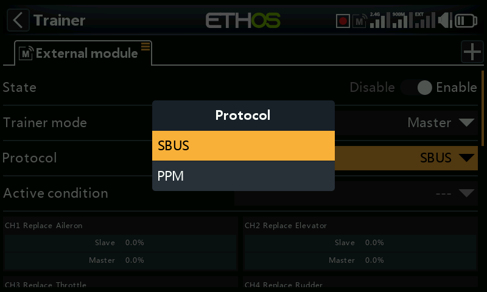

There are 2 protocol options for a for master trainer link using the external module interface on the back of the radio:

##### Trainer master (SBUS)

Please refer to the [Trainer master (SBUS)](rf-system.md) section in Model /RF for details on configuring the external module interface for an SBUS trainer connection.

##### Trainer master (PPM)

Please refer to the [Trainer master (PPM)](rf-system.md) section in Model /RF for details on configuring the external module interface for a PPM trainer connection.

##### Trainer master configuration

Please refer to the [Trainer master configuration](trainer.md) section below for details on configuring the Trainer master mode ‘Active condition’ and slave channels.

#### Trainer cable options

Tapping on the ‘S.Port connector’ tab brings up the tab options.

If a master trainer has been configured, then the copy followed by the paste options become available. This allows the trainer master settings to be copied and pasted between the trainer methods.

Finally a delete option is available to delete the external module configuration tab.

## S.Port connector

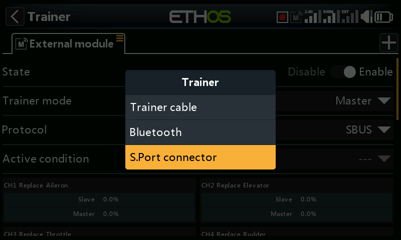

Select the ‘S.Port connector’ option to configure a trainer link using the S.Port connector at the top of the radio.

### State

The S.Port connector trainer function may be disabled. This allows the user to enable only one trainer tab at a time, while preserving the different configurations.

### Trainer mode

#### Slave

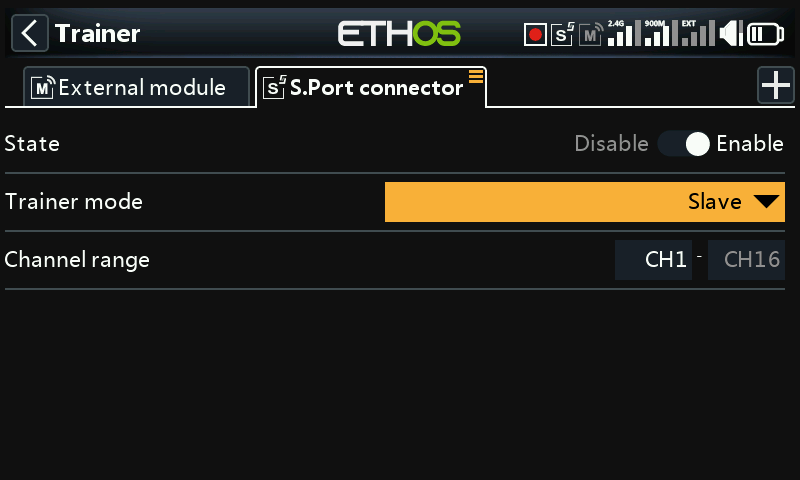

The default mode for an S.Port connector trainer is Slave.

##### Channel range

By default the first eight channels are transmitted, but this is configurable.

#### Master

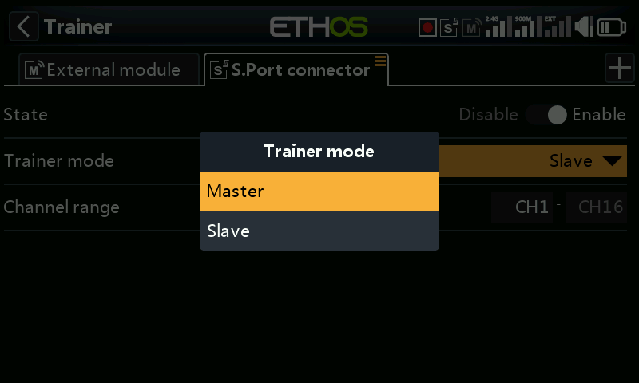

The S.Port connector trainer mode may be changed to Master to configure the radio for the tutor.

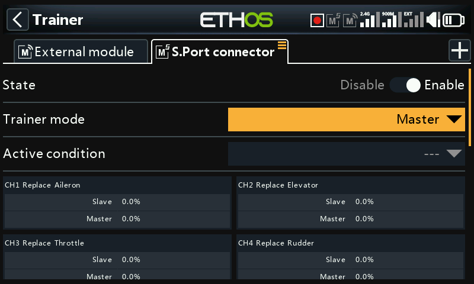

##### Trainer master configuration

Please refer to the [Trainer master configuration](trainer.md) section below for details on configuring the Trainer master mode ‘Active condition’ and slave channels.

#### Trainer cable options

Tapping on the ‘S.Port connector’ tab brings up the tab options.

If a master trainer has been configured, then the copy followed by the paste options become available. This allows the trainer master settings to be copied and pasted between the trainer methods.

Finally a delete option is available to delete the S.Port connector configuration tab.
