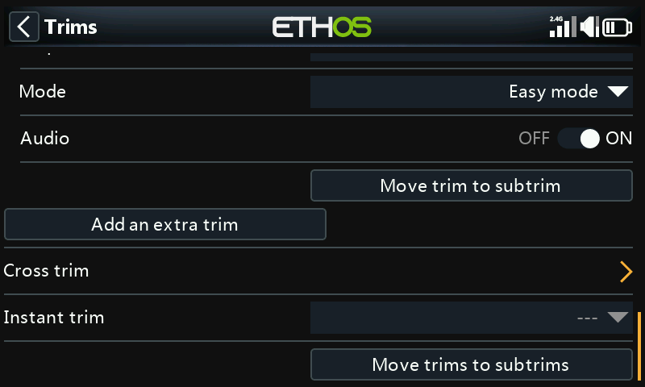

# Trims

Configures each stick's trim range, step size, and behavior, plus cross
trim and instant trim. The **X20 Pro/R/RS** and **X18** add two extra trim
switches, **T5**/**T6**, useful for in-flight adjustments beyond the four
main sticks:

Each stick has its own independent set of trim settings.

## Trim settings

- **Range** — default ±25%, adjustable up to the stick's full ±100%. On
  the main display, a default-range trim reads −100 to 100; a full-range
  (100%) trim reads −400 to 400 (4× the normal range).

  !!! warning
      Widening the range means holding a trim tab too long can add enough
      trim to make the model unflyable.

- **Step** — trim switch granularity: **Extra fine**, **Fine**,
  **Medium**, **Coarse**, **Exponential** (fine near center, coarse
  further out), or **Custom** (a specific percentage per click).

  

  | Step | µs per click (25% range) |
  |---|---|
  | Extra fine | 0.5 |
  | Fine | 1 |
  | Medium | 2 |
  | Coarse | 4 |
  | Exponential | 0.3–16 |

  Custom, at a 25% range: 1% step = 1µs/click, 100% step = 128µs/click.
  At a 100% range: 1% step = 5µs/click, 100% step = 512µs/click.

## Mode

By default a trim is always active, but **Mode** changes that behavior.
Changing modes resets the trim to 0.

- **OFF** — disables the trim entirely.

  

  Useful, for example, on an electric model with no need for throttle
  trim — the freed-up trim control can then be [repurposed to adjust a
  Var](variables.md).

- **Easy** — one shared trim value across every flight mode. The usual
  choice for aileron and rudder, since those rarely need to vary by
  flight mode.

  

- **Independent per flight mode** — the trim only affects the active
  flight mode. The usual choice for elevator trim, since elevator trim
  commonly needs to differ by flight mode (e.g. wing camber changes) —
  in fact, this is often the main reason to set up flight modes at all.

  

- **Custom** — full custom behavior, built from **behaviors** you add
  yourself.

### Custom trim behaviors

Each behavior row has a condition and one of:

- **Unplugged** — disables the trim selectively under this condition
  (rather than turning it off outright with Mode = OFF).

  
  

- **Normal** (default) — ordinary trim behavior.
- **Equal (to another trim)** — this trim tracks another condition's trim
  value exactly.

  

- **Offset + (another trim)** — this trim is added on top of another
  condition's trim value.

  

**Worked example** — a glider with a base **Cruise** elevator trim, and
dependent trims for **Speed** and **Thermal**:

1. Trim for level flight in the default mode (Cruise).
2. Add a behavior: **Offset + Default**, condition `FM5(Speed)`. Now any
   trim adjustment made in Speed mode is saved as an offset on top of the
   Cruise base value — separate, but still dependent on it.

   

3. Add a second behavior: **Offset + Default**, condition `FM4(Thermal)`,
   the same way. (Once the first behavior exists, the dialog also offers
   `Equal FM5(Speed)` and `Offset + FM5(Thermal)` as options, since it can
   now reference that behavior too.)

   

With this set up, adjusting the base Cruise trim later (say, after a C of
G change) shifts Speed's and Thermal's trims by the same amount
automatically, since they're offsets on top of it rather than independent
values.

- **Audio** — disable the standard trim announcement for a repurposed
  trim if it no longer makes sense to hear it.

## Additional trims

**Add an extra trim** creates a trim beyond the four standard sticks (and
T5/T6): **Name**, **Up**/**Down** sources to drive it, plus the same
**Range**, **Step**, **Mode**, and **Audio** options as above.

## Cross trim

Nominates which trim switch actually adjusts each stick — i.e. lets a
stick's trim be driven by a different physical trim control than usual.
(T5/T6 are available on the X20 Pro and X18 only.)

## Instant trim

While active, adds the current stick positions into the corresponding
default (and cross) trims. Best assigned to a switch reachable without
letting go of the sticks — trigger it while flying straight and level to
set trims instantly, instead of clicking a trim tab repeatedly when trims
are badly off. Disable it again after the trimming flight to avoid
accidentally disturbing trims later.

!!! note
    Instant trim is only active while viewing one of the main views.

## Move trims to subtrims

After trimming for level flight, moves a channel's trim value (e.g.
elevator) into its [Subtrim](outputs.md) setting and resets the on-screen
trim back to zero — a clean way to confirm flight trims haven't drifted
since.

With flight modes involved, a channel can have more than one relevant
trim value, while Subtrim in Outputs is a single global setting applying
to every flight mode. This function accounts for that: it takes the
**currently selected** flight mode's trim, moves it into Subtrim, resets
that trim, and adjusts every *other* flight mode's trim on the same
channel to compensate — so every flight mode's actual surface position
ends up unchanged overall.

!!! tip
    Always run this from the same "base" flight mode (e.g. Cruise on a
    glider) for consistency — it can be repeated safely as long as you do.

Large trim or subtrim values create very asymmetric throws — better to
fix the root cause mechanically. Aim for linkages at 90° when surfaces are
neutral (flaps being the exception, where you trade some up-travel for
more down-travel), then use **PWM center** to fine-tune to exactly 90°
once the linkage is close.
