# Trims

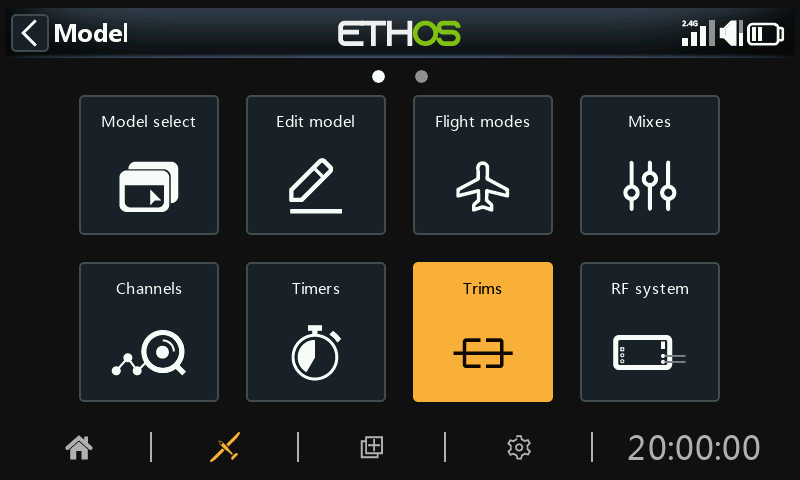

The Trims section allows you to configure the trim range and trim step size, or to configure custom trim behavior for each of the 4 control sticks. It also allows cross trims and instant trim to be configured.

The X20 Pro/R/RS and X18 have two additional trim switches T5 and T6, which are very useful for in-flight adjustments.

Additional trims may be configured as required.

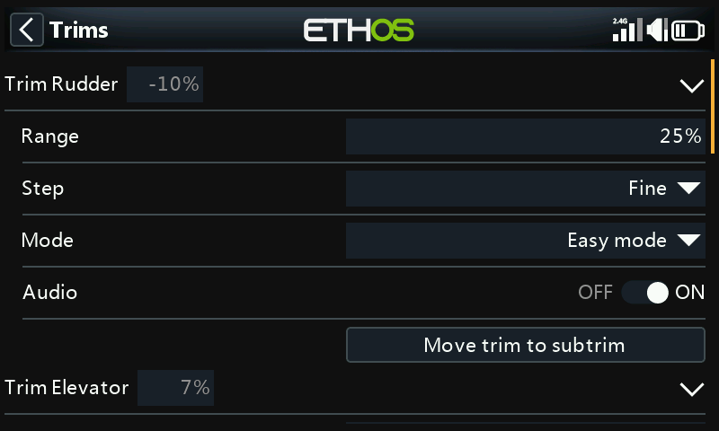

There is a set of Trims settings for each stick.

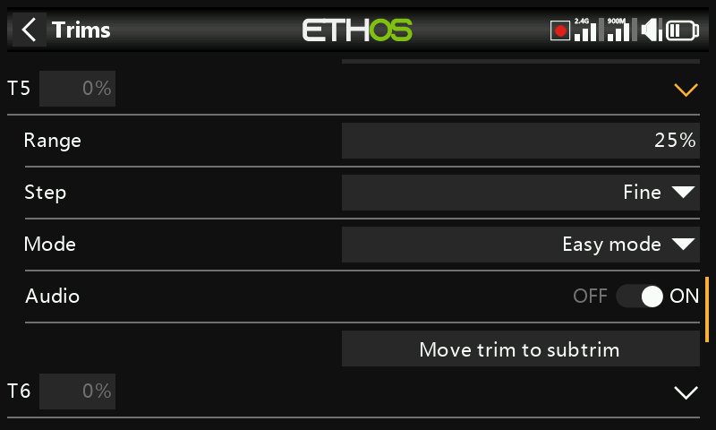

The X20 Pro and x18 have two additional trims T5 and T6.

## Trim settings

### Range

The default trim range is +/- 25%. The range may be changed to cover up to the full stick range of 100%. Care must be taken with this option, as holding the trim tabs for too long might add so much trim as to make your model unflyable.

Note that on the main display the default trim range is shown as -100 to 100. A trim range of 100% will show -400 to 400 (i.e. 4 times the normal trim range).

### Step

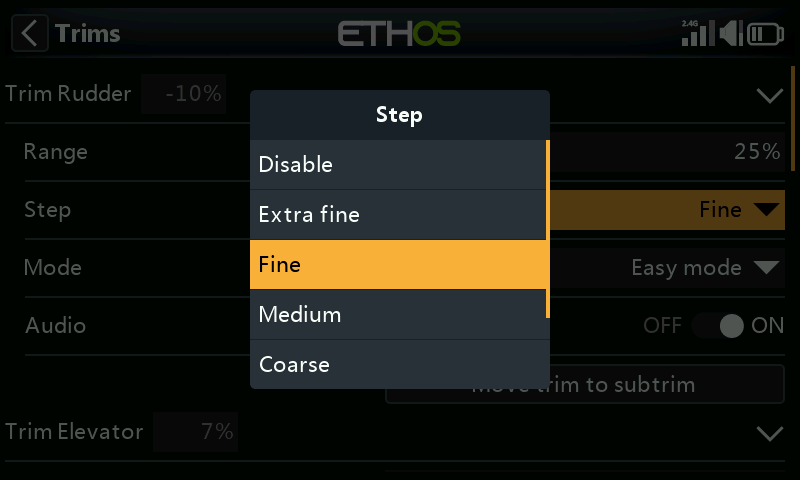

The trim step parameter allows trims to be disabled, or to configure the granularity of the trim switch steps, from ‘Extra fine’ through Fine, Medium, Coarse, Exponential or Custom. The Exponential setting gives fine steps near the center, and coarse steps further out. Custom allows the trim step to be specified as a percentage.

With a default range of 25%, the trim steps per click are:

Extra fine	0.5us

Fine	1us

Medium	2us

Coarse	4us

Exponential	0.3us to 16us

For Custom trims and a default range of 25%, the trim steps per click are:

Step size 1%	1us

Step size 100%	128us per step

For Custom trims and a range of 100%, the trim steps per click are:

Step size 1%	5us

Step size 100%	512us per step

### Mode

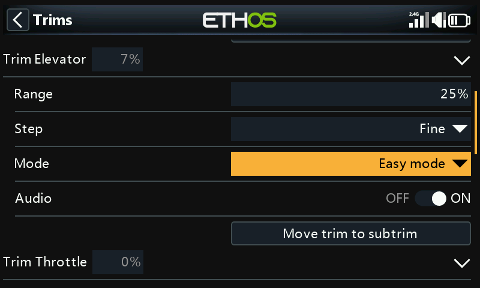

By default the trims are always on, but Trim behavior options can be configured to alter the trim behavior according to various conditions.

Note: Trims are reset to 0 when the mode is changed.

There are four modes of trim behaviour:

#### OFF

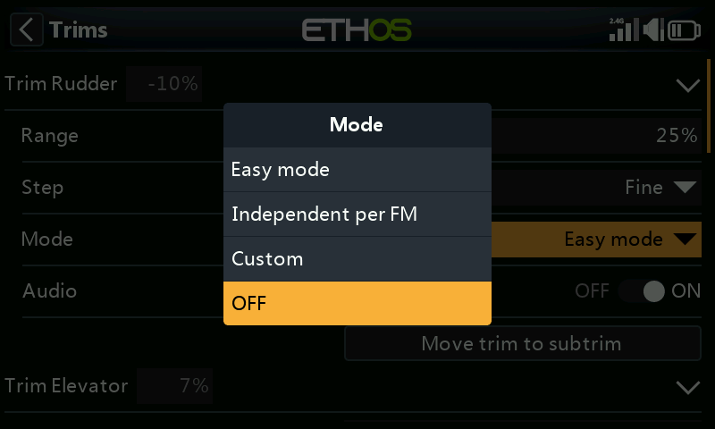

With trim Mode set to OFF, the trim is disabled.

For example, on electric models the throttle trim is not required and can be disabled by setting the mode to OFF. The trim can then be repurposed to adjust a Var, please refer to [Repurposed trim](../model-setup/variables-vars.md) in the Vars section.

#### Easy mode

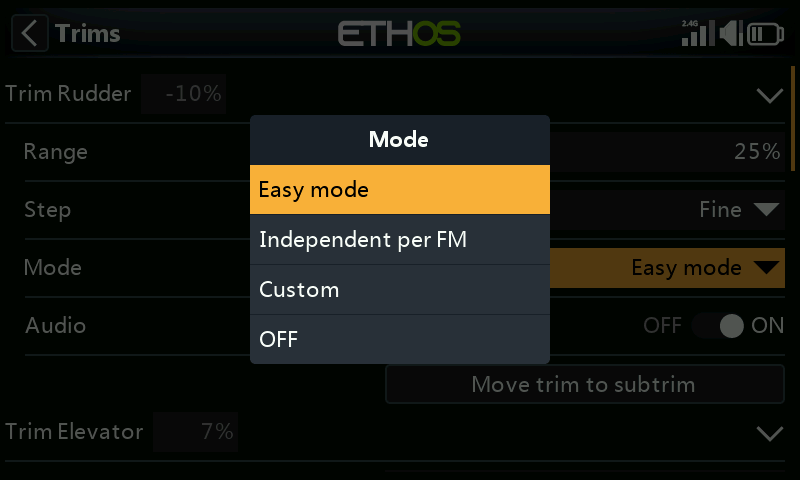

In Easy mode there is only one trim value for each control, so the trim value is shared across all flight modes. This is usually appropriate for aileron and rudder trim since these trims usually do not vary across flight modes.

#### Independent per flight mode

#### Custom

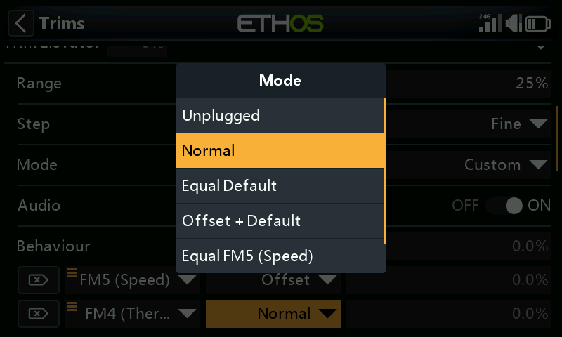

In Custom mode, the trim behavior can be customized

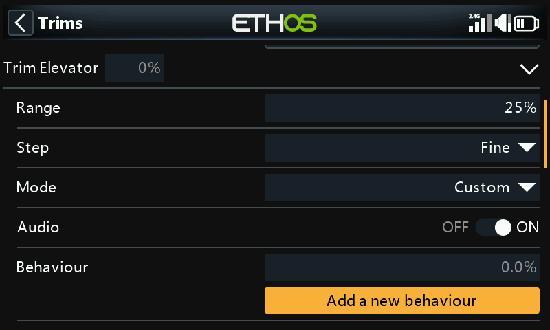

Once Custom mode has been selected, a new ‘Behavior’ dialog appears. Click on ‘Add a new behaviour’.

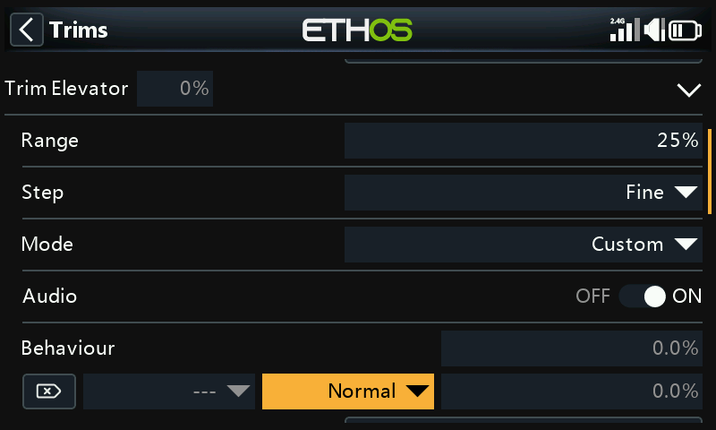

A new behavior line will be added.

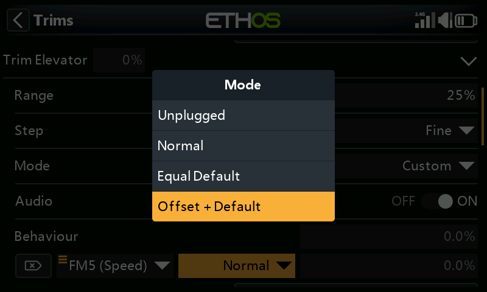

The initial behavior options are:

- Unplugged
- Normal (default)
- Equal default 
- Offset + default

Each of the options are described below.

##### Disable trims

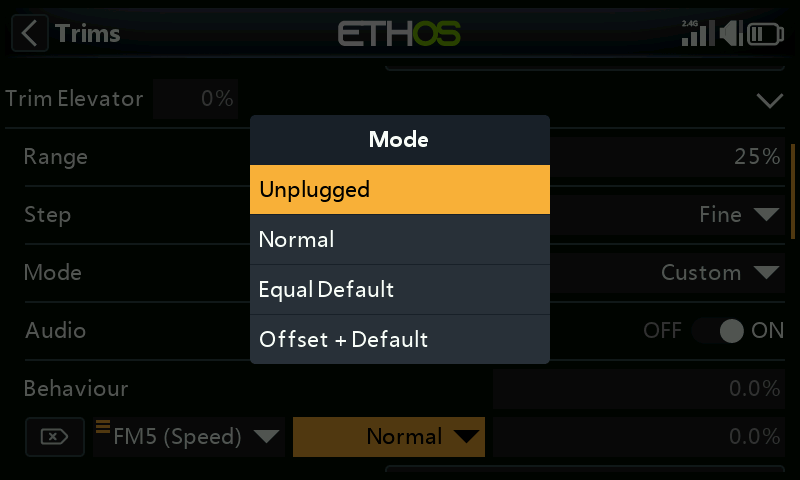

Trims can be disabled selectively by configuring the ‘Unplugged’ option.

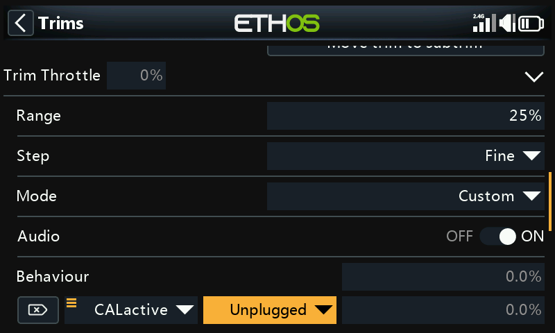

Trims can be disabled selectively by changing from ‘Always On’ to the desired condition. To disable a trim completely, set the trim Mode to OFF as explained above.

##### Equal (to another trim)

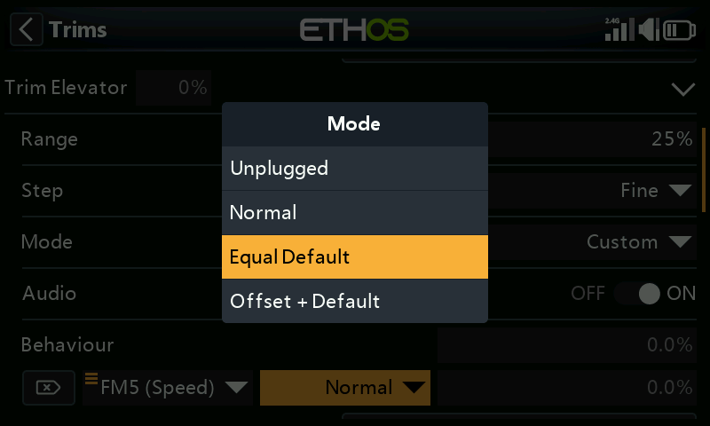

The trim for a specific condition can be configured to be equal to the trim of another condition.

##### Offset + (another trim)

The trim for a specific condition can be configured to be added to the trim of another condition.

##### Offset trim example

On many models you want to have a base elevator trim for when it is flying in its default mode, and then to have dependent elevator trim settings for other flight modes.

As an example, on gliders the default is normally a flight mode called Cruise, where the elevator is trimmed first for level flight.

Then you want dependent elevator trims in other flight modes such as Speed and Thermal. We will ‘Add a new behavior’ for the Speed and Thermal modes.

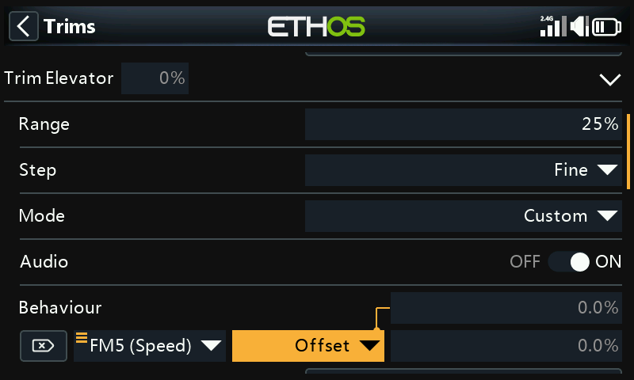

We configure the first behavior as ‘Offset + Default’ with condition ‘FM5(Speed)’. When FM5(Speed) mode is selected, any trim adjustments will be saved as an offset to the base mode trim value in FM0(Cruise). Therefore the trim in FM5(Speed) will be separate but also dependent on the base trim.

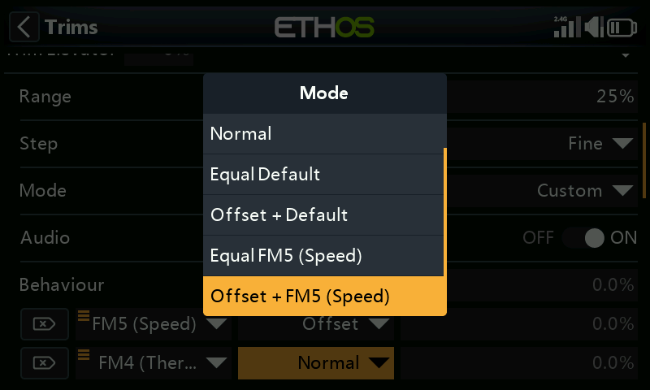

Note that when we configure the second behavior, we now get additional ‘Equal FM5(Speed)’ and ‘Offset + FM5(Thermal)’ options in the drop-down dialog. These are due to the first behavior we have configured above.

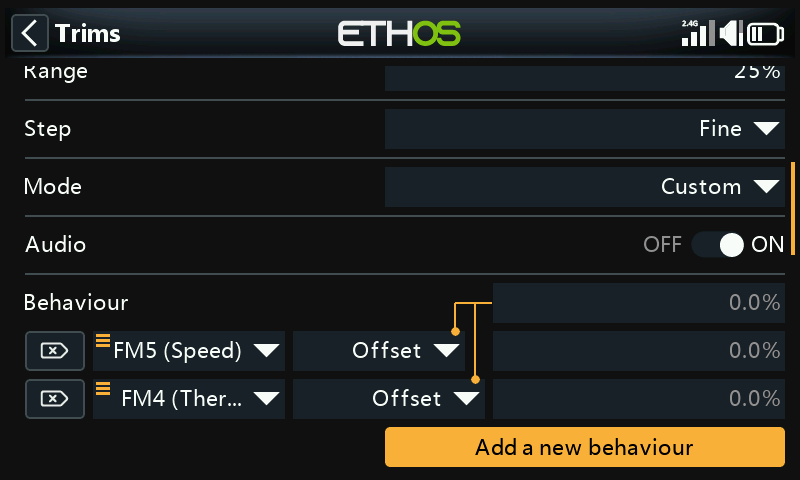

Similar to the first, we configure the second behavior as ‘Offset + Default’ with condition ‘FM4(Thermal)’. When FM4(Thermal) mode is selected, any trim adjustments will be saved as an offset to the base mode trim value in FM0(Cruise). Therefore the trim in FM4(Thermal) will be separate but also dependent on the base trim.

If your base Cruise trim then needs to change because you have altered the glider’s C of G, the dependent trim settings for Speed and Thermal will also be changed by the same amount.

### Audio

For each trim Audio can be disabled if the standard trim announcements are not desired, for example if the trim has been repurposed.

### Move trim to subtrim

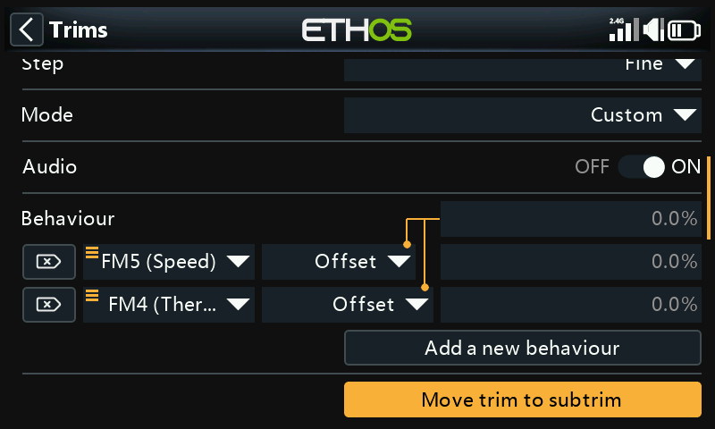

After trimming your model for level flight, this function can be used to move the required trim value (of for example the Elevator) into the Subtrim setting in Channels, and reset the trim in the main screen to the zero position. This makes it easy to check that your flight trims have not moved.

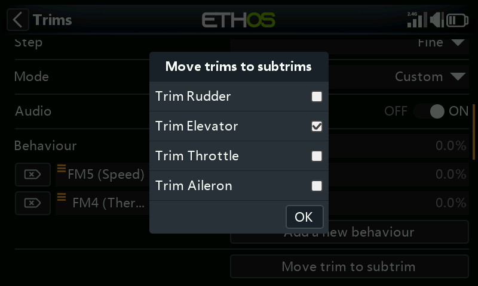

The ‘Move trim to subtrim’ option for the Elevator trim will have ‘Trim Elevator’ selected by default. Other trims may be added, or you may use the master ‘Move trims to subtrims’ option below which selects all trims by default.

## Additional Trims

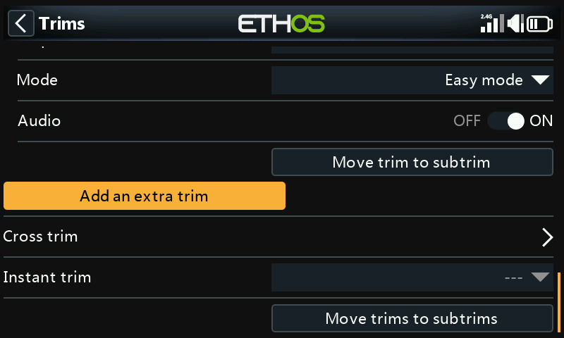

Additional trims may be created by tapping on the ‘Add an extra trim’ button.

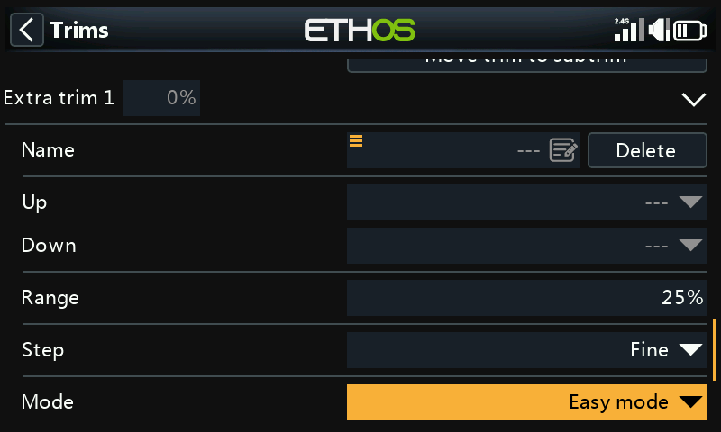

### Name

The new trim can be named.

### Up

Select the source to be used for increasing the trim value.

### Down

Select the source to be used for decreasing the trim value.

### Range

Please refer to the range description for the standard trims above.

### Step

Please refer to the step description for the standard trims above.

### Mode

Please refer to the description for configuring the behavior of the standard trims above.

### Audio

For each trim Audio can be disabled if the standard trim announcements are not desired, for example if the trim has been repurposed.

## Cross trim

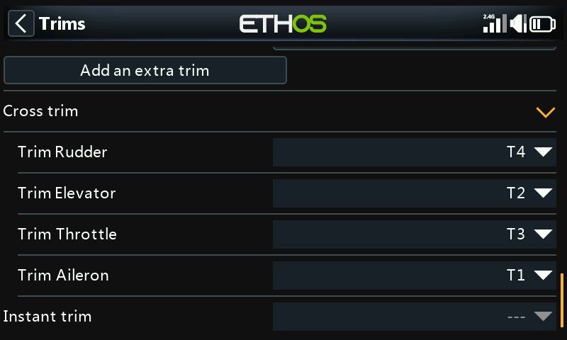

Cross trims can be set up for each trim stick, so you can nominate which trim switch to use for each stick. (The T5 and T6 trims are available on the X20 Pro and X18 only.)

## Instant trim

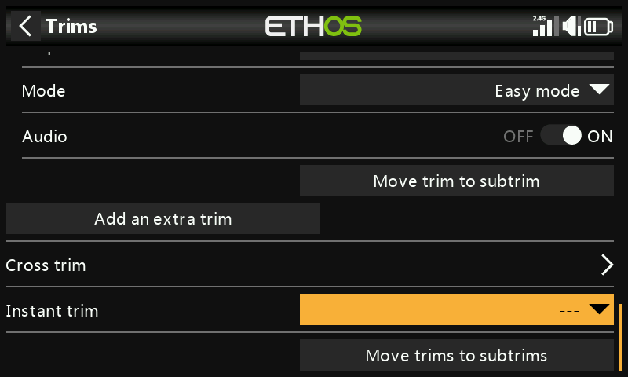

When this function transitions to active it adds the current stick positions to the respective trim values for default trims (also cross trims). It is best assigned to a switch you can reach without letting go of the sticks, which is then used to instantly set the trims while flying straight and level. This avoids having to frantically press the trim switches many times if the trims are way off. This setting should be disabled after the trimming flight, to avoid accidentally upsetting the trims again.

Please note that Instant Trim is only active when you are on one of the main views.

## Move trims to subtrims

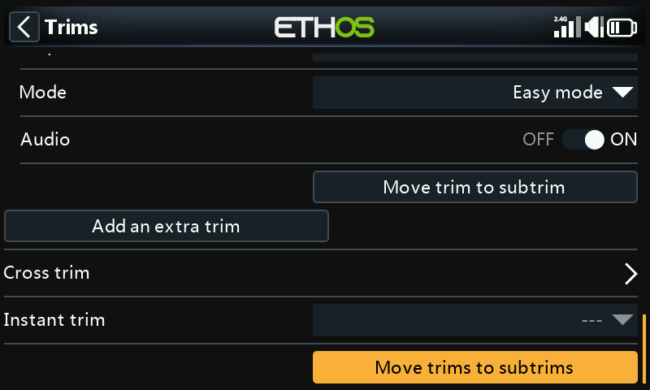

After trimming your model for level flight, this function can be used to move the required trim values into the Subtrim setting in Channels, and reset the trim in the main screen to the zero position. This makes it easy to check that your flight trims have not moved.

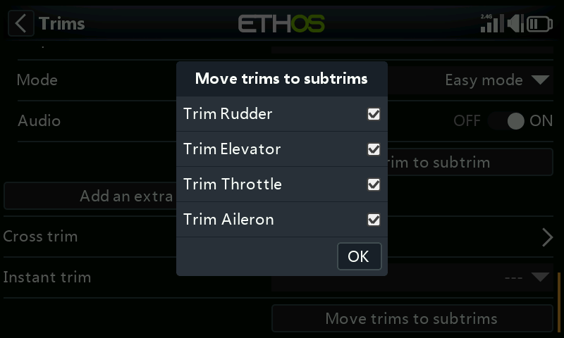

Review the trims to be moved to subtrims. You may wish to deselect the throttle trim.

When using flight modes, there may be more than one trim value to be considered for each channel. The Subtrim parameter in Channels is a global setting which applies in all flight modes, while trim values may vary according to the flight mode. Therefore it follows that shifting the trim in one flight mode into the global Subtrim may require the other flight modes’ trims to be adjusted. Therefore the function will take the trim of the currently selected flight mode, transfer its content to the subtrim, reset the trim, and adjust all other flight modes' affected trims. At the end of the day the control surface positions in each flight mode should be the same as they were before the ‘Trims to subtrims’ operation.

Large trim or subtrim values may have an adverse effect due to the resulting very asymmetric throws. It would be wiser to correct the problem mechanically. Every effort should be made to have 90 deg at the linkages when the surfaces are at neutral, with the exception of flaps where you sacrifice travel in the up direction in order to maximize travel in the down direction. After getting the linkages as close to 90 deg as possible, PWM Center should be used to get them exactly to 90 deg.

There is no problem repeating Trims to Subtrims, but you should be consistent and always do it in the same flight mode, i.e. your ‘base’ flying mode. For example on a glider the Cruise flight mode is usually the base mode and the one to trim first.
