# Variables (Vars)

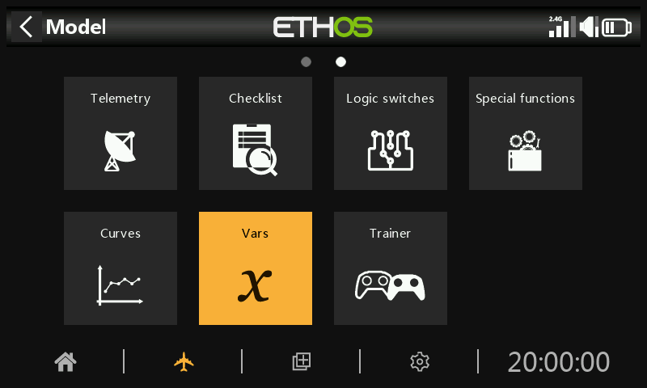

Variables (Vars) can be used to name and store a model’s settings parameters in a way which can then be referenced elsewhere in the radio programming including the mixes. Vars can be thought of as containers that hold information.

They have been separated into their own section, which allows a clean separation between a model’s configuration data and the programming logic. This means you can centralize all your setup settings in one place with meaningful names, where they can be found and edited easily, without having to jump between dozens of mixes or other configuration items and scroll to the relevant parameter.

Vars can hold fixed values (i.e. constants), or they can be adjustable with user-definable limits to avoid bad values potentially causing a crash. Each Var can hold multiple values depending upon the active conditions (such as flight modes) configured. Actions can be configured to alter their value, such as using a repurposed trim for an in-flight adjuster, or using add/subtract/multiply/divide actions driven by inputs. Vars are persistent between sessions.

Vars are also extremely useful when it is desirable to have one adjustment value that is to be used in multiple places. For example, a glider may have split ailerons on each wing, allowing the inside ones to be used as flaps during landing. However, during normal flight all four surfaces act as ailerons and hence should share a common differential setting to counter adverse yaw while turning, which can be achieved by making use of a Var.

Vars can be substituted for the normal numeric value in all parameters with the ‘Options’ feature, which is identified by the menu icon (hamburger symbol). Refer to the [Options feature](../getting-started/user-interface-and-navigation.md) section.

There are 64 Vars available.

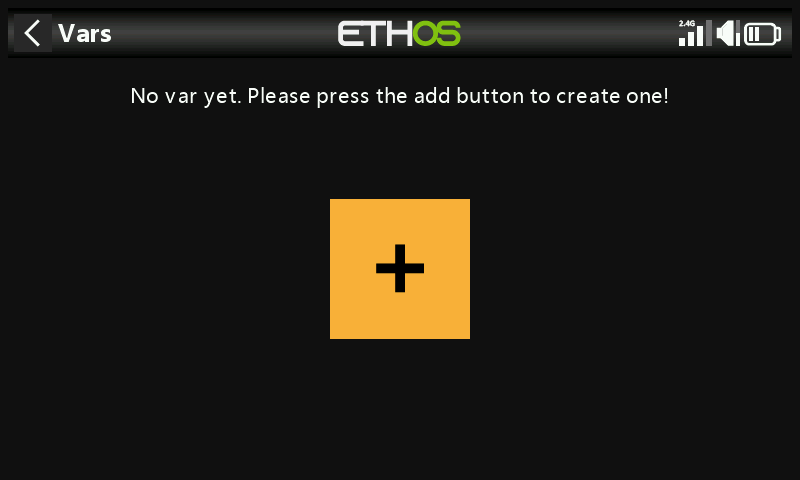

There are no default Vars. Tap on the ‘+’ button to add a new Var.

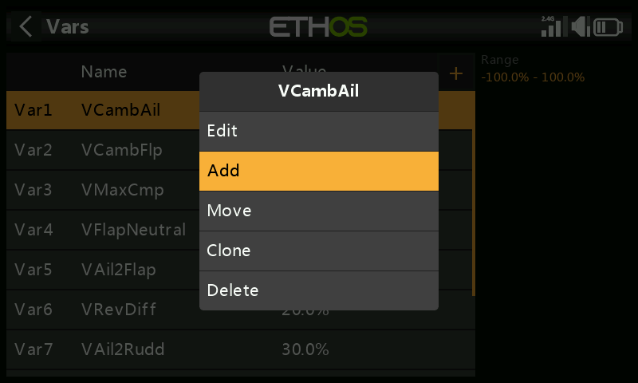

Once Vars have been defined, tapping on a list of Vars brings up a dialog allowing you to Edit, Move, Copy, Clone or Delete the highlighted Var. You can also add another Var by selecting ‘Add’, or by tapping on the ‘+’ symbol next to the column headings.

## Adding Vars

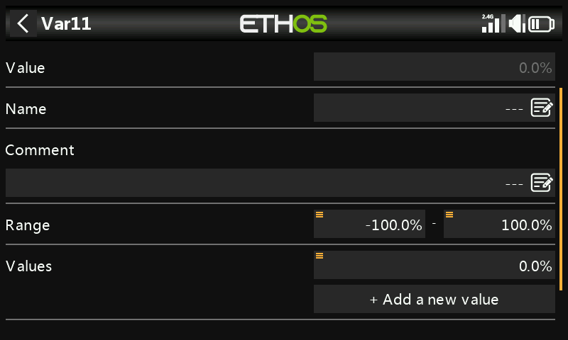

Value

Displays the current value of the Var.

Name

Allows the Var to be named.

Comment

A comment may be added as explanation of its use or function, to aid in understanding.

Range

The low and high limits of a range can be set to one decimal within +/- 500% to keep the value of the Var within defined limits.

Values

Fixed values

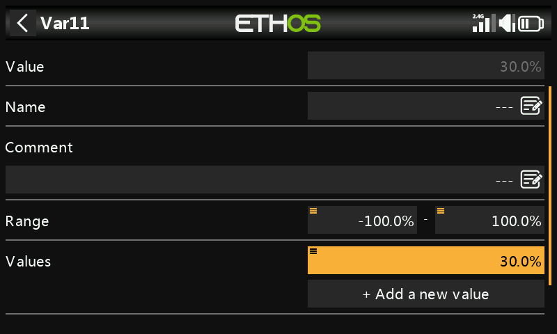

Vars can hold a single fixed value (i.e. a constant) to one decimal, as per the example above.

Multiple or variable values

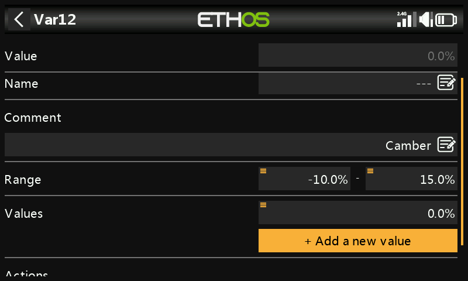

Select ‘Add new value’ to add a new value to a Var.

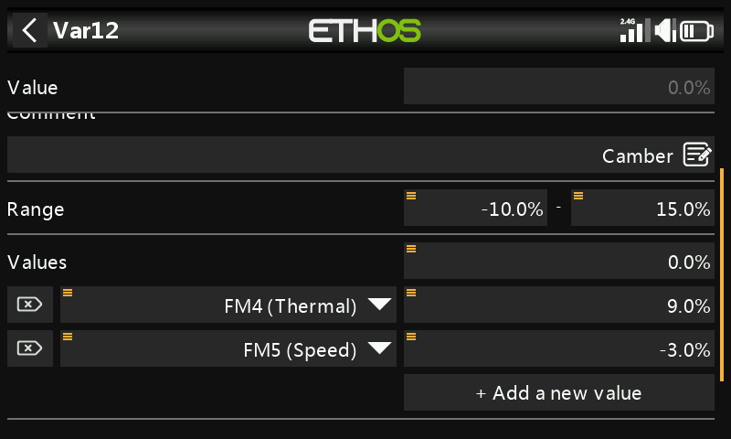

Each Var can hold multiple values depending upon the active conditions (such as flight modes) configured. In the example above, while the Thermal flight mode FM4 is active, Var12 has a value of 9%. When the Speed flight mode FM5 is active, Var12 will have a value of -3%.

Note that a range between -10% and +15% has been set to avoid values larger than desired.

Vars are persistent between sessions.

Actions

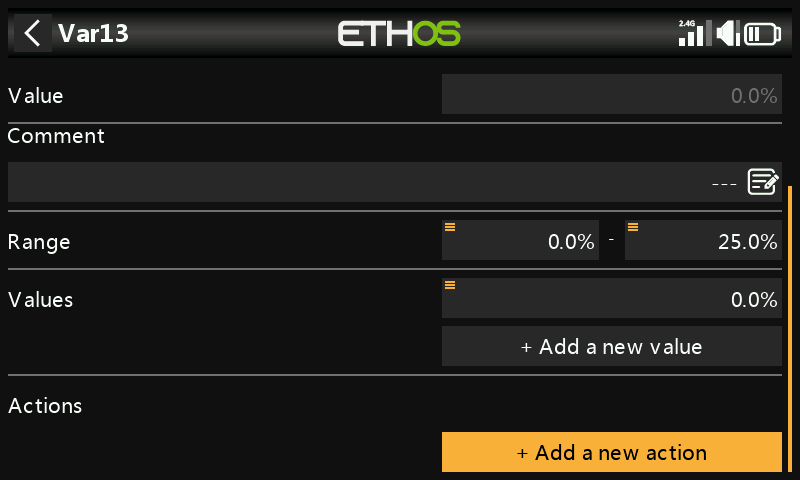

Var actions may be added, for example to repurpose trims or to perform calculations.

Repurposed trim

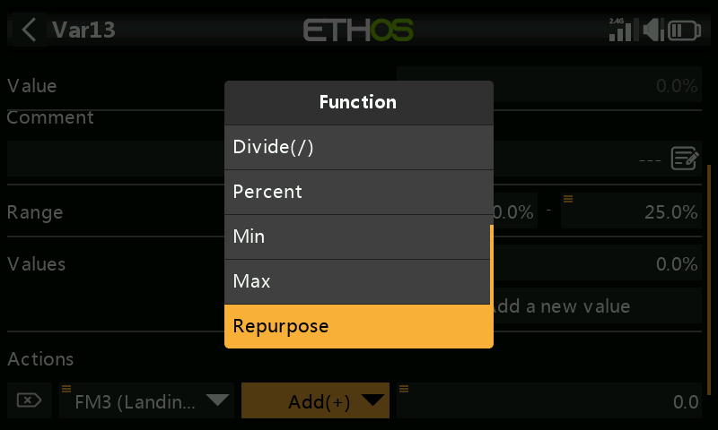

One of the trims can be repurposed to adjust a Var’s value.

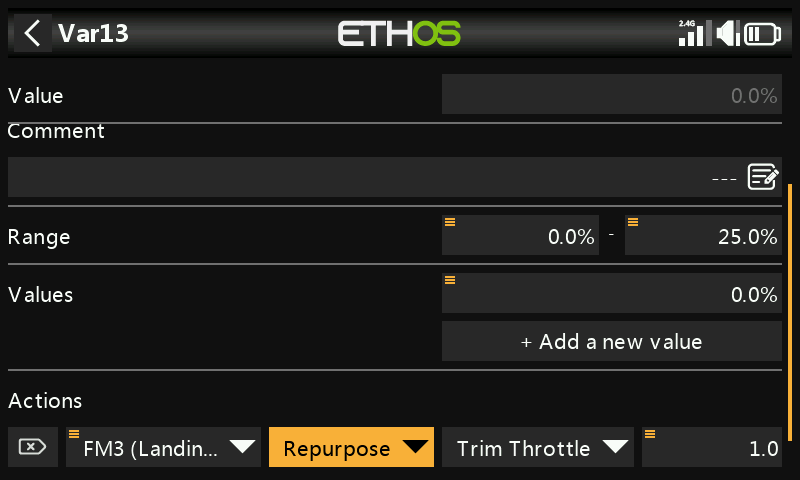

In the example above, an action has been defined to repurpose the Throttle trim for camber compensation during the Landing flight mode FM3 only. A range of 0 - 25% has been set to keep the Var between reasonable limits. A trim step value to one decimal may be defined, e.g. 1.0% in the example above.

Repurposed trims are only repurposed for that specific active condition. They operate according to their normal function at all other times.

Arithmetic Actions

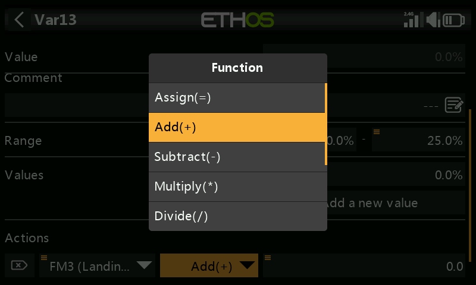

Actions can also be set to:

- Assign a specific value to the Var
- Add(+) to the Var
- Subtract(-) from the Var
- Multiply(\*) the Var by the parameter
- Divide(/) the Var by the parameter
- Apply a percentage to the Var
- Min
- Max

The actions are driven by inputs.

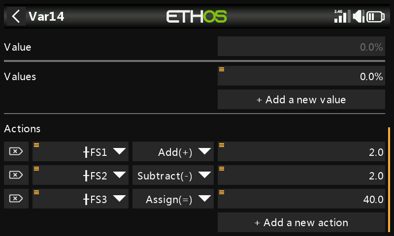

In this example above, function switch FS3(edge) will assign a value of 40% to the Var, and FS1(edge) will increase its value by 2 with every button press until the Range maximum is reached, and FS2(edge) will similarly decrease its value by 2 until the Range minimum is reached. Please note that the edge option must be selected (long press on the FS) so that the action is only performed when the function switch changes state.
