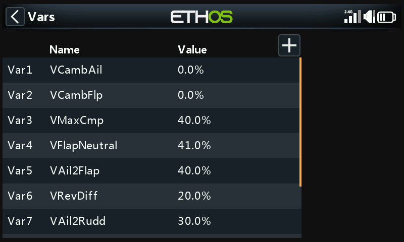

# Variables

Variables ("Vars") are named containers for a model's own settings
values, referenceable anywhere else in the programming — including
[mixes](mixes.md). Keeping them in their own section separates a model's
*configuration data* from its *programming logic*: instead of hunting
through dozens of mixes to find and tweak a value, everything lives in
one place with a meaningful name. 64 Vars are available; none exist by
default. Add one with **+**; tap an existing Var for **Edit**/**Move**/
**Copy**/**Clone**/**Delete**.

A Var can hold a fixed constant, or be adjustable within user-defined
limits (to keep bad values from causing a crash), and can hold a
*different* value per active condition (e.g. per flight mode). Values are
persistent between sessions. A Var substitutes for any ordinary numeric
value anywhere the [Options
feature](../getting-started/user-interface-and-navigation.md#the-options-feature)
is available (the hamburger-icon fields).

!!! example
    A glider with split ailerons (the inboard sections doubling as
    landing flaps) wants a single shared aileron-differential setting
    used everywhere all four surfaces act as ailerons — a Var holding
    that one value, referenced from every relevant mix, keeps it
    consistent and means it only has to be tuned in one place.

## Adding a Var

- **Value** — current value (read-only display).
- **Name** — editable.
- **Comment** — free text explaining its purpose.
- **Range** — low/high limits (one decimal, within ±500%) the Var's value
  can never exceed.

### Values

- **Fixed** — a single constant, one decimal place.
- **Multiple/variable** — **Add new value** attaches a value per active
  condition. E.g. `Var12` reads 9% while flight mode Thermal (FM4) is
  active, and −3% while Speed (FM5) is active, with its Range constrained
  to −10%…+15% so neither can exceed sensible limits:

  
  

### Actions

Actions change a Var's value over time, driven by an input.

**Repurposed trim** — hands one of the physical trims over to adjusting
this Var instead of its normal function, typically gated to one active
condition:

!!! example
    Repurpose the throttle trim to adjust a camber-compensation Var, but
    only while flight mode Landing (FM3) is active, with Range 0–25% and
    a 1.0% step per click. Outside that active condition, the trim
    reverts to its ordinary function automatically.

**Arithmetic actions** — driven by any input:

- **Assign** — sets the Var to a specific value.
- **Add** / **Subtract** / **Multiply** / **Divide** — arithmetic against
  the current value.
- **Percentage** — applies a percentage of the driving input.
- **Min** / **Max** — clamps the Var against the driving input.

  

!!! example
    `FS3(edge)` assigns 40% to a Var outright; `FS1(edge)` adds 2 on each
    press (capped at the Range maximum); `FS2(edge)` subtracts 2 on each
    press (capped at the Range minimum). The **Edge** option (long-press
    the function switch) matters here — without it, the action would
    re-fire continuously for as long as the switch is held, rather than
    once per press.

  
