# Basic Flying Wing (Elevon) **Airplane** example

This simple flying wing example covers the configuration of a model having 2 servos for the elevons. We will use the Dreamflight Weasel recommended rates, expo and mix ratios.

## Step 1. Confirm System settings

Begin by following the 'Initial radio setup example' above, which is used to configure those parts of the radio system’s hardware that are common to all models. For this example we are using the default AETR (Aileron, Elevator, Throttle, Rudder) channel order. Ensure that the ‘First four channels fixed’ setting is OFF.

Use the [RF System](../model-setup/rf-system.md) function to register (if your receiver is ACCESS) and bind your receiver in preparation for configuring the model.

## Step 2. Identify the servos/channels required

The Mixes function forms the heart of the radio. For an elevon model the mixes are used to combine the aileron and elevator controls to both act on the elevon surfaces.

Our elevon example has the following servos/channels:

2 channels combining the aileron and elevator inputs

## Step 3. Create a new model.

Refer to the Model Setup / [Model Select](../model-setup/model-select.md) section to create your new model. Also refer to the Menu Navigation section to familiarize yourself with the radio's user interface, so that you can find the functions you need easily.

Tap on the Model tab (Airplane Icon), and select the Model Select function. Then tap on the ‘+’ symbol, which will present you with a choice of model creation wizards.

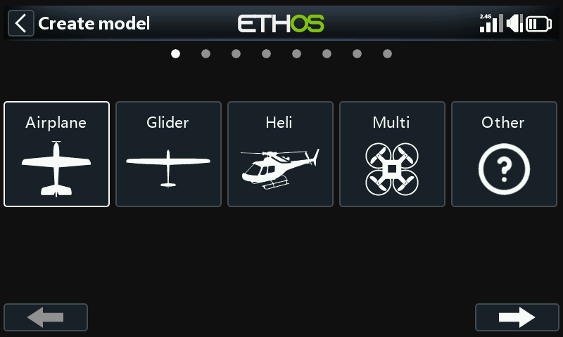

For our example, tap on the Airplane icon to start the model creation wizard.

The wizard includes optionally setting up pre-set mixes for FrSky stabilized receivers. For this example, we will choose the ‘Non stabilized receiver’ option.

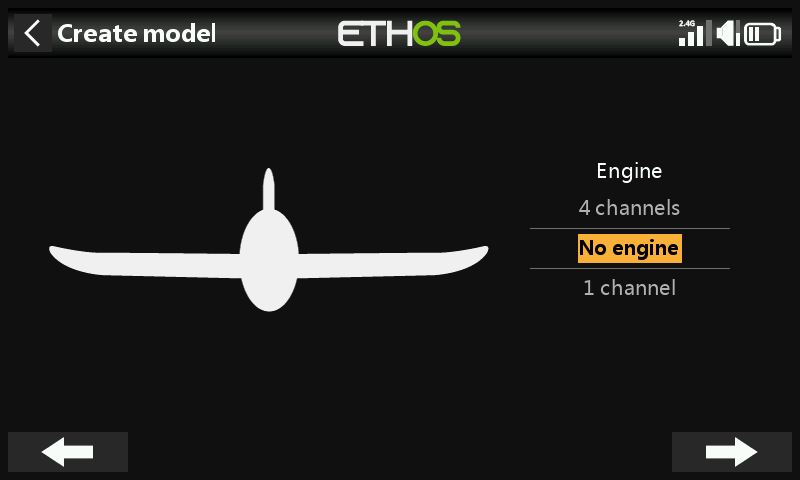

Select ‘No engine’ for the motor.

Accept the default 2 channels for Ailerons, and select ‘No flaps’.

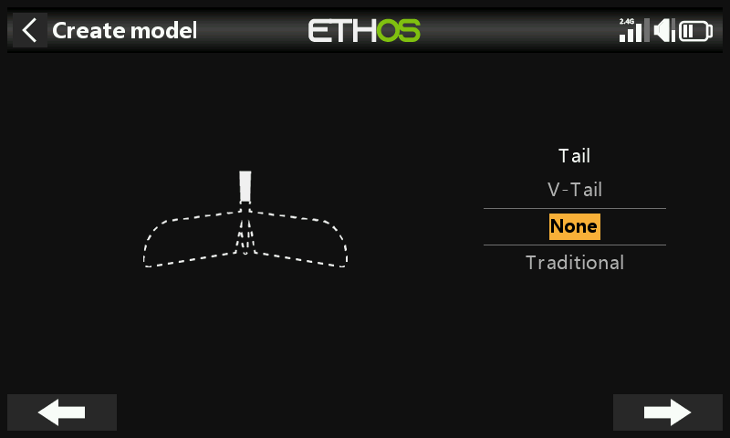

Select ‘None’ for the Tail. This will create an elevon mix using Aileron and Elevator inputs.

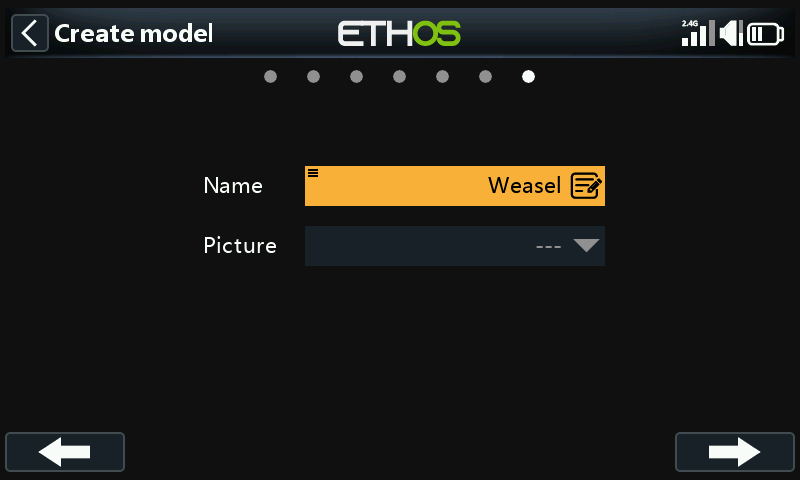

We will name the model ‘Weasel', select a bitmap image for it, and follow the wizard to the end which results in the 'Weasel' model being created in the Airplane group. It will also be made the active model, so we can continue to configure its features.

## Step 4. Review and configure the ***mixes***

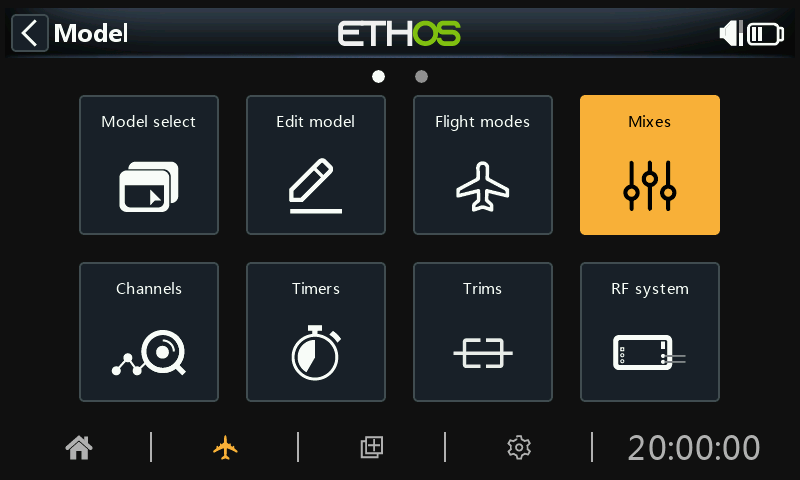

Tap on the Mixes icon to review the mixes created by the Airplane wizard.

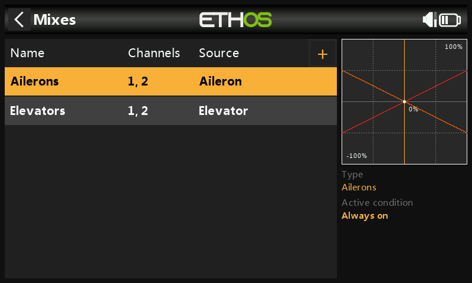

The wizard has created an Ailerons mix on channels 1 and 2, followed by an Elevators mix also on channels 1 and 2. This means both input controls will act on the two elevon channels.

### Ailerons

To review the Aileron mix, tap on the Ailerons line and select Edit from the popup menu.

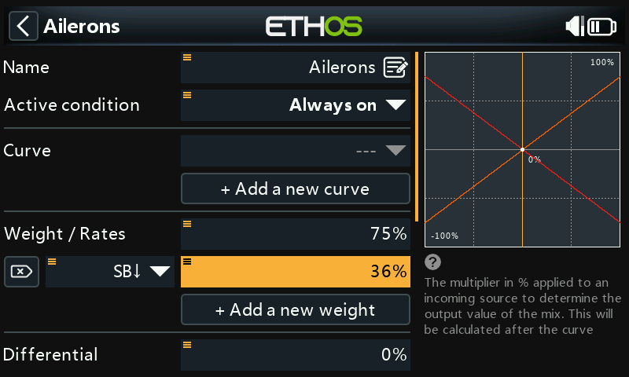

#### Weight/Rates

Referring to the Weasel manual, the recommended deflections for Aileron are approximately 3x greater than for Elevator. We want combined weights of 100%, so the aileron weight should be 75% and elevator 25%.

According to the Weasel manual, low rates should be about 50% of the high rates. Therefore we will use 36% for aileron low rates and 12% for elevator low rates.

#### Expo

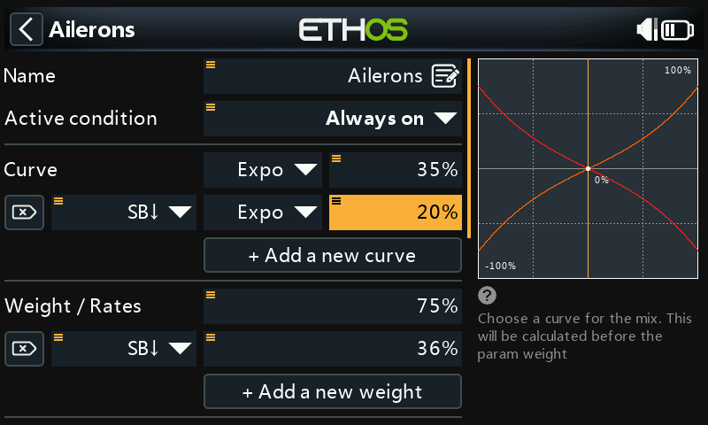

In the Rates examples above you can see that the output response is linear. To avoid the response being too twitchy at the stick centers, you can use an Expo curve to reduce the control surface movement at center stick and to increase it as the stick moves further from center. The Weasel recommended Expo values are 35% for high and 20% for low, so we will add a curve that will be active on the SB switch down position. The graph now shows a curved response which is flatter at stick center.

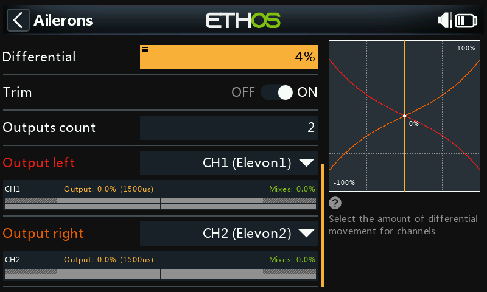

For Ailerons there is another special setting called Differential. If the left and right ailerons move up or down by the same amount, the downward moving aileron will cause more drag than the upward moving aileron, causing the wing to yaw in the opposite direction to the turn. This is known as adverse yaw. To reduce this a positive value in the Differential setting will result in less downward aileron movement, reducing adverse yaw and improve turning/ handling characteristics. The Weasel recommended differential is quite small and equates to about 4%.

### Elevator

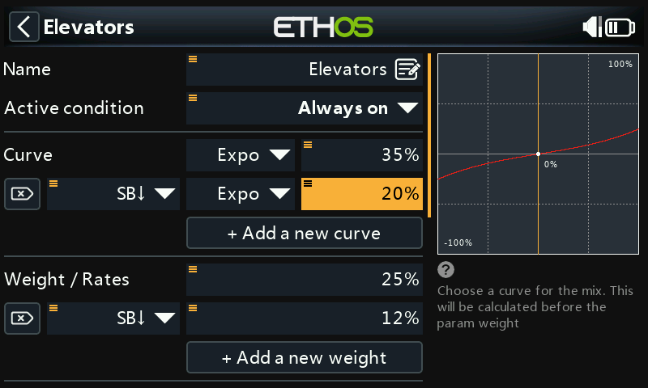

In a similar way to the Ailerons, we can set up rates and expo for the Elevator. We will use elevator rates/weights of 25% and 12%. We will use the same Expo values as for aileron.

### Rudder

The Weasel does not have a Rudder, it really does not need one. Other elevon models may require a rudder, in which case a free mix should be used to add a rudder on channel 3.

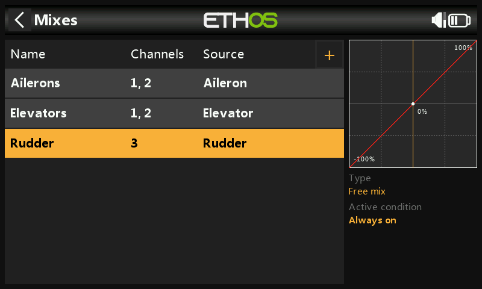

## Step 5. ***Bind the receiver***

Use the [RF System](../model-setup/rf-system.md) function to register (if your receiver is ACCESS) and bind your receiver in preparation for configuring the Channels.

Please read through the next two sections on reviewing your mixes and configuring the Channels before proceeding. To avoid damage by inadvertently over-driving your servos, it would be wise to disconnect your servo linkages or reduce the servo travel until you are ready to configure the servo min/max limits.

## Step 6. Review the Mixes

You can use the Channels screen to review the mixes. Output channels 1 and 2 may be renamed to Elevon1 and Elevon2.

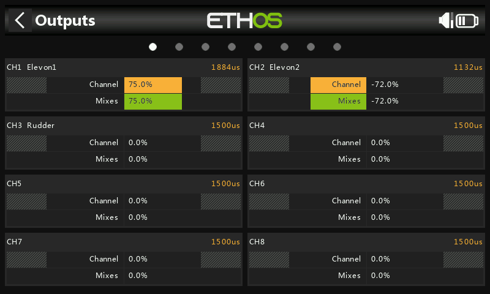

The example above shows that full right aileron has been applied, so channel 1 is at 75%, while the left down-going aileron is at 72% due to aileron differential.

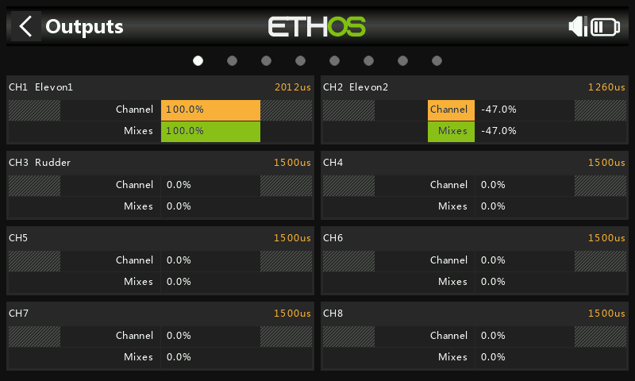

This example shows that full right aileron has been applied as well as full down elevator so channel 1 is at 75+25 = 100%, while the left down-going aileron is at 72-25 = 47% due to aileron differential.

## Step 7. Configure the maximum servo throws

Start by adjusting the servo center points using the PPM Center adjustment.

Finally the actual maximum servo throws should be configured to set the recommended deflections and to avoid exceeding mechanical servo limits. The maximum Weasel recommended throws are 25mm (aileron) + 10mm (elevator) = 35mm. Apply full aiding as well as opposing aileron and elevator inputs, then set your maximum surface deflections ensuring that servo or linkage limits are not exceeded.

#### Min/Max

The Channel min and max settings are ‘hard’ limits, i.e. they will never be overridden. They should be set to avoid mechanical binding. Note that they serve as gain or ‘end point’ settings, so reducing these limits will reduce throw rather than induce clipping. Note that the limits default to +/- 100.0%, but may be increased here to +/- 150.0% if required.

#### Curve

Curves are a quicker and more flexible way of configuring the center and min/max limits of the channel outputs, and you get a nice graphic. Use a 3-point curve for most outputs, but use a 5-point curve for things such as the second elevon, so you can synchronize the travel at 5 points. When using a curve it is good practice to leave Min, Max and Subtrim at their 'pass thru' values of -100, 100 and 0 respectively (or -150, 150 and 0 if using extended limits).
