# Emphasis

\*\*this is bold text\*\*

\*this is italic text\*

### Step 2. Copy the checklist file to the radio.

After creating the Checklist file, copy it to the models folder where the model file is located on the radio.

Eject the radio drives on the PC and disconnect the radio.

### Step 3. Review the checklist

Load your model. Your new Checklist should display as part of the startup checks. The text section of the screen can be scrolled to view.

## 10. How to configure an in-flight adjustable flap compensation curve

### Overview

#### The need for flap to elevator compensation

When a glider or airplane deploys its flaps, the change in wing camber causes high wing aircraft to ‘balloon up’, and low wing planes to descend. To compensate, some elevator correction is required. A curve will be used because the correction is non-linear.

#### Approach taken

Ethos has the capability to adjust points on a curve using Vars. This opens up the ability to adjust the different points on a compensation curve in flight, making it much easier to tune for example a flaps to elevator compensation curve.

In this example we will repurpose the throttle trim to adjust points along a compensation curve which is applied to the elevator. The points adjusted depend on the position of the flap stick, so the compensation can be tuned in flight for varying amounts of flap.

### Step 1: Select a curve type for the compensation curve

A 5 point curve will provide sufficient points for smooth compensation without over complicating things.

Starting from the right, point number 5 is always zero, which means that no compensation is applied when the flap stick is fully up (at +100%) and no flaps are deployed.

The other 4 points on the curve will be made adjustable using Vars.

We also need to consider that the flap stick may be close to being in between two points of the compensation curve, in which case we should adjust both points at the same time.

### Step 2: Calculate the overlapping ranges for the Compensation Curve adjustment points.

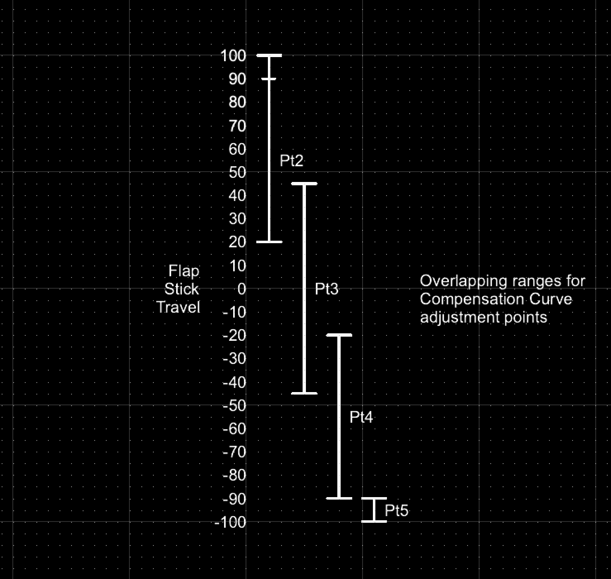

Please refer to the above diagram for the overlapping ranges chosen for the compensation curve adjustment points. These ranges were defined by Mike Shellim for his ‘Crow-aware adaptive elevator trim’ developed for OpenTX (see rc-soar.com) and are used with his kind permission.

I have made a small modification to extend the Pt2 range all the way up to +100% for reasons explained further down.

As the flap stick is deployed, from +100% downwards, curve point 2 is the first one to be active and adjustable. Then when the flap stick is between +45% and 20%, both points 2 and 3 will be adjusted simultaneously. When the flap stick is between +20% and -20%, only point 3 will be adjusted. Then when the flap stick is between -20% and -45%, both points 3 and 4 will be adjusted simultaneously. When the flap stick is between -45% and -90%, only point 4 will be adjusted. Finally, when the flap stick is between -90% and -100%, only point 5 will be adjusted.

### Step 3: Configure logic switches for the comp curve adjustment points

For each of the four adjustable curve points, we need to set up a Logical Switch that will be active when the flap stick is within its defined range.

LSW AdaptivePt2: range = 20 to 100%

LSW AdaptivePt3: range = -45 to 45%

LSW AdaptivePt4: range = -90 to -20%

LSW AdaptivePt5: range = -100 to -90%

Set up a logic switch AdaptivePt2 with the flap (i.e throttle) stick as source, and a range of 20% to 100%. Making the range up to 100% allows adjustment of point 2 even with no flaps. Please refer to the setup explanation in step 6 below.

Set up a logic switch AdaptivePt3 with the flap (i.e throttle) stick as source, and a range of -45% to 45%.

Set up a logic switch AdaptivePt4 with the flap (i.e throttle) stick as source, and a range of -90% to -20%.

Set up a logic switch AdaptivePt5 with the flap (i.e throttle) stick as source, and a range of -100% to -90%.

### Step 4: Define the four Vars that hold the curve point adjustment values

The next step is to define the four VARs that will be adjusted by the repurposed throttle trim when each corresponding logic switch is active. The logic switches become active as the flap stick traverses across each logic switch’s defined range.

The screenshot above shows the four Vars named VAdjPt2 to VAdjPt5, which we will configure below.

The Var named VAdjPt2 has a range of 0-50% (which should be sufficient for compensation, but may be increased if necessary).

It has an action defined to repurpose the throttle trim to adjust the Var’s value with a step size of 1.0% when the AdaptivePt2 logic switch defined in step 4 above is active. (Note: It will be active when the flap control has a value between 20% and 90%.)

The Var named VAdjPt3 has a range of 0-50% (which should be sufficient for compensation, but may be increased if necessary).

It has an action defined to repurpose the throttle trim to adjust the Var’s value with a step size of 1.0%  when the AdaptivePt3 logic switch defined in step 4 above is active. (Note: It will be active when the flap control has a value between -45% and 45%.)

The Var named VAdjPt4 has a range of 0-50% (which should be sufficient for compensation, but may be increased if necessary).

It has an action defined to repurpose the throttle trim to adjust the Var’s value with a step size of 1.0%  when the AdaptivePt4 logic switch defined in step 4 above is active. (Note: It will be active when the flap control has a value between -90% and -20%.)

The Var named VAdjPt5 has a range of 0-50% (which should be sufficient for compensation, but may be increased if necessary).

It has an action defined to repurpose the throttle trim to adjust the Var’s value with a step size of 1.0%  when the AdaptivePt5 logic switch defined in step 4 above is active. (Note: It will be active when the flap control has a value between -100% and -90%.)

### Step 5: Define the compensation curve

We determined in step 1 that a 5 point curve is appropriate.

Create a new custom curve named for example EleComp, with 5 points. Enable the smooth option so that the compensation changes smoothly.

Long press Enter on each of the curve value points 1 to 4, and use the ‘Use a source’ option to assign the Vars VAdjPt5 through to VAdjPt2 as shown in the above example.

### Step 6: Apply the curve in your application

The compensation curve can now be applied in your application.

It is very helpful when there is data available (perhaps in rcgroups forums, or the airplane manufacturer’s guidelines) as to how much elevator travel is required vs the amount of downward flap movement. The compensation curve should be preloaded with some starting values. If you have no setup recommendations for your airplane, a few millimeters of compensation at full flaps may be a reasonable starting point.

A careful approach is required when tuning the compensation. Start with small amounts of flap and small amounts of trim! Bear in mind that AdaptivePt2 can be adjusted even with no flaps deployed. This means you can apply a little flaps, and then remove them again while you dial in a little compensation. This is less stressful than having to quickly dial in some compensation while the plane is rising or sinking. You can then reapply a little flaps and check whether the compensation is right or needs further adjustment.

Once compensation curve adjustment point 2 has been dialed in, proceed to the next point at about mid stick. If a large amount of trim was needed for point 2, it may be prudent to land and adjust the other points to each be slighter greater than the last.

For our example, you can use the newly created EleComp curve to replace the EleComp curve in step 7 “Add the Elevator compensation curve and mix’ of the How To section 6 above “How to configure a Butterfly (aka Crow) mix” above.

## 11. How to configure instant take-back for the trainer function.

A useful enhancement to the trainer function is to add instant take-back, so the instructor simply has to move their aileron or elevator stick to regain control from the student.

The trainer function is still controlled with a switch, but in addition it can be cancelled by simply moving the instructor’s sticks.

We will use a sticky logic switch to control the trainer function, which will be set by the desired trainer switch. We will use two logic switches to detect the instructor stick movement, and another to cancel the trainer function sticky when stick movement is detected or the trainer switch is moved to off.

### Step 1: Configure the aileron detect logic switch

The logic switch will become True if the absolute value (i.e either positive or negative) of the aileron stick moves more than 10% from the mid position.

Long press on the Aileron source and select ‘Ignore trainer input’ so that the student’s aileron movements will not trigger the logic switch.

The little ‘crossed-out circle’ icon shows that the Aileron source will ignore Aileron inputs from the student radio.

### Step 2: Configure the elevator detect logic switch

Repeat the same steps for the elevator detect logic switch.

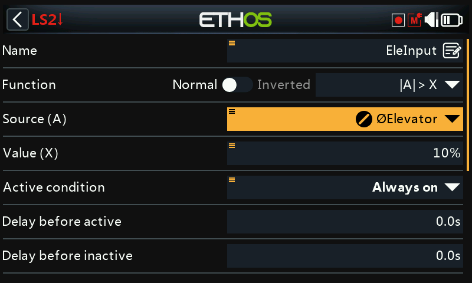

Again, the little ‘crossed-out circle’ icon shows that the Elevator source will ignore Elevator inputs from the student radio.

### Step 3:Configure the cancellation logic switch

Configure an OR logic switch to become True when either the aileron or the elevator stick is moved, or when the trainer switch SD is switch to the off position (i.e. when switch SD is Not in the down position.

### Step 4: Configure the trainer function enable sticky logic switch

Configure a Sticky logic switch so that it is set by trainer switch SD down, and reset when stick movement is detected or the trainer switch is not in the down position.

Use the TrainerActive logic switch to control the trainer function.

It would be a good idea to configure some ‘play file’ special functions to give audio announcements when the trainer function becomes active and when it is disabled.

## 12. How to find the latest Bootloader or other component for your radio:

Step 1. Download ‘components.json’ from the latest release.

Step 2. Open it with a text editor such as Visual Studio Code or Notepad.

Step 3. Look for the section covering your radio, for example X20:

{

"targets": \["X20", "X20S", "X18", "X18S", "XE", "XE-S", "X20 Pro"\],

"components": \[

{

"name": "bootloader",

"version": "1.4.15"

},

{

"name": "firmware",

"version": "1.6.1"

},

{

"name": "audio",

"version": "1.6.1"

},

{

"name": "system\_files",

"version": "1.6.1"

}

\]

},

Note: The above is a snapshot example taken at the time of writing. Please use the information from the latest release.

Step 4. The example above shows that the latest bootloader for X20 is 1.4.15.

## 13. How to configure a gear door and landing gear sequencer

The sequencer mix allows multiple channels to be sequenced forwards and backwards using programmable timebases and curves. It is very useful for programing things like landing gear and gear door sequences. The sequencer has been designed with the controls needed to make the sequence easy to program, while allowing full flexibility only limited by your imagination.

Before starting the programming, you will want to do some planning in how you want the sequencer to function. For example, use a stopwatch to measure the time for landing gear and gear door operation. You may for example wish to operate the gear doors in a scale manner rather than snapping them open or shut. Likewise, if your retracts only require a switch signal, the sequencer curve should use a step function instead of a ramp.

### Step 1: Configure the gear door and retracts channels

It is better to assign the gear door and retracts channels before configuring the sequencer, so that the channels will already have names when you assign the sequencer output channels.

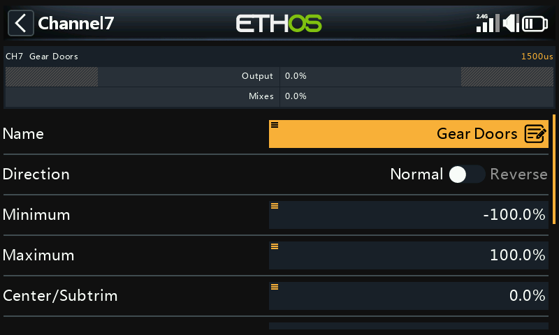

In our example channel 7 is assigned to the gear doors.

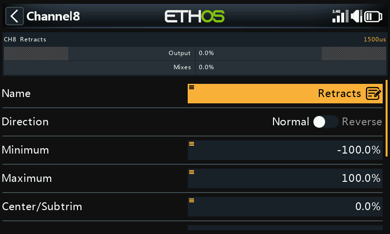

In our example channel 8 is assigned to the retracts.

### Step 2. Add a sequencer mix

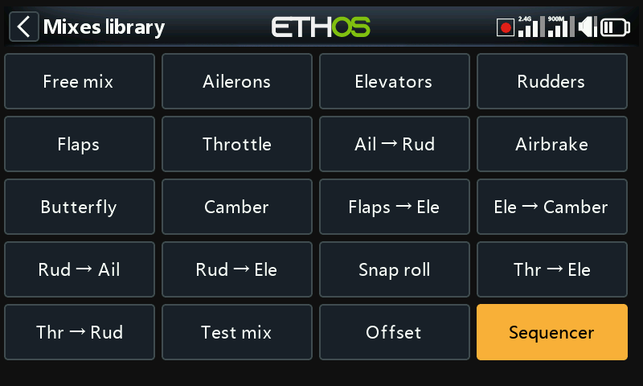

- In the main mixes screen, tap on the ‘+’ symbol next to the column headings to add a new mix.
  - Select the Sequencer mix, and add it after the last mix.

### Step 3. Configure the sequencer

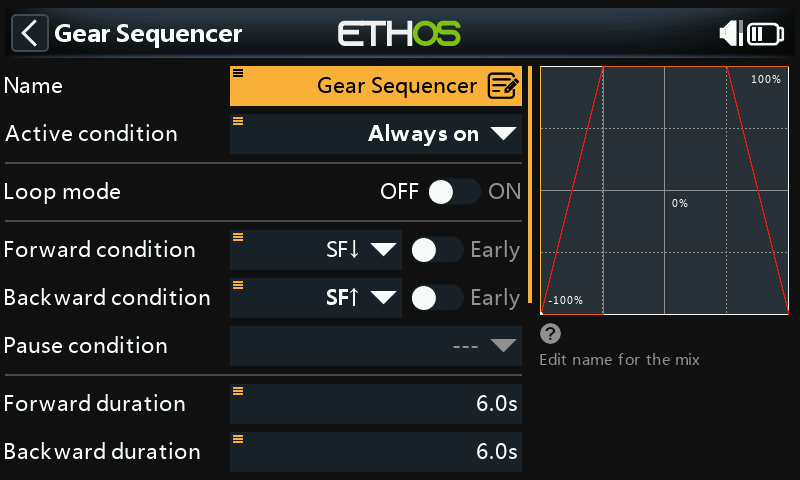

#### Name

Our example is named Gear Sequencer.

##### Active condition

The default active condition is ‘Always on’. It may be made conditional by choosing from switch or button positions, function switches, flight modes, logic switches, a system event such as throttle cut or hold, or trim positions.

##### Flight modes

If any flight modes have been defined in the ‘Flight modes’ section, then this parameter becomes available. The mix can then be made conditional to one or more flight modes. Click on ‘Edit’ and check the boxes for the flight modes in which this mix must be active.

##### Loop mode

Leave loop mode in the default Off position.

##### Forward condition

We have selected switch SF down to initiate the forward condition.

##### Backward condition

We have selected switch SF up to initiate the backward condition.

##### Pause condition

Leave the pause condition in the default Off position..

##### Forward duration

We have selected 6 seconds as the forward duration. We will explain the timings when we configure the curves below.

##### Backward duration

Similarly, we have selected 6 seconds as the backward duration. We will explain the timings when we configure the curves below.

##### Outputs

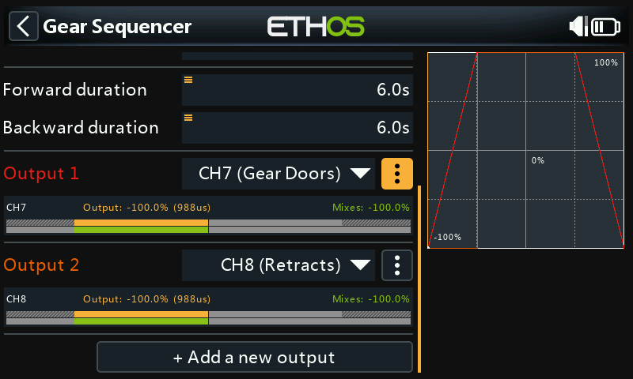

Output1 has been assigned to CH7 (Gear Doors), and Output2 has been assigned to CH8 (Retracts).

##### Output1 menu

Tap on the 3 dots to open the curve options menu.

##### Curve options

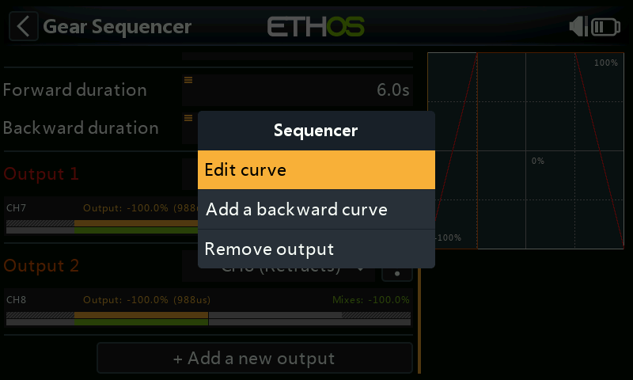

##### Edit curve

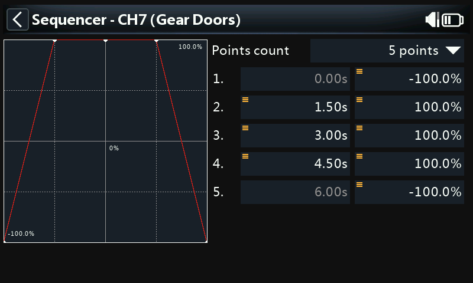

The curve has 5 points by default, but may have up to 21 points. Both X and Y coordinates are configurable.

The curve for the gear doors ramps up between points 1 and 2 from -100 to +100 in 1.5 seconds, so that the doors open in a scale-like manner. The retracts can be activated at point 2. The retracts used in this example take 2 seconds, leaving a 1 second gap to point 4. The curve then ramps down between points 4 and 5 from +100 to -100 to close the doors in 1.5 seconds, giving a total duration of 6 seconds.

The above timings allow the same gear door curve to be used for both forward and backward operation.

##### Output2 menu

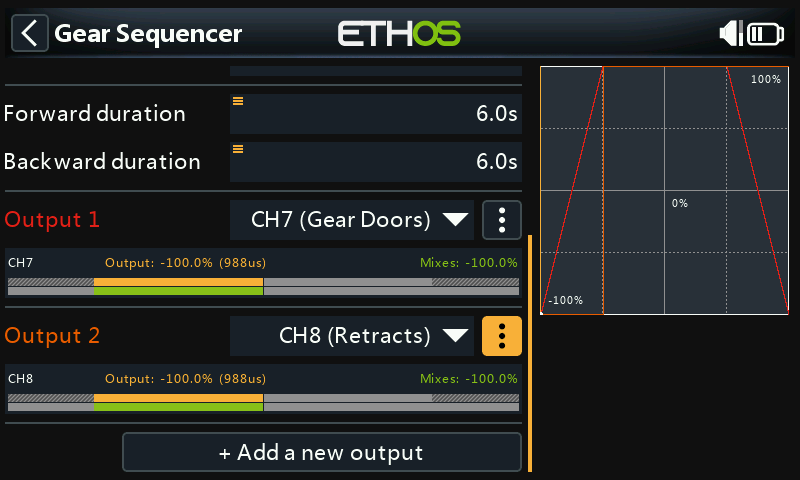

Tap on the 3 dots to open the curve options menu.

##### Curve options

##### Edit forward curve

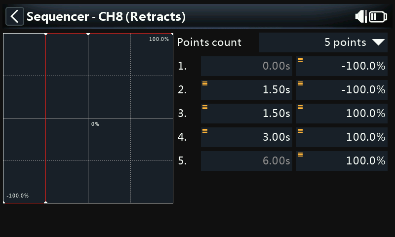

The curve has 5 points by default, but may have up to 21 points. Both X and Y coordinates are configurable.

The curve for the retracts should have a step function, because in our example we are using retracts that expect a switch input. The step is achieved by editing the X value for point 3 to be the same as the X value for point 2.

##### Add a backward curve

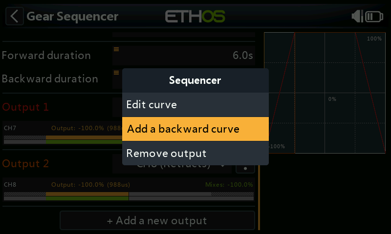

We will now add a backward curve. Tap on ‘Add a backward curve’ in the output 2 curve menu.

##### Edit backward curve

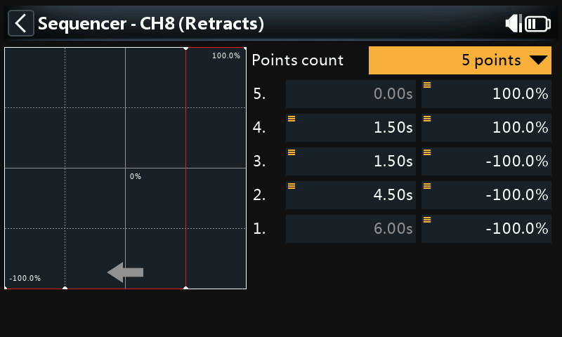

Note that the backward curve editing screen now shows an arrow for the direction, to help distinguish between them.

The backward curve has been edited to move the step to point 4 on the curve, so that the retracts are pulled up as soon as the gear doors are open.
