# 'How To' section

## 1. How to set up a low battery voltage warning

In this age of telemetry, a better battery management approach is to monitor the battery voltage under load, and raise an alert when the voltage drops below the chosen threshold.

For this a battery voltage sensor such as the FrSky FLVSS can be used.

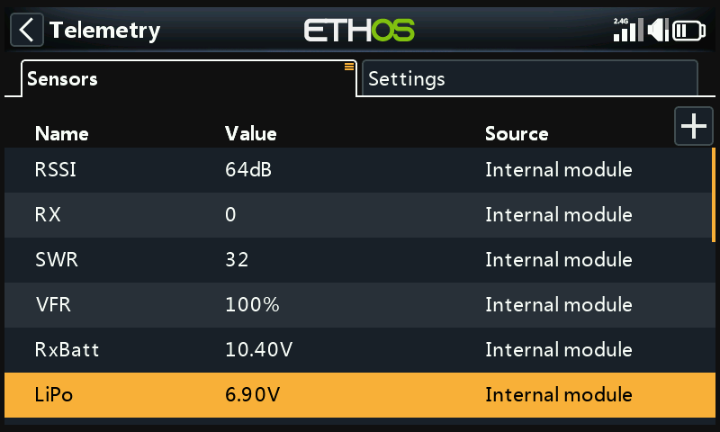

In Receiver Options set the Telemetry Port to the S.Port option. Connect the FLVSS to your receiver via an S.Port cable, and enable the 'Discover new sensors' option in Model / Telemetry. The additional LiPo sensor is shown in the example above.

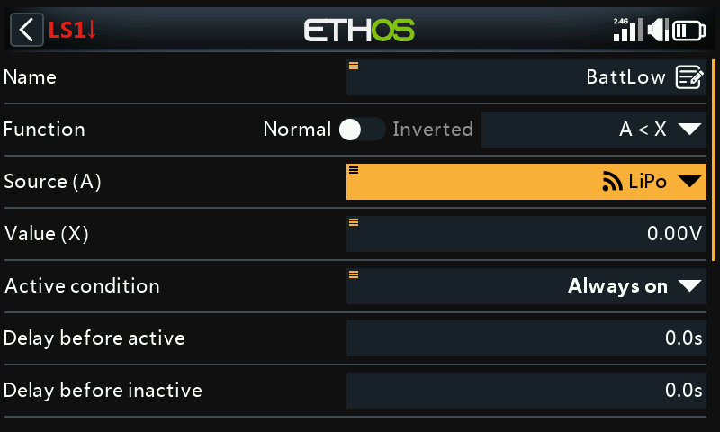

Add a new Logical Switch and select the Lipo sensor as the Source.

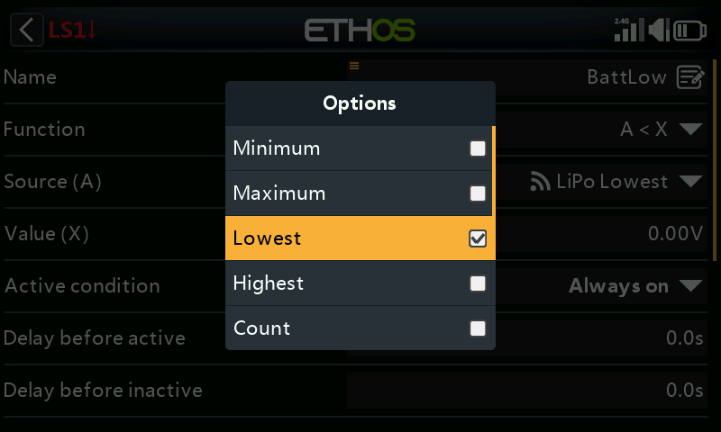

With the Lipo sensor highlighted, long-press the \[ENT\] key to bring up an options dialog. Select the Lowest from the list of Lipo sensor options, which include Min pack voltage, Max pack voltage, Lowest cell voltage, Highest cell voltage, cell Count and the individual cell voltages.

Note: The individual cells are only selectable as sources while the FLVSS/MLVSS is hooked up to a bound receiver and has a lipo connected!

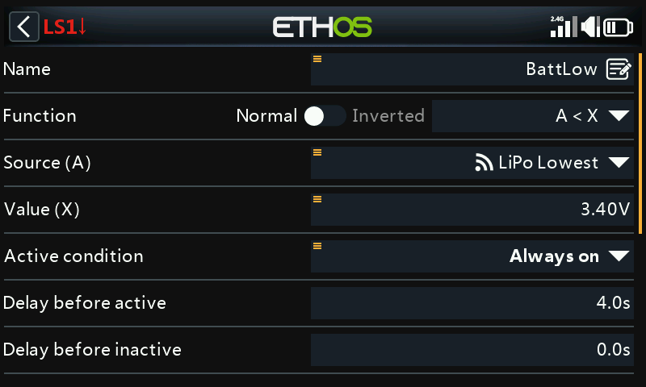

Set the Value to something like 3.4V, and 'Delay before active' to 4 seconds. The Logical Switch will become True/Active when the lowest cell voltage remains below 3.4 per cell for 4 seconds or more. A threshold of 3.4V under load will recover to around 3.7V when no longer under load.

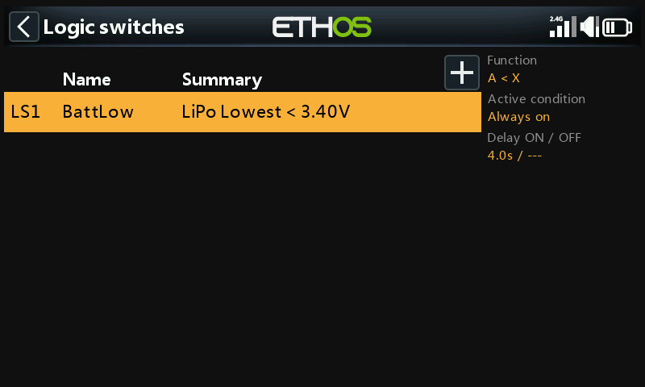

The completed Logical Switch for battery low is shown above.

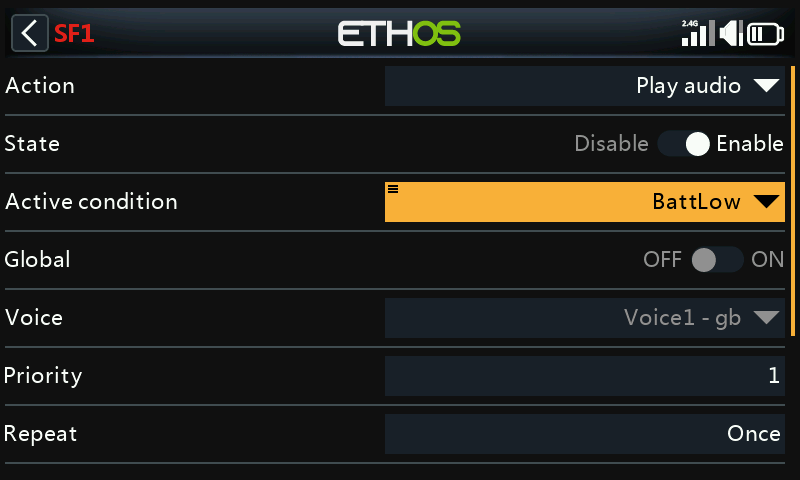

Add a special function to speak the value of the LiPo total voltage when the BattLow logic switch becomes True.

Set the Active Condition to the logic switch BattLow. Select the voice you wish to use.

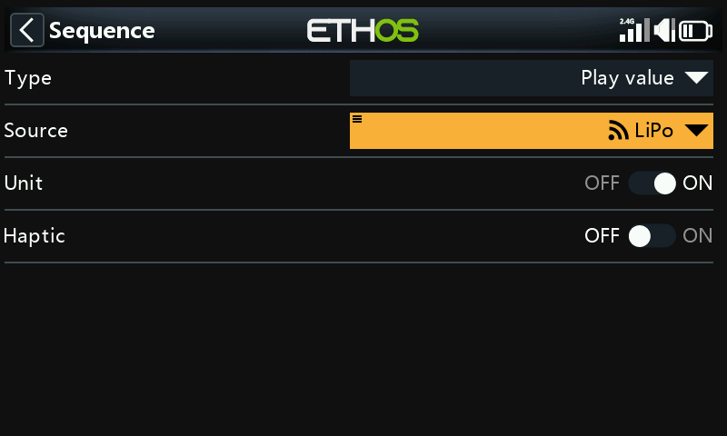

Under ‘Sequence’ add a ‘Play value’ command to speak the Lipo voltage.

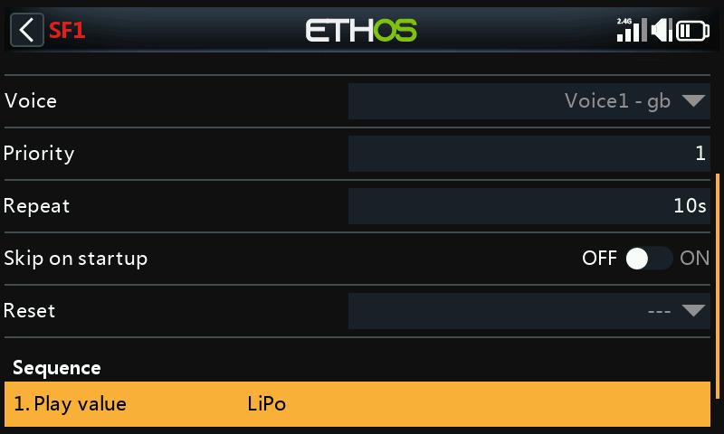

The Lipo voltage will be played every 10 seconds when its value drops below the threshold of 3.4V per cell for 4 seconds as set up in the logical switch above.

## 2. How to s***et up*** a battery capacity warning using a Neuron ESC

The best method of monitoring battery usage is to measure the energy or mAh consumed, so that the remaining battery capacity can be calculated. The FrSky Neuron series of ESCs offer this capability. If your ESC does not have this capability, a current sensor may be used with a calculated Consumption sensor, please refer to the next example.

In Receiver Options set the Telemetry Port to the S.Port option. Connect the telemetry port of the Neuron ESC to your receiver via an S.Port cable, and enable the 'Discover new sensors' option in Model / Telemetry. The additional sensors are shown in the example above. The sensor of interest is 'ESC Consumption'.

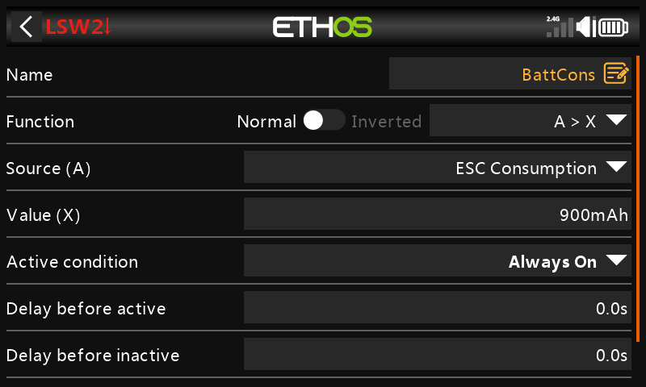

Add a new Logical Switch to monitor the 'ESC Consumption', and become True/Active when the consumption exceeds say 900mAh, or approximately 60% of the battery capacity, allowing sufficient capacity to land and still have about 30% left.

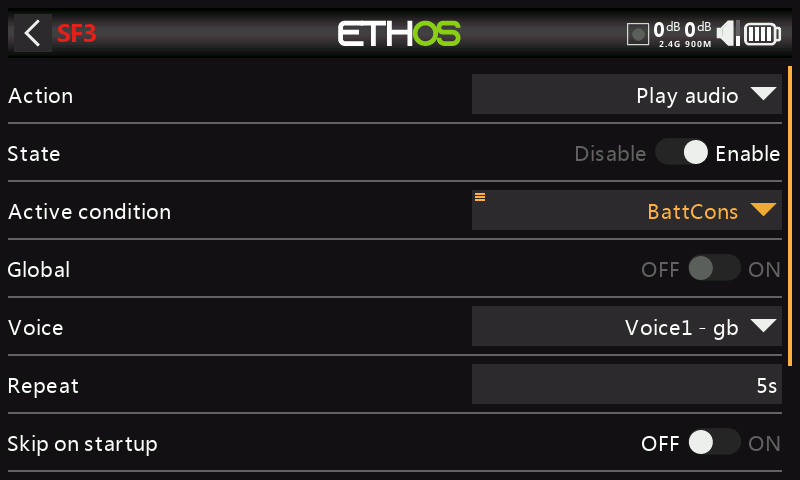

Add a special function to speak the value of 'ESC Consumption' when the BattCons logical switch become True.

Under ‘Sequence’ add a ‘Play value’ command to speak the value of the ESC Consumption telemetry sensor.

As an additional safeguard, we can also set up an alert for battery voltage using the Neuron 'ESC Voltage' sensor.

Add a new Logical Switch to monitor the 'ESC Voltage', and to become True/Active when the 'ESC Voltage' voltage remains below 3.4 per cell for 4 seconds. In the example a 4S LiPo is being monitored, so the threshold is set to 3.4×4 = 13.6V. A threshold of 3.4V under load will recover to around 3.7V when no longer under load.

Now add a special function to speak the value of 'ESC Voltage' every 5 seconds when the logical switch BattLow becomes True..

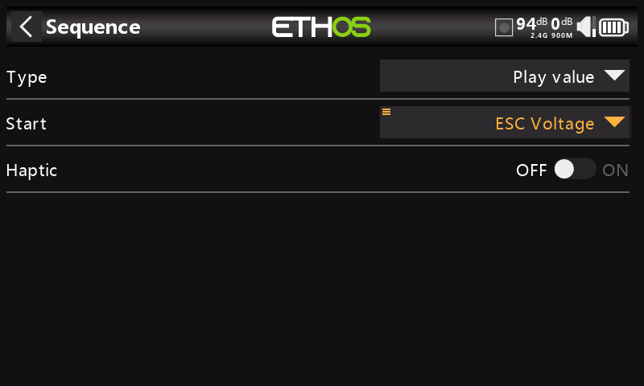

Under ‘Sequence’ add a ‘Play value’ command to speak the value of the ESC Voltage telemetry sensor.

## 3. How to s***et up*** a battery capacity warning using a ***calculated sensor***

This is another example of monitoring battery usage by measuring the energy or mAh consumed, so that the remaining battery capacity can be calculated. If your ESC does not have this capability, a current sensor such as the FrSky FASxxx series may be used together with a calculated Consumption sensor.

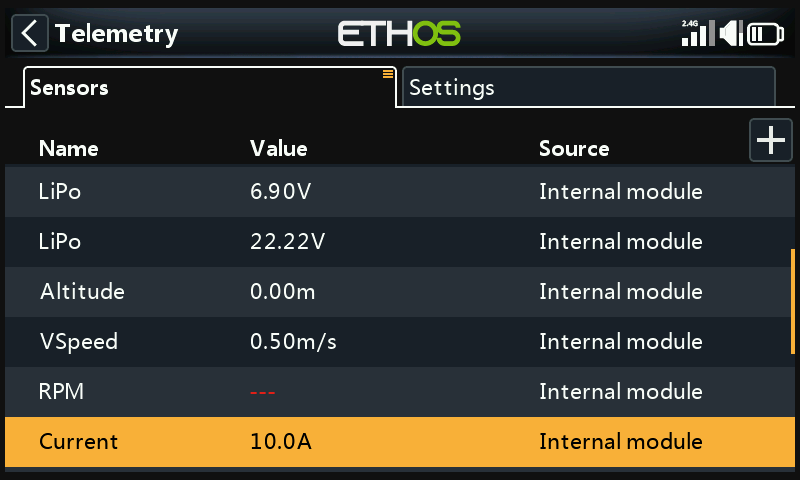

Connect the telemetry port of the FASxxx current sensor to your receiver via an S.Port cable, and enable the 'Discover new sensors' option in Model / Telemetry. The additional sensors include ‘Current’ as shown in the example above.

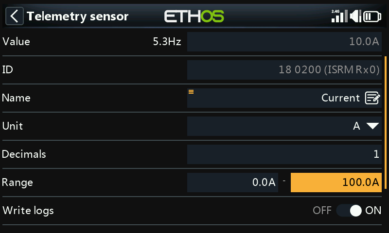

In this example a FAS100 was used, so the Range is set to 0-100A.

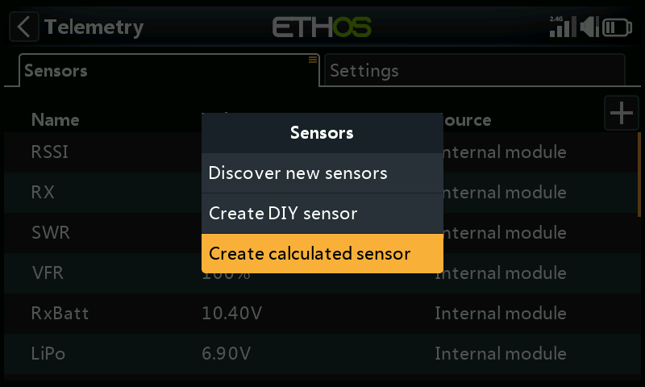

In Telemetry click on 'Create Calculated Sensor'.

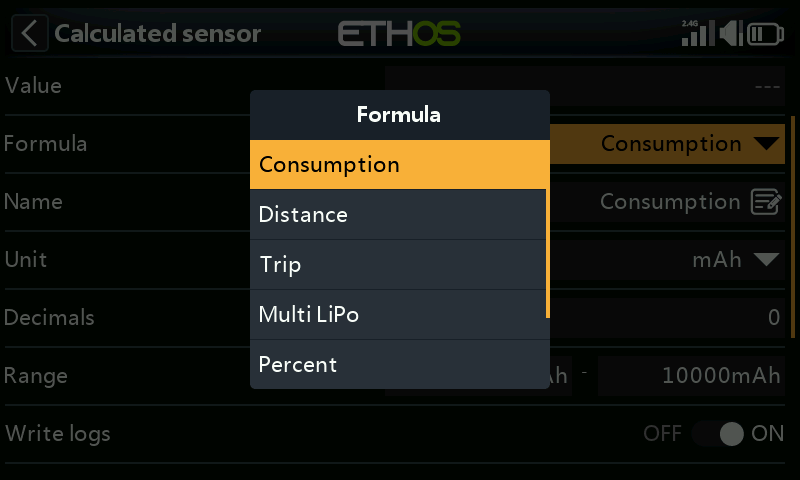

And select 'Consumption' from the popup dialog.

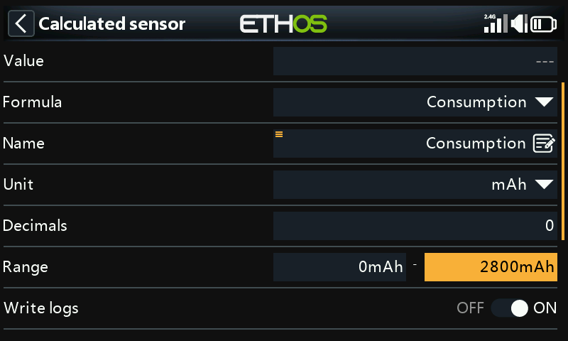

Configure the Consumption sensor to use 'mAh' units, and set the range to suit your Lipo, e.g. 2800mAh.

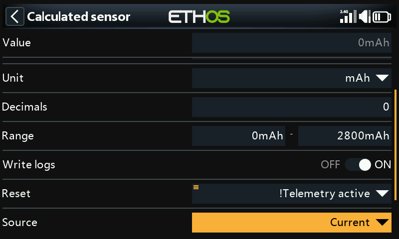

Select a suitable Reset condition, such as system event ‘!Telemetry Active’. First select ‘Telemetry Active’, and then long press Enter on it to bring up the option menu, and select ‘Invert’. The sensor will be reset when telemetry is lost when the model is switched off.

Select the source as 'Current'.

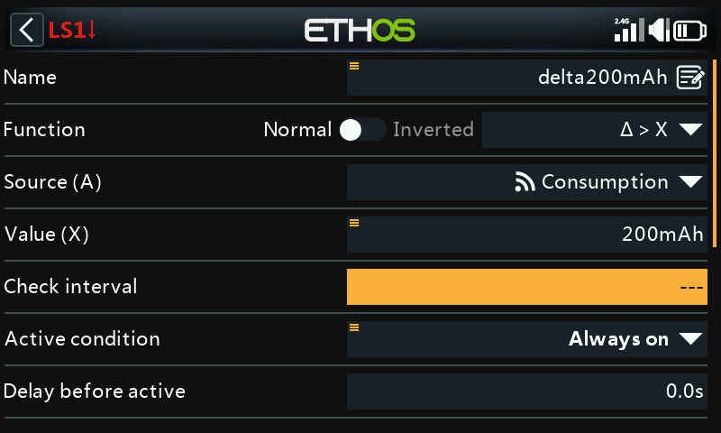

Add a new Logical Switch using the Delta (∆>X) function to monitor the Consumption sensor, and become True/Active every time the consumption reaches say 200mAh, or a convenient fraction of the battery capacity.

Please note that for the consumption calculation you want the function to keep measuring until your threshold is reached, so the Check Interval must be set to Infinite (i.e. ‘---‘).

Also the Min Duration can be set to greater than 0 so you can see it triggering while debugging. At 0.0 it happens too fast to see it.

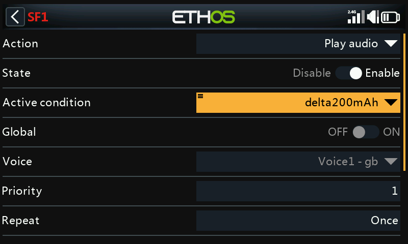

Add a ‘Play audio’ special function call up our ‘delta200mAh’ logic switch to speak the value of Consumption every time the logic switch becomes True.

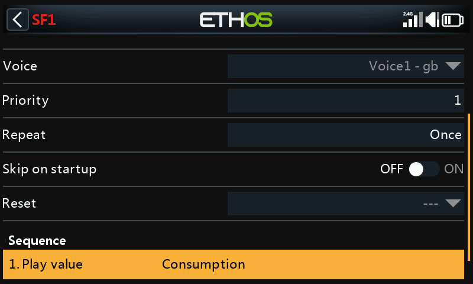

Add an audio action to play the value of the ‘Consumption’ sensor’.

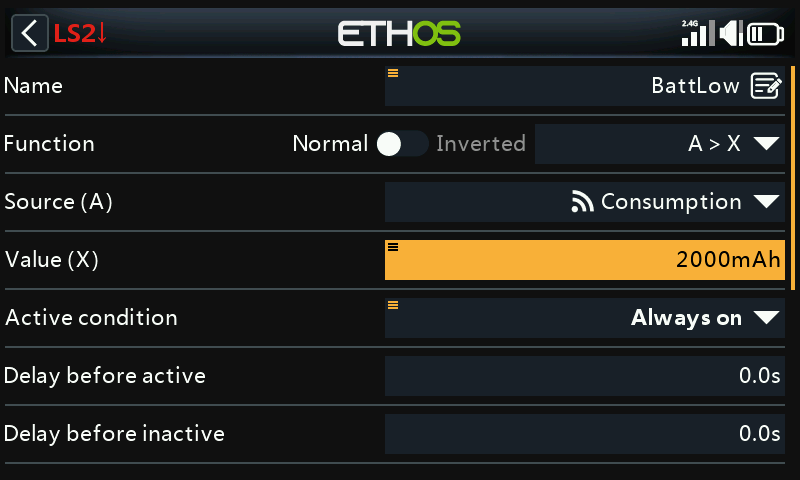

In addition, you can set up another logic switch to trigger a call out of Consumption every 10 seconds once a threshold such as your low limit has been reached. In our example, a threshold of 2000mAh has been set for a 2800mAh LiPo.

Set up a special function to play the value of Consumption once the BattLow logic switch triggers when the 2000mAh threshold has been reached.

Select the voice you wish to use.

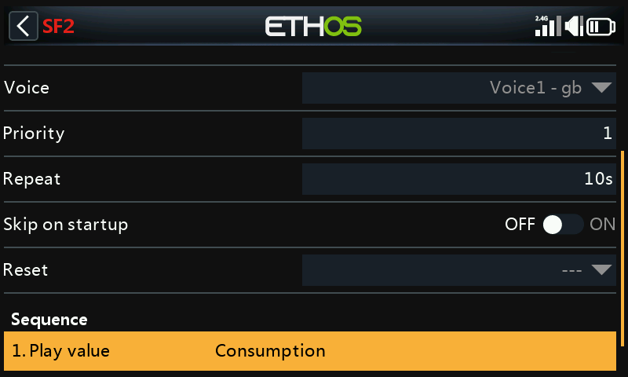

Configure the special function to repeat every 10 seconds

Configure the audio action to play the value of the ‘Consumption’ sensor’.

## 4. How to create a model utilizing a stabilized receiver

To begin, please familiarize yourself with the System / Device Config / Receiver section.

The model creation wizards use the channel order as defined in System / Sticks, by default AETR which denotes that channels 1 to 4 are in the order Aileron, Elevator, Throttle, Rudder. However, for models with more than one surface for ailerons, elevator, rudder, flaps etc the wizard will normally group these surfaces, so for example you would get AAETR if using 2 Aileron channels.

The FrSky stabilized receivers expect a channel order of AETRA, so the wizard must be told (in System / Sticks) to keep the 'First four channels fixed':

### Step 1. Confirm the default channel order

In System / Sticks, confirm that the default channel order is AETR.

### Step 2. Enable 'First four channels fixed'

In System / Sticks, enable the 'First four channels fixed' setting. This will ensure that the wizard does not group similar channels (within the first four) and keep for example both Aileron channels together.

### Step 3. Create the model using the wizard

Run the new model creation wizard by clicking on the \[+\] in Model / Select Model, select your stabilized receiver on the receiver options page, and then add all the channels you will be using. The first 5 channels will be AETRA. The necessary channels for controlling the gyro gain and stabilization mode are also pre-configured. Please refer to the [Adding a New Model](../model-setup/model-select.md) section for more details.

### Step 4. Configure stabilization

Please refer to the [Stabilizer config](../system-setup/device-config.md) section for details on configuring stabilization, including guidance on choosing the correct Lua stabilization tool for your receiver. It also includes links to a very details configuration document as well as a video.

#### Notes

Please note that Self Check for Archer receivers is now performed via the System / Device Config / SxR tool. The Archer receiver firmware must be v2.1.10 or higher.

Note that the throttle channel 3 must be at -100 or the Self Check will not be initiated. However, from firmware version v3.0.0 onwards, the throttle channel setting of -100% is no longer required.

There is also no longer a panic mode on channel 12.

## 5. How to reorder channels e.g. for SR8/SR10

You may wish to convert an existing model for use with an FrSky stabilized receiver. This might involve re-ordering the channels.

Your current model may have a channel order of AAETRFF.

CH1	Aileron1 (Right)

CH2	Aileron2 (Left)

CH3	Elevator

CH4	Throttle

CH5	Rudder

CH6	Flap1 (Right)

CH7	Flap2 (Left)

CH8	Retracts.

The FrSky stabilized receivers have a defined channel order AETRAE as follows:

CH1 Aileron1 (Right)

CH2 Elevator

CH3 Throttle

CH4 Rudder

CH5 Aileron2 (Left) or AUX1

CH6 Elevator2 or AUX2

then

CH9 Gain

CH10 & CH11 Flight modes

CH12 Self check on older SxR receivers

### Step 1. Change CH2 (Aileron2) to CH9

First we move CH2 (Aileron2) out of the way.

a) Go to Model / Channels, and tap on CH2 (Aileron2) to highlight it.

b) Tap again, and select Swap Channels from the popup dialog.

c) The swap dialog opens with the first channel (i.e CH2 Aileron2) already filled in. Select CH9 as the channel to be swapped.

d) Click ‘OK’ to swap CH2 and CH9 channel settings. Note that the swap takes place immediately. All mixes etc will be adjusted accordingly.

e) You will now have Aileron2 on CH9.

### Step 2. Swap CH3 (Elevators) and CH2

a) Repeat the above steps to move CH3 (Elevators) to CH2.

### Step 3. Change CH4 (***Throttle***) ***to*** CH3

a) Repeat the above steps to move CH4 (Throttle) to CH3.

### Step 4. Swap CH5 (***Rudders***) and CH4

a) Repeat the above steps to move CH5 (Rudders) to CH4.

### Step 5. Swap CH9 (Aileron2) to CH5

a) Repeat the above steps to move CH9 (Aileron2) to CH5.

### Step 6. Confirm new channel order

As can be seen in the above example, the channels are now in the correct order for FrSky stabilized receivers:

CH1	Aileron1 (Right)

CH2	Elevator

CH3	Throttle

CH4	Rudder

CH5	Aileron2 (Left)

CH6	Flap1 (Right)

CH7	Flap2 (Left)

CH8	Retracts.

## 6. How to configure a Butterfly (aka Crow) mix

Butterfly or crow braking is used to control the rate of descent of an aircraft, most commonly used on gliders. The ailerons are set to go up a modest amount, say 20%, while the flaps go down a large amount. This combination creates a lot of drag, and is very effective for braking and therefore ideal for controlling the landing approach.

For this example it will be assumed that a Butterfly mix is to be added to a glider which already has Flap channels created by the model creation wizard. Gliders typically use the throttle stick for braking. We will configure the mix so that no butterfly is added with the throttle stick up, and butterfly progressively increases as the stick is moved down.

Compensation is also needed on the elevator to avoid the glider ballooning up when crow is applied. We will use a curve because the response is non-linear.

### Step 1. Disable the default Flaps mix

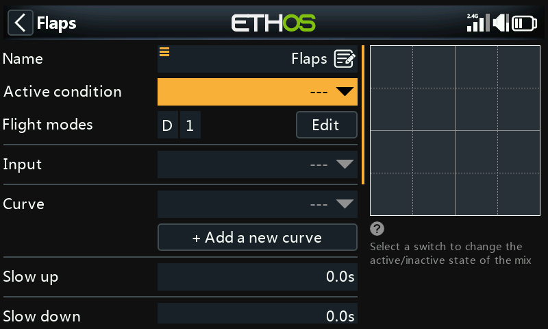

We will not be using the default Flaps mix, so if not already disabled, we will disable it by setting the active condition in the Flaps mix to ‘---’.

### Step 2. Create the Butterfly mix.

In the main mixes screen new mixes may be added by tapping on the ‘+’ symbol next to the column headings.

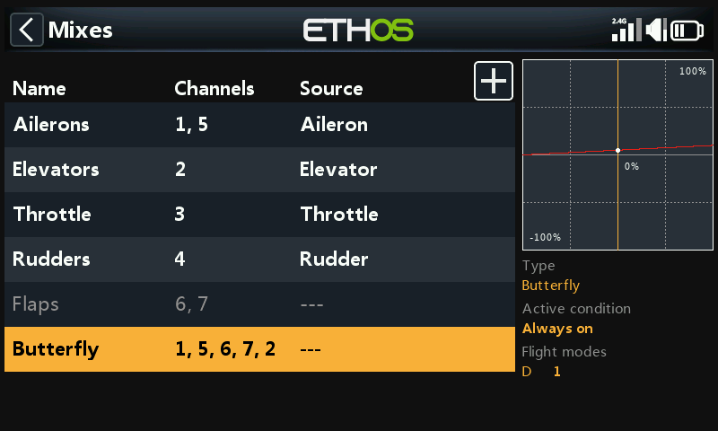

### Step 3. Configure the input to the Butterfly mix

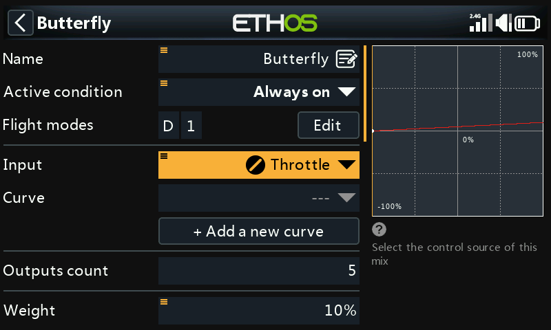

We will be using the Throttle stick as the input control, so we can set the Input to ‘Throttle’.

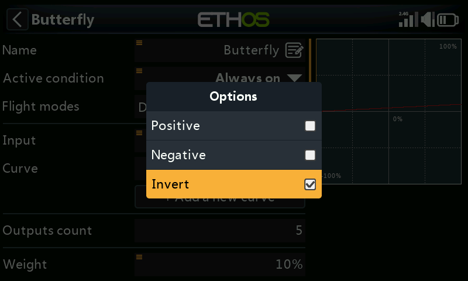

By default the Throttle input is at maximum when the stick is fully up. For the Butterfly mix we want it to be at 0 when the stick is fully up, so we will invert the input. Long press on ‘Throttle’ for the Invert dialog.

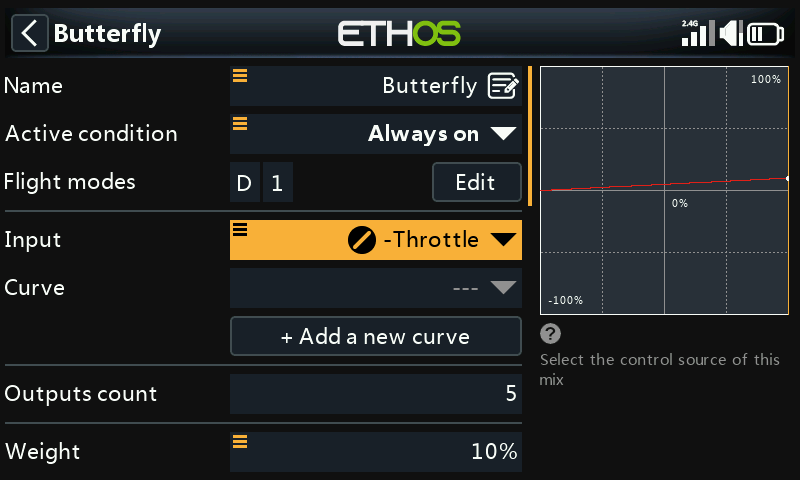

With the Throttle stick fully up, the Input now sits at 0 (see above). The Input parameter now says ‘-Throttle’ to indicate that it has been inverted.

If you do not want the Butterfly mix to be active all the time, the ‘Active condition’ may be set to a flight mode such as a landing mode, or other control as desired.

### Step 4. Add a deadband curve

Generally, it is a good idea to have a little flap stick deadband at the zero end to prevent accidental deployment if the stick moves a little from the end stop.

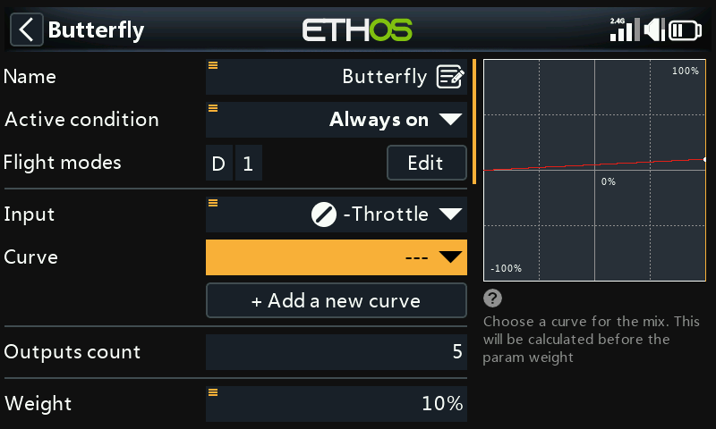

Tap on the Curve parameter.

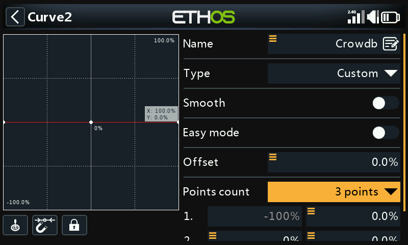

Name the curve something like ‘Crowdb’, make it a custom curve with 3 points, and turn ‘Easy mode’ off so that we can shift the X points.

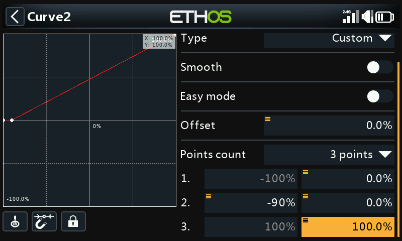

As soon as you add your own curve to the Butterfly mix, the internal offset that makes the source control operate from 0 to 100 is removed. This means our curve must also transform the source control to go from 0 to 100.

You can see above that the curve will output 0% until the throttle stick reaches -90%, then increase linearly to 100%.

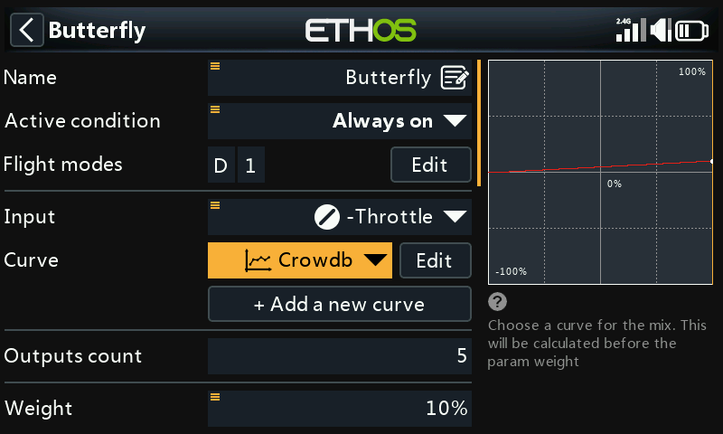

The throttle input now has a dead band applied to it.

### Step 5. ***Configure*** the Ailerons and Flaps

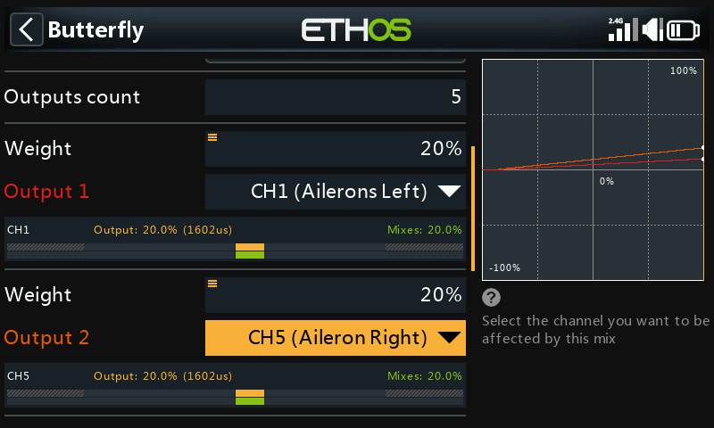

Normally for butterfly or crow braking, the ailerons are set to go up a modest amount, say 20%, while the flaps go down a large amount. This combination creates a lot of drag, and is very effective for braking. (In the above example the top graph line is at 20% for the ailerons, the other channels are still at 10%.) The vertical yellow line shows that the Throttle stick is fully down, i.e. at the full Butterfly position, so the Aileron outputs are at 20%.

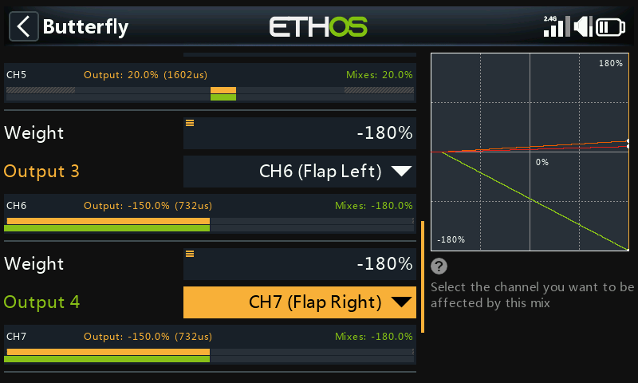

Flaps are unusual in that a very large downward deflection is needed, with very little or no upward movement. This may be achieved by sacrificing some upward travel in favor of downward travel. In practice the flap servo horns may be offset from neutral by say 20 or 30 degrees.

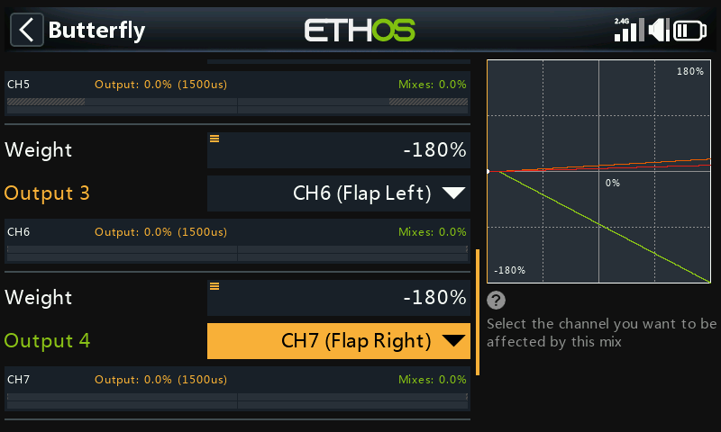

In this situation the flaps will be half down at servo neutral (mid stick) (refer to the screenshot above), which means an offset mix will be needed to bring the flaps up to their neutral position for normal flight (see step 4 below).

We have set the Flap weights to -180% for maximum travel. The actual travel may be configured in the Channels section. (To avoid overdriving servos the initial min/max limits should be set to something like +/- 30% in the channel outputs, and then increased during final setup while being careful not to overdrive the servos. Please note that for the sake of clarity this has not been done for this example, they are set to -180%.). The example above shows the flaps in the fully down position.

### Step 6. Add a 'Flaps Neutral' offset mix

If you have offset your flap servo horns to achieve sufficient downward travel, the flaps will probably be deflected downwards about 20-30% at servo neutral. We need to add an offset using an Offset Mix to bring the flaps up to the wing neutral position for normal flight.

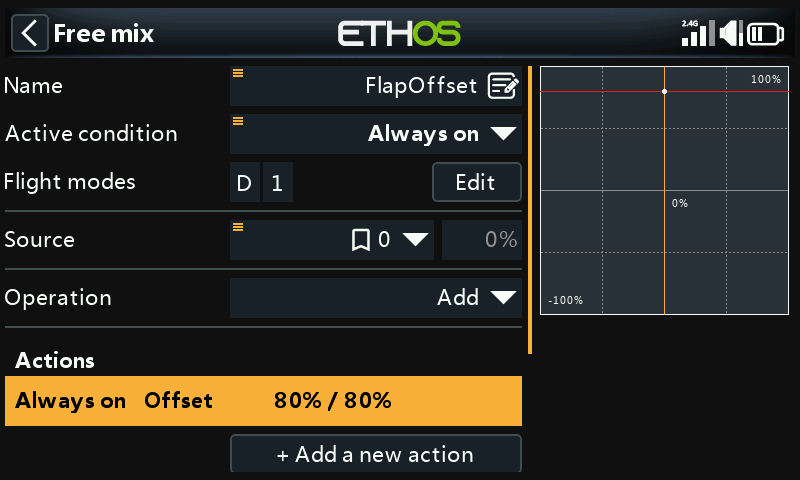

Add an Offset Mix. We will start with an offset of 80%, which will need to be tweaked to achieve a ‘flaps neutral’ situation.

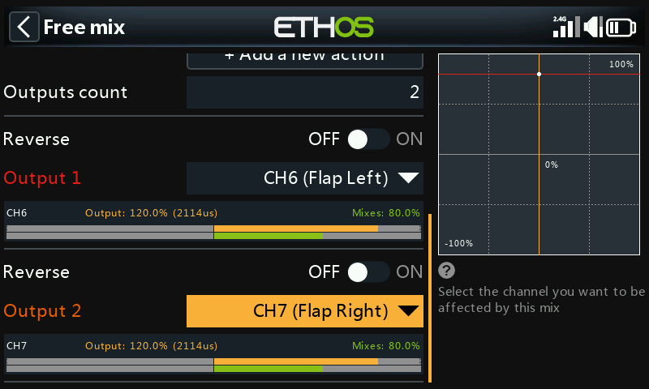

Move the throttle stick fully up to ensure that the Butterfly mix is off and not contributing to the flap channels.

Set the 'Channels count' to 2, and the mix Outputs to your flaps channels. In this example the flaps are on channels 6 and 7, and the mixer values are at 80% as per our Offset we have just set. (Note that the Orange bars showing the Channel outputs are higher than the Mixer values because the Min/Max limits for the Flaps have been set to +/- 150% in Channels.)

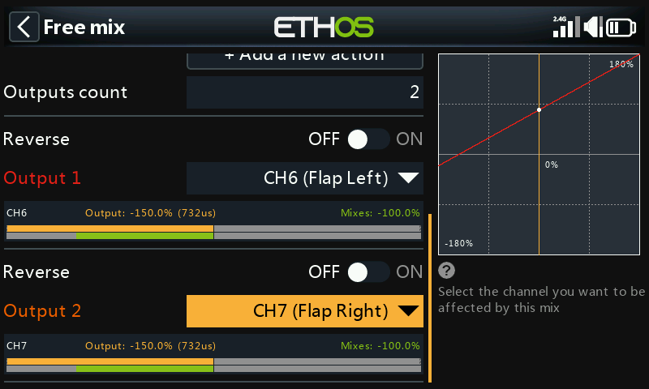

Move the flap stick to the fully deployed position. The screen above shows that the mixer outputs have moved by 180% (i.e. the Weight setting) from +80% down to -100%.

The actual flap servo travel limits should be configured in the Channels section, using either the Min and Max settings, or by using a curve.

### Step 7. Add the Elevator compensation curve and mix

Compensation is needed on the elevator to avoid the glider ballooning up when crow is applied. We will use a curve because the response is non-linear.

To add non-linear elevator compensation to the butterfly mix. the Weight parameter for the Elevator must be changed to a mix which in turn calls up a compensation curve.

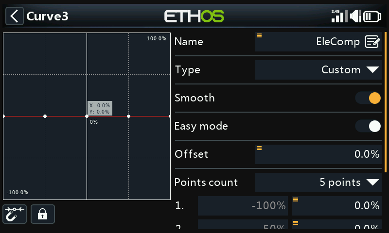

Define a curve EleComp as a custom 5 point curve.

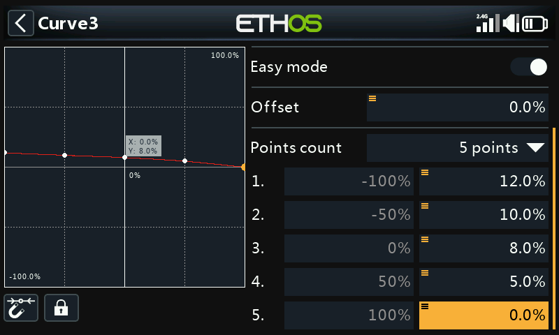

In this example EleComp has initial values of 12%, 10%, 8%, 5% and 0%. If your aircraft does not have an elevator compensation curve specified, these points will need to be determined empirically.

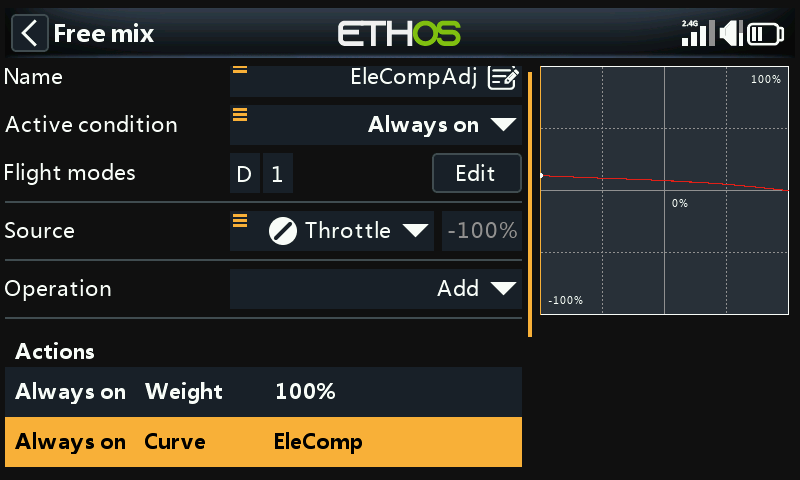

Next we define a high mix which will convert our compensation curve into a variable value suitable as a weight in the Butterfly mix. Use a Free Mix, with throttle as source and attach the curve EleComp. Let’s call it EleCompx.

Finally assign the EleCompx mix output to a high channel such as CH20.

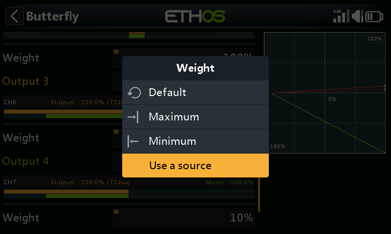

Now go back to the Butterfly mix, scroll right down and long-press \[ENT\] on the Weight for the Elevator mix Output, then select 'Use a source'.

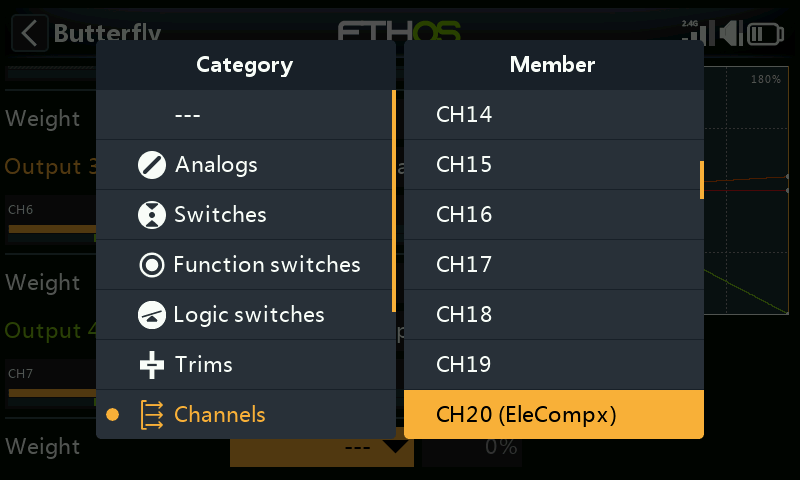

Tap on it again, then choose the Channels category and navigate to CH20 (EleCompx) and select it.

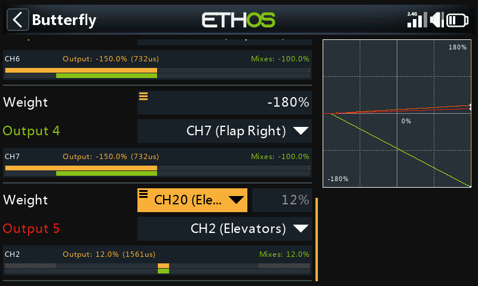

The Butterfly mix is now configured.

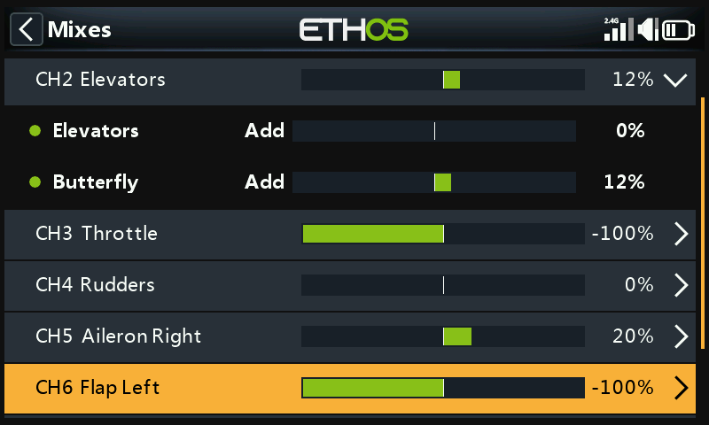

Switching to the ‘View by Channel’ view allows you to see the effect of moving the throttle stick on all the other channels together, which is much easier for debugging etc.

## 7. How to configure an FBUS system

The FBUS (previously F.Port 2.0) protocol is the upgraded protocol which integrates SBUS for control and S.Port for telemetry into one line. This new protocol enables one Host device to communicate on one line with several Slave accessories. For example FBUS servos are controlled on one daisy-chained connection while also sending their servo telemetry back to the receiver on the same connection. All FBUS devices connected to a receiver (Host) can be configured wirelessly from the radio on this protocol.

In this example we will configure 2 Xact servos to work with our Basic Fixed Wing Airplane example in the tutorials above on the Aileron channels 1 and 5.

### Step 1: Download the latest firmware

FBUS requires use of the latest firmware for receivers and devices. For example, the firmware for the Xact servos must be at least v2.0.1.

Go to the Download section of the FrSky website [https://www.frsky-rc.com/download/](https://www.frsky-rc.com/download/) and download the relevant receiver and FBUS device (such as Xact servo) updates.

### Step 2: Flash the firmware

Copy the downloaded firmware files to the Firmware folder on the SD card or eMMC.

Got to System / File Manager and scroll to the relevant firmware file. In the example above we have chosen the update file for the Xact HV5201 servo. The file date is 2022-02-15, which is for the v2.0.1 version.

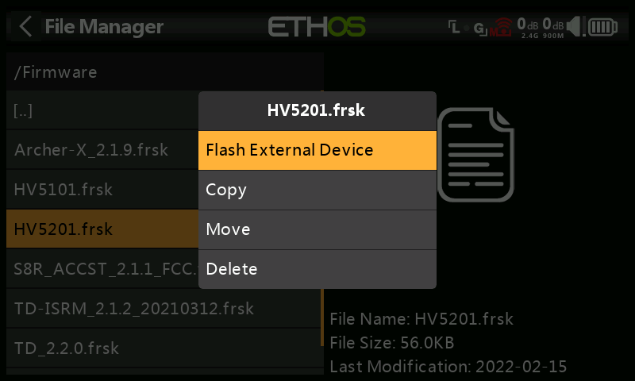

Plug the servo lead into the S.Port connection at the top of the radio. The white or yellow lead goes to the side with a notch. Tap on the highlighted filename, and select ‘Flash External Device’. Flashing will commence, with a bar chart showing progress.

### Step 3: Configure the Physical IDs

Next we have to configure the Physical IDs and Application IDs for the two Xact servos. Note that they must be unique to avoid conflict on the FBUS.

#### Step 3a: Configure the Physical ID and Application ID for servo 1

Plug the first servo into the S.Port connection at the top of the radio. The white or yellow lead goes to the side with a notch.

Go to System / Device config / XAct.

When the configuration page opens, click on Module and select S.Port connector.

Confirm that the default Physical ID is 0C hex, and the Application ID is 6800 hex. For the first servo we can leave the Physical ID and the Application ID at the default values.

We can leave this servo at the default channel number it will respond to. Scroll down and confirm that Channel is set to CH1.

If you have made any changes, scroll further down and tap on the ‘Save to flash’ button.

#### Step 3b: Configure the Physical ID and Application ID for servo 2

For the second servo we need to change the default Physical ID of 0C to an unused slot, please refer to the Physical ID table in the Telemetry section. We will choose 0D hex for this example.

Confirm that the Physical ID is 0C hex, and the Application ID is 6800 hex.

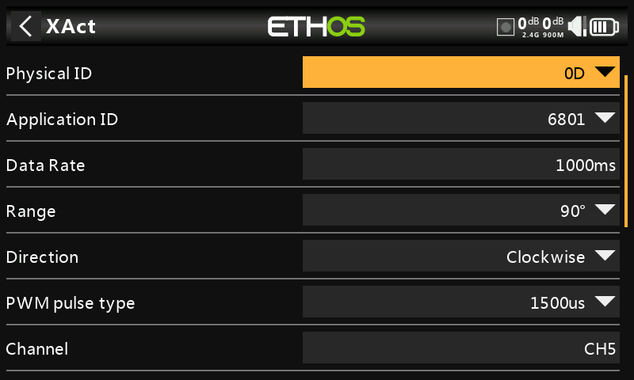

Tap on the Physical ID and select 0D hex. Tap on the Application ID and select 6801 hex.

We also need to assign the channel number we want this servo to respond to, in this example CH5. Scroll down and change the Channel to CH5.

Then scroll further down and tap on the ‘Save to flash’ button.

### Step 4: Configure ***the*** receiver for FBUS

#### 4a: Configure ***an SR10 Pro*** receiver for FBUS

With an SR10 Pro registered and bound, go to RF System and tap on the ‘SR10’ button.

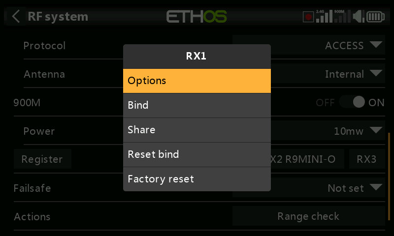

Tap on receiver ‘Options’.

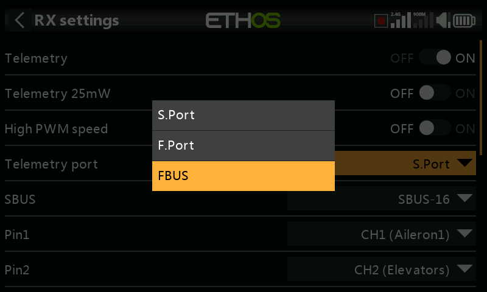

Scroll down to the ‘Telemetry Port’ parameter and select FBUS. The Telemetry Port on the receiver will now operate on the FBUS protocol. The Xact servos can now be daisy-chained off this FBUS port. Since the servos only have a single connector, F.Port 2.0 multichannel extenders such as the FP2CH4, FP2CH6 or FP2CH8 can be used to extend the FBUS wiring.

#### 4b. Configure a TD-R18 Tandem receiver for FBUS

With an TD-R18 Tandem receiver registered and bound, go to RF System and tap on the ‘TD18R’ button.

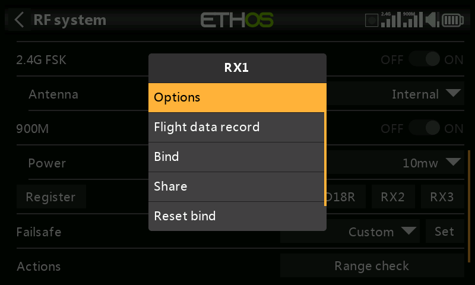

Tap on receiver ‘Options’.

Scroll down and tap on the Pin1 parameter, and select FBUS as the option for Pin1, to change the default PWM connection to the FBUS protocol.

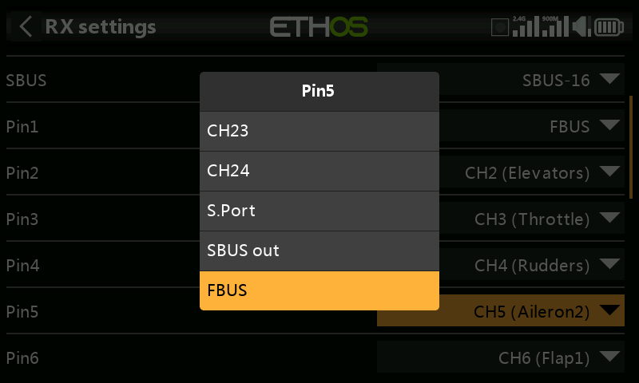

Repeat for pin5, to change the default PWM connection to the FBUS protocol.

The R18 receiver is now ready to operate two Xact servos plugged into Pin1 and Pin5 via the FBUS protocol. You can reassign as many ports as required to FBUS, which avoids having to use multichannel extenders.

### Step 5: Configure the Physical IDs

This section details an alternate way to configure the Physical IDs and Application IDs for the two Xact servos. Remember that they must be unique to avoid conflict on the FBUS.

#### Step 5a: Configure the Physical ID for servo 1

With only the first servo plugged in at Pin18, go to System / Device config / XAct.

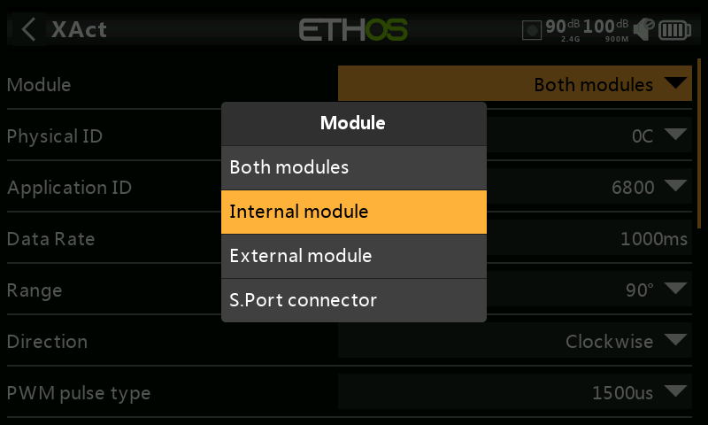

Click on Module and select ‘Internal module’.

Confirm that the default Physical ID is 0C hex, and the Application ID is 6800 hex. For the first servo we can leave the Physical ID and the Application ID at the default values.

We can leave this servo at the default channel number it will respond to. Scroll down and confirm that Channel is set to CH1.

Then scroll further down and tap on the ‘Save to flash’ button.

#### Step 5b: Configure the Physical ID for servo 2

For the second servo we need to change the default Physical ID of 0C to an unused slot, please refer to the [Physical ID table](../model-setup/telemetry.md) in the Telemetry section. We will choose 0D hex for this example.

Device Config can only connect to one servo at a time. So with only the second servo plugged in at Pin17, go to the Device Config / Xact and confirm that the Physical ID is 0C hex, and the Application ID is 6800 hex.

Tap on the Physical ID and select 0D hex. Tap on the Application ID and select 6801 hex.

We also need to assign the channel number we want this servo to respond to, in this example CH5. Scroll down and change the Channel to CH5.

Then scroll further down and tap on the ‘Save to flash’ button.

Exit the screen, reselect Device Config / Xact and confirm that the Physical ID has been changed to 0D hex, the Application ID to 6801 hex and the Channel to CH5.

### Step 6: Check FBUS ***control of the servos***

The servos are now ready for use. Plug servo 1 into the Pin1 position on the TD-R18, and servo 2 into the Pin5 position, which are the aileron channels on our Basic Fixed Wing Airplane example in the tutorials above. Note that all receiver pins programmed as FBUS carry exactly the same FBUS signal, this is just a convenient method of wiring your system so that each servo and FBUS device has somewhere to be plugged in.

Power the radio and receiver, and test that channels 1 and 5 operate the servos as expected.

### Step 7: Check the FBUS telemetry.

Finally, we can configure our telemetry. With both servos plugged in, go to Telemetry and delete any ‘SRV’ sensors, and then discover sensors again.

You should now see four sensors for each servo as shown above, namely servo current, servo voltage, servo temperature and servo status. The status shows OK with everything normal.

### Step 8: Making configuration changes

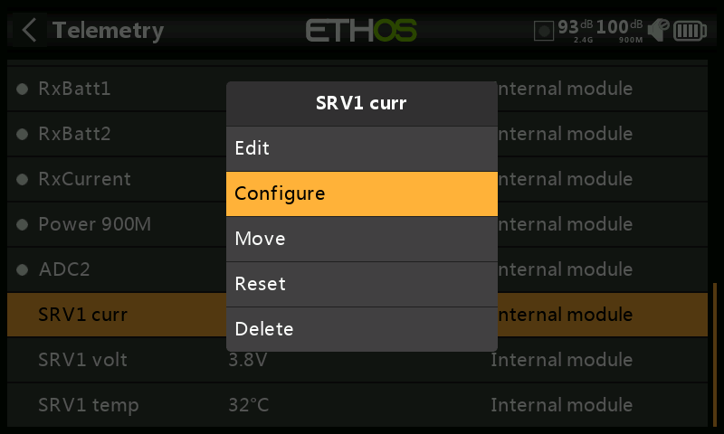

In a configured model it is not practical to isolate XAct servos in order to make configuration changes via Device Config.

Instead, go to Telemetry, scroll down to the XAct sensors, and highlight a sensor belonging to the servo you want to reconfigure, for example ‘SRV1 curr’.

Select ‘Configure’.

The configuration screen for the selected servo will be opened. After making changes, remember to scroll down and tap on the ‘Save to flash’ button. Take care not to change the Physical IDs and Application IDs.

## 8. How to test a Redundant Receiver setup

It is important to test your model thoroughly before flying, including redundancy.

This test assumes that you have configured a redundant receiver. Please also see [Adding a Redundant Receiver](../model-setup/rf-system.md) in the RF System section.

### A. Real world ***test***

Assuming you have your main receiver on 2.4G and the redundant receiver on 900M, you can activate Range Test, and simply walk out until the 2.4G stops working (i.e. past the RSSI Critical alert). The redundant receiver should have taken over at this point.

### B. Bench test

#### Step 1: Confirm normal setup

- Confirm that you have connected SBUS Out on the redundant receiver to SBUS In on your main receiver.
- Assuming you have your main receiver on 2.4G and the redundant receiver on 900M, confirm that both receivers are bound and green LEDs are on. Check that your controls are functioning.

#### Step 2: Redundancy test

- Make a clone copy of your model with a different Model ID.
- To avoid confusion rename the clone, perhaps by adding a suffix.
- Bind the main receiver to the cloned model. Using a clone ensures that the outputs will behave as normal, because all your mixes and programming will still be in place.
- Switch back to your model under test. The LED on the main receiver should now be flashing red, because it is bound to the clone model. The LED on the redundant receiver should be green. Your controls should be functional, proving that the redundant receiver is working.
- If you have external telemetry sensors, and they are daisy chained via S.Port to both receivers, then you should still be receiving their telemetry.

#### Step 3: Rebind the main receiver to its normal Model ID.

With the redundancy testing complete,

- Rebind the main receiver back to its normal Model ID.
- Confirm that the green LEDs on both receivers are on again, and check that your controls are functioning normally.
- Delete the cloned test model.

## 9. How to set up a User Defined Text Checklist

The Checklist function during startup can also display user defined text. The text can be plain text or enhanced text. Once the text file is installed for a given model and the radio is started with that model selected the radio will always display the Checklist for that model on startup.

### Step 1. Create the user defined Checklist text.

#### Option A - Plain Text

Write your checklist using a code editor such as Notepad++, or you can simply use MS Word and save your file with the model's name and a .txt extension.

#### Option B - Enhanced Text

For enhanced text Ethos supports Markdown syntax, which makes it easy to add formatting.

For example, to denote a heading, you add two ‘#’ characters before it. Or to make a phrase bold, you add two asterisks before and after it (e.g., \*\*this text is bold\*\*).

You can still use a text editor to create your checklist, embedding the formatting characters as needed. However, the file must be saved with with the model's name and an .md extension. Alternatively you can use a Markdown editor such as Nextpad or Marktext.

Example formatting elements:
