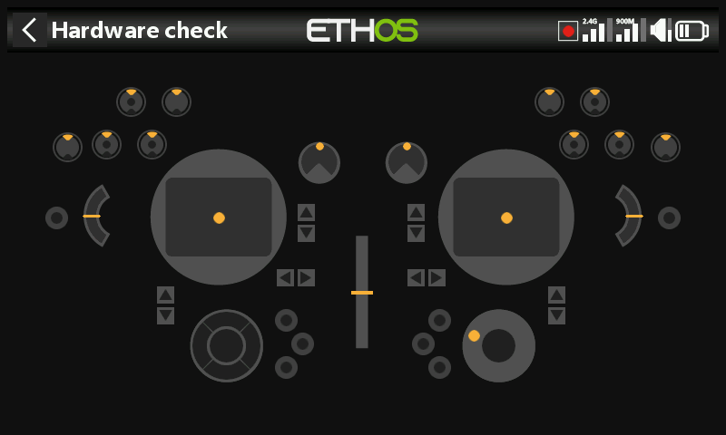

# X20 Pro / X20 Pro AW

Differences from the X20S baseline this manual is written against —
these apply to the **X20 Pro**, and mostly extend to the **X20 Pro AW**
and **X20R/RS** family too.

- **Storage** — internal 8GB eMMC by default, SD card optional — see
  [General → Storage
  location](../system-setup/general.md#storage-location-x18-and-x20-prorrs).
- **Extra trims** — adds trim switches **T5** and **T6** — see
  [Trims](../model-setup/trims.md#trim-settings).
- **Extra switches** — two latching pushbutton switches, **K** and **L**,
  on the rear shoulders, plus switch positions **M**/**N** if wired
  (typically stick-end switches) — see [Hardware →
  Switches](../system-setup/hardware.md#switches-settings).
- **Extra pots** — **Ext1**/**Ext2**, typically used with 3-axis gimbals
  — see [Hardware → Pots/Sliders](../system-setup/hardware.md#potssliders-settings).
  This shifts the [ADC value inspector](../system-setup/hardware.md#adc-value-inspector)
  index: Ext1/Ext2 sit between Pot2 and the sliders.
- **Haptic feedback** — the **X20 Pro AW** and **X20RS** ship with MC20R
  gimbals with haptic stick-shaker motors built in; an **X20 Pro** or
  **X20R** can gain the same via a retrofit MC20R gimbal upgrade, enabled
  under [Hardware → Enabling haptic gimbal
  upgrades](../system-setup/hardware.md#radio-specific-hardware-options).
  Once enabled, [Select haptic
  motors](../model-setup/special-functions.md#actions) offers Default,
  All motors, Left stick, or Right stick.
- **Rotary encoder** — the X20 Pro AW and X20R/RS use a more sensitive
  encoder; a **half steps** option under [Hardware → Encoder
  option](../system-setup/hardware.md#radio-specific-hardware-options)
  tones it down.
- **Internal RF module** — the X20 Pro/R/RS use the **TD-ISRM Pro**
  module (LoRa-capable, with tandem dual-band and TD-Pro modes in
  addition to ACCESS/ACCST D16), rather than the TD-ISRM module in the
  X18/X20/X20S/X20HD — see [RF System](../model-setup/rf-system.md).
