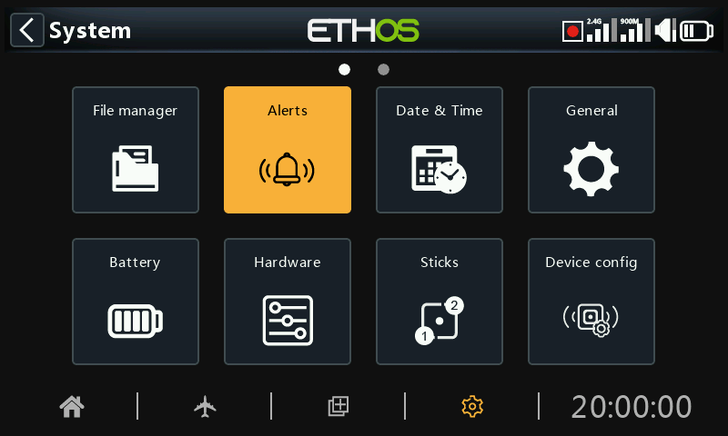
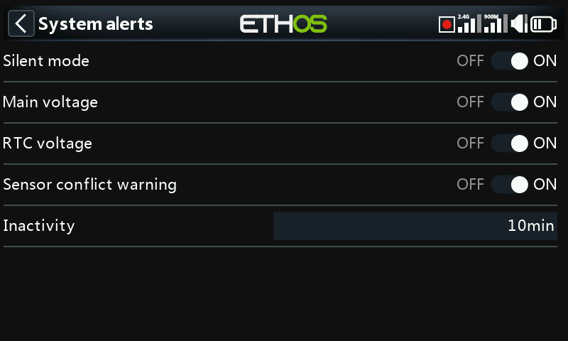
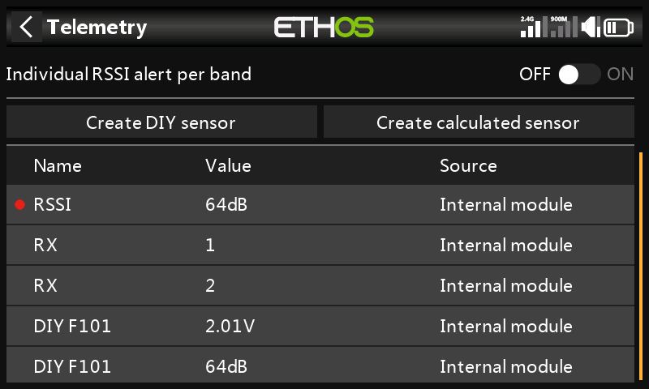

# Alerts

The System Alerts are:

## Silent mode

A ‘Silent mode’ alert will be given at startup when ‘Silent mode’ check is ON and the ‘Audio mode’ has been set to Silent in System / General / [Audio mode](../system-setup/general.md)

## Main voltage

A speech 'Radio battery is Low' alert will be given when the ‘Main voltage’ check is ON and the main radio battery is below the threshold set in the 'Low voltage' parameter in System / Battery.

## RTC v***oltage***

A speech 'RTC battery is Low' Alert will be given when the ‘RTC voltage’ check is ON and the RTC coin battery is below 2.5V, the default RTC battery threshold. It may be turned off until the RTC battery has been replaced, but should not be left off indefinitely. The real time is used in data logging, and an invalid time will cause difficulty in reading the logs, especially in distinguishing flight sessions.

## Sensor conflict warning

Sensor conflict detection may be disabled. This should only be needed if you have sensors which do not meet the S.Port specification.

## Inactivity

A speech 'Prolonged inactivity' alert will be given when the radio has not been used for longer than the 'Inactivity' time, and also a haptic alert in case the radio volume is turned right down. The default is 10 minutes.
