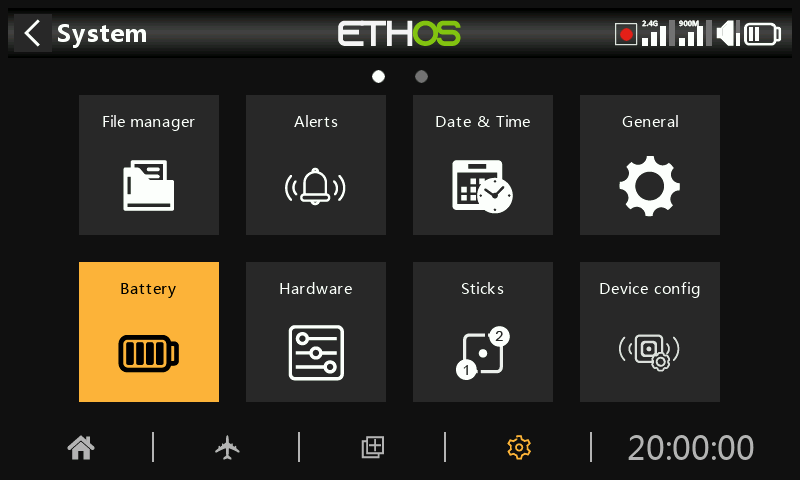
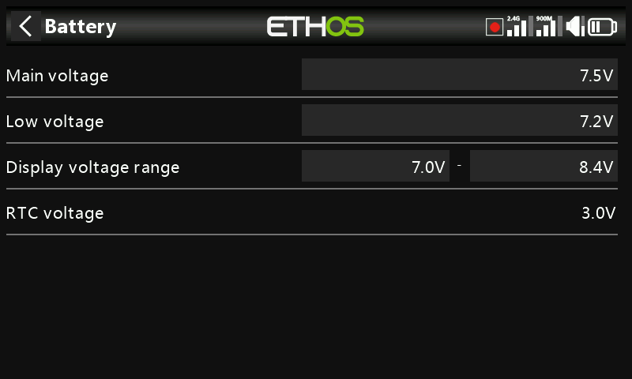

# Battery

The Battery section is for calibrating the radio batteries and setting the alarm thresholds.

## Main voltage

‘Main voltage’ displays the current battery voltage, but it is also the battery voltage calibration adjustment. You can enter the actual battery voltage measured with a multimeter. The default is 8.4V for a charged 2 cell lithium battery.

## Low voltage

This is the alarm threshold voltage. The default is 7.2V. A value of 7.4V would give an extra safety margin.

A Warning dialog will be opened, and a speech 'Radio battery is low' alert will be given every minute when the main radio battery voltage drops below the threshold set here if the ‘Main voltage’ check is ON in System / Alerts / [Main voltage](alerts.md).

Warning!

When this alert is given, it is prudent to land and charge the radio battery!  The alert is repeated every minute, even if the Warning dialog is open.

Please note that when the radio battery voltage drops to 6.0V the radio will shut down regardless to protect the LiIon battery (2 x 3.0V)!

## Display voltage range

These settings set the range of the graphical battery display in the top right of the screen. The default range limits for the built-in Li-Ion battery are 6.4 and 8.4V. Many pilots increase the bottom sensing voltage to trigger the low TX voltage alert earlier and prevent over discharging their TX battery.

The MIN value will be where the first dot bar goes off and MAX will be the value where the fourth dot bar will light up when using the graphical representation of the battery voltage.

If the battery is changed to a different type, then the limits must be set appropriately.

## RTC voltage

Shows the voltage of RTC (Real Time Clock) battery in the radio. The voltage is 3.0v for a new battery. If the voltage is below 2.7v please replace the battery inside the radio to ensure the clock runs properly. If the voltage drops below 2.5V, and alert will be given, please refer to Alerts / [RTC voltage](alerts.md).
