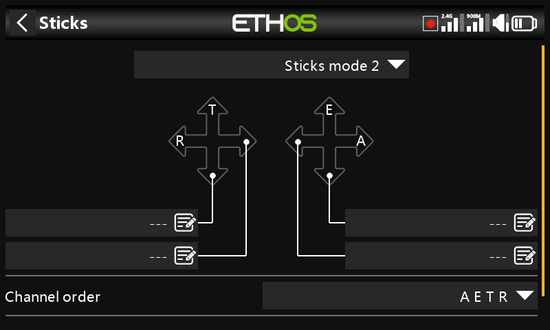
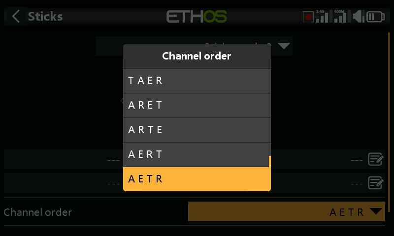
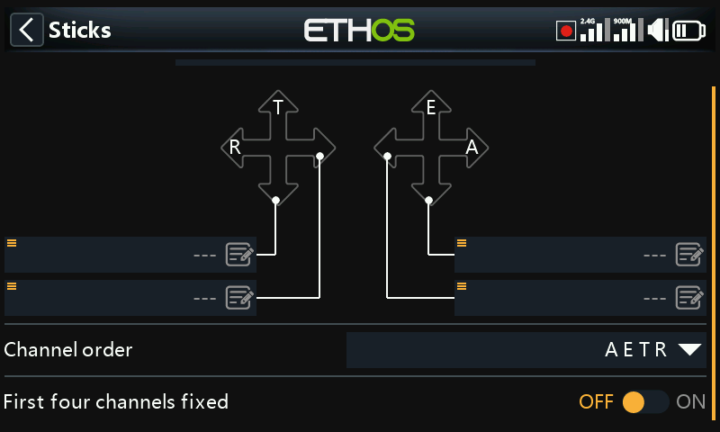

# Controls

Called **Sticks** in the menu — stick mode and the default channel
assignment order.

## Stick mode

- **Mode 1** — throttle and aileron on the right stick, elevator and
  rudder on the left.
- **Mode 2** — throttle and rudder on the left stick, aileron and elevator
  on the right.

Sticks are named for the industry-standard modes by default, and can be
renamed.

## Channel order

Defines the order the four stick inputs are assigned to channels when a
new model is built by the [Model Select](../model-setup/model-select.md)
wizards. Default is **AETR**. Where an airframe has more than one of a
given surface, they group together unless [First four channels
fixed](#first-four-channels-fixed) is on — e.g. 2 ailerons becomes
**AAETR**.

## First four channels fixed

With this enabled, the first four channels are never grouped. With order
**AETR** and an airframe with 2 ailerons, 1 elevator, 1 motor, 1 rudder,
and 2 flaps, the wizard produces **AETRAFF** (channels 1–4 stay exactly
A-E-T-R, with the second aileron and both flaps appended after) instead of
**AAETRFF**. This is the setting that makes the wizard build models
suited to SRx stabilized receivers, which expect that fixed layout.

