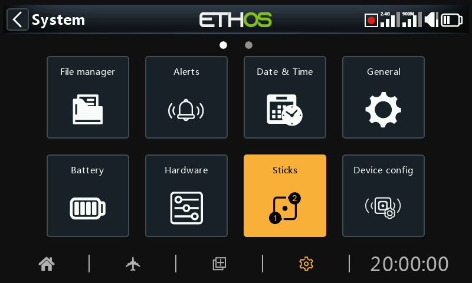

# Sticks

Select your preferred stick mode. Mode 1 has throttle and aileron on the right stick, and elevator and rudder on the left. Mode 2 has throttle and rudder on the left stick, and aileron and elevator on the right.

By default the sticks are named as listed above for the industry standard stick modes. They may be renamed as desired.

## Channel order

The ‘Channel order’ defines the order in which the four stick inputs are assigned to channels in the mixes when a new model is created by the wizards. The default order is AETR. If there are more than one of each type of surface, they will be grouped unless the first four channels are fixed, see below. For example, for 2 ailerons the channel order will be AAETR.

## First four channels fixed

When this option is enabled, then channel grouping will not occur on the first four channels. If the channel order is AETR, then the wizard will create a model suited to the SRx stabilized receivers. For example, a model with 2 Ailerons, 1 Elevator, 1 Motor, 1 Rudder and 2 Flaps will be created with a channel order of AETRAFF. If this option is not enabled, the channel order would be AAETRFF.
