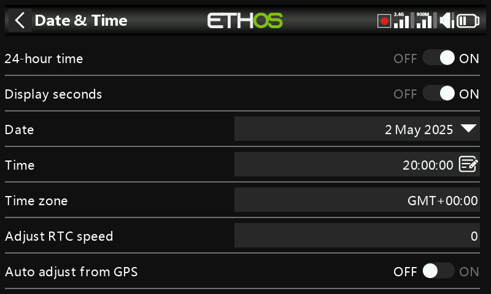

# Date & Time

- **24 hour time** — switches the clock between 12- and 24-hour display.
- **Display seconds** — adds seconds to the clock display.
- **Date** / **Time** — set the current date/time; both feed into data
  logging.
- **Time zone** — your local time zone.
- **Adjust RTC speed** — compensates for real-time-clock drift, up to 41
  seconds/day. Measure how many seconds your clock gains or loses over 24
  hours, and set the calibration value to **12× that number of seconds**
  — negative if the clock runs fast, positive if it runs slow (range
  −500 to +500). Re-check after a day or two and fine-tune.
- **Auto adjust from GPS** — when enabled, sets date and time
  automatically from a remote GPS sensor's data instead.
