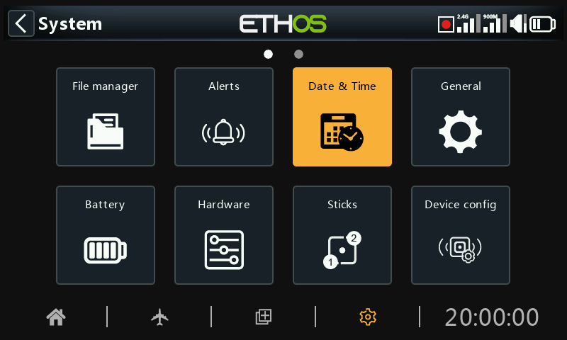

# Date and Time

The Date and Time settings are:

## 24 hour time

The clock displays in 24 hour format when enabled.

## Display seconds

The clock will display seconds when enabled.

## Date

Click to open a date setting dialog. Should be set to the current date. This is used in the logs.

## Time

Click to open a time setting dialog. Should be set to the current time. This is used in the logs.

## Time zone

Allows configuration of the user's time zone.

## Adjust RTC speed

The Real Time Clock may be calibrated to compensate for any drift in the clock, up to 41 seconds per day.

For the calibration, work out how many seconds your clock gains or loses in 24 hours.

Set the calibration value to 12 times this number of seconds, making it negative if your clock runs fast, and positive if it is slow. For best accuracy, you may then want to check if your clock is accurate, and adjust the calibration value slightly. The actual calibration value may be set to -500 to +500.

## Auto adjust from GPS

When enabled, the time and date will be automatically set from remote GPS sensor data.
