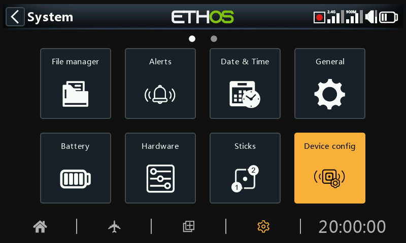
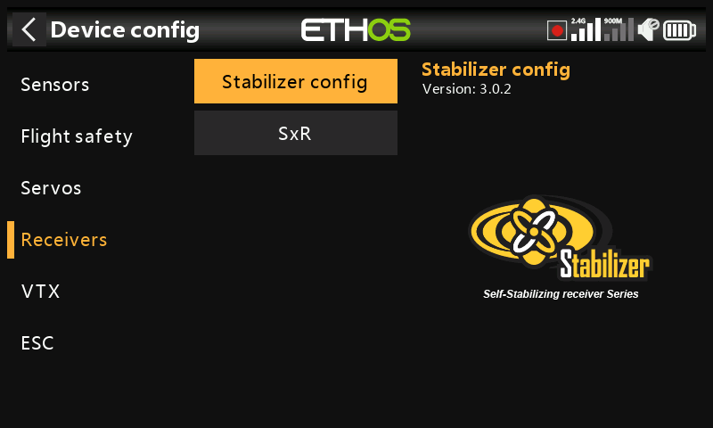
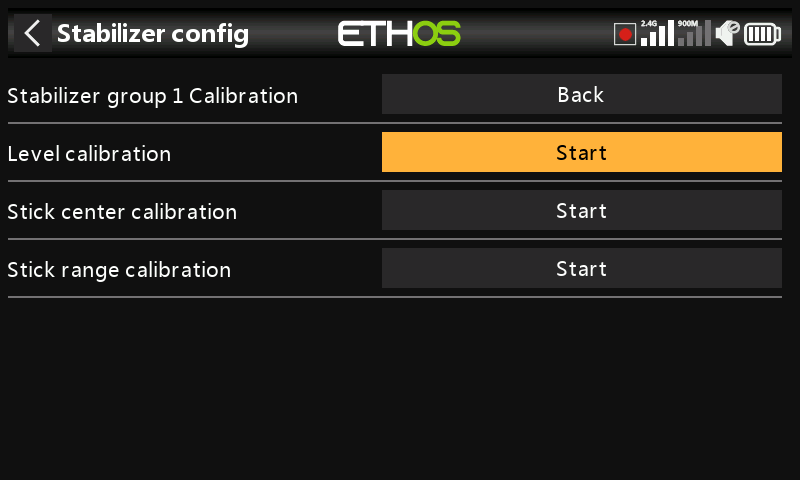
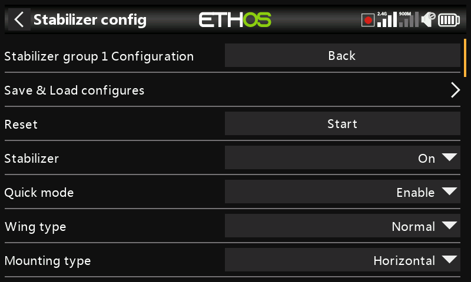
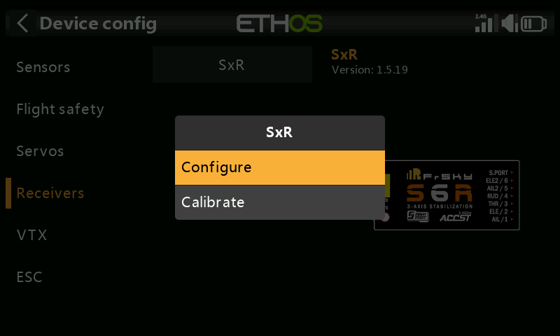

# Device config

‘Device config’ contains tools for configuring devices like sensors, receivers, the gas suite, servos and video transmitters.

The following devices are currently supported:

- Sensors
- Flight safety
- Servos
- Receivers
- VTX
- ESC
- DIY sensors (DIY will appear under device category if a DIY sensor is detected.)

Please refer to the device's manual for further details.

Please note that the ETHOS ‘Device config’ menus allow you to change S.Port sensor Physical IDs and Application IDs. If you have more than one device that have the same function, you would need to connect them one at a time, discover them in Telemetry / ‘Discover new sensors’, then in ‘Device config’ change the Physical ID and Application ID, and then go back and rediscover them with the new ID. Please refer to the [SmartPort Telemetry](../model-setup/telemetry.md) section.

Device Config is now extensible and the user (and FrSky) can add pages via Lua.

## Receivers example

FrSky stabilized receivers can now be configured via ‘Device config’ after installation of the necessary setup Lua scripts. These are easily installed with 1 click from the Lua Library in ETHOS Suite, please refer to the [Lua library](../frsky-suite/operation.md) section and look for the StabilizerConfig Lua.

### Overview

There is a choice between ‘Stabilizer config’ for the newer receivers, and ‘SxR’ for the older receivers.

#### Stabilizer config option

The ‘Stabilizer config’ option is used for the newer receivers such as the TD SR12, TD SR18, TD SR10, TD SR6, TW SR12, TW SR8, TW SR10, Archer+ SR10+, Archer+ SR8, Archer+ SR12+, SR6 Mini, SR6 Mini E, SR6BL15A, and SR6Lite.

#### SxR option

The SxR option is used for older receivers, such as ACCST D16 S6R,

ACCST D16 S8R, Archer SR6, Archer SR8 Pro, Archer SR10 Pro, R9 Stab, R9 Stab OTA, as well as the RB30S and RB40S. Please refer to the [SxR option](../system-setup/device-config.md) below for details.

### Stabilizer config option

The option is used for the newer receivers such as the receiver models listed above.

#### Note for v3.0.x

Please note that a Factory Reset operation should be done after updating the Rx firmware to v3.0.x, and then rebinding and reconfiguration (especially the Stab functions including the 6-axis calibration) of all the functions are required. This is due to addition of the new Failsafe data saving feature on the Rx end. Note that the Failsafe function must be reset and checked carefully after upgrading receivers. The receiver Factory Reset can be found under receiver Options in the RF setup.

The ‘Stabilizer config’ process has been streamlined, but will be immediately familiar if you've used the SxR or SRx Lua before.

Completed configurations may be saved to your PC, or backups may be restored. This does not include calibration data.

New model receivers have two stabilization groups. Group 1 covers channels 1-6, and group 2 covers 7-11. If you aren’t using pins 7-11 for stabilization then please turn off group 2 stabilization.

The 6-axis calibration function is now integrated. This has to be done once on new receivers and when upgrading to v3.0.x (after the Factory Reset).

#### Group 1 and 2 calibration

Under the group 1 and 2 Calibration function, the Self-Check step has been replaced by a far superior independent calibration of the desired attitude for ’self level mode’, channel center and channel endpoints. In addition, each channel can now be activated/deactivated.

#### Group 1 and 2 configuration

The stabilization setups are done in this section.

Completed configurations may be saved to your PC,, or backups may be restored. This does not include calibration data.

FrSky North America have compiled [a comprehensive guide](https://docs.google.com/document/d/1l4pE8nvk-KvRSlBYujmPA-Qt_G_CbVQaioiFv69BMls/edit?tab=t.0#heading=h.xbt6jdtpyqla) to stabilized receiver setup which covers all the detail.

There is also a [video of the setup process](https://youtu.be/0pKSzxyJrB8?si=PFuby_4TNiMnONvM) by FrSky Team Pilot Juan Sanchez Garcia.  He does an excellent job explaining the setup in full detail.

### SxR option

The older legacy receivers (such as ACCST D16 S6R, ACCST D16 S8R) and the Archer & Archer Pro receivers (such as Archer SR6, Archer SR8 Pro, Archer SR10 Pro), and R9 Stab, R9 Stab OTA as well as the RB30S and RB40S use the SxR option.

Even though the Archer receivers are named SRx instead of SxR and have Gain assigned to channel 9, they still use the SxR option.

The newer receivers with "Advanced stabilization" and the Gain control on channel 13 use the ‘[Stabilizer config](../system-setup/device-config.md)’ option.

The older SxR receivers can be calibrated and configured via the ‘SxR’ option.

## Configuration via S.Port connector on the transmitter

Support for configuring S.Port and FBUS devices directly from the transmitter is available via the S.Port connector on the transmitter.

### Configuring FBUS devices

Plug the FBUS device into the S.Port connection at the top of the radio. The white or yellow lead goes to the side with a notch.

Go to System / Device config and scroll to your FBUS device, for example an FAS40 ADV current sensor. Press Enter.

Once the configuration page opens, click on Module and select ‘S.Port connector’.

Make your configuration changes, remembering that the Physical ID and the Application ID must both be unique.

Then scroll further down and tap on the ‘Save to flash’ button.

Also refer to the How To section “[How to configure an FBUS system](../programming-tutorials/how-to-section.md)” for more examples.

### Configuring S.Port devices

Plug the S.Port device into the S.Port connection at the top of the radio. The white or yellow lead goes to the side with a notch.

Go to System / Device config and scroll to your S.Port device, for example a Variometer. Press Enter.

Once the configuration page opens, click on Module and select ‘S.Port connector’.

Make your configuration changes, remembering that the Physical ID and the Application ID must both be unique.

Then scroll further down and tap on the ‘Save to flash’ button.
