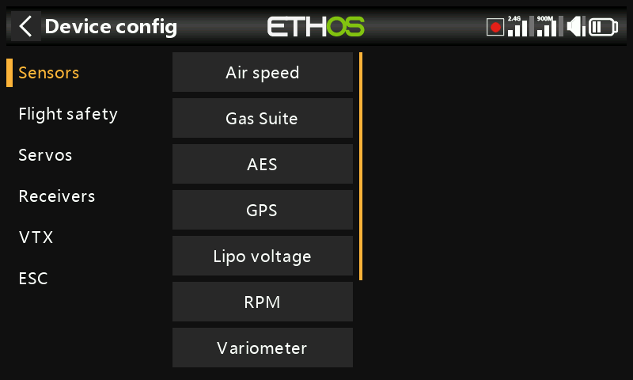
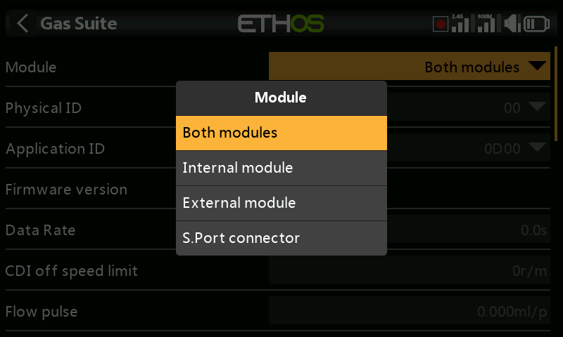

# Devices

Selects and configures the radio's RF modules (internal and any external
bay module) — separate from per-model receiver binding, which happens in
[Model Select](../model-setup/model-select.md) and [Model
Edit](../model-setup/model-edit.md).

!!! note "Draft"
    This page is a placeholder — full content coming in a later pass.
