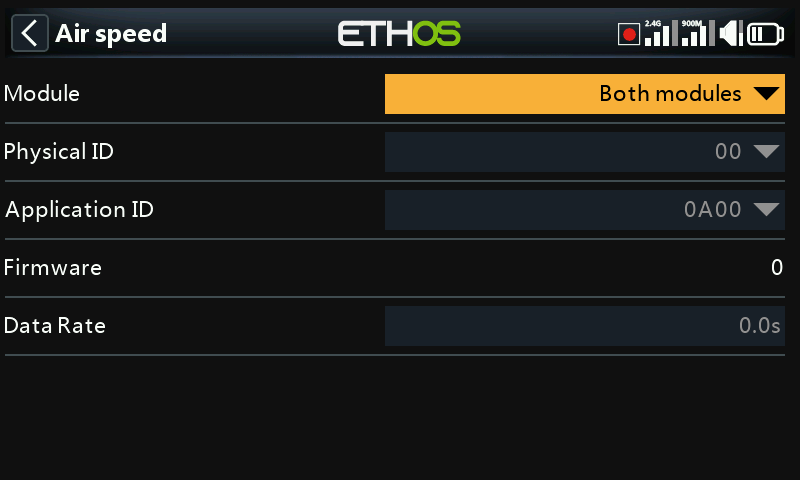

# Devices

Called **Device config** in the menu — tools for configuring peripheral
devices connected over S.Port/FBUS: sensors, receivers, the "gas suite",
servos, VTX, and ESC. **DIY sensors** appears automatically once a DIY
sensor is detected. Refer to each device's own manual for full detail;
this page covers what's common across them.

!!! note
    This is unrelated to choosing which RF module (internal or external) a
    *model* transmits on — that's a per-model setting, covered in
    [RF System](../model-setup/rf-system.md).

Device Config is extensible: both users and FrSky can add pages here via
Lua.

## Reassigning sensor IDs

Ethos's Device config screens let you change a device's S.Port **Physical
ID** and **Application ID** directly. If you have more than one device with
the same function, connect them **one at a time**: discover each in
[Telemetry → Discover new sensors](../model-setup/telemetry.md), change its
Physical ID and Application ID here in Device config, then go back and
re-discover it under the new ID.

## Receivers example

FrSky stabilized receivers can be configured here once their setup Lua
script is installed (one click, from Ethos Suite's Lua Library). There are
two configuration paths depending on the receiver generation:

- **Stabilizer config** — newer receivers with "Advanced stabilization"
  (gain control on channel 13). Two independent stabilization groups are
  exposed: Group 1 covers channels 1–6, Group 2 covers 7–11 — turn off
  Group 2 if you're not using pins 7–11 for stabilization. A 6-axis
  calibration is built in and must be run once on a new receiver, and
  again after any v3.0.x firmware upgrade (following a factory reset).
  Under each group's calibration, the old "self-check" step has been
  replaced by independent calibration of aircraft level, channel center,
  and channel endpoints, and each channel can be individually
  activated/deactivated. Configurations (not calibration data) can be
  saved to and restored from a PC.
- **SxR** — older receivers, including legacy units and Archer/Archer Pro,
  plus receivers like the SR10 Pro that (despite the "SRx" name) have Gain
  on channel 9 rather than 13.

  

!!! warning "After updating to receiver firmware v3.0.x"
    Do a factory reset (found under receiver Options in RF setup), then
    rebind and fully reconfigure — especially the Stab functions and 6-axis
    calibration. This is required by v3.0.x's new failsafe-data-saving
    feature; check the failsafe function carefully afterward.

FrSky North America publishes a detailed stabilized-receiver setup guide,
and there's a walkthrough video by FrSky Team Pilot Juan Sanchez Garcia
covering the same ground.

## Configuring via the transmitter's S.Port connector

S.Port and FBUS devices can also be configured directly through the S.Port
connector on top of the transmitter, without going through a bound
receiver.

1. Plug the device into the transmitter's S.Port connector (white/yellow
   lead toward the notched side).
2. Go to **System → Device config**, scroll to the device (e.g. an FAS40
   ADV current sensor), and press `ENT`.
3. On the configuration page, set **Module** to **S.Port connector**.
4. Make your changes — Physical ID and Application ID must each be
   unique — then scroll down and tap **Save to flash**.

This applies to both FBUS devices (see also [How-To: Configure an FBUS
System](../how-to/fbus-setup.md)) and plain S.Port devices such as a
variometer.
