# File manager

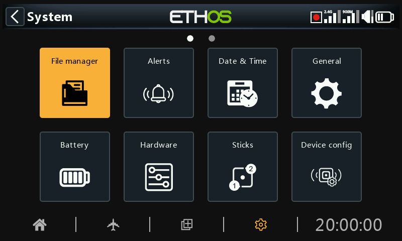

The ‘File manager’ is for managing files and folders, and access to flash firmware to the RF module, external S.Port, OTA (Over The Air) devices and external modules.

Note that when updating the system firmware, the files in the SD or eMMC card may also need updating.

Please note that from Ethos 26.1 onwards the radio no longer uses the internal Flash memory drive for storing system bitmaps and fonts. These files are now part of the Ethos firmware, shortening the start up time, and increasing the speed of the UI (no dynamic load for bitmaps).

ETHOS has a radio-to-radio Bluetooth file transfer feature. Please refer to the example in the [Sharing files via Bluetooth](file-manager.md) section below.

Note: Both the Bootloader and the system firmware are stored in the internal flash memory on all FrSky Radios back to the original X9D.

Tap on ‘File manager’ to open the file explorer.

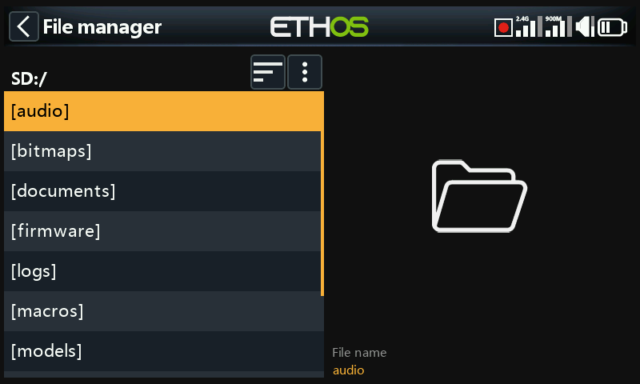

The X20/S/HD series requires an SD card that is 32gig or less formatted fat32. SanDisk Ultra Micro SDHC Class 10 16gig cards are a good option. Files will be on the FRSky website.

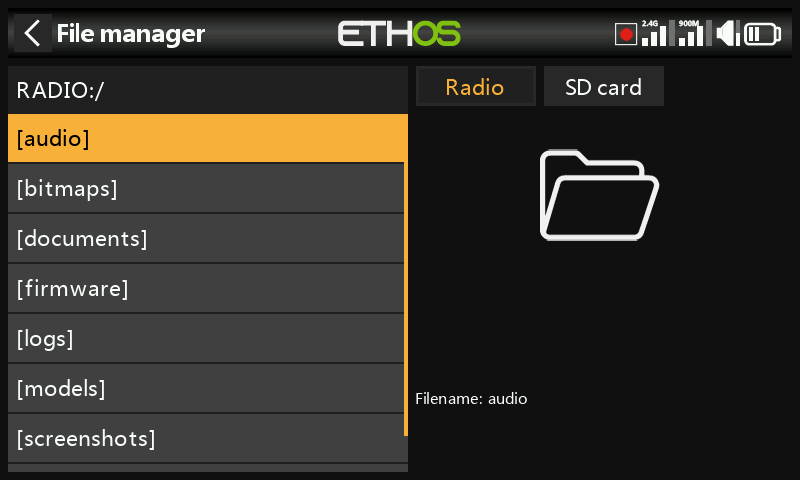

The X18 and X20 Pro/R/RS radios use an internal eMMC card for file storage by default, but an external SD card may be added. Tap on the ‘Radio’ tab to explore the eMMC card memory. The \[Page\] key may also be used to switch between drives.

The system will create some of the folders if the user does not create them, like Logs, Models and Screenshots. The Firmware folder was created manually to keep device firmware like receivers, etc.

SD Card drive path when connected to a PC:

SD Card (drive letter)/ or

RADIO (drive letter)/ {radios with internal eMMC card}

## File manager menu

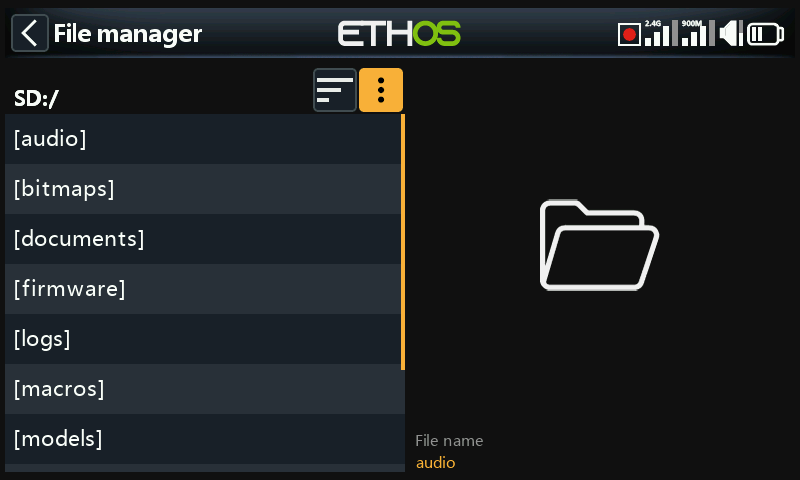

The File manager has an options menu. Tap on the 3 vertical dots in the menu bar (or scroll backwards).

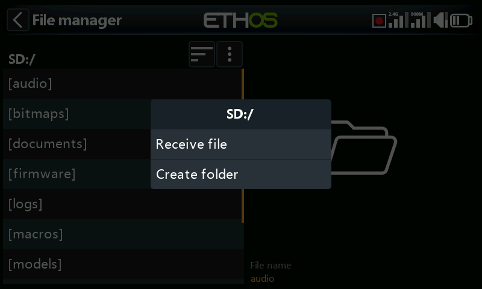

The File manager menu has two options:

- You can receive a model via Bluetooth. Please refer to the ‘models’ folder below for more detail.
- You can create a new folder in the folder you have open when you invoke this menu.

## File manager sort options

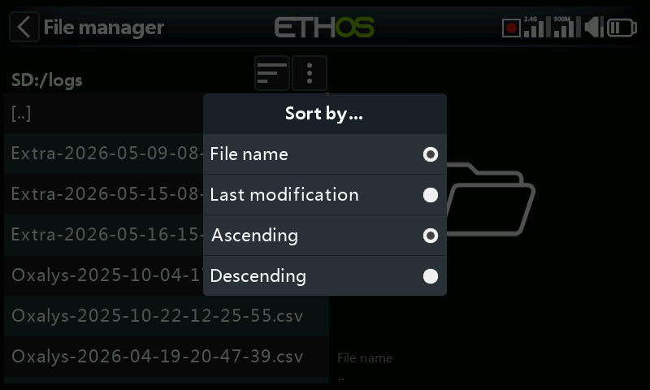

Tap on the ‘Sort options’ icon next to the file manager menu icon above, to open the sort options dialog:

- You can sort by file name or by the file last modification date.
- You can sort in ascending or descending order.

This option is extremely useful for finding the most recent log file in the ‘logs’ folder.

## Top level folders

The top level folders are:

### audio/

This folder is for audio files.

#### audio/en/gb	English voice  
audio/en/us	American voice  
**audio/en/default**	default voice

These folders are for user sound files, which can be played by the 'Play audio' special function. Refer to the Model / [Special Functions](#Special Functions section) section, and also the [Choice of Voices](general.md) section.

The format should be 16kHz or 32kHz PCM linear 16 bits or alaw (EU) 8 bits or mulaw (US) 8bits. There may be 31 characters in the names of wav files plus extension.

#### audio/en/gb/system  
audio/en/us/system  
a*udio/en/**default**/system*

These folders are for system sound files, e.g.

| hello.wav | The 'Welcome to Ethos' greeting |
| --- | --- |
| bye.wav	 | This is not provided by Ethos, but you can add your own goodbye WAV file. |

Tap on the \[audio\] folder to view the folder contents.

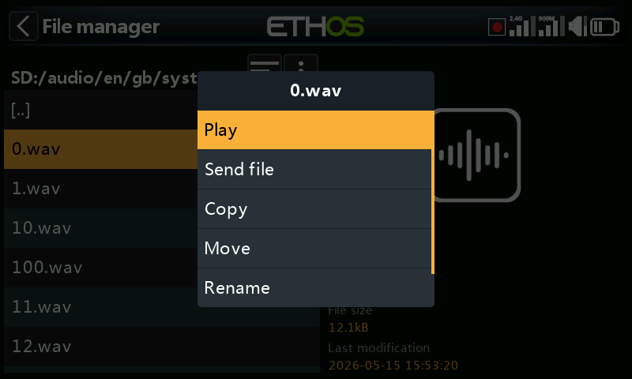

Tap on a WAV file, and select the Play option to listen to it.

The file may also be copied, moved, renamed or deleted. There are also options for sending or receiving the file via Bluetooth. Please refer to [Sharing files via Bluetooth](file-manager.md) below.

Note: All three folders are updated by Ethos Suite regardless of which one(s) you have selected in the Voice options.

### bitmaps/

This folder is for bitmap files.

#### bitmaps/***models***/

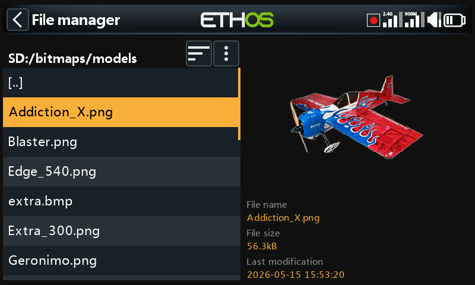

This folder is for user model images that are configured in ‘Model / Edit model’ or the new model wizards.

Note that File Manager displays file details in the right hand pane, such as the file name, the file size and the last modification date.

#### bitmaps/***user***/

This folder is for user bitmaps other than the model images set up in ‘Model / Edit model’.

The recommended image format is the following BMP format:

32bits BMP format

8 bits per color

Alpha channel (used for image transparency)

Size: 300×280px

This format reduces the computational load on the on-board microcontroller of the radio. Additionally, ETHOS will resize BMPs on the fly, but not PNG or JPG.

Image file naming rules:

Rule 1: use only the following characters: A-Z, a-z, 0-9, ()!-\_@#;\[\]+= and Space

Rule 2: the name must not contain more than 11 characters, plus 4 for the extension. If the name is longer than 11 characters, it is displayed in the File Manager but does not appear in the model image selection interface.

#### Image conversion tools

Ethos Suite has image conversion tools available. Please refer to the [Image manager](../ethos-suite/operation.md) section of Ethos Suite.

### ***documents***/

This folder is for documents.

***documents***/***user***/

This folder is for user text documents. They can be called up in the ‘Text’ widget.

### ***Firmware***/

This folder is for firmware files. Firmware updates for the Internal RF module, external modules and other devices like receivers etc. are stored here. They can then be flashed from here via the external S.Port on the radio, or OTA (Over The Air). The new firmware must be copied to the Firmware folder after placing the radio in boot-loader mode and connecting to a PC via USB.

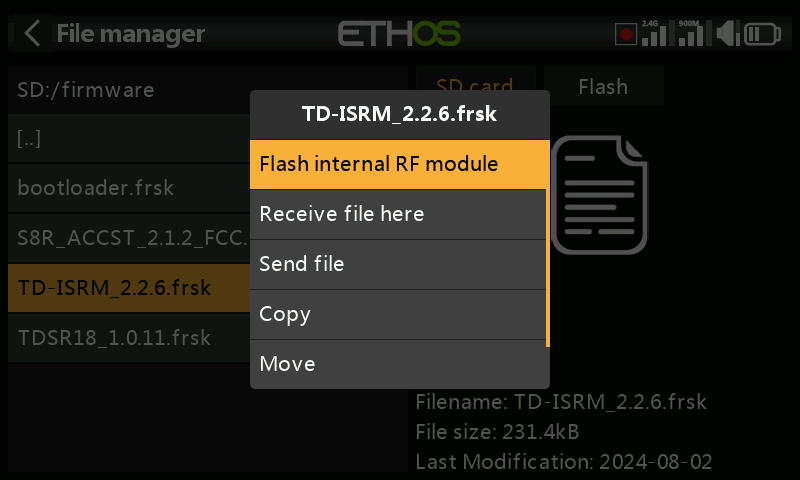

Tap on the Firmware folder to view the firmware files that have been copied to this folder.  Select the appropriate firmware for your device, and then tap on the Flash option in the popup dialog. The example above shows the internal RF module about to be updated.

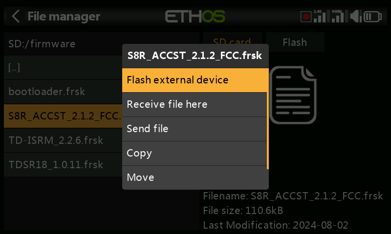

The example above shows an S8R receiver about to be updated via the S.Port connection on the radio.

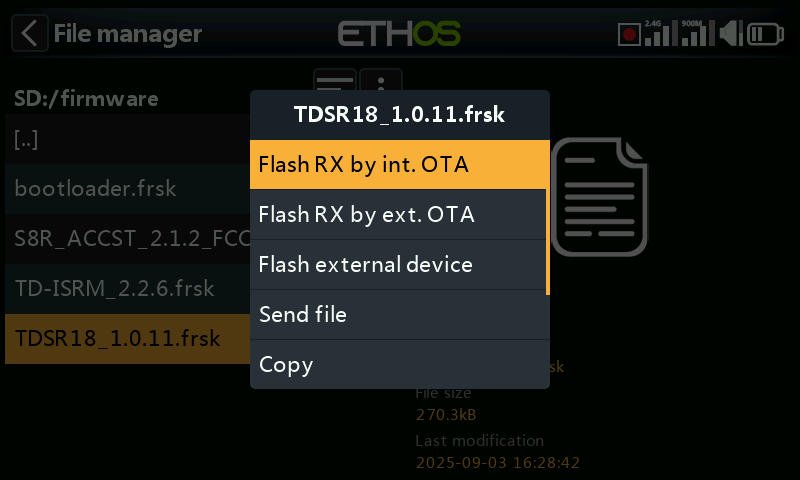

The example above shows a TD-R18 receiver about to be updated Over-The-Air via the wireless link to the bound receiver.

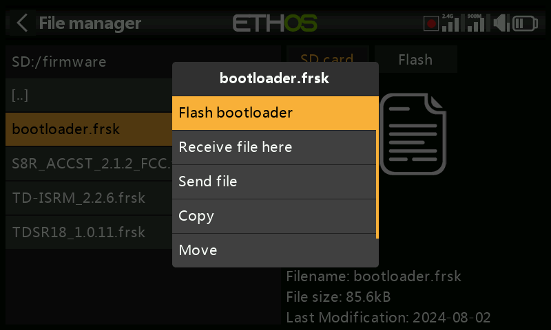

The example above shows the bootloader about to be updated.

The files may also be copied, moved or deleted.

### I18n

This folder holds the language translation files.

### Logs/

Data logs are stored here.

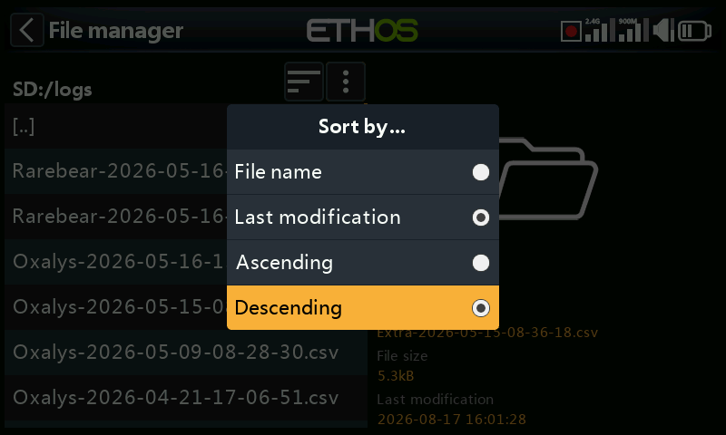

To view the logs, it is most convenient to change the File Manager sort options to ‘Last modification’ and ‘Descending’ order so that the most recent logs are at the top.

Navigate to the logs folder,  then tap on the ‘Sort options’ icon next to the file manager menu icon above, to open the sort options dialog. Tap on sort by ‘Last modification’ and ‘Descending’ order.

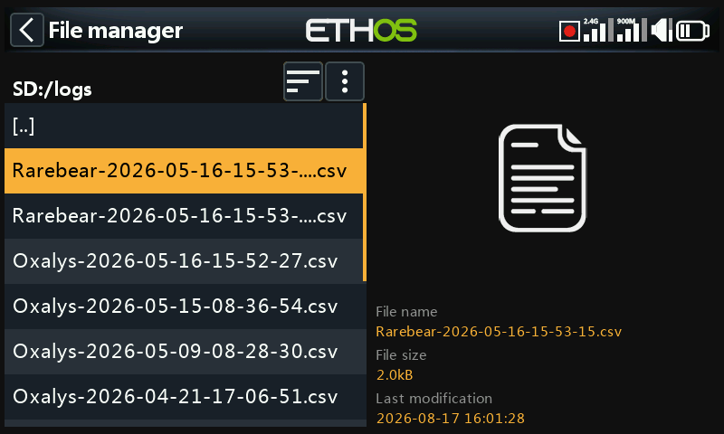

Scroll to the desired recent log file. Note that File Manager displays file details in the right hand pane, including the full file name which is very useful for seeing the complete time stamp if it has been truncated in the view on the left.

Tap on the log file and select ‘Open’ to view it. Please refer to the ‘[Log viewer](../model-setup/special-functions.md)’ section for more details.

### models/

The radio stores model files here. These files cannot be edited by the user, but may be backed up or shared from here. Initially models were simply named from model01.bin onwards, but from Ethos v1.2.11 the model name is used, for example a model named ‘Extra’ will have a filename of ‘Extra.bin’. If there is more than one ‘Extra’, the additional models will be named ‘Extra01.bin’ etc.

When editing the model names in the ‘Edit model’ screen the model filename (.bin) will be changed too. The model filename will be in all lower case (the actual model name with upper and lower case is saved inside the bin). Not all characters are supported for the model file bin name so it might not match the model name exactly.

There are Sub Folders for each user created model category folder.

### screenshots/

Screenshots created by the Screenshot special function are stored here in .png format. Refer to the Model / [Special Functions](#Special Functions section) section.

### scripts/

This folder is used to store Lua scripts. Scripts may be organized into individual folders, and have support files included in a folder structure.

**Caution**! Please note that Lua scripts increase the startup time of the radio. If they are implemented correctly the delay should not be noticeable, but if it is not the case, then the delay may be almost indefinite.

Lua script types include widgets, tasks, sources and tools. They are also used for controlling external modules.

#### Widgets

Widgets are used in the main views to display desired information such as telemetry and radio status etc. Please refer to the [Configure Screens](../displays/index.md) section for more details.

#### Tasks and sources

Using Lua scripts it is possible to create custom sources such as for example custom sensors, or to create tasks that perform custom actions such as for example logging data to a file after flight is over. Once installed under the scripts/ folder, the Lua menu appears in the Model section to manage the task or source for each model. Please refer to the [Lua](../model-setup/lua-scripts.md) menu for more details.

#### Tools

For example the stabilized receiver configuration tools that appear in the System menus.

#### Scripts for external modules

Each third-party external module has its own individual Lua file, and should be stored in its own folder.

scripts/multi

scripts/elrs

scripts/ghost

scripts/crossfire

Please refer to the [Third-Party External Modules](https://www.rcgroups.com/forums/showpost.php?p=49550649&postcount=18844) post on the X20 and Ethos thread on rcgroups for more information.

### radio.bin

This file is in the root folder and is created by the radio system when it initializes and holds the system settings. It should be backed up together with the models folder above before updating the firmware, to allow downgrading to the earlier version if required.

The firmware update file firmware.bin should be saved here in the root folder of the SD card or eMMC when doing a radio firmware update. After saving the new firmware.bin file, the update will automatically be flashed into the radio when it is disconnected from the PC. (Please note that you also may need to update the SD card or eMMC drive contents at the same time.)

### sdcard.version

This file holds the sdcard version and is used and maintained by Ethos Suite.

## Sharing files via Bluetooth

ETHOS has a radio-to-radio Bluetooth file transfer feature.

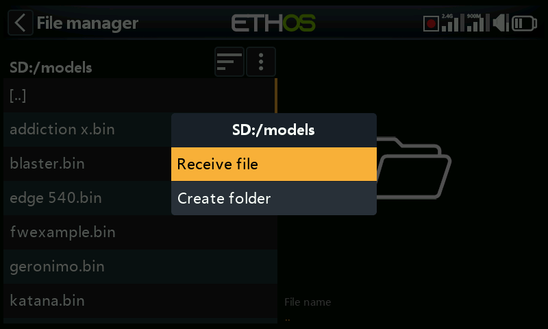

On the receiving radio, using File Manager navigate to the model folder that you wish to receive the file or model into. Then tap on the ‘File manager menu’ icon the top line (or scroll backwards and press \[ENT\] on the icon). Then select ‘Receive file here’.

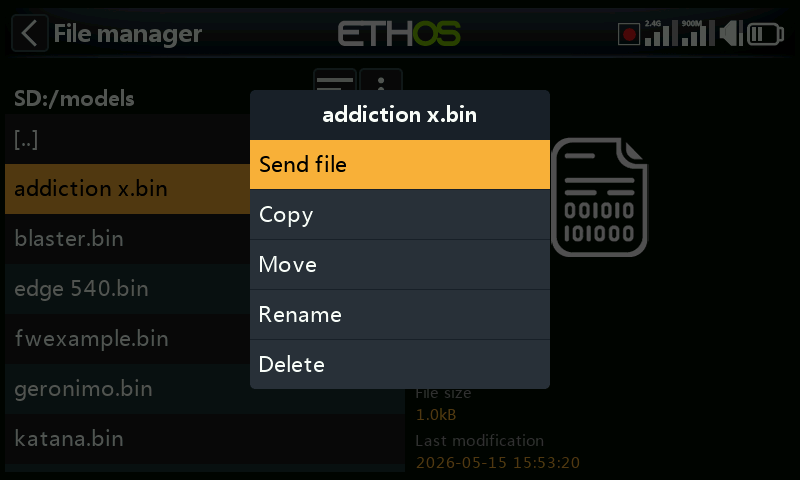

On the sending radio, navigate to the file you want to send and tap on it. Then select ‘Send file’ and follow the prompts on both radios.

If the radio is already connected to another Bluetooth device under Telemetry / Bluetooth or Trainer / Link mode / Bluetooth or General / Audio / Bluetooth (X20S/Pro only) you will be asked whether you wish to disconnect that device.
