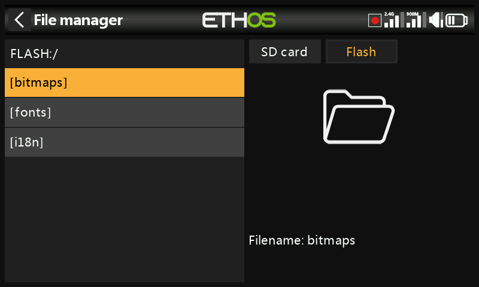

# File Manager

File Manager browses the radio's storage and flashes firmware to the
internal RF module, S.Port-connected devices, OTA (Over-The-Air) devices,
and external modules.

## Storage layout

Tap **Flash** (or press `PAGE` to switch drives) to browse the radio's
internal virtual USB flash drive, used for system bitmaps and fonts:

- `bitmaps/system` — the bitmaps used for screen displays and icons
- `fonts/` — fonts for the different language selections

Both the bootloader and the system firmware itself live in this internal
flash memory, on every FrSky radio back to the original X9D.

The **X20/X20S/X20HD** series takes a FAT32-formatted SD card, 32GB or
smaller (a SanDisk Ultra Micro SDHC Class 10 16GB card is a solid choice).
The **X18** and **X20 Pro/R/RS** use an internal eMMC by default (an
external SD card can be added alongside it) — tap **Radio** to browse it.
Ethos creates `Logs/`, `models/`, and `screenshots/` automatically if
they're missing; `Firmware/` is a manual convention for device firmware
files like receivers.

## Top-level folders {: #top-level-folders }

- **`audio/`** — user and system sound files, split by voice
  (`audio/en/gb`, `audio/en/us`, `audio/en/default`). User files are
  played by the [Play Audio special function](../model-setup/special-functions.md);
  system files include `hello.wav` (the "Welcome to Ethos" greeting — a
  `bye.wav` can be added but isn't provided). Format: 16kHz or 32kHz PCM,
  linear 16-bit, or A-law (EU)/µ-law (US) 8-bit; filenames up to 31
  characters plus extension. All three voice folders are kept in sync by
  Ethos Suite regardless of which is actually selected.

  

- **`bitmaps/`** — `bitmaps/models/` holds user model images (set in
  [Model Edit](../model-setup/model-edit.md) or the new-model wizards);
  `bitmaps/user/` holds everything else. Recommended format: 32-bit BMP,
  8 bits per color, with an alpha channel, 300×280px — this keeps the
  radio's on-board decoding cheap. Ethos resizes BMPs on the fly but not
  PNG/JPEG. Filenames may only use `A-Z a-z 0-9 ()!-_@#;[]+=` and spaces,
  and must be 11 characters or fewer (plus a 4-character extension) to
  show up in the model image picker — longer names still appear in File
  Manager but won't be selectable there. Ethos Suite's image conversion
  tools handle the format conversion for you.

  

- **`documents/user/`** — user text documents, recalled from the **Text**
  display widget.

- **`Firmware/`** — firmware files for the internal RF module, external
  modules, and other devices (receivers, etc.), flashed from here via
  S.Port or OTA. Copy new firmware here while the radio is in [bootloader
  mode](../getting-started/usb-connection-modes.md) and connected by USB;
  tapping a firmware file and choosing **Flash** starts the update:

  
  
  
  

- **`I18n/`** — language translation files.

- **`Logs/`** — data logs.

- **`models/`** — the model files themselves. These can't be edited
  directly here, only backed up or shared. Since Ethos v1.2.11, a model is
  named from its model name rather than `model01.bin` onward (e.g. a model
  called "Extra" becomes `Extra.bin`; a second "Extra" becomes
  `Extra01.bin`). Renaming a model in [Model Edit](../model-setup/model-edit.md)
  renames its file too — always in lower case (the mixed-case display name
  is stored inside the file), and not every character in a model name
  survives into the filename. Since v1.1.0 Alpha 17, each user-created
  model category gets its own subfolder.

- **`screenshots/`** — output of the [Screenshot special
  function](../model-setup/special-functions.md).

- **`scripts/`** — Lua scripts, optionally organized into their own
  subfolders with support files. Script types are **widgets** (see
  [Displays](../displays/index.md)), **tasks and sources** (custom
  sensors or post-flight actions — installed here, they appear under the
  model's [Lua](../model-setup/lua-scripts.md) menu), and **tools** (e.g.
  the stabilized-receiver configuration tools under System menus).
  Third-party external modules each get their own script and folder,
  e.g. `scripts/multi`, `scripts/elrs`, `scripts/ghost`,
  `scripts/crossfire`.

  !!! warning
      Lua scripts add to the radio's startup time. A well-written script's
      delay is unnoticeable — a poorly written one can delay startup
      almost indefinitely.

- **`radio.bin`** (root folder) — the system settings file, written by
  the radio itself at initialization. Back it up together with `models/`
  before a firmware update, so you can downgrade if needed.

- **`firmware.bin`** (root folder) — drop a new radio firmware file here
  to have it flashed automatically the next time the radio is
  disconnected from the PC. The SD card/eMMC and internal flash drive
  contents may need updating in the same pass.

- **`sdcard.version`** (root folder) — the SD card content version,
  maintained by Ethos Suite.

## Sharing files via Bluetooth

Ethos can transfer files radio-to-radio over Bluetooth. On the
**receiving** radio, navigate to the destination folder in File Manager,
long-press `ENT`, and choose **Receive file here**:

On the **sending** radio, tap the file, choose **Send file**, and follow
the prompts on both radios:

If either radio already has an active Bluetooth connection (telemetry,
trainer link, or — on X20S/Pro — audio), it'll ask whether to disconnect
that device first.
