# General

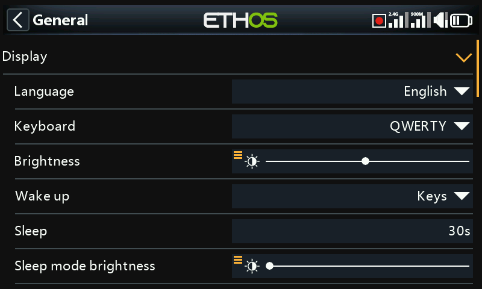

Covers display attributes, audio, vario, haptics, and the top toolbar.

## Display attributes

- **Language** — the display menu language (English, 中文, Česky, Deutsch,
  Español, Français, עברית, Italiano, Nederlands, Norsk, Português
  Brasileiro, Polish, Português, and others).
- **Keyboard** — QWERTY, QWERTZ, or AZERTY virtual keyboard layout.
- **Brightness** — a slider for backlight brightness; long-press `ENT` to
  drive it from a source instead (e.g. a slider, per the example below),
  or force it to minimum/maximum.

  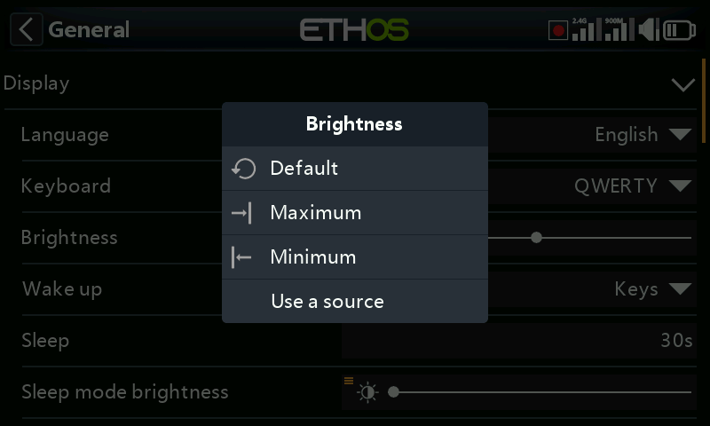
  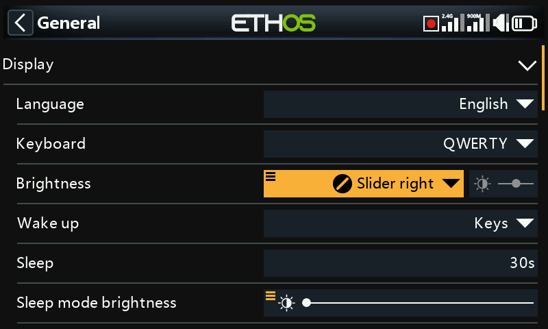

  !!! note
      If **Brightness** equals **Sleep mode brightness**, the touchscreen
      stays active even while "asleep".

- **Wake up** — which of these wake the backlight from sleep (more than
  one may be enabled): **Always on** (never sleeps), **Sticks**,
  **Switches**, **Gyro** (tilting the radio). Keys always wake it
  regardless of these settings.
- **Sleep** — inactivity time before the backlight turns off (greyed out
  if Wake up is set to Always on).
- **Sleep mode brightness** — backlight brightness while asleep.
- **Dark mode** — light or dark display theme.
- **Highlight Color** — the UI's accent color (default `#F8B038`).

## Audio settings

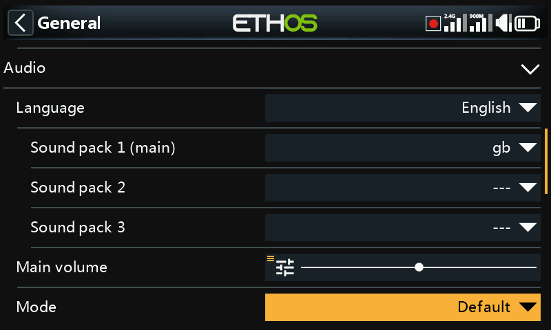

- **Audio language** — language for voice announcements.
- **Choice of voices** — Ethos supports multiple simultaneous voice packs:

  - **Voice 1 (main)** — used for all built-in system announcements. For
    English, the default choice is between American (`us`) and British
    (`gb`) packs, read from `audio/en/us/system` and `audio/en/gb/system`.
    User sound files for the [Play Audio special
    function](../model-setup/special-functions.md) go in `audio/en/us/`
    or `audio/en/gb/` respectively.
  - **Voice 2 / Voice 3** — additional packs, for example a custom
    TTS voice. Each needs the same folder shape as Voice 1 — e.g. a voice
    called "Susan" needs `audio/en/Susan/` for user sounds and
    `audio/en/Susan/system` for its system sounds (every voice needs a
    `/system` folder, since that's what **Play Value** and timer
    announcements read from; a `.csv` list of the standard system sound
    files ships with each audio release). Once installed, a voice can be
    assigned per timer and per Play Audio function — or even set as Voice
    1 to replace the system announcements outright.
  - **Voice "default"** — installed automatically as a safe fallback (and
    used to avoid conversion issues from 1.4.x installs): if Voice 1 isn't
    already set during an install/upgrade, it's set to `default`, reading
    from `audio/en/default/system`. Commonly-requested custom sound files
    for Play Audio live in `audio/en/default/`.

- **Main volume** — a slider for overall audio volume (long-press `ENT` to
  drive it from a pot); beeps play during adjustment so you can judge the
  level by ear.
- **Audio mode**:
  - **Silent** — no audio (still triggers the [Silent mode
    alert](alerts.md) at startup, if enabled).
  - **Alarms only** — only alarms are audible.
  - **Default** — normal sounds.
  - **Often** — adds error beeps when a value is pushed past its
    minimum/maximum.
  - **Always** — adds beeps for ordinary menu navigation, on top of Often.
  - **Bluetooth** (X20S/HD/Pro/R/RS only) — relays audio to a paired
    Bluetooth device (headset, etc.). Choose **Search Devices**, put the
    target device into pairing mode, then select it once found:

    
    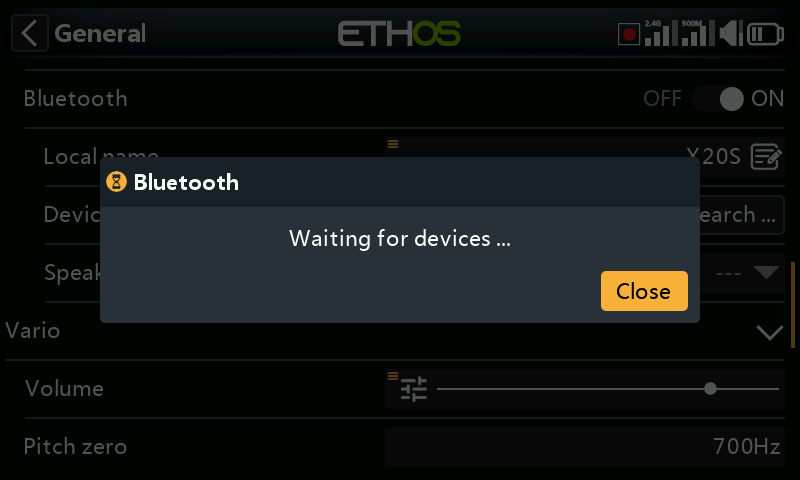
    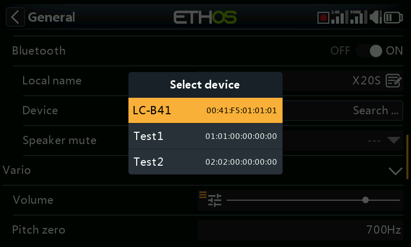
    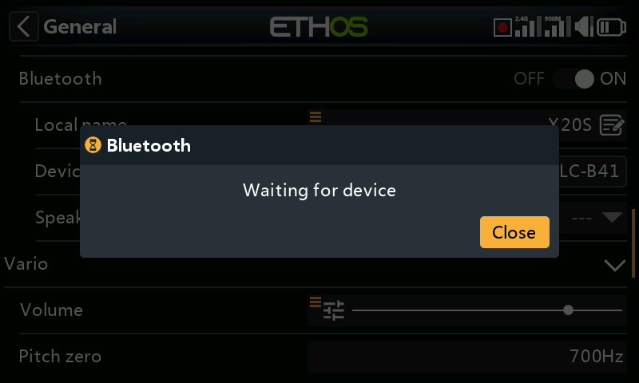
    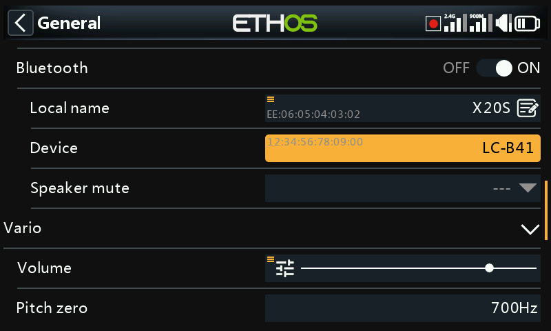

    **Speaker mute** then controls the built-in speaker — always on,
    only while telemetry is active, or driven by a source (e.g. a
    switch). The radio remembers the paired device; power the radio on
    before the Bluetooth device for normal operation, and allow a few
    seconds after it connects for speaker mute to re-engage.

## Vario

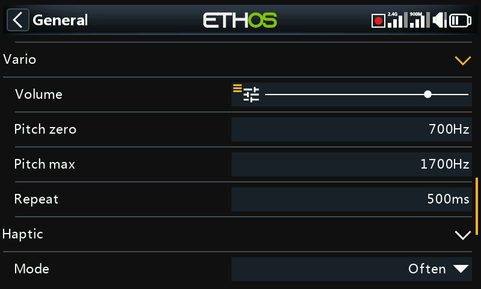

- **Volume** — relative volume of the vario tone.
- **Pitch zero** — tone pitch at zero climb rate.
- **Pitch max** — tone pitch at maximum climb rate.
- **Repeat** — delay between beeps at pitch zero.

See also the VSpeed sensor under [Telemetry](../model-setup/telemetry.md)
and the [Play Vario special function](../model-setup/special-functions.md)
for further vario behavior.

## Haptic

- **Strength** — a slider for vibration intensity.
- **Mode** — the same option set as Audio mode above.

## Storage location (X18 and X20 Pro/R/RS)

These radios have an internal 8GB eMMC. By default Ethos uses it, making
an SD card optional — but you can select the eMMC, an SD card, or a
combination of both. If moving the system and models to an SD card, copy
the relevant folders/files (including audio and bitmaps) across **before**
switching the storage location.

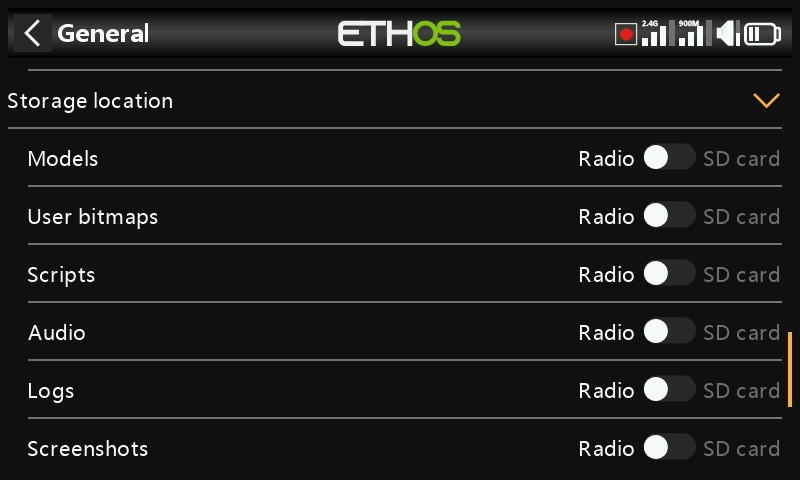

## Top toolbar

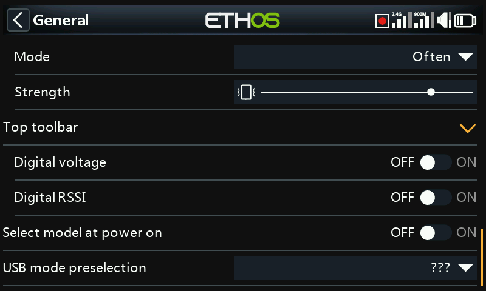

- **Digital voltage** — shows radio battery voltage as a number instead of
  a bar in the top toolbar.
- **Digital RSSI** — same, for 2.4GHz and 900MHz RSSI.
- **Select model at power on** — shows the model-selection screen at
  startup, before the previous model's checklist alerts appear, so you can
  switch models without first dismissing them. The last-used model is
  highlighted by default.

  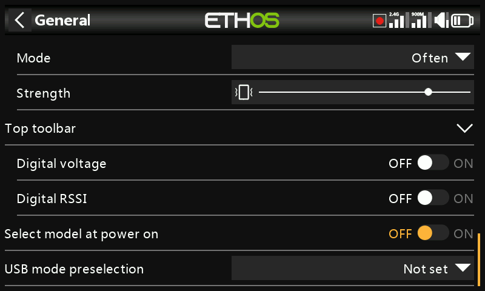

## USB mode preselection

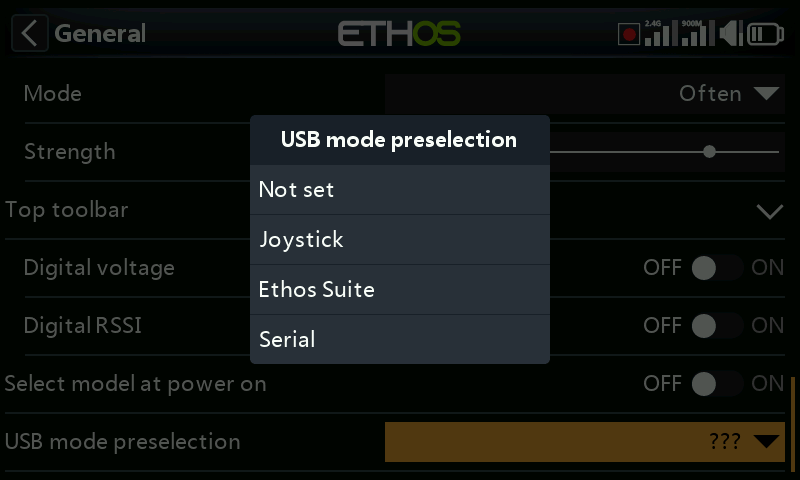

What happens automatically when the radio connects to a PC over USB:

- **Not set** — prompts for a choice at connect time.
- **Joystick** — enters joystick mode for an RC simulator immediately.
- **Ethos Suite** — enters Ethos mode for [Ethos
  Suite](../ethos-suite/index.md) immediately.
- **Serial** — enters Serial mode immediately, routing Lua debug traces
  over USB-Serial at 115200 bps (a Windows virtual COM port driver may be
  needed).
