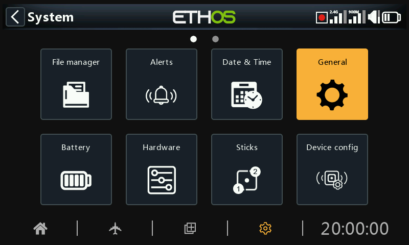
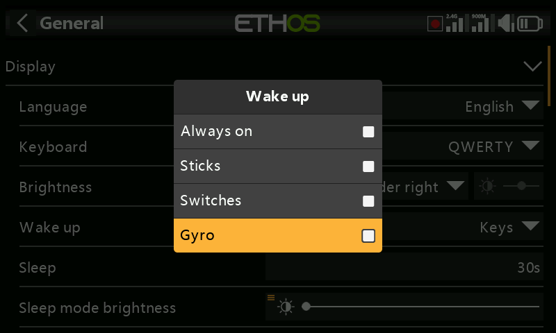
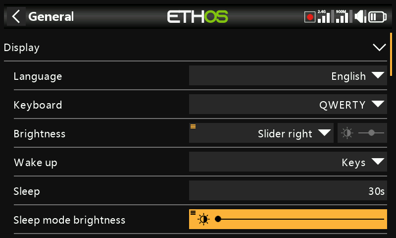
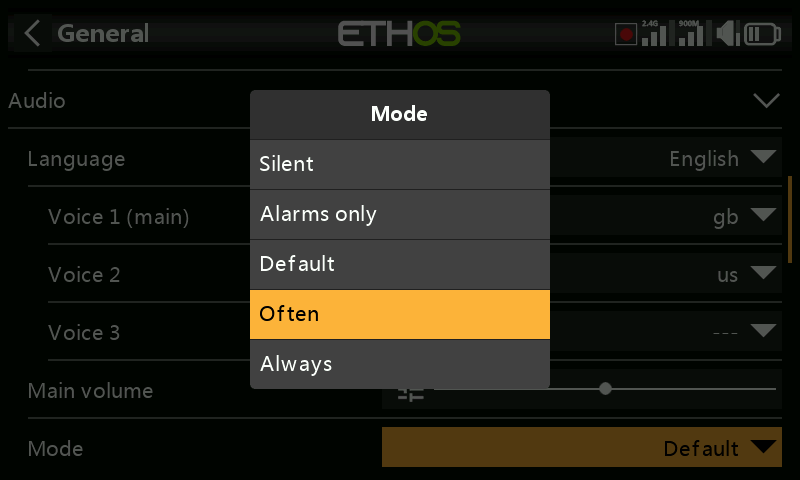
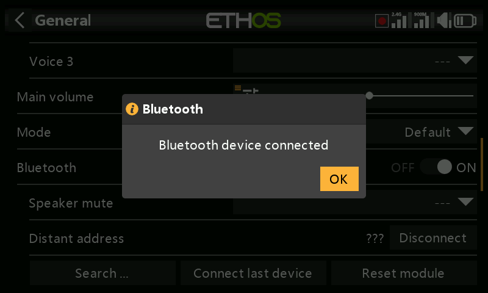
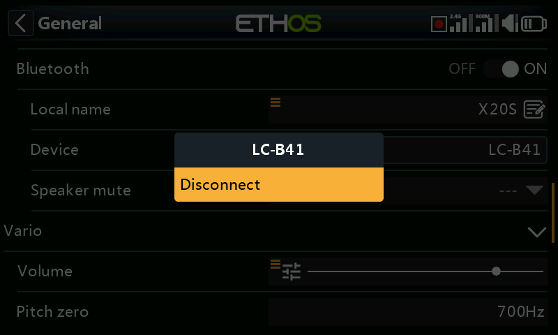
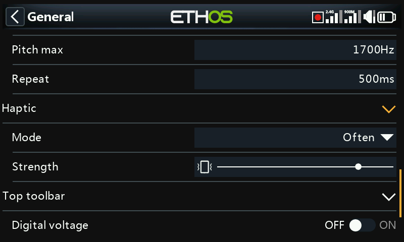
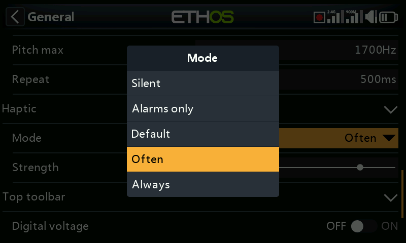

# General

The following can be configured here:

- LCD display attributes
- The audio settings
- The vario settings
- The haptic feedback settings
- The top toolbar

## Display attributes

The LCD display attributes can be configured here:

### Language

The following languages are supported for the display menus:

English

中文

Česky

Deutsch

Español

Français

עִברִית

Italiano

Nederlands

Norsk

Português Brasileiro

Polish

Português

### Keyboard

Allows selection between QWERTY, QWERTZ and AZERTY virtual keyboard layouts.

### Brightness

Use the slider to control the screen brightness, from left to right to set brightness from dark to bright. Long press \[ENT\] brings up options to use a source, or set it to minimum or maximum.

Please note that if Brightness (for backlight ON) = ‘Sleep mode brightness’ (for backlight OFF) then the touchscreen stays active.

#### Pot/slider option

Tap on ‘Use a source’, then select a pot or slider to use as brightness control.

The above example shows brightness being controlled via the right slider.

### Wake up

The screen backlight can be woken from the sleep state in accordance with one or more of the following options:

#### Always on

The backlight stays on permanently.

#### Sticks

The backlight turns on when sticks or keys are operated.

#### Switches

The backlight turns on when switches or keys are operated.

#### Gyro

The backlight turns on when you tilt the radio or when keys are operated.

Note that more than one option may be enabled.

### Sleep

The length of inactivity before the backlight is turned off. When selecting ‘Always on’ as the display ‘Wake up’ option, the Sleep option is greyed out.

### Sleep mode brightness

Use the slider to control the screen brightness during sleep mode, from left to right to set brightness from dark to bright.

Please note that if Brightness (for backlight ON) = ‘Sleep mode brightness’ (for backlight OFF) then the touchscreen stays active.

### Theme

Allows selection between themes for the display. The default theme is Dark, with Light as an alternative. In addition, other Lua themes may be installed. Please refer to the ‘[Alternative Lua display themes](../lua-scripts/alternative-display-themes.md)’ section for more details.

### Highlight Color

Allows selection of the highlight color to be used in the display. The default is yellow (#F8B038).

## Audio settings

### Audio language

Allows the language for voice announcements to be selected.

#### Choice of voices

The multi voice system feature provides the ability to select from different voice sets within a given language.

##### Voice 1 (main)

The main voice is used for all system announcements which are part of the Ethos operating system. By default, for English, there is a choice between an American (us) and an English (gb) voice. These packs only cover system announcements.

In the example above the English ‘gb’ voice has been selected as the ‘Voice 1 (main)’.

The files are located in these folders:

a*udio/en/us/system*

audio/en/gb/system

##### User sound files

User sound files may be installed for use with the ‘Play audio’ special function (previously ‘Play track’ and ‘Play sequence’). Their location must be:

*audio/en/us/*     or

audio/en/gb/

##### Voice 2 and 3

Alternate voice packs may be installed as Voice 2 or 3.

To ensure the appropriate voice output for Voice 2 or 3 you will need to add your custom sound files to a folder structure similar to the standard ones shown above under Voice 1. For example, if you were using TTS and a voice called Susan, your folder structure would be:

*audio/en/Susan*	for user sound files

*audio/en/Susan/system*	for replacement system sound files

Please note that each voice must have a /system folder, containing the sound files needed for ‘Play value’ and timer announcements. Note that a list of the system sound files supplied as standard is included as a .csv file with each audio release.

You can then choose the voice to be used for each timer and ‘Play audio’ special function. Optionally, you could assign a custom voice as Voice 1 (main) if you wish to replace the system announcements with your own.

##### Voice ‘default’

To avoid conversion issues from 1.4.X, a default voice is also installed. During installation/upgrade, if the system audio Voice 1 (main voice) has not already been set, then ‘Voice 1 (main)’ will be set to ‘default’, as it is certain that the folder exists.

The files are located in this folder:

a*udio/en/**default**/system*

##### User sound files

Some commonly requested custom sound files are provided for use with the ‘Play audio’ special function (previously ‘Play track’ and ‘Play sequence’). Their location is:

*audio/en/**default**/*

Additional custom user sound files may be added to this folder if the user wishes to continue using this default voice.

### Main volume

Use the slider to control the audio volume. Long press \[ENT\] allows a pot to be used. Beeps during adjustment assist in judging the volume.

### Audio mode

#### Silent

No audio. Note that there will be an alert given at startup if the ‘Silent mode’ check in System / Alerts is ON.

#### Alarms only

Only alarms will be output on audio.

#### Default

Sounds are enabled.

#### Often

There will additionally be error beeps when attempting to exceed the maximum or minimum value on editable numbers.

#### Always

In addition to the sounds in 'Often', there will also be beeps when the menu is navigated.

### Bluetooth (X20S/HD/Pro/R/RS only)

The X20S, HD and X20 Pro/R/RS models have an additional audio mode for relaying the audio to a Bluetooth device like a headset.

Touch 'Search Devices'.

‘Waiting for devices’ displays. Turn on your Bluetooth device and place it into pairing mode.

After the Bluetooth device is found, its name will be displayed. Touch it to select the device.

'Waiting for device' displays.

When the radio and device are paired, 'Bluetooth Device connected' displays. Touch OK.

The Bluetooth screen will display again, showing the connection. The audio device should now be operating.

#### Disconnect

Tap on the Device to bring up a Disconnect option.

#### Speaker mute

To mute the system speaker (for example when using a BT earpiece), select from always on, or only on when telemetry is active, or controlled by a source such as a switch or any other condition.

The system remembers the Bluetooth device. For normal operation power on the radio and then the Bluetooth device. The Bluetooth device will connect, taking a few seconds for the speaker mute to activate again.

## Vario

The audio characteristics of vario tones can be configured here.

### Volume

The relative volume of the vario tone.

### Pitch zero

The tone pitch when the climb rate is zero.

### Pitch max

The tone pitch at maximum climb rate.

### Repeat

The delay between beeps at pitch zero.

Please refer to the [VSpeed](../model-setup/telemetry.md) sensor in Telemetry and the [Play vario](../model-setup/special-functions.md) special function for other Vario parameters.

## Haptic

### Strength

Use the slider to control the haptic vibration strength.

### Mode

Similar to Audio mode above.

## Storage location (X18 and X20 Pro/R/RS)

The X18 and X20 Pro/R/RS radios have an 8Gb eMMC (embedded MultiMediaCard) that is a storage device made up of NAND flash memory and a simple storage controller. The ETHOS system default selects the eMMC storage making the SD card use optional. However, the user may select the use of the eMMC storage or use an optional SD card or a combination of both.

Please refer to the storage location selection screen above. If the system and models are moved to the SD card those folders and files need to be copied to the SD card before making the selection. The same applies to the audio and bitmaps.

## Top toolbar

### Digital voltage

The battery status in the top toolbar may be changed from the default bar display to display the radio battery voltage as a digital value instead.

### Digital RSSI

Similarly, the RSSI status may be changed from a bar display to a digital value for both 2.4G and 900M.

## Select model at power on

When this option is enabled, the model selection screen will come up at power on, so that a model may be chosen before the checklist alerts from the previously selected model come up. This avoids having to cancel out of the checklist alerts before selecting a different model.

By default the last model used in the previous session is highlighted for selection.

## USB mode preselection

The following preselections are available for when the radio is connected to a PC via USB cable:

### Not set

If ‘Not set’, a dialog will pop up at connect time for a selection to be made then.

### Joystick

At connection, the radio will automatically enter joystick mode for use with an RC simulator.

### Ethos Suite

At connection, the radio will automatically enter ‘Ethos mode’ for communication with Ethos Suite. Please refer to [Ethos Mode](#Ethos Mode) in the Ethos Suite section.

### Serial

At connection, the radio will automatically enter Serial mode, in which Lua debug traces are sent to USB-Serial if present. The baud rate is 115200bps. A suitable Windows virtual COM port driver may be found [here](https://www.st.com/en/development-tools/stsw-stm32102.html).
