# Hardware

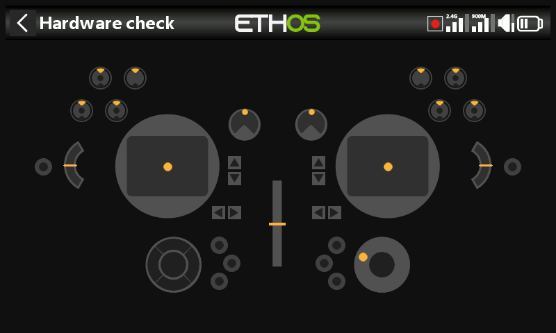

Testing and calibrating the radio's physical controls, switch type
definitions, and the home key map.

## Hardware check

Exercises every physical input so you can confirm each one registers
correctly.

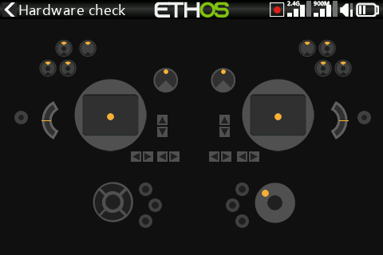

- **X20 Pro/R/RS** — also checks the two latching pushbutton switches **K**
  and **L** on the rear shoulders, plus the additional trims **T5**/**T6**.
- **X18** — also checks the additional trims **T5**/**T6**.

## Analogs calibration

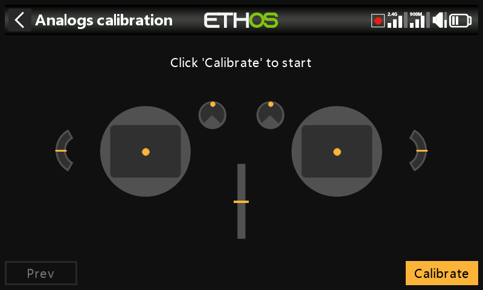

Teaches the radio exactly where the center and limits of each gimbal, pot,
and slider are. Runs automatically on first startup; repeat it after
replacing a gimbal, pot, or slider.

## Gyro calibration

Calibrates the built-in gyro so tilt-based inputs respond correctly to
tilting the radio — the "level" position becomes however you normally hold
it. Also runs automatically on first startup.

## Analogs filter

An on/off ADC filter for the sticks, on by default — reduces jitter around
stick center. This is the **global** setting; there's also a **per-model**
Analogs Filter override under [Model Edit](../model-setup/model-edit.md).

## Pots/Sliders settings

Rename the pots and sliders. The **X20 Pro/R/RS** additionally supports two
extra pots, **Ext1**/**Ext2**, typically used for 3-axis gimbals.

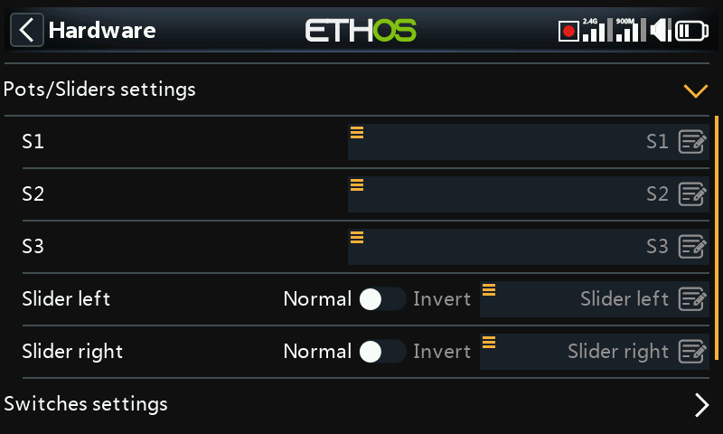
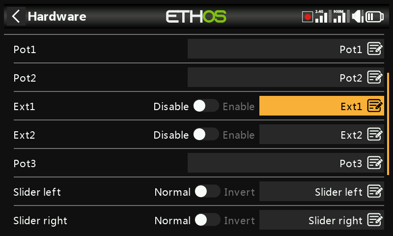

## Switches settings

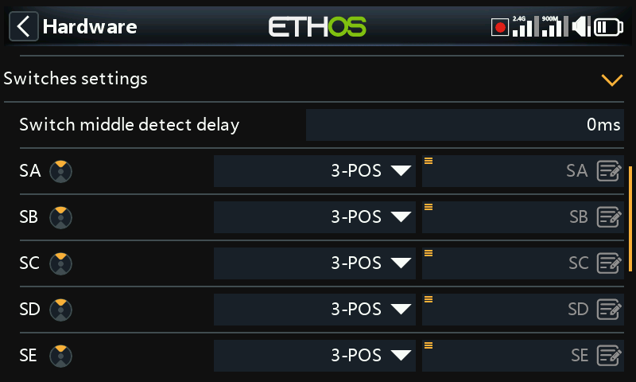

- **Switch middle detect delay** — prevents a fast up→down (or down→up)
  flip of a 3-position switch from momentarily registering the middle
  position; the middle should only register when the switch actually stops
  there. Default is 0ms, chosen to suit FrSky stabilized receivers'
  "self-check" detection on CH12.
- **Switch type** — SA–SJ can each be defined as **None**, **Momentary**,
  **2 POS**, or **3 POS**, letting you swap functionality between physical
  switches (e.g. give momentary switch SH the role normally played by
  2-position SF) — subject to what the radio's wiring actually supports
  (a 3-position role generally can't be assigned to hardware that isn't
  wired for it).

  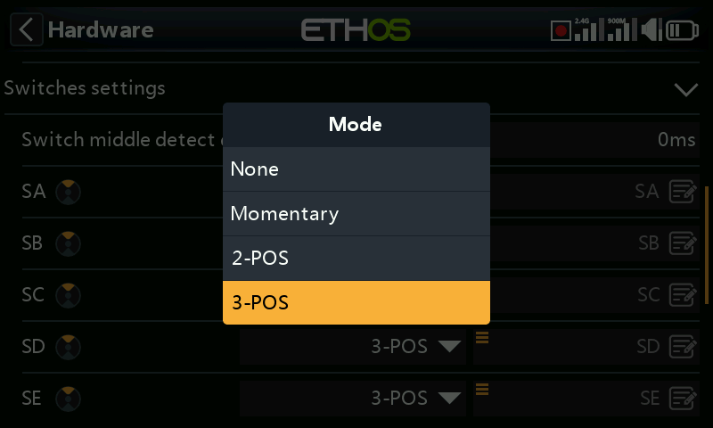
  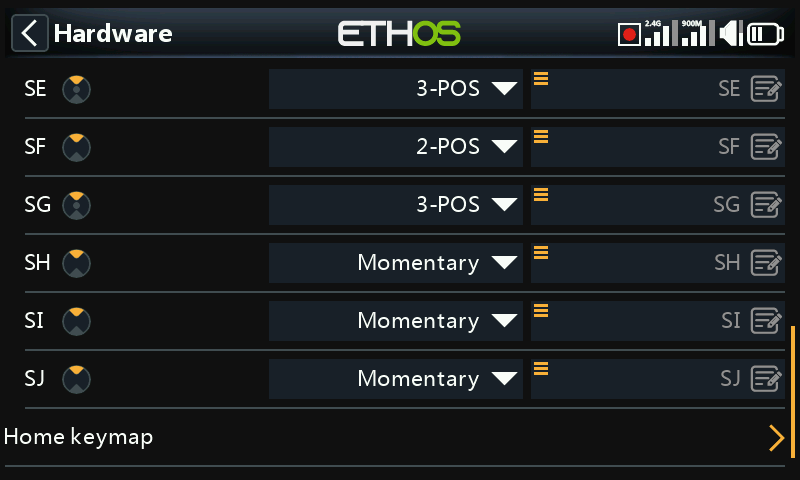

- **Renaming** — switches can be renamed from SA–SJ to custom names;
  names are global across all models.
- **X20 Pro** — adds pushbutton switches **K**/**L** on the rear
  shoulders, plus positions **M**/**N** if wired (typically for stick-end
  switches).

## Home keymap

Reassigns what the `SYS`, `MDL`, and `DISP` (`TELE` on older radios) home
keys jump to.

- **`DISP`** — both short- and long-press can be reassigned to any Model
  page, System page, Configure Screens, Home, or the Flight Data Record.
  For consistency with the X10 series, `DISP` long-press is conventionally
  set to Configure Screens.
- **`SYS`/`MDL`** — only the long-press is reassignable (to the same set
  of destinations); a short press always opens the System or Model section
  respectively.

## Radio-specific hardware options

- **Enabling haptic gimbal upgrades** (X20 Pro, X20R) — the X20 Pro AW and
  X20RS ship with MC20R gimbals that have haptic stick-shaker motors; if
  MC20R gimbals have been retrofitted to an X20 Pro or X20R, enable them
  here (see [Special Functions](../model-setup/special-functions.md) for
  configuring the haptic patterns themselves).

  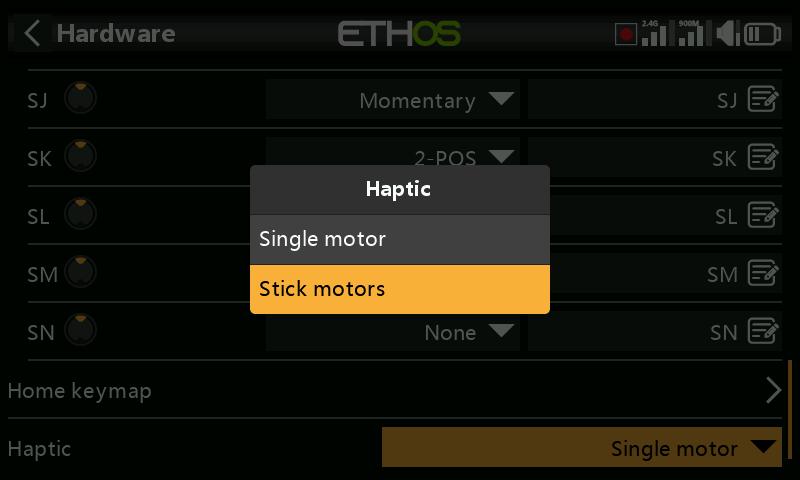
  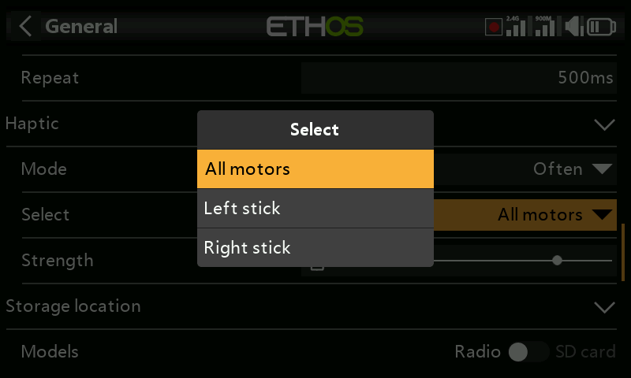

- **Encoder option** (X20 Pro AW, X20R/RS) — these radios have a more
  sensitive rotary encoder; enable **half steps** to tone it down.

  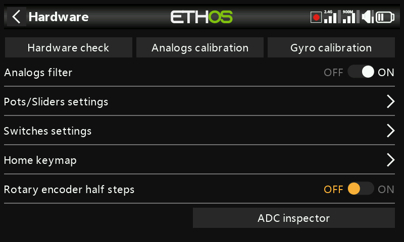

## ADC value inspector

Shows the raw analog-to-digital conversion values the CPU reads for each
analog input:

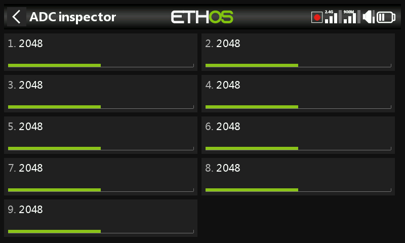
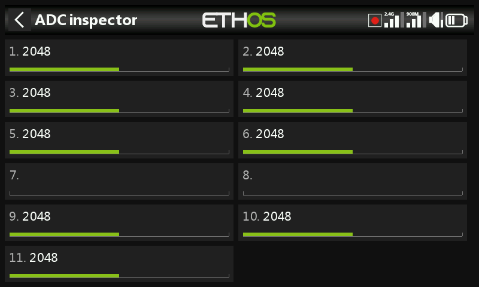

**X20S**: 1 left stick horizontal, 2 left stick vertical, 3 right stick
vertical, 4 right stick horizontal, 5 Pot 1, 6 Pot 2, 7 middle slider, 8
left slider, 9 right slider.

**X20 Pro**: as above, but with two extra external-pot channels (7 Ext1,
8 Ext2 — e.g. stick-mounted pots) inserted before the sliders, which shift
to 9 middle slider, 10 left slider, 11 right slider.
