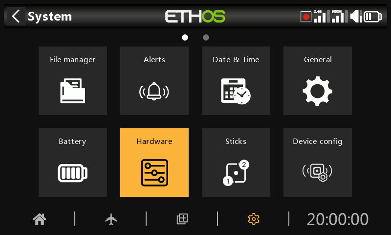
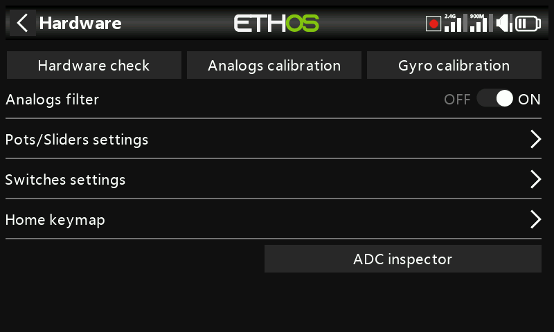
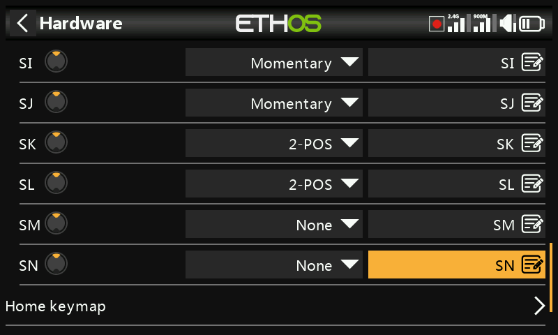
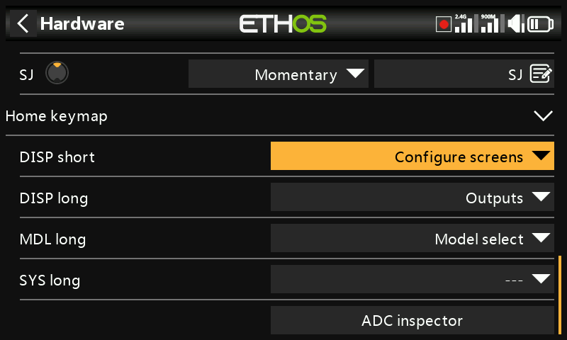
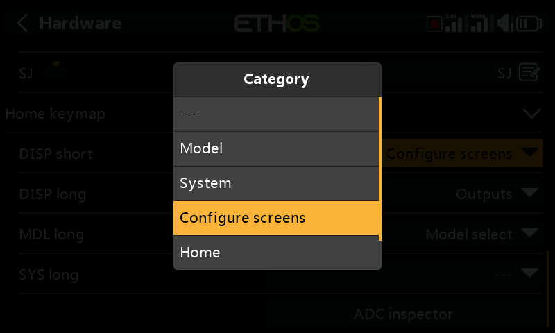

# Hardware

The Hardware section is used to test all inputs, perform analog and gyro calibration, and set switch types and the ‘home key’ map.

## Hardware check

The Hardware check allows all the inputs to be checked for operation.

X20 Pro/R/RS

The Hardware check for the X20 Pro/R/RS radios includes the two latching pushbutton switches K and L on the rear shoulders, as well as the additional Trims T5 and T6.

X18

The X18 radios also have the additional Trims T5 and T6.

## Analogs calibration

Analogs calibration is be performed so that the radio knows exactly where the centers and limits of each gimbal, pot, and slider are. It is automatically run at initial startup. It should be repeated after replacement of a gimbal, pot or slider.

## Gyro calibration

Gyro calibration can be performed so that the gyro sensor outputs respond correctly to tilting the radio. It is automatically run at initial startup. For example, the radio 'level' position would be the angle at which you normally hold the radio.

## Analogs filter

The analog to digital converter filter for the sticks can be turned on/off with this setting. The default value is ON, which may improve jitter around stick centre. This is a global setting here on the Hardware page. There is a model specific option available in the ‘Edit model’ section under [Analogs Filter](../model-setup/model-edit.md).

## Pots/Sliders settings

The pots and sliders can be given custom names here.

X20 Pro/R/RS

The X20 Pro/R/RS has the facility for two additional pots Ext1 and Ext2. These may typically be used when installing 3-axis gimbals.

## Switches settings

Switch middle detect delay

This setting ensures that the switch middle position on three way switches is not detected when the switch is flipped from the up to the down position in one movement, and vice versa. It should only be detected when the switch stops in the middle position. The default has been changed to 0ms to suit the FrSky stabilized receivers when detecting 'Self check' on CH12.

Switches SA to SJ may be defined as:

- None
- Momentary
- 2 POS
- 3 POS

This allows for switches to be swapped over, for example the momentary switch SH could be swapped over with the 2 position switch SF. Note that it may not be possible to replace a momentary or 2 position with a 3 position switch if the radio wiring does not allow for it.

Switches may also be renamed from the default names SA through SJ to custom names. Note that these names will be global across all models.

X20 Pro

The X20 Pro has two additional latching pushbutton switches K and L on the rear shoulders. In addition, switch positions M and N may be wired to the circuit board, typically used for stick end switches.

## Home keymap

The \[SYS\], \[MDL\] and \[DISP\] (TELE on older models) home keys can be re-assigned to suit the user.

\[DISP\] key

For the \[DISP\] key both short and long press options may be reassigned to any Model page, System page, the ‘Configure screens’ page, the Home page or the Flight Data Record. For consistency with the X10 series, the \[DISP\_long\] may be conventionally assigned to the ‘Configure screens’ page.

\[SYS\] and \[MDL\] keys

For the \[SYS\] and \[MDL\] keys only the long-press options may be re-assigned to any Model page, System page, the ‘Configure screens’ page, the Home page or the Flight Data Record. A short press calls either the System or Model section respectively.

## Enabling haptic gimbal upgrades (X20 Pro and X20R)

The X20 Pro AW and X20RS have MC20R gimbals with haptic feedback motors (stick shakers). If MC20R gimbals have been retrofitted to X20 Pro or X20R as an option, you can enable the gimbal motors here. Please refer to the ‘[Select haptic motors](../model-setup/special-functions.md)’ section for details on configuring them.

## Encoder option (X20 Pro AW and X20R/RS)

The X20 Pro AW and X20R/RS models have an improved rotary encoder which is more sensitive. The ‘half steps’ option may be enabled to reduce the sensitivity.

## ADC value inspector

Shows the analog to digital conversion (ADC) values for the analog inputs read by the CPU.

1. Left stick horizontal
2. Left stick vertical
3. Right stick vertical
4. Right stick horizontal
5. Pot 1
6. Pot 2
7. Middle slider
8. Left slider
9. Right slider

X20 Pro

The (ADC) index for the X20 Pro is:

1. Left stick horizontal
2. Left stick vertical
3. Right stick vertical
4. Right stick horizontal
5. Pot 1
6. Pot 2
7. Ext1 (external pot, e.g. stick mounted)
8. Ext1 (external pot, e.g. stick mounted)
9. Middle slider
10. Left slider 
11. Right slider
