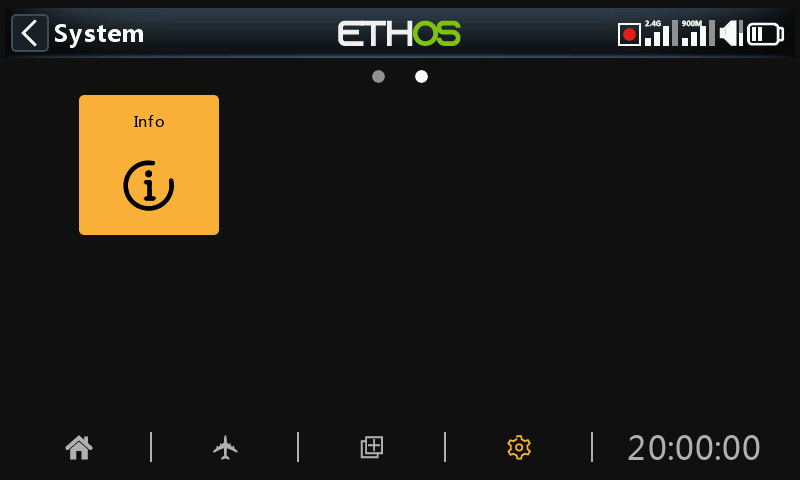
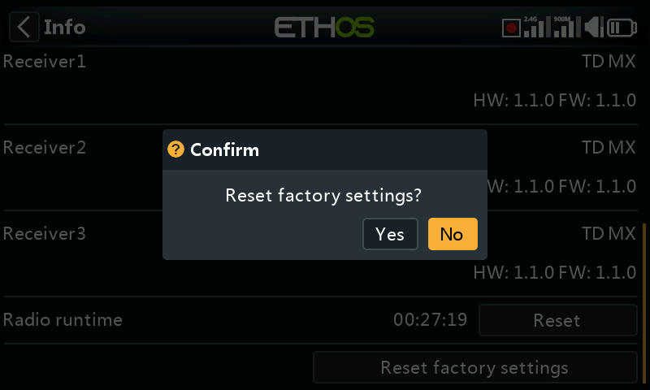
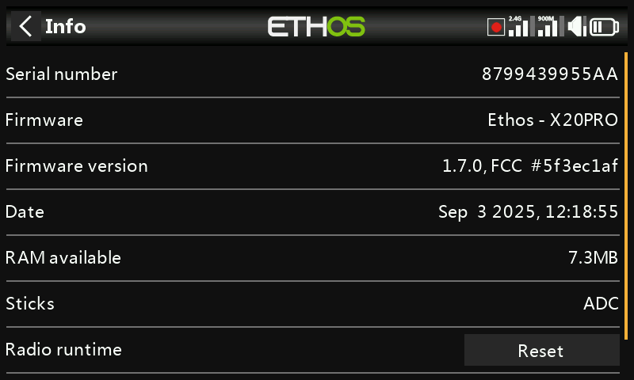

# Info

The Info page displays system firmware information, gimbals type, internal module firmware version, ACCESS, TD or TW receiver firmware and external module information.

## X18 and X20

### Serial number

Serial number of the radio.

### Firmware

Ethos firmware, and radio type (e.g. X20).

### Firmware Version

Current firmware version and type, e.g. FCC, LBT, or Flex.

### Date

The firmware version date and time.

### RAM available

Shows the system RAM available. This is useful for checking for misbehaving Lua scripts. This is also available as a System Value so it can be displayed in a widget for example.

### Sticks

The gimbal Hall sensor version installed. ADC is for analog.

### Internal Module

Details of the internal RF module, including hardware and firmware versions.

### Receiver

Bound receiver details are shown after the Internal Module. If a redundant receiver is bound to the same slot as the main receiver, the receiver details will be shown alternately on the display. The example above shows an Archer SR10 Pro and it's redundant R9MM-OTA shown against Receiver1 details.

### Radio runtime

The radio runtime timer keeps track of the total transmitter usage. A Reset button allows it to be reset to zero.

### Errors

When ETHOS detects an error a red triangle error warning icon is displayed in the main view top bar. The Errors panel displays the errors.

Errors may be due to:

#### Lua script errors

Lua script related problems will result in error messages.

#### RAM backup error

A model may be so huge that it exceeds the backup ram. ETHOS has now expanded the RAM space for model backup from 4k to 32k, so it is unlikely to be exceeded now. This is a major error and will make the model load slower in Emergency Mode from the SD instead of backup RAM.

#### Write log errors

A log writing error alert is raised if problems are encountered by the ‘Write logs’ special function, probably due to SD card errors.

#### Running a nightly firmware build

If a nightly firmware build has been loaded, the warning icon serves to remind the user that nightly builds are not for flying.

A Reset button allows the errors to be cleared, for example during Lua debug sessions.

### External Module

Details of any external FrSky RF module (if fitted), including hardware and firmware versions if ACCESS protocol.

Multimodules are not shown.

### Reset factory settings

Allows returning the radio to its factory settings. No PC USB connection is needed, it is all done on the radio.

When you confirm that you want to reset to the factory settings, the radio erases all models, log files, screenshots, documents, scripts, bitmaps and the radio settings.

There is a progress bar during the erase process. It will then unmount all drives and reboot the radio.

## X20 Pro/R/RS

Similar information for the X20 Pro/R/RS.
