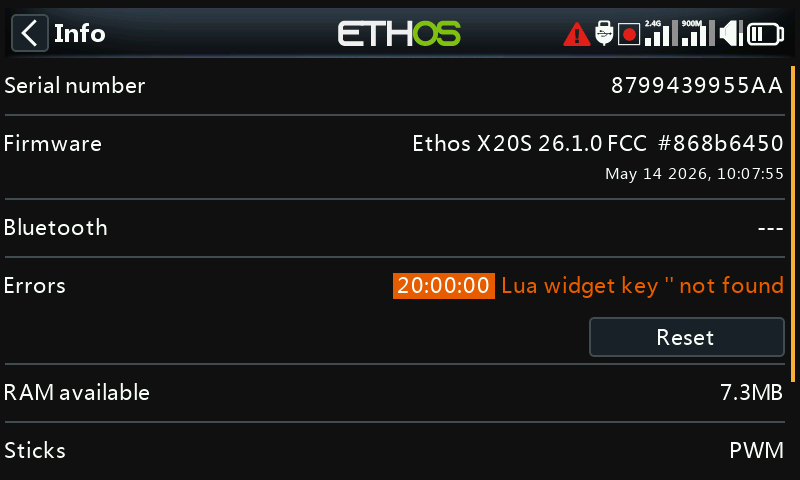

# Information

System firmware details, gimbal type, internal/external RF module info,
bound receiver info, radio runtime, error logs, and factory reset.

## Radio information

- **Serial number** — the radio's serial number.
- **Firmware** — Ethos version and radio type (e.g. X20).
- **Firmware Version** — build variant, e.g. FCC, LBT, or Flex.
- **Date** — firmware build date/time.
- **RAM available** — free system RAM, useful for spotting a misbehaving
  Lua script; also exposed as a System [source](../getting-started/user-interface-and-navigation.md#choosing-a-source)
  so it can be shown in a widget.
- **Sticks** — installed gimbal Hall sensor version (or "ADC" for analog
  gimbals).
- **Internal Module** — hardware and firmware versions of the internal RF
  module.
- **Receiver** — the currently bound receiver's details, shown after the
  internal module. If a redundant receiver shares the same slot as the
  main one, the two alternate on the display (e.g. an Archer SR10 Pro
  shown alongside its redundant R9MM-OTA under "Receiver1").
- **External Module** — hardware/firmware details for a fitted FrSky
  external RF module using the ACCESS protocol. Multi-protocol modules
  aren't shown here.

## Radio runtime

Tracks total transmitter usage time; **Reset** zeroes it.

## Errors

A red triangle in the main-view top bar means Ethos has logged an error,
shown in detail here. Causes include:

- **Lua script errors** — a problem in a running Lua script.
- **RAM backup error** — a model too large for the model-backup RAM. Ethos
  expanded this from 4K to 32K, so it's now unlikely to be hit, but if it
  is, it's a significant error: the model loads more slowly from the SD
  card instead of backup RAM if [Emergency
  Mode](../getting-started/emergency-mode.md) is triggered.
- **Running a nightly firmware build** — a reminder that nightly builds
  aren't intended for flying.

**Reset** clears logged errors — handy mid Lua-debugging session.

## Factory reset

Restores the radio to factory settings entirely on-device — no PC
connection needed.

!!! danger
    Confirming erases **all** models, logs, screenshots, documents,
    scripts, bitmaps, and radio settings. A progress bar tracks the erase,
    after which all drives unmount and the radio reboots.

The X20 Pro/R/RS Info page shows the equivalent information for that
radio family.
