# Basic Fixed Wing **Airplane** example

This simple fixed wing airplane example covers the configuration of a model having a motor, 2 ailerons (and optionally retracts and 2 flaps) and has a servo for each surface.

## Step 1. Confirm system settings

Begin by following the 'Initial radio setup example' above, which is used to configure those parts of the radio system’s hardware that are common to all models. For this example we are using the default AETR (Aileron, Elevator, Throttle, Rudder) channel order.

## Step 2. Identify the servos/channels required

The Mixes function forms the heart of the radio. It allows any of the many sources of input to be combined as desired and mapped to any of the output channels. Ethos has 100 mix channels available for programming your model. Normally the lowest numbered channels will be assigned to the servos, because the channel numbers map directly to the channels in the receiver. The X20 Internal RF (Radio Frequency) module has up to 24 output channels available.

The upper mix channels can be used as 'virtual channels' in more advanced programming, or as real channels using multiple RF modules (Internal + External) and SBus. The channel order is a matter of personal preference or convention, or it may be dictated by the receiver. We will use AETR for our example.

Our airplane example has the following servos/channels:

1 motor

2 ailerons

2 flaps

1 elevator

1 rudder

We will also add retracts later.

## Step 3. Create a new model.

Refer to the Model Setup / [Model Select](../model-setup/model-select.md) section to create your new model. Also refer to the Menu Navigation section to familiarize yourself with the radio's user interface, so that you can find the functions you need easily.

Tap on the Model tab (Airplane Icon), and select the Model Select function. To create a new model, select the Model Category you wish to create the model under, then tap on the \[+\] icon to start the Create Model wizard. (You may need to create your Model Categories first. Please refer to the [Adding a New Model](../model-setup/model-select.md) section for more details.)

For our example, tap on the Airplane icon to start the model creation wizard.

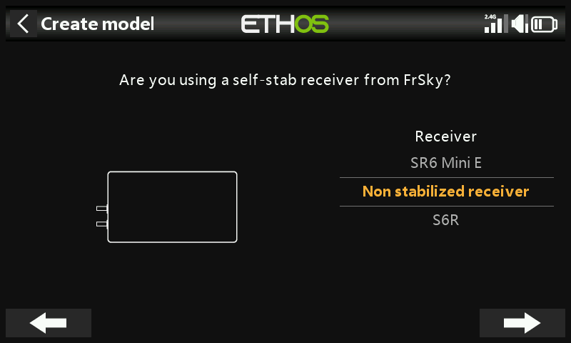

The wizard includes optionally setting up pre-set mixes for FrSky stabilized receivers. For this example, we will choose the ‘Non stabilized receiver’ option.

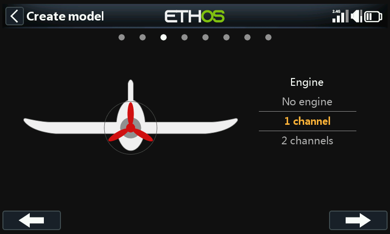

Accept the default of 1 channel for the motor.

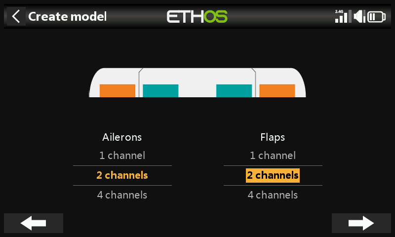

Accept the default 2 channels for Ailerons, and select 2 channels for Flaps.

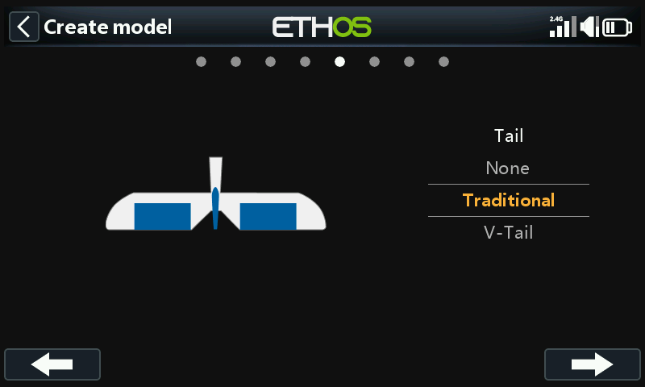

Accept the default Traditional Tail (which has Elevator and Rudder).

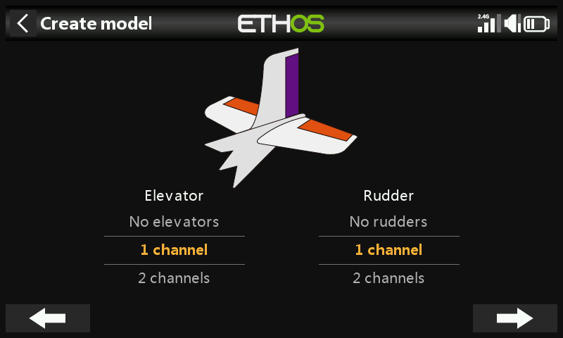

Accept the default 1 channel for Elevator and 1 channel for Rudder.

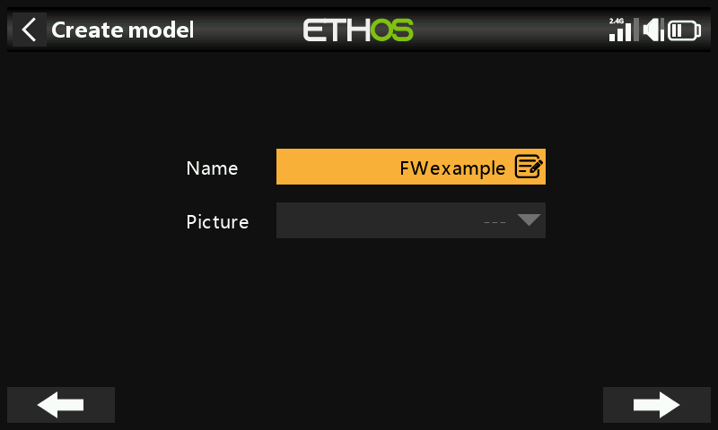

We will name the model 'FWexample', and follow the wizard to the end which results in the 'FWexample' model being created in the Airplane group. Note that model names can be up to 15 characters. It will also be made the active model, so we can continue to configure its features.

## Step 4. Review and configure the ***mixes***

Tap on the Mixes icon to review the mixes created by the Airplane wizard.

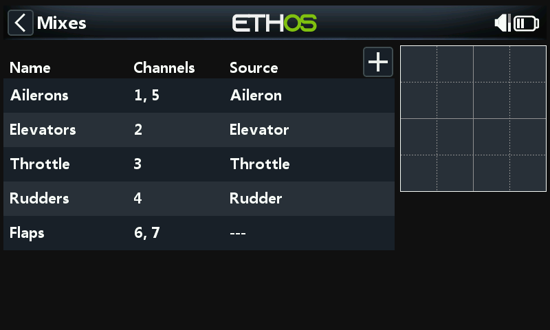

The wizard has created two Ailerons on channels 1 and 5, followed by the Elevator, Throttle, Rudder and Flaps channels. Note for the Flaps the ‘—-‘ denotes that no control source has been assigned to them yet.

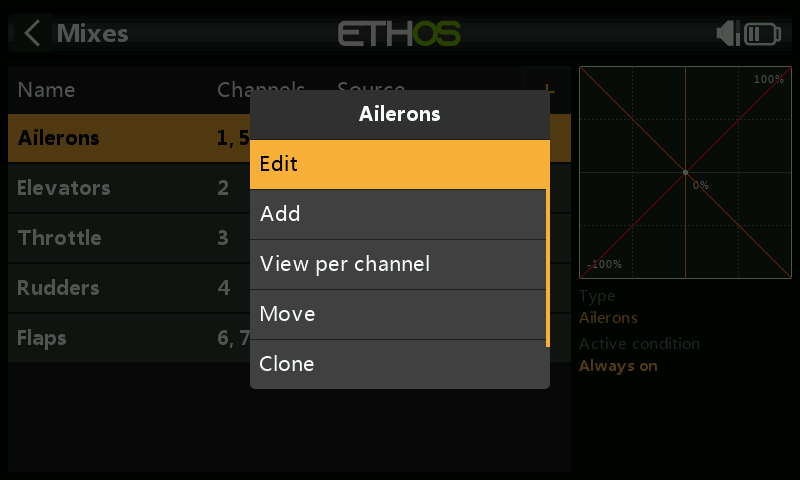

Ailerons

To review the Aileron mix, tap on the Ailerons line and select Edit from the popup menu.

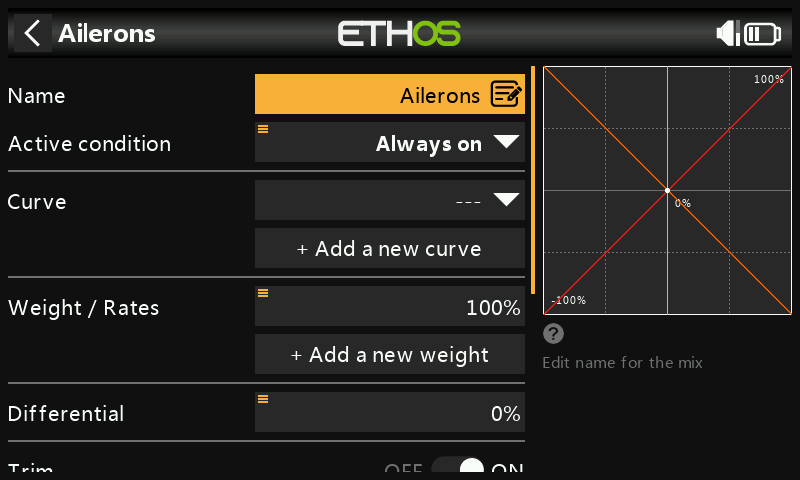

Weight/Rates

It is a good idea to set up Rates on your model, especially if you have not flown it before. Rates set the ratio of the stick movement to channel movement. For example, for sport flying you normally want fairly modest throws on the control surfaces, so you may want to reduce the travel to say 30%. On the other hand, for 3D flying you want as much travel as you can get, i.e. 100%.

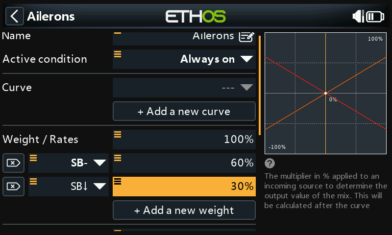

Click on 'Add a new weight', and set up a 60% Rate for switch SB in the mid position.

Click on 'Add a new weight' again, and set up a 30% Rate for switch SB in the down position. The vertical axis in the graph on the right now shows that only 30% of throw is available in this switch position. Note that the Rate will be 100% with switch SB in the up position.

Expo

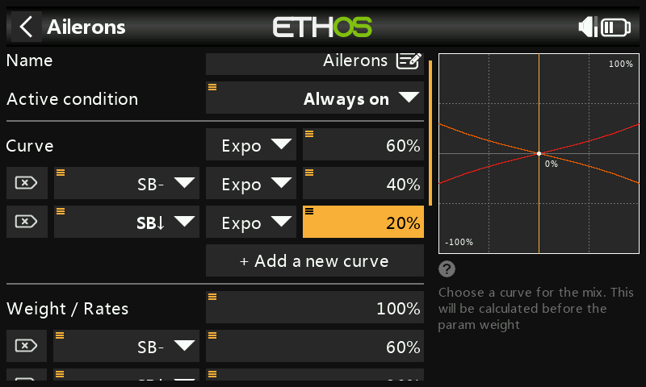

In the Rates examples above you can see that the output response is linear. To avoid the response being too twitchy at the stick centers, you can use an Expo curve to reduce the control surface movement at center stick and to increase it as the stick moves further from center. For this example we have set three Expo rates to 60%,  40% and 20% on the corresponding SB switch positions, and the graph now shows a curved response which is flatter at stick center.

Differential

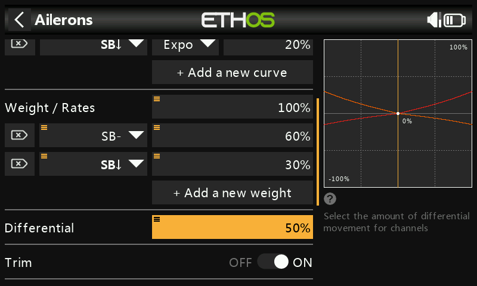

For Ailerons there is another special setting called Differential. If the left and right ailerons move up or down by the same amount, the downward moving aileron will cause more drag than the upward moving aileron, causing the wing to yaw in the opposite direction to the turn. This is known as adverse yaw. To reduce this a positive value in the Differential setting will result in less downward aileron movement, as can be seen in the graph. This will reduce adverse yaw and improve turning/ handling characteristics. A common aileron differential setting is 50%.

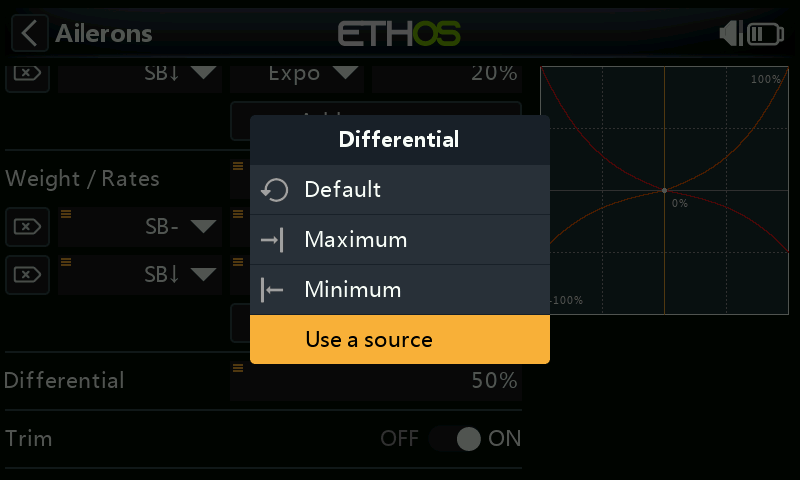

However, you can assign the differential to a pot, allowing you to optimize the value in flight. Long press Enter to bring up the Options dialog, and select 'Use a source'.

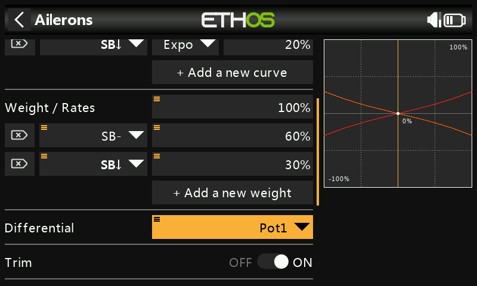

Choose Pot1 from the sources list. You can see the effect of Pot1 in the graph on the right.

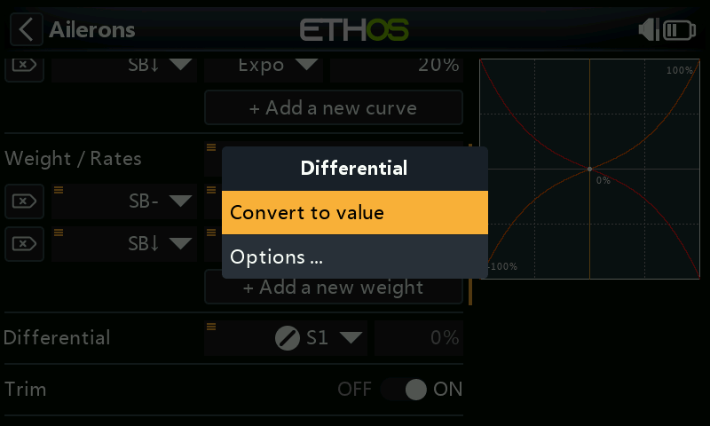

After optimizing aileron differential in flight, you can easily make the pot value your permanent setting. Long press Enter to bring up the Options dialog, and select 'Convert to value'.

Trim

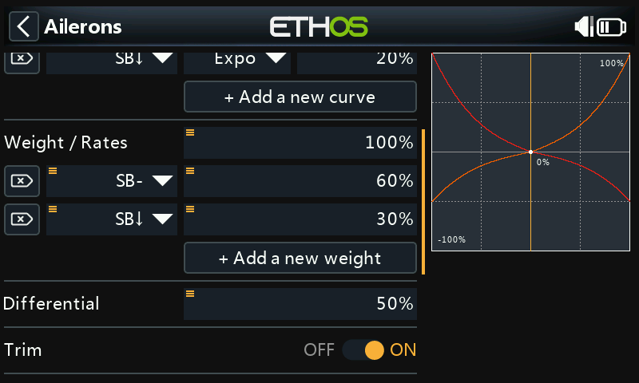

Provides the ability to disconnect a mix’s associated trim without disabling it, so it can be used elsewhere.

Elevator and Rudder

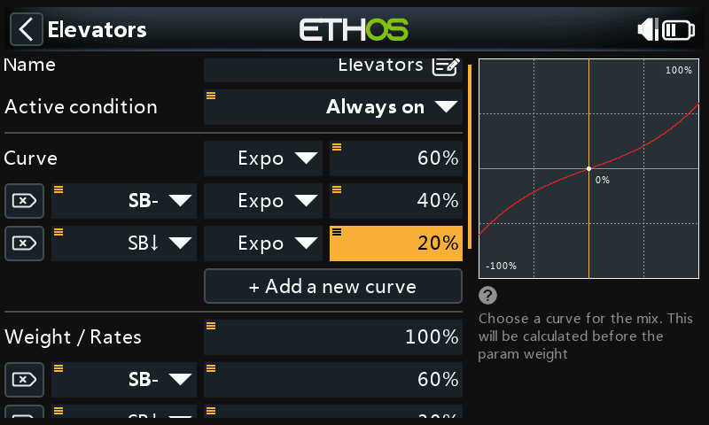

In a similar way to the Ailerons, we can set up triple rates and expo for the Elevator and Rudder on switch SC.

Throttle

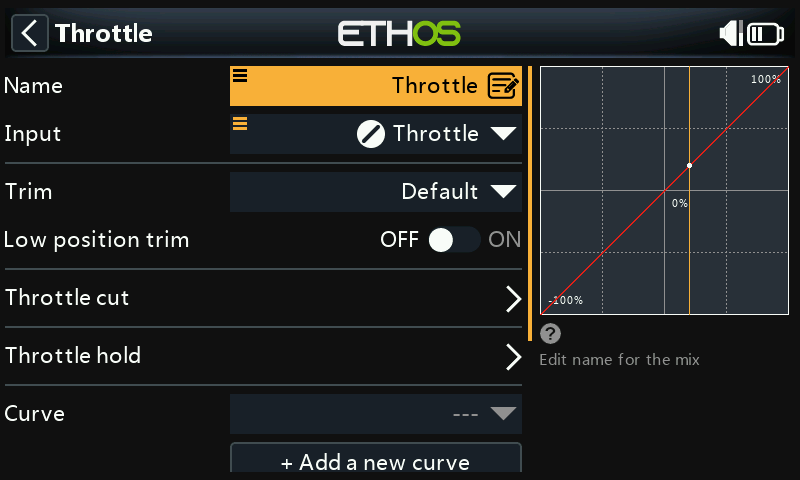

For the throttle we will leave the Input on the throttle stick. We do not need rates or expo, but we do need a safety switch so that the motor will not start unexpectedly. This is extremely important, because model engines and motors can cause serious injury or death.

Low position trim

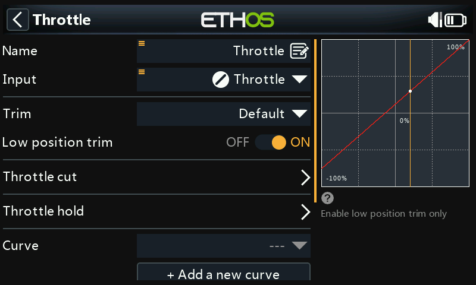

For glow and gas we use 'Low position trim' to adjust the idle speed. The idle speed can vary depending on the weather, etc., so having a way to adjust the idle speed without impacting the full throttle position is important.

If 'Low position trim' is enabled, the throttle channel goes to an idle position of -75% when the throttle stick is at the low position, as shown in the example above. The throttle trim lever can then be used to adjust the idle speed between -100% and -50%. Throttle Cut can then be configured to cut the engine with a switch.

Throttle cut

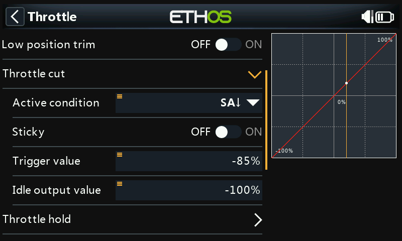

Throttle cut provides a throttle safety latching mechanism. Once the active condition has been satisfied in our example with switch SA in the down position (switch SA down is shown in bold to indicate that it is active), the throttle output will be held at -100% once the throttle value falls below -85%. (Compare the first graph above with the second.)

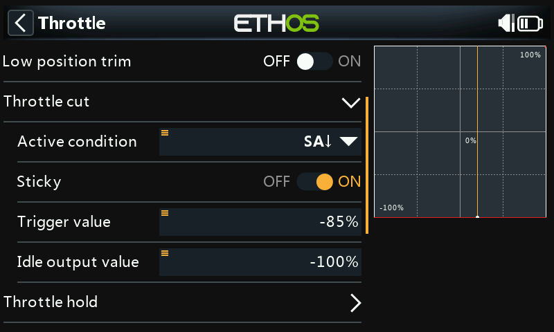

However, if the 'Sticky' is enabled, then the throttle will be cut the instant switch SA goes down, as shown in the example above.

Once the active condition has been removed (i.e. switch SA not in the down position), the throttle stick or control must be brought down below -85% before it can be increased. This avoids the motor unexpectedly starting at a high throttle position when throttle cut on switch SA is released.

Throttle hold

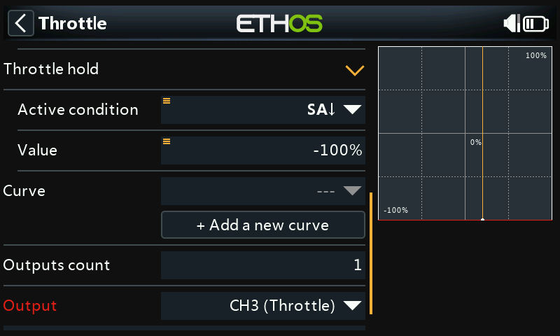

‘Throttle hold’ is used to cut the motor in an emergency from any throttle position. When the throttle hold active condition is met, the throttle output is instantly reduced to -100% (or the value entered). As can be seen in the graph above, the throttle output has been cut to -100% even though the throttle stick is above the half way mark.)

Flaps

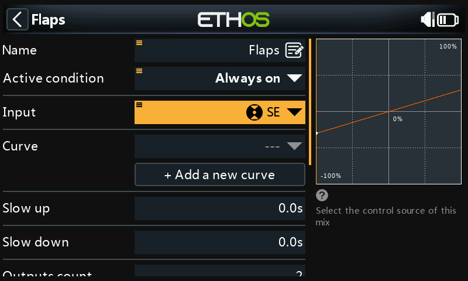

In this example we assign the flaps to switch SE.

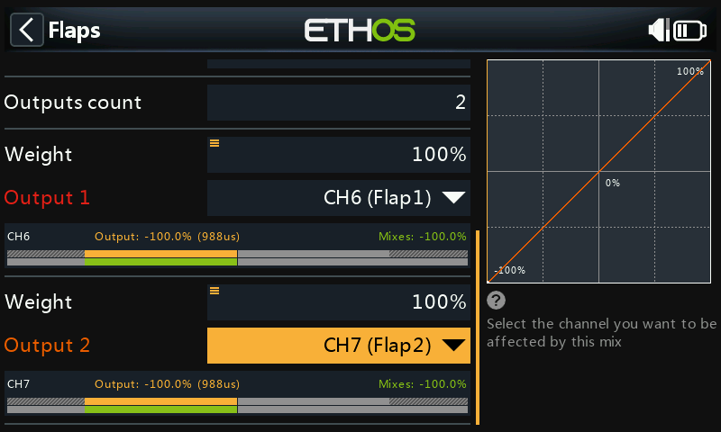

Also increase both output channel weights to 100%.

## Step 5. ***Bind the receiver***

Use the [RF System](../model-setup/rf-system.md) function to register (if your receiver is ACCESS) and bind your receiver in preparation for configuring the Outputs.

Please read through the next section on configuring the Outputs before proceeding. To avoid damage by inadvertently over-driving your servos, it would be wise to disconnect your servo linkages or reduce the servo travel until you are ready to configure the servo min/max limits.

## Step 6. Configure the outputs

The Outputs section is the interface between the setup "logic" and the real world with servos, linkages and control surfaces, and motors or engines. So far we have set up the logic for what we want each control to do. Now, we can adapt that to the mechanical characteristics of the model. The various channels are outputs, for example CH1 corresponds to servo plug #1 on your receiver.

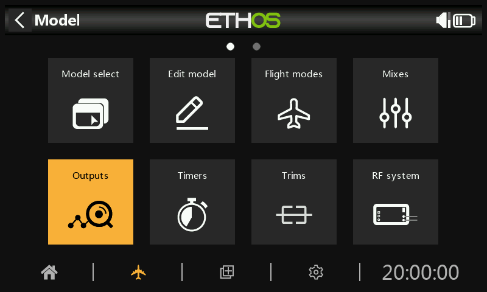

Tap on the Outputs icon to configure the outputs.

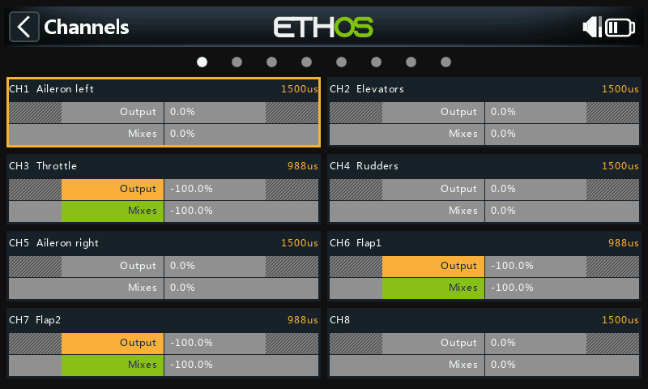

Tap on an output channel to configure it.

Example 1: Aileron1

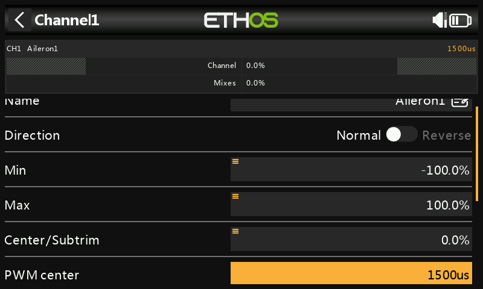

Start by adjusting the servo center points using the PPM Center adjustment, after optimizing the mechanical linkages.

The servo or channel limits should then be configured with the Min and Max settings. To make it easier you can temporarily assign a pot to Min and then Max. Long press on the value and then select ‘Use a source’ as shown in the aileron differential example above.

Flaps

Note that Flaps normally require a large amount of down deflection for effective braking. To achieve this large downward deflection, you can sacrifice some of the upward deflection when making the linkages. This means that the Flaps will be in a half down position at servo center. The Min and Max values are adjusted to achieve the desired flap up and flap full positions.

The curves can also be to correct any real world response issues, for example to ensure that the ailerons and flaps track each other properly. A 5-point curve is commonly used on one side so that surfaces travel can be matched at 5 points.

Channel balancing

Finally, you can use the Channel balancing feature in Outputs to synchronize the movement of left and right surfaces such as ailerons and flaps. Please refer to the [Balance channels](#Balance channels) section.

## Step 7. Introduction to flight modes

Flight modes are a great way to configure a model for different tasks. For example, a glider may have flight modes for tasks such as Cruise, Speed, Thermal, Launch and Land. Each flight mode can remember its own trim settings, so once you have trimmed the glider to fly well in each mode, you no longer have to keep changing your trims during flight as you change tasks. The flight mode switch becomes a bit like changing gears in a car. Flight modes are sometimes called 'Conditions' in other firmware.

For simplicity, this example only shows setting up flight modes for Default, Flaps Half and Flaps Full.

There are 20 flight modes including the default mode available for use. The first flight mode that has its active condition ON is the active one. When none has its active condition ON, the default mode is active. This explains why the default mode does not have a switch selection option.

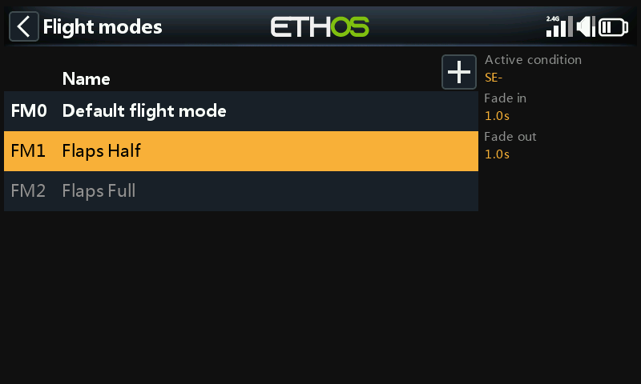

For our example we have configured the default flight mode as Default, and added two additional flight modes named Flaps Half (switch SE-mid) and Flaps Full (switch SE-Up).

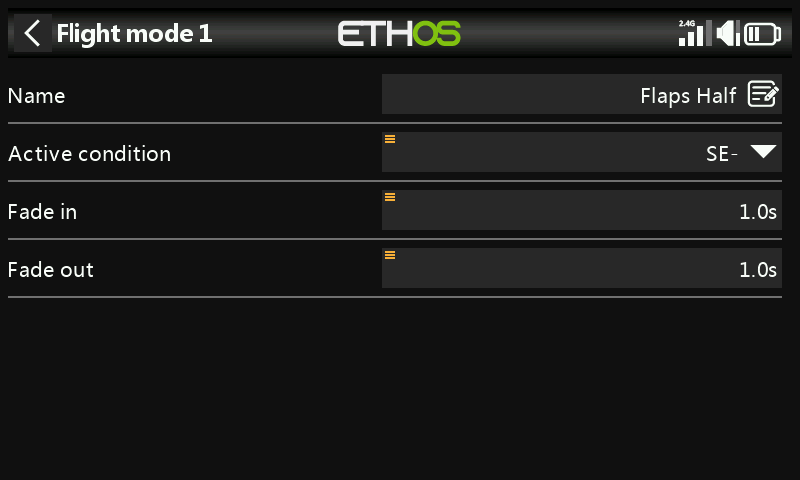

For flaps you may wish to slow the transition between flight modes. The example above shows fade in and fade out times of 1 second.

## Step 8. Configure the trims

Option – Independent Trims

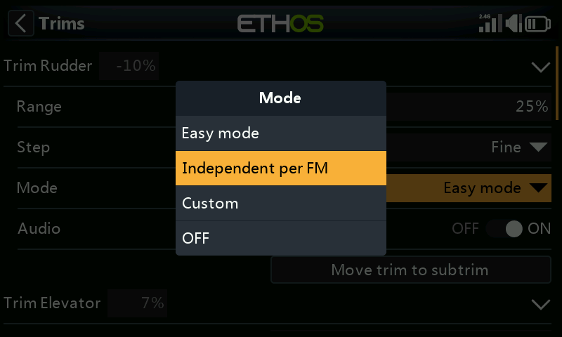

Next we go the Trims section. The first option is to change the Elevator stick to have ‘Independent trims per flight mode’. This then allows you to have independent elevator compensation for the two flaps deployed settings. The Elevator Trim buttons will automatically switch between the independent settings as you operate the flaps on switch SE.

Because the trims are fully independent, you have to trim the elevator in each flight mode ‘from scratch’ as it were. You may want to use the ‘Instant trim’ feature to assist with first trimming for normal flight, and then trimming for each flaps position. You could also land after trimming for normal flight to transfer its trim value to the flap mode trims as a starting trim value for those modes.

Option – Base trim with Offset

Another option is to configure the two flap modes to use a base trim with an offset for each flap position. This way you trim for normal flight in flight mode ‘FM0 Default’, and when you switch to the flaps positions this base trim is used again, but now any Elevator compensation trim adjustments are added as an offset to the base trim.

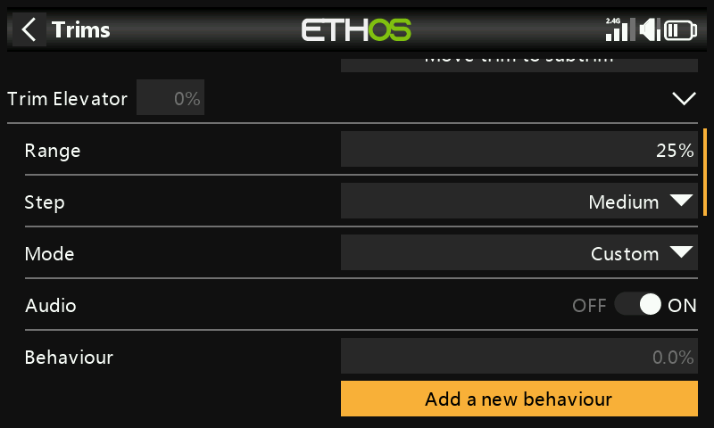

We start by setting the Step size to Medium, so that it is easier to reach the desired trim quickly. The Step size can then be reduced for fine tuning.

Next set the Mode to Custom, and click on ‘Add a new behaviour’.

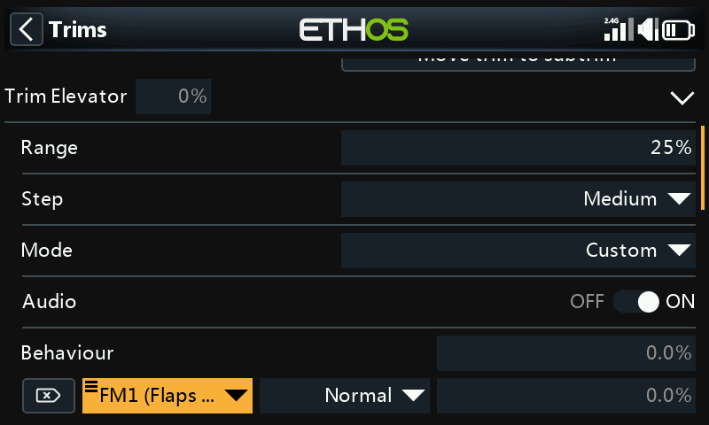

For the ‘Active condition’ select flight mode ‘FM1 Flaps Half’.

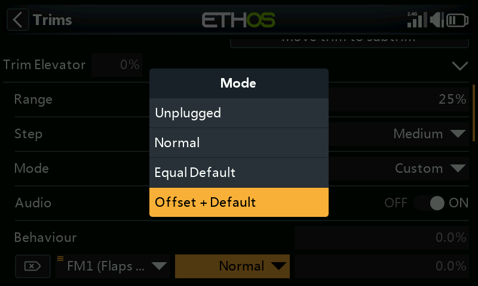

Next select ‘Offset + Default’ for the mode.

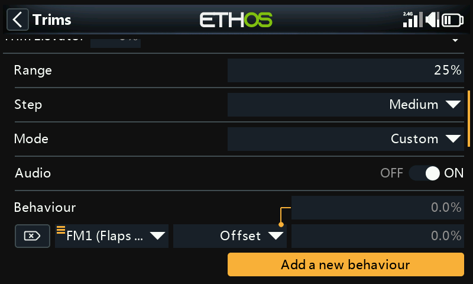

The first behavior has been configured. In flight mode 1 ‘FM1 Flaps Half’ the trim value will be the sum of the base or default trim plus the Offset trim resulting from trim adjustments made while in flight mode 1 ‘FM1 Flaps Half’.

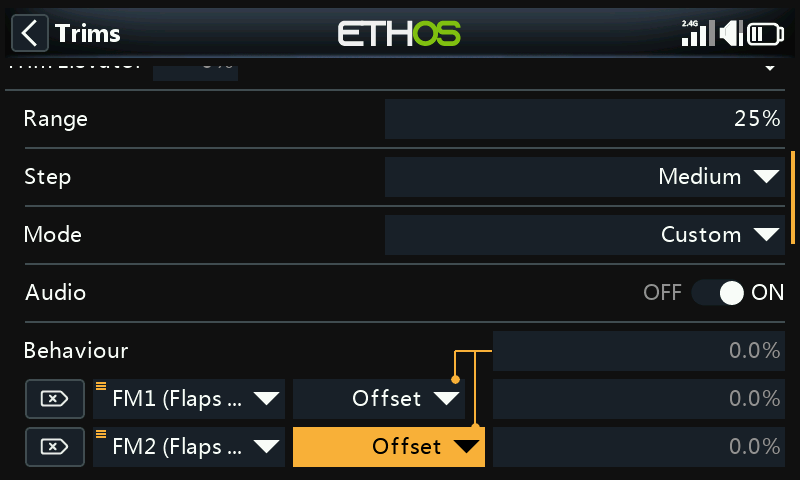

Repeat for flight mode 2 ‘FM2 Flaps Full’.

The elevator compensation can now be trimmed independently for both the ‘Flaps Half’ and the ‘Flaps Full’ flight modes. However, if the base or default trim used in flight mode ‘FM0 Default’ is adjusted, the two flaps compensation trims will also be altered by the same amount. This can be useful if for example the Default trim has to be adjusted due to servo thermal drift.

## Step 9. Set up a ***flight*** battery timer

Tap on Timer 1 in the Model / Timers section, and select Edit. In this example we are configuring a Down counting timer, with a Start Value of 5 minutes. The timer will run whenever the System Event ‘Throttle active’ is True, provided it is not being held in reset.

If you assign a proportional timing source, then the speed of the timer will depend on the position of the Throttle stick (for example). At full throttle the timer will count in real time, but will slow down as the Throttle is reduced.

Please refer to the [Countdown timer](../model-setup/timers.md) section for details on configuring the remaining timer parameters.

## Step 10. Add a mix for retracts

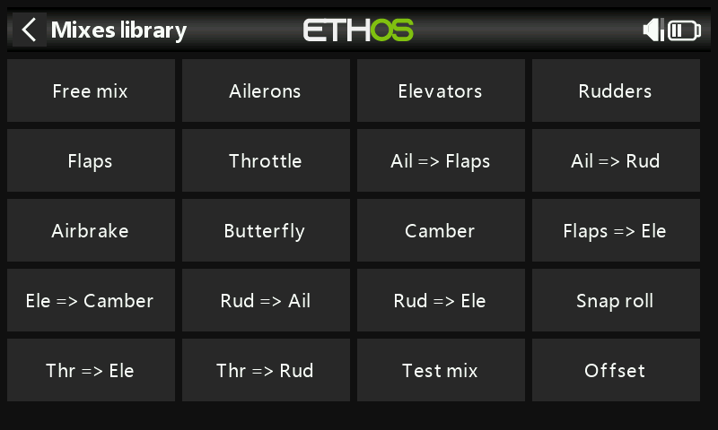

Tap on a mix and select 'Add Mix' from the popup menu. This will open the Mixes Library. Select 'Free Mix'.

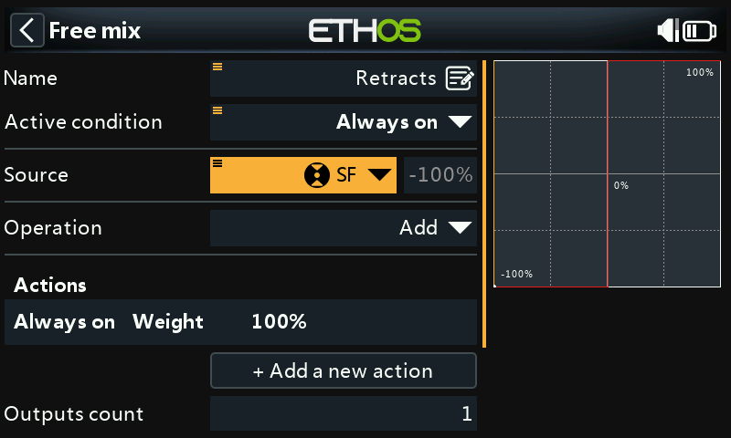

For this example name the Free Mix as 'Retracts'. The mix can always be on, and the Source can be switch SF.

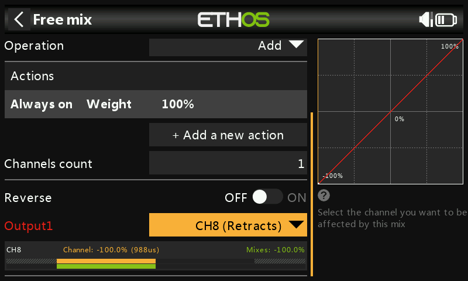

The default mix action of Weight = 100% is fine.

The lower half of the Free Mix settings shows that channel 8 has been allocated to the retracts.
