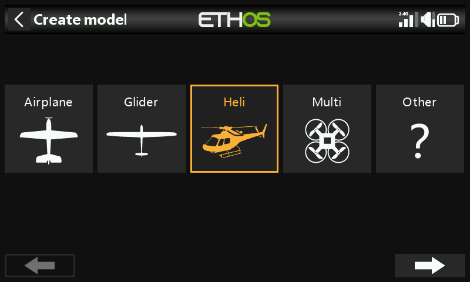
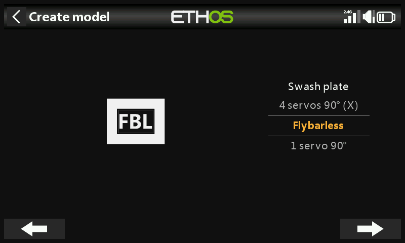
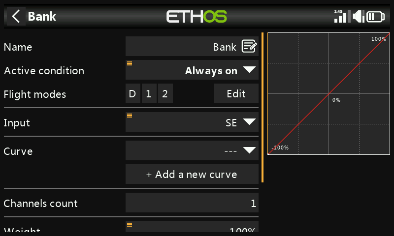
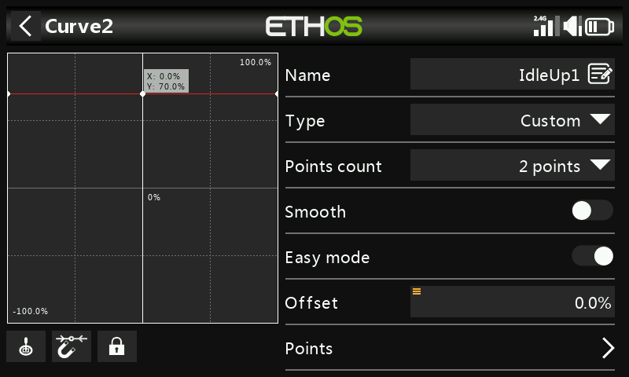
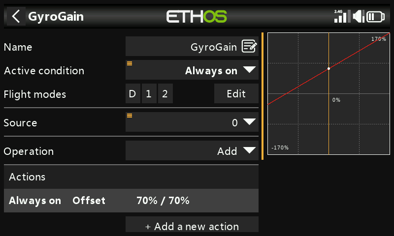

# Basic Flybarless Heli Example

A flybarless helicopter built from the wizard, including FBL controller
channel reassignment, through to reviewing swash mixing, throttle/pitch
curves per flight mode, and gyro gain.

!!! note "Draft"
    This page is a placeholder — full content coming in a later pass.
