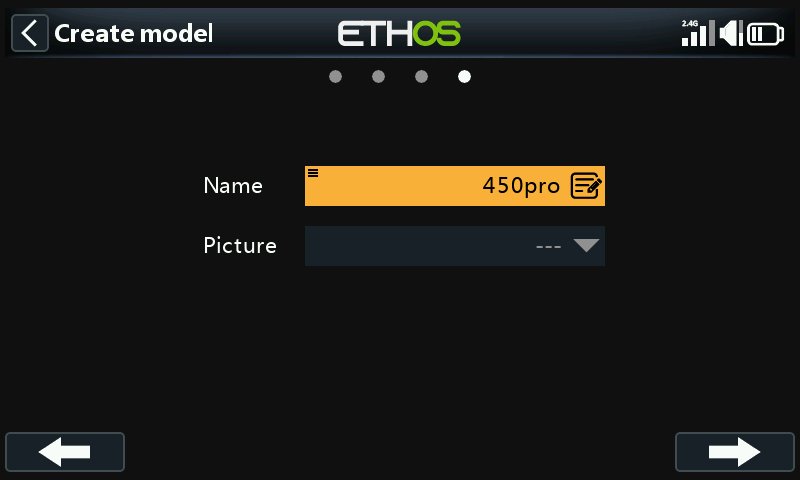
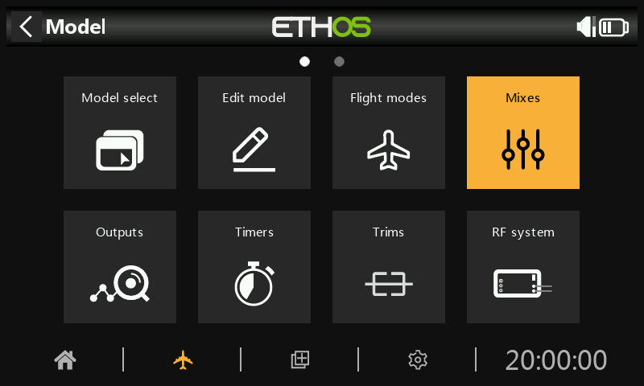
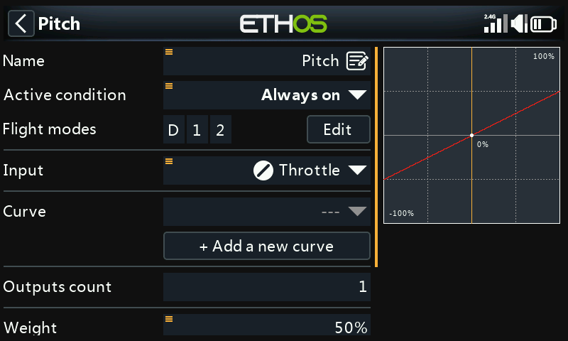
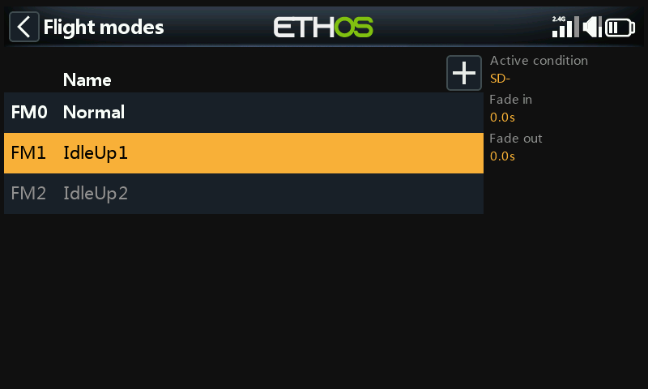
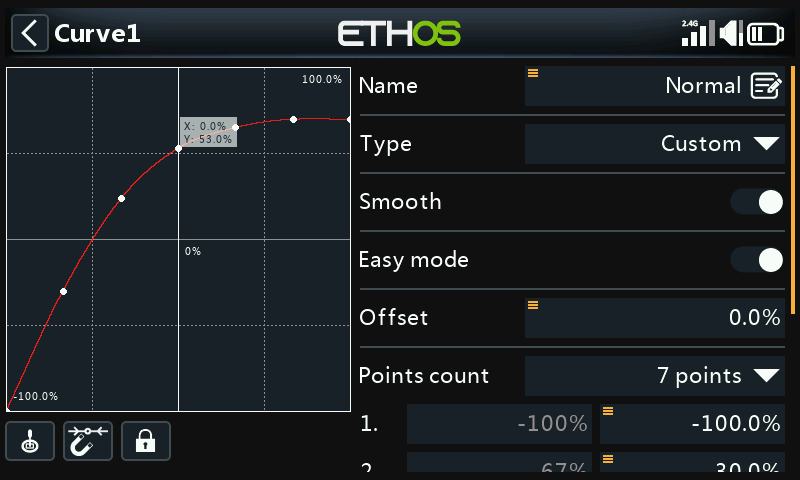
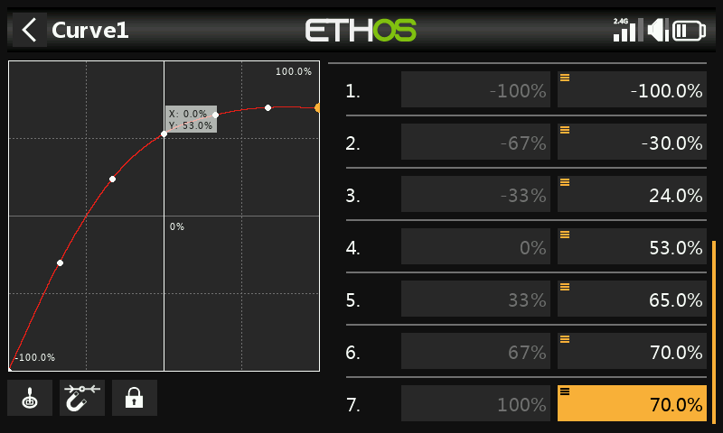
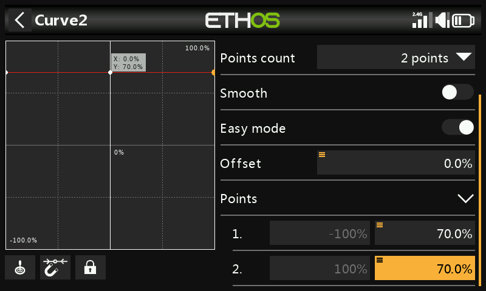
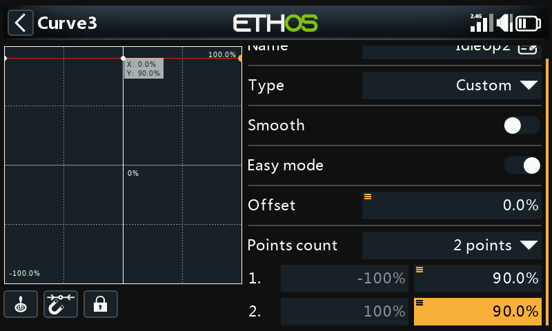
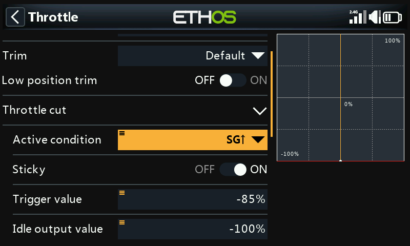
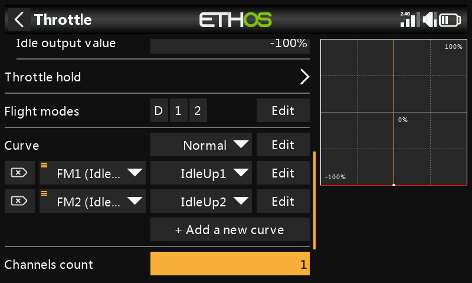

# Basic Flybarless Helicopter example

This basic flybarless helicopter example covers the configuration of a basic helicopter using an FBL controller such as the Spirit.

Unlike fixed wing aircraft with dihedral, helicopters are inherently unstable, and rely on a flight controller using gyros and accelerometers to produce stable flight.

Gyros, which measure the rate of rotation about an axis, and accelerometers, which sense motion and velocity to keep track of movement and orientation, are the primary contributors to the determination of yaw, pitch and roll for the flight calculations required for stable flight. Stability is achieved by the use of a software algorithm called a Proportional Integral Derivative (PID) control loop. The PID loop requires tuning to achieve stable flight while retaining responsiveness yet minimizing overshoot. The tuning parameters are a function of the physical and electrical characteristics of the helicopter.

In this example we will only cover the radio programming side of the helicopter setup. Please refer to your FBL setup app documentation for the balance of the setup. A good knowledge of helicopter technology and operation is assumed.

**Warning!** Before commencing, to avoid injury, ensure that the rotor blades have been removed so that you can perform the setup safely.

## Step 1. Confirm System settings

Begin by following the 'Initial radio setup example' above, which is used to configure those parts of the radio system’s hardware that are common to all models. For this example we are using the AETR (Aileron, Elevator, Throttle, Rudder) channel order, and the 'First four channels fixed' setting should be ‘OFF’.

Use the [RF System](../model-setup/rf-system.md) function to register (if your receiver is ACCESS) and bind your receiver in preparation for configuring the model.

## Step 2. Identify the servos/channels required

The Mixer function forms the heart of the radio. It allows any of the many sources of input to be combined as desired and mapped to any of the output channels.

Our helicopter example has the following servos/channels:

1 x roll (aileron)

1 x pitch (elevator)

1 x throttle

1 x yaw (rudder)

1 x gyro gain

1 x collective pitch

1 x settings bank

1 x rescue

## Step 3. Create a new model.

Refer to the Model Setup / [Model Select](../model-setup/model-select.md) section to create your new model. Also refer to the Menu Navigation section to familiarize yourself with the radio's user interface, so that you can find the functions you need easily.

Please refer to the System / [Sticks](../system-setup/controls.md) section and confirm that the Channel Order is AETR, and set the 'First four channels fixed' setting to ‘OFF’ to ensure that the channel order created by the wizard will suit the FBL unit. The Spirit FBL units expect the SBUS channels to be in this order, despite the fact that it uses TAER in it’s setup.

Tap on the Model tab (Airplane Icon), and select the Model Select function. Create a Heli category if not already present and select it. Tap on the ‘+’ symbol, which will present you with a choice of model creation wizards, i.e. Airplane, Glider, Heli, Multirotor or Other. The wizard takes your selections and creates the Mixer lines needed to implement the functionality required.

For our example, tap on the Heli icon to start the model creation wizard.

Select Flybarless.

Define a name and model image for your model.

## Step 4. Review and configure the ***mixes***

Tap on the Mixer icon to review the mixes created by the Heli wizard.

The wizard has created Ailerons, Elevators, Throttle and Rudder in the AETR sequence as expected, and created Pitch on channel 6 and FBL Bank on channel 7.

Collective Pitch is normally on channel 6. Confirm that Pitch is on channel 6:

| ch6 | collective Pitch |
| --- | --- |
| ch7 | FBL Bank |

We will also need to add additional mixes for Gyro Gain and Rescue/Stabi. Tap on the ‘+’ symbol next to the column headings to add the extra channels needed using Free Mixes:

| ch5 | Gyro Gain |
| --- | --- |

| ch8 | Rescue / Stabi |
| --- | --- |

### Review Aileron / Elevator / Rudder

Nothing needs to be added on these channels. Please note that settings such as rates and expo are handled by the FBL unit, so the radio just passes the linear control inputs to the FBL unit.

### Configure Collective Pitch

Collective Pitch is just a straight line linear curve, so you only need to confirm the output Channel (normally channel 6). Please note that things like rates and expo are taken care of by the FBL unit, so the transmitter just sends ‘clean’ inputs.

### Configure the FBL Bank mix

The Spirit FBL unit has three settings Banks that can be used to set up different configurations. The Bank switching is great for switching between flight styles, different sensor gains for low or high RPMs, or for Beginner, Acro or 3D. Alternatively it can be used just for tuning your settings.

We will assign the mix to 3 position switch SE.

### Configure Gyro Gain

In the main mixes screen (see earlier) new mixes may be added by tapping on the ‘+’ symbol next to the column headings.

Gyro Gain is typically a fixed value, so we set the Source to Special Value – 0, and then dial up the required gain value using Offset. The final gain value may need to be determined in flight. Scroll further down and assign the output Channel to 5. (Gain is normally on channel 5).

### Configure flight modes

We will use flight modes to configure the three flight modes needed for Normal, Idle Up 1 and Idle Up 2. For our example we have renamed the ‘Default flight mode’ to ‘Normal’, and added two additional flight modes for Idle Up 1 and 2 on switch SD.

### Configure the Throttle Mix

The Throttle channel will be controlled by three throttle curves for the three flight modes, i.e. Normal, Idle Up 1 and Idle Up 2.

#### Normal mode curve

Normal mode is used for spool up and take off, so the curve starts at -100% (motor off) and then smoothly increases for take off. The final curve values may need to be determined in flight.

In this example we have used a 7 point curve with Smooth On to get a smooth curve.

#### Idle Up 1 curve

Idle Up 1 is used for most flying. The straight line curve means that we will have a constant throttle setting to keep the rotors spinning at a steady rate. The final throttle value may need to be determined in flight. The helicopter’s motion will be controlled by the Collective Pitch and Aileron (roll) and Elevator (pitch) controls.

Note that there should not be a big jump between Normal and Idle Up 1, so the transition happens smoothly.

Note also that most FBL units offer a Governor function, which ensures that rotor speed is kept constant even during aggressive flying manoeuvres. Please refer to the Spirit FBL manual for details.

#### Idle Up 2 curve

Idle Up 2 is used for more aggressive flying, for example aerobatics and 3D. The final throttle value may need to be determined in flight.

#### Throttle mix setup

##### Throttle Cut

If we assign switch SG-up to the Throttle Cut function and it’s Sticky to ‘ON’, then the throttle will be cut as soon as you flip the switch to the ‘Up’ position. However, due to the Sticky setting the throttle can only be armed with the throttle stick in the low (off) position.

##### Throttle curves

We can now configure the Throttle mix for the three throttle curves, controlled by the flight modes.

### Configure the Rescue / Stabi mix

In a similar way, the Rescue mix can be assigned to say switch SA on channel 8.

## Step 5. FBL Setup

### Install the ***FBL*** configuration tool

Begin by installing the Spirit Settings software on your PC.

### Connect your receiver to the ***FBL unit***

Connect your receiver to your FBL unit in accordance with the Wiring section of the FBL manual. Your receiver ‘SBUS Out’ should be connected to the ‘RUD’ port of the FBL unit (note some Spirit models require an SBUS adapter). Alternately, you can connect using F.Port 1 or FBUS.

### Connect the ***FBL unit*** ***to your PC***

Connect your PC to your FBL unit in accordance with the Configuration section of the Spirit FBL manual, either using the supplied cable or via Bluetooth.

Establish a successful connection to your FBL unit. Your are now ready to configure the radio programming side of your helicopter setup. As already stated, your should refer to the Spirit FBL configuration documentation in the manual to complete the remaining setup.

**Warning!** Do not connect any servos yet!

### Check the FBL firmware version

If necessary, update the FBL firmware to the latest version (refer to the Update tab in the Spirit Settings tool).

### General Setup

Please refer to the General Tab in the Spirit Settings software.

- Set the Receiver type to ‘Futaba SBUS’ or ‘FrSky F.Port’ (as appropriate) and restart the system.
  - Click on the ‘Channels’ button to go to the receiver channel mapping dialogue. If you used the AETR channel order in the Heli wizard you will be able to assign the channels as follows:

|  |  |
| --- | --- |
|  |  |
|  |  |
|  |  |
|  |  |
|  |  |
|  |  |
|  |  |

### Channel Limits

Please refer to the Diagnostic Tab in the Spirit Settings software.

For proper operation of the FBL unit, the radio channel limits must be calibrated, and the centers checked.

On the radio, ensure all subtrims and trims are zeroed. Set your Collective Pitch to the center stick position to give an output of 1500uS in the Channels screen. Now power up the FBL unit and check that the aileron, elevator, pitch and rudder channels are centered at 0% in the Diagnostic Tab. The FBL unit automatically detects the neutral position during each initialization.

Move the controls to their limits, and adjust the corresponding Minimum and Maximum throw settings in the Channels page for each channel to achieve a reading of +100% and -100% in the Diagnostics tab. The direction of the movement of the bars must match with the sticks as well. Do not use subtrim or trim functions on your transmitter for these channels, as the Spirit FBL unit will consider these as an input command.

Adjust the Offset value in the Gyro Gain mix to ensure that Heading Lock is achieved.

After these adjustments, everything should be configured with regards to the transmitter. You can now continue with the rest of the FBL setup as per the Spirit FBL manual.
