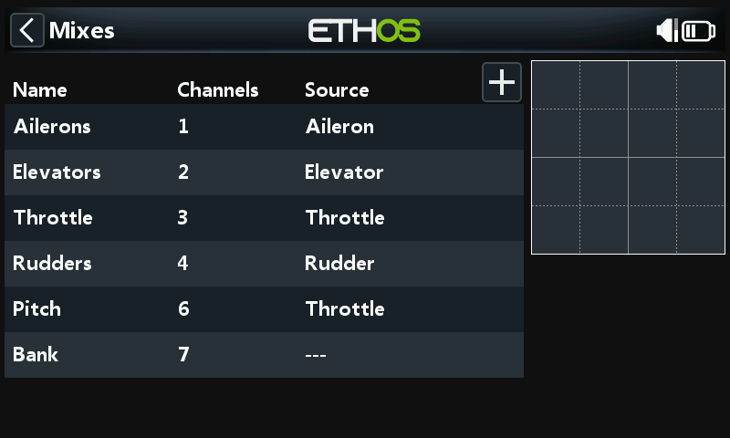
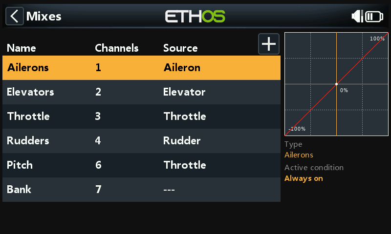
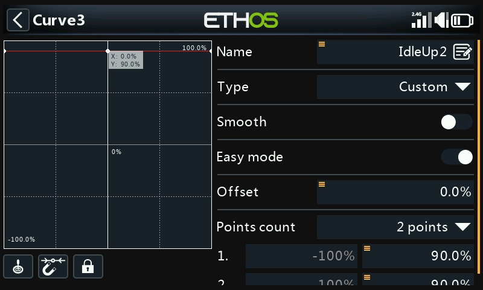
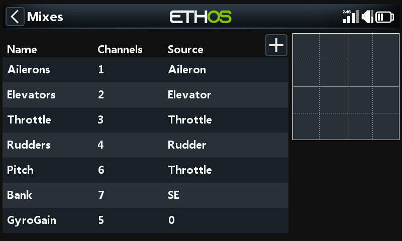

# Basic Flybarless Heli Example

A basic flybarless (FBL) helicopter setup, using a controller such as the
Spirit as the example. Unlike a fixed-wing model, a helicopter is
inherently unstable — the FBL controller uses gyros (rate of rotation)
and accelerometers (motion/orientation) to calculate yaw/pitch/roll
corrections via a tuned PID (Proportional-Integral-Derivative) control
loop, balancing stability, responsiveness, and overshoot based on the
specific helicopter's physical and electrical characteristics.

This tutorial covers only the **radio programming** side — refer to your
FBL unit's own documentation for the rest, and come in with solid general
helicopter knowledge already.

!!! danger
    Remove the rotor blades before starting, for safety.

## Step 1. Confirm System settings

**AETR** channel order, **[First four channels
fixed](../system-setup/controls.md#first-four-channels-fixed)** **OFF**
— Spirit FBL units expect SBUS channels in this order specifically
(despite using TAER internally in their own configuration). Register (if
ACCESS) and bind the receiver via [RF System](../model-setup/rf-system.md).

## Step 2. Identify the servos/channels required

| Function | Channel |
|---|---|
| Roll (aileron) | — |
| Pitch (elevator) | — |
| Throttle | — |
| Yaw (rudder) | — |
| Gyro gain | 5 |
| Collective pitch | 6 |
| Settings bank | 7 |
| Rescue | 8 |

## Step 3. Create a new model

From [Model Select](../model-setup/model-select.md), create/select a Heli
category, start the wizard, and choose **Flybarless**:

Name it and pick an image.

## Step 4. Review and configure the mixes

The wizard builds Ailerons/Elevators/Throttle/Rudder in AETR order, Pitch
on channel 6, and FBL Bank on channel 7:

Confirm channel 6 is Collective Pitch. Two more channels need [Free
Mixes](../model-setup/mixes.md#mix-libraries) added manually: **Gyro
Gain** (channel 5) and **Rescue/Stabi** (channel 8).

**Aileron/Elevator/Rudder** — nothing to add; rates and Expo are the FBL
unit's job, so the radio just passes clean linear input through.

**Collective Pitch** — a straight linear curve; just confirm the output
channel (normally 6). As above, rates/Expo are handled by the FBL unit,
not here.

**FBL Bank** — the Spirit's three settings banks (different flight
styles, sensor gains at different RPMs, or Beginner/Acro/3D — or simply
tuning presets) mapped to a 3-position switch, e.g. SE:

**Gyro Gain** — add as a Free Mix after the last channel. Gain is
typically a fixed value: set **Source** to Special Value 0, dial in the
gain via **Offset** (fine-tuned in flight later), output to channel 5:

### Configure flight modes

Three [flight modes](../model-setup/flight-modes.md): rename the default
to **Normal**, and add **Idle Up 1**/**Idle Up 2** on switch SD.

### Configure the throttle mix

Three throttle curves, one per flight mode, each a [custom
curve](../model-setup/curves.md):

- **Normal** — spool-up/takeoff: starts at −100% (motor off), rising
  smoothly. A 7-point curve with **Smooth** on works well; exact values
  need in-flight tuning.

  

- **Idle Up 1** — general flying: a straight-line curve for a constant
  throttle setting holding steady rotor speed, with motion coming from
  Collective Pitch, Aileron (roll), and Elevator (pitch) instead. Keep
  the transition from Normal smooth — no big jump. (Most FBL units also
  offer a **Governor** function to hold rotor speed constant through
  aggressive maneuvers — see the FBL unit's own manual.)

  

- **Idle Up 2** — aggressive flying (aerobatics, 3D); again tuned in
  flight.

  

**Throttle cut** — assign e.g. switch SG-up with **Sticky** on: flipping
SG up cuts the throttle instantly, and (because of Sticky) it can only be
re-armed with the throttle stick back at low/off first.

**Rescue/Stabi** — assign similarly, e.g. to switch SA on channel 8.

## Step 5. FBL Setup

1. **Install the FBL configuration tool** — e.g. Spirit Settings, on a
   PC.
2. **Connect the receiver to the FBL unit** per its wiring diagram —
   typically the receiver's SBUS Out to the FBL unit's RUD port (some
   Spirit models need an SBUS adapter), or via F.Port1/FBUS instead.
3. **Connect the FBL unit to the PC** — cable or Bluetooth, per its
   manual.

   !!! danger
       Do not connect any servos yet.

4. **Update FBL firmware** if needed, from the tool's Update tab.
5. **General setup** (Spirit Settings' General tab):
   - Receiver type: **Futaba SBUS** or **FrSky F.Port** as appropriate,
     then restart.
   - Channel mapping (with AETR from the wizard):

     | Function | Channel |
     |---|---|
     | Throttle | 1 |
     | Aileron | 2 |
     | Elevator | 3 |
     | Rudder | 4 |
     | Gyro | 5 |
     | Pitch | 6 |
     | Bank | 7 |
     | Rescue/Stabi | 8 |

     (This mapping follows from how the Spirit unit interprets SBUS data
     stream positions.)

6. **Channel limits** (Diagnostic tab) — the FBL unit needs calibrated
   radio channel limits and verified centers:

   - Zero every subtrim and trim on the radio first.
   - Center the Collective Pitch stick to read exactly 1500µs in
     [Outputs](../model-setup/outputs.md).
   - Power up the FBL unit and confirm aileron/elevator/pitch/rudder all
     read 0% on the Diagnostic tab (the FBL unit auto-detects neutral on
     each init).
   - Move each control to its limits and adjust the matching **Min**/
     **Max** in Outputs until the Diagnostic tab reads exactly +100%/
     −100%, confirming bar direction matches stick direction too.

   !!! warning
       Never use subtrim or trim on these channels — the Spirit FBL unit
       treats them as input commands, not calibration.

7. Adjust the Gyro Gain mix's **Offset** to achieve Heading Lock.

With this done, the transmitter side is fully configured — continue with
the rest of setup per the FBL unit's own manual.
