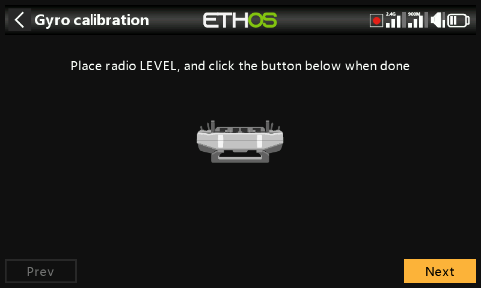

# Initial Radio Setup

Charging the radio and flight batteries, calibrating hardware (sticks,
gyro, pots, switches — see [System Setup —
Hardware](../system-setup/hardware.md)), and completing the initial system
configuration before creating a first model.

!!! note "Draft"
    This page is a placeholder — full content coming in a later pass.
