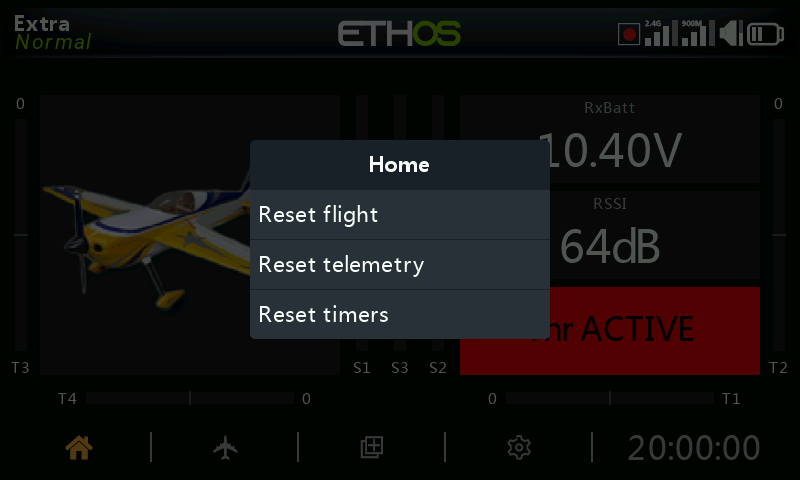

# Reset menu

A long press on the \[ENT\] key from the Home screens brings up a reset menu:

## Reset flight

Reset flight will reset telemetry, the timers, and the function switches. Note that preflight checks will be done after a ‘Reset flight’.

## Reset telemetry

Will reset telemetry, and clear any ‘sensor lost’ or ‘sensor conflict’ red dot alerts. Please refer to [Sensor lost / conflict alerts](../model-setup/telemetry.md).

## Reset timers

Will reset the timers.
