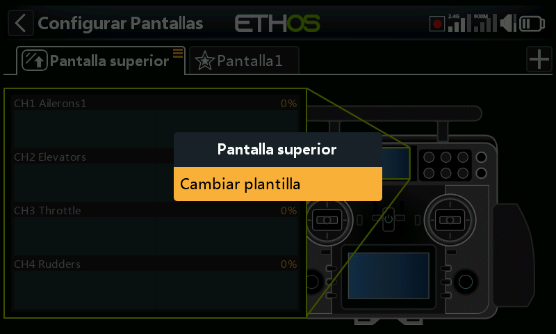
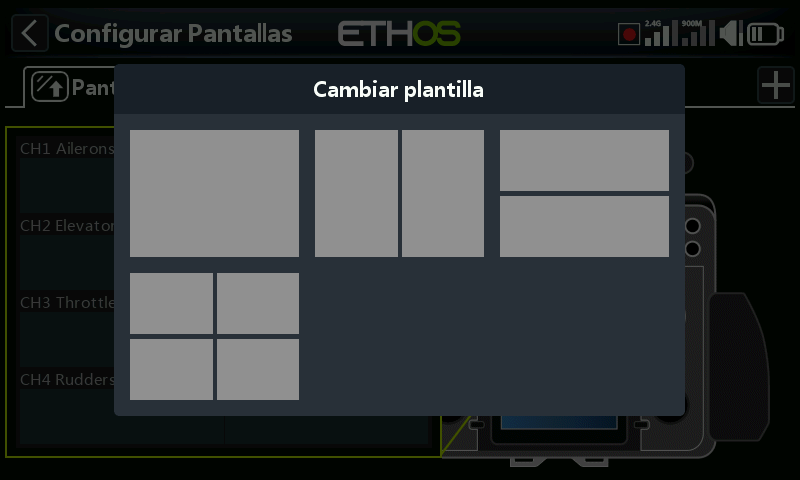

# Gestionando pantallas principales

Las pantallas pueden cambiar su plantilla, establecerse como la pantalla principal y reordenarse o eliminarse. El diálogo de gestión de pantallas se invoca mediante una pulsación prolongada en la pestaña de la pantalla, o una pulsación larga de Enter.

## Gestionando la pantalla superior (solo en la serie XE)

En las radios serie XE, la pantalla superior puede cambiar su diseño. El cuadro de gestión de la pantalla se abre con un toque largo en la pestaña de la pantalla, o pulsando Enter durante mucho tiempo.

Se abrirá un cuadro de diálogo que le permitirá elegir entre 4 diseños diferentes de la pantalla superior.
